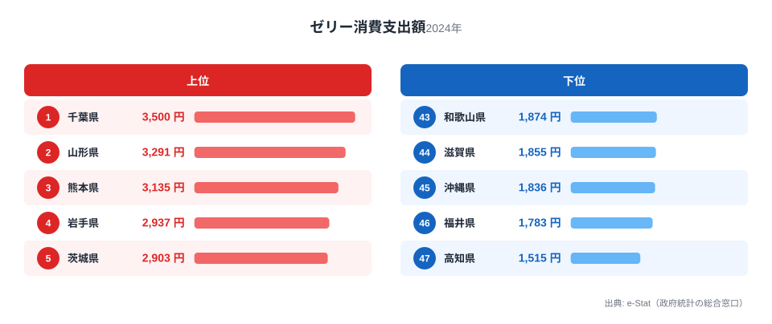
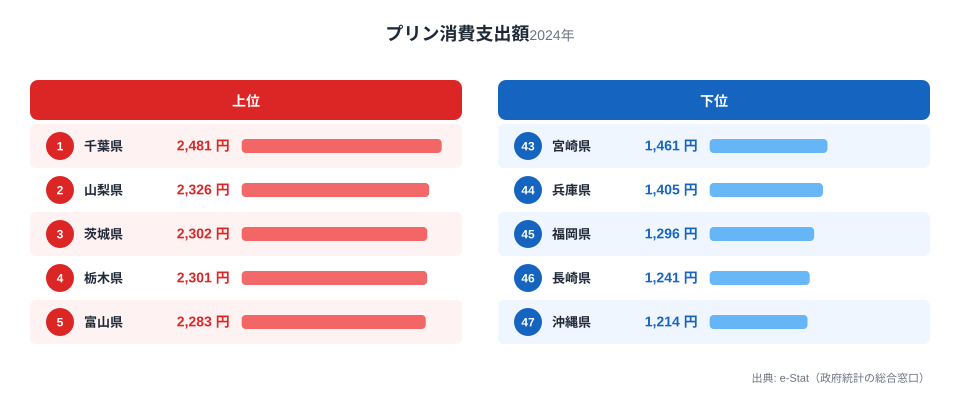
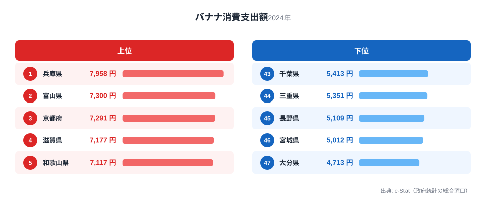
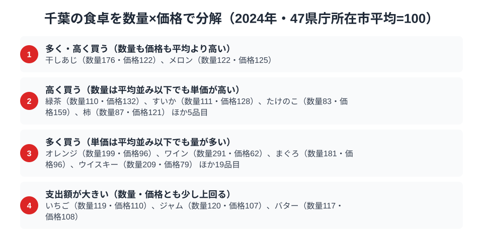

千葉県の家計調査を見ていくと、ある奇妙な偏りに気づきます。ゼリーの消費支出額が全国1位、プリンも全国1位。ところが同じデザート系でも、バナナの消費支出額は47都道府県中43位と下位に沈んでいます。同じ「甘いもの」でも、加工されたひんやりデザートには強く、生の果物には弱い。この偏りはどこから来るのでしょうか。

千葉県は東京のベッドタウンとして人口が急増した県であり、同時に成田・銚子といった独自の食文化圏も抱えています。全国的な統計で「県民性」を語るとき、千葉はしばしば「特徴がない県」と評されがちですが、家計調査の品目別データを丹念に見ていくと、実は加工デザート消費に強い個性が浮かび上がってきます。この記事では、千葉県が全国1位を獲得したゼリー・プリンの消費支出額と、対照的に下位に沈むバナナのデータから、千葉の食卓を読み解きます。

> [!NOTE]
> 本記事のデータは総務省統計局「家計調査（品目別）」2024年の都道府県庁所在市・二人以上世帯を対象とした消費支出額です。千葉県の数値は県庁所在市である千葉市のデータを指します。県全体の消費傾向そのものではなく、あくまで県庁所在市というサンプルポイントの数値である点にご留意ください。

## ゼリー消費支出額 — 全国1位3,500円、2位山形県に約200円差

<source-link href="/ranking/jelly-consumption-expenditure">ゼリー消費支出額ランキングをもっと見る</source-link>

千葉市のゼリー消費支出額は3,500円で全国1位です。2位の山形県は3,291円で約200円差、3位の熊本県は3,135円で400円近い差をつけています。ゼリーは常温保存が効き、暑い季節に涼を取る菓子として定着している商品ですが、上位には千葉・山形・熊本と気候も地理もばらばらの県が並んでおり、単純な「暑いから売れる」という説明では足りません。

千葉県は東京都心への通勤・通学人口が多く、共働き世帯やひとり親世帯の比率が全国的にも高い水準にあります。ゼリーは調理不要で子どものおやつや高齢者の水分補給にも使われる、忙しい家庭の「時短デザート」としての性格を持ちます。首都圏のベッドタウンという千葉の生活スタイルが、手軽に用意できるゼリーへの支出を押し上げている可能性が考えられます。

## プリン消費支出額 — 全国1位2,481円、ゼリーと合わせて甘味二冠

<source-link href="/ranking/pudding-consumption-expenditure">プリン消費支出額ランキングをもっと見る</source-link>

プリンの消費支出額も千葉市が2,481円で全国1位です。2位の山梨県は2,326円、3位の茨城県は2,302円で、いずれも千葉が上回っており、千葉はゼリーとプリンという2つの主要な冷菓デザート品目で同時に全国トップに立っています。同じ品目群で2冠を独占する例は他の県ではあまり見られず、千葉の加工デザート消費の強さを裏付けています。

プリンとゼリーは、どちらもスーパーやコンビニの冷蔵ケースに並ぶ定番商品であり、購入頻度と単価の掛け算で支出額が決まります。千葉県内には大規模なスーパー・コンビニチェーンの店舗網が密に展開されており、住宅街での買い物のしやすさが日常的なデザート消費を後押ししていると見られます。また、千葉県は乳製品を含む加工食品の物流拠点としての性格も持ち、こうした流通の利便性がデザート類の消費行動に影響している可能性があります。

## バナナ消費支出額 — 全国43位5,413円、甘味王国の意外な穴

<source-link href="/ranking/banana-consumption-expenditure">バナナ消費支出額ランキングをもっと見る</source-link>

一方でバナナの消費支出額を見ると、千葉市は5,413円で47都道府県中43位です。全国1位は兵庫県で7,958円、2,500円以上の差があり、下位圏に沈んでいます。バナナはコンビニ・スーパーどこでも手に入る全国均一に近い商品でありながら、地域差が明確に出る品目です。

ゼリー・プリンで全国1位を2つ獲得した県が、同じ「手軽なデザート」枠でもバナナには消極的という組み合わせは、一見すると矛盾に見えます。しかし加工デザートと生鮮果物では消費の文脈が異なります。ゼリーやプリンは「小腹満たし・子どものおやつ」として日常的に買い置きされる一方、バナナは「朝食の一品・健康志向の間食」として朝食習慣や健康意識の違いに左右されやすい品目です。千葉のバナナ消費が低い背景には、朝食を簡素に済ませる世帯の多さや、通勤時間の長さによる朝の時間的余裕の少なさが関係している可能性があります。

> [!WARNING]
> ここでの数値は消費支出額（円）であり、消費量（グラム・個数）ではありません。単価の高い商品を少量買う県と、単価の安い商品を多く買う県では、支出額だけでは実際の消費量の多寡を判断できない点に注意が必要です。また、落花生など千葉の代表的な農産物は、家計調査の個別品目として集計されていないため本記事では扱っていません。

## 千葉の食卓を貫くもの

千葉県の食卓データを3品目通して見ると、共通する軸が浮かび上がります。それは「調理不要・買い置き可能な加工デザートへの強い依存」です。ゼリー・プリンという2つの冷菓品目で全国1位を独占する一方、下ごしらえや食べるタイミングの意識が必要なバナナには消極的という対比は、時短・簡便性を優先する首都圏ベッドタウン特有の生活リズムを映し出しています。

これは、名産品や郷土料理が消費支出額の主役になる県とは異なる千葉の個性です。たとえば[宮崎県の食卓](/blog/miyazaki-food-culture)では焼酎や緑茶といった郷土色の強い嗜好品への支出が突出する一方、ほたて貝のような海産物は下位に沈むという対比が特徴として現れますが、千葉の場合は特定の郷土産品ではなく加工済みデザートに支出が集中する傾向が明確です。「郷土色の強い産物」ではなく「都市型の生活パターンが生む消費の偏り」こそが、千葉の食文化を読み解く鍵だと言えるでしょう。

> [!TIP]
> ゼリー・プリンともに千葉が1位という組み合わせは偶然ではなく、同じ「冷蔵庫にストックしておける甘味」という購買行動のパターンを共有しています。逆にバナナのように毎回鮮度を気にして買う必要がある品目は、千葉では相対的に選ばれにくい傾向にあります。他の都道府県の食卓を読み解く際も、品目を個別に見るだけでなく「保存性」「調理の手間」という軸で品目群をグルーピングすると、地域性の輪郭がより鮮明になります。

千葉県の消費傾向をさらに広く見たい方は、[千葉県の地域プロフィール](/areas/12000)から他の指標もあわせて確認できます。家計消費全体の動向は[経済カテゴリ一覧](/category/economy)からもたどれます。

## 数量×価格で分解する千葉市の食卓

<source-link href="/ranking/tuna-consumption-quantity">まぐろ消費量ランキングをもっと見る</source-link>

ここまで見た3品目の消費支出額は、いずれも「金額の大小」を示す数字です。ところが支出額は数量と単価の掛け算で決まるため、同じ支出額の高さでも、たくさん買っているから高いのか、一つひとつを高く買っているから高いのかで、背景にある生活の姿はまったく異なります。家計調査で数量と支出額の両方が公表されている125品目について、千葉市の値を47都道府県庁所在市の平均を100とした指数に直すと、この2つの効果を分けて読むことができます。

千葉市が際立って多く買っている品目の代表がまぐろです。まぐろ消費量は2,702gで47都道府県中3位、47市平均の約1.8倍にあたりますが、単価を示す価格指数は96とほぼ平均並みです。ワインも数量指数291と平均の約2.9倍を買っている一方、価格指数は62と平均より4割ほど低くなっています。どちらも「たくさん食べる・飲む」ことが支出額を押し上げているタイプで、単価の高さが理由ではありません。

対照的に、たけのこは数量指数83と平均をやや下回るのに、価格指数は159と平均より6割近く高くなっています。買う量は控えめでも、1gあたりの単価が高いものを選んでいる様子がうかがえます。緑茶も数量指数110とほぼ平均並みですが、価格指数は132と3割ほど高く、より上質な茶葉を選ぶ傾向が読み取れます。こちらは「単価の高いものを選ぶ」ことが支出額を押し上げているタイプです。

この枠組みで見ると、下位に沈んだバナナの姿も違って見えてきます。バナナの数量指数は85、価格指数は103とどちらもほぼ平均並みで、極端に少ないわけでも、安いものだけを選んでいるわけでもありません。支出額の低さは、量・価格のどちらか一方が突出して低いからではなく、両方がわずかに平均を下回ることの積み重ねだと分かります。

> [!TIP]
> 支出額の順位だけを見ると「千葉はまぐろが好き」「バナナには興味がない」という印象で終わってしまいますが、数量指数と価格指数に分解すると、まぐろは量で支出額を稼ぐ品目、たけのこや緑茶は単価で支出額を稼ぐ品目と、高くなる理由が異なることが分かります。他の都道府県のデータを読むときも、支出額の順位だけでなく数量と価格に分けて見ると、地域性の輪郭がより鮮明になります。

> [!NOTE]
> ここでの指数は、家計調査で数量・支出額の両方が公表されている品目について、47都道府県庁所在市の単純平均を100として算出した相対値であり、総務省が公表する全国平均とは基準が異なります。また価格指数は「支出額÷数量」から求めた相対的な単価であり、購入している銘柄やブランドの違いも反映されるため、純粋な物価水準を表すものではありません。数値はいずれも二人以上世帯・千葉市の年間値です。

## まとめ

- ゼリー消費支出額は千葉が全国1位で3,500円、2位山形県の3,291円を約200円上回る
- プリン消費支出額も千葉が全国1位で2,481円、ゼリーとの二冠を達成
- バナナ消費支出額は千葉が全国43位で5,413円、全国1位の兵庫県の7,958円と2,500円超の差
- 加工デザートへの強い支出と生鮮果物への消極性という対比が、千葉の都市型生活パターンを映し出している

## データ出典

総務省統計局「家計調査（品目別）」2024年、都道府県庁所在市・二人以上世帯（e-Stat 経由で整備）。
