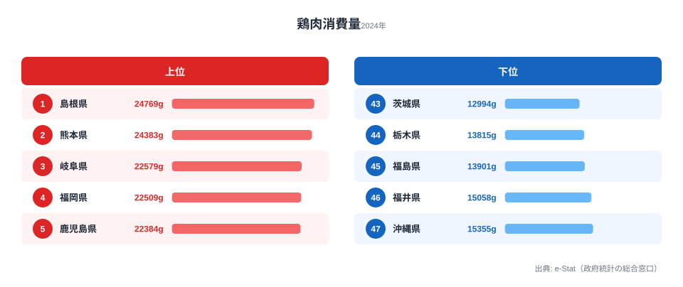

「鶏肉なら全国どこでも同じくらい食べているはず」と思うかもしれません。ところが総務省「家計調査」(2024 年) の都道府県庁所在市・二人以上世帯あたり **年間鶏肉消費量** を見ると、**1 位 島根県 (24,769g)** に対して最下位 **茨城県 (12,994g)** は **1.9 倍** もの差があります。同じ日本でも、住む県によって家庭の鶏肉購入量はこれだけ違うのです。

しかもこの差は、ランダムにばらついているわけではありません。上位は **島根・熊本・岐阜・福岡・鹿児島・大阪・大分・山口・宮崎・滋賀** と西日本と中部が独占し、下位には北関東の **茨城・栃木** が並びます。この記事では「なぜ西日本で鶏肉がよく食べられ、北関東で少ないのか」という地域構造を、家計データから読み解いていきます。

> [!NOTE]
> ここでいう消費量は「世帯が購入した生鮮・加工鶏肉のグラム数」で、外食の焼鳥や惣菜の唐揚げは含まれません。家庭で調理する鶏肉に限った数値のため、外食産業の規模が大きい都市部では実際の摂取量より低めに出る傾向があります。

## 鶏肉消費量が多い県・少ない県 (2024年)

まず上位5県と下位5県を見てみます。

<source-link href="/ranking/chicken-consumption-quantity">鶏肉消費量ランキング (47都道府県・各年版) をもっと見る</source-link>

1 位 **島根県 (24,769g)** は、二人以上世帯あたり年間 **約 25kg** の鶏肉を購入する計算になります。2 位 熊本 (24,383g) との差はわずか **1.6%** で拮抗しており、トップ争いは山陰と九州の接戦です。続く 3 位 岐阜 (22,579g)、4 位 福岡 (22,509g)、5 位 鹿児島 (22,384g) と上位は 22,000g 台に密集しています。

上位を地域でくくると、その偏りは一目瞭然です。TOP10 のうち **九州が 5 県 (熊本・福岡・鹿児島・大分・宮崎)** を占め、残りも島根・山口といった中国地方西部、岐阜・滋賀の中部、そして大阪と、いずれも **西日本〜中部** に集中しています。東日本からの TOP10 入りは 1 県もありません。鶏肉消費の地図は、ほぼそのまま「西高東低」の地図と重なります。

注目したいのは **6 位 大阪府 (22,342g)** です。人口が多く外食機会も豊富な大都市でありながら家庭消費でも上位に入っており、関西に根づいた鶏肉中心の食文化がうかがえます。3 位 岐阜・10 位 滋賀は中部からのランクインで、ちょうど鶏肉消費の濃淡が切り替わる **東西の境界線** に位置しています。上位10県がいずれも2万g台で並ぶ一方、最下位の茨城は1万3千g以下にとどまり、上位群と下位群のあいだにはっきりとした段差があるのも特徴です。

## 下位を占める北関東 — なぜ少ないのか

下位グループは様相が一変します。最下位 **茨城 (12,994g)** は 1 位 島根のわずか **52%**。次いで 46 位 栃木 (13,815g)、45 位 福島 (13,901g)、44 位 福井 (15,058g)、43 位 沖縄 (15,355g) と続き、**茨城・栃木という北関東 2 県が最下位の 2 つを占めています**。

なぜ北関東で鶏肉消費が少ないのでしょうか。

> [!TIP]
> 「鶏肉が少ない県」は「肉を食べない県」ではなく「別の肉を選んでいる県」と読むのがコツです。茨城・栃木・群馬・千葉は全国有数の養豚地帯で、最下位の茨城も鶏肉では47位ですが、家庭の肉支出は豚肉に厚く配分されている地域です。鶏肉単体の順位だけで「肉の消費が少ない」と解釈しないよう注意してください。

つまり北関東の低さは「鶏肉文化が弱い」というより、**[仮説] 豚肉が日常の主要肉として選ばれ、相対的に鶏肉の購入量が減っている** 構造だと考えられます。地元で豚肉が安価かつ豊富に手に入る環境では、家計の肉予算が豚肉に流れやすくなります。ただし家計調査の単一指標だけでは因果は確定できないため、豚肉消費量との突き合わせによる検証が必要です。

## 「西の鶏・東の豚」という食文化の境界線

上位と下位を地域クラスターでまとめると、鶏肉消費の東西分断が鮮明に浮かび上がります。

- **北部九州クラスター**: 熊本 (2 位)、福岡 (4 位)、鹿児島 (5 位)、大分 (7 位)、宮崎 (9 位) — 九州5県すべてがTOP10入り
- **山陰・山陽クラスター**: 島根 (1 位)、山口 (8 位)
- **中部クラスター**: 岐阜 (3 位)、滋賀 (10 位)
- **大都市クラスター**: 大阪 (6 位)
- **北関東・南東北の下位クラスター**: 茨城 (47 位)、栃木 (46 位)、福島 (45 位)

特筆すべきは **九州 5 県がすべて TOP10 入り** している集中度です。九州は地鶏文化の中心地で、熊本の天草大王、宮崎の地鶏炭火焼、鹿児島の薩摩地鶏など、地域ブランド鶏が日常食に根づいています。1 位の島根も、石見地鶏に代表される郷土の鶏食文化が家庭消費を底上げしている可能性があります。

逆に下位は北関東 (茨城・栃木) を中心に、関東〜南東北の養豚地帯が固まっています。「**鶏肉は西日本、豚肉は東日本**」という肉の地域文化が、家計データにそのまま映し出されているのです。同じ家計調査の食材でも地域差の出方は指標ごとに違うため、[砂糖消費量ランキング](/ranking/sugar-consumption-quantity) のような別の食材と比べてみると、食習慣の地図がより立体的に見えてきます。

> [!WARNING]
> 家計調査の対象は各県の県庁所在市の二人以上世帯であり、県全体の平均とは厳密には一致しません。また年ごとのサンプル世帯の入れ替えで数値が上下することがあるため、単年の順位だけでなく複数年の傾向で読むのが安全です。

## まとめ

- 1 位 **島根県 (24,769g)**、2 位 **熊本 (24,383g)**、3 位 **岐阜 (22,579g)**
- 最下位 **茨城 (12,994g)** で **1.9 倍** の地域差 (1位島根の52%)
- TOP10 のうち **九州が 5 県**、西日本〜中部が独占し東日本はゼロ
- 下位は **茨城・栃木の北関東 2 県** が最下位の2つを占める
- 「鶏肉は西日本・豚肉は東日本」という食文化の東西分断が家計データに表れている

各県の年次推移や全47都道府県の順位は [鶏肉消費量ランキング](/ranking/chicken-consumption-quantity) で確認できます。世帯の食費全体の地域差に関心があれば [経済・消費カテゴリ](/category/economy) の他のランキングもあわせてどうぞ。

## データ出典

- 総務省「家計調査」(2024 年・都道府県庁所在市の二人以上世帯)
- e-Stat (政府統計の総合窓口) 経由で都道府県別に整備
