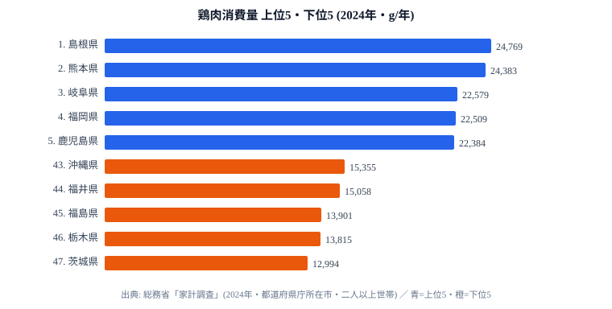

「同じ日本でも、住む県でこんなに鶏肉を食べる量が違うのか」──総務省「家計調査」(2024 年) の都道府県庁所在市・二人以上世帯あたり **年間鶏肉消費量** を見ると、最も多い **島根県 (24,769g)** と最も少ない **茨城県 (12,994g)** の差は **約 1.91 倍** にのぼります。鶏肉は全国どこでも手に入る肉ですが、家庭での消費量にはこれだけの地域差が存在します。

しかも、その差はランダムに散らばっているのではありません。上位は **西日本と北部九州** が独占し、下位は **北関東 3 県** が固めるという、地図にきれいに重なる東西分断の形をしています。この記事では「なぜ鶏肉が西で多く東で少ないのか」を、上位・下位の顔ぶれから読み解いていきます。

> [!NOTE]
> 本データは総務省「家計調査」の都道府県庁所在市・二人以上世帯あたりの **購入量** です。県全体の平均ではなく県庁所在市の数値である点、外食での鶏肉は含まれず家庭で購入した分のみを集計している点に注意してください。鶏むね・もも・手羽など部位を合算した「鶏肉」の総量です。

## 鶏肉消費量ランキング（2024年・上位5と下位5）

上位 5 県と下位 5 県を 1 枚にまとめると、上位が西日本、下位が北関東〜南東北に偏る構造が一目で分かります。

1 位 [**島根県**](https://stats47.jp/areas/32000) (24,769g) は、二人以上世帯で年間 **約 25kg** もの鶏肉を購入する計算になります。2 位 熊本 (24,383g) との差はわずか **1.6%** で、両県はほぼ並んでいます。続く 3 位 岐阜 (22,579g)、4 位 福岡 (22,509g)、5 位 鹿児島 (22,384g) まで、上位はすべて中部より西の県が占めています。九州勢の濃さが際立ち、熊本・福岡・鹿児島の 3 県が早くも顔を出しています。

一方、下位 5 県は 43 位 沖縄 (15,355g)、44 位 福井 (15,058g) を挟みつつ、45 位 福島 (13,901g)、46 位 栃木 (13,815g)、47 位 茨城 (12,994g) と続きます。最下位の [**茨城県**](https://stats47.jp/areas/08000) (12,994g) は 1 位島根の **52%** にとどまり、ほぼ半分しか鶏肉を買っていない計算です。下位 3 県のうち茨城・栃木は北関東で、地理的にも隣り合って固まっているのが特徴です。なぜ西で多く東で少ないのか、その背景を上位・下位それぞれの食文化から見ていきます。

<source-link href="/ranking/chicken-consumption-quantity">鶏肉消費量ランキングをもっと見る</source-link>

## 上位を独占する西日本・九州の地鶏文化

上位 10 県の顔ぶれを並べると、東西の境界がはっきり浮かび上がります。

- **北部九州クラスター**: 熊本 (2 位)、福岡 (4 位)、鹿児島 (5 位)、大分 (7 位)、宮崎 (9 位)
- **山陰・山口クラスター**: 島根 (1 位)、山口 (8 位)
- **中部クラスター**: 岐阜 (3 位)、滋賀 (10 位)
- **都市部クラスター**: 大阪 (6 位)

九州だけで 5 県が TOP10 に入っており、この集中度は偶然とは考えにくいものです。九州は地鶏文化の中心地で、熊本の天草大王、宮崎の地鶏炭火焼き、鹿児島の薩摩地鶏など、地域ブランド鶏が日常の食卓に根付いている地域です。鶏を炭火で焼く・蒸す・刺身で食べるといった鶏中心の調理が家庭に浸透しているため、購入量が押し上げられていると読めます。島根が 1 位なのも、焼き鳥文化や石見地鶏に代表される郷土食が家庭内の鶏肉消費を支えているためでしょう。

注目したいのは 6 位 **大阪府 (22,342g)** です。大都市でありながら上位に食い込んでいます。これは大阪の焼鳥居酒屋文化や、串カツ・鶏料理を日常的に食べる食習慣が家庭消費にも波及している可能性を示します。3 位 岐阜と 10 位 滋賀は中部からのランクインで、ちょうど東西の文化が交わる境界線に位置している点も興味深いところです。上位 10 県は中部以西で固まり、関東以東は 1 県も入っていません。

> [!TIP]
> 鶏肉の「量」が多い県は、必ずしも「金額」が高い県とは限りません。地鶏など単価の高いブランド鶏を買う県は、購入量が中位でも支出額は上位に来ることがあります。量と金額を見比べると、その県が「安い鶏を多く食べる」のか「高い鶏を選ぶ」のかが見えてきます。

<source-link href="/ranking/chicken-consumption-expenditure">鶏肉消費支出額ランキングをもっと見る</source-link>

## 下位を固める北関東──鶏より豚の食文化か

下位グループを見ると、最下位の茨城 (47 位)、栃木 (46 位)、福島 (45 位) という並びになります。茨城・栃木の北関東 2 県に南東北の福島が続き、関東〜南東北のラインが下位を固めています。

これは「北関東で鶏肉が嫌われている」というより、**[仮説] 養豚が盛んな北関東では豚肉が日常の主要な肉として選ばれ、その分だけ鶏肉の購入量が相対的に少なくなっている** という構造が考えられます。茨城・栃木・群馬・千葉は全国有数の養豚地帯であり、家計の肉支出が豚肉に厚く配分される食文化が背景にあるかもしれません。この仮説は豚肉消費量の地域分布と突き合わせて検証する必要があります。

下位は北関東の養豚地帯が固まっており、上位の西日本・九州とは対照的です。鶏肉の量だけを見て「東日本は肉をあまり食べない」と早合点するのは禁物で、豚肉や牛肉まで含めて初めて「どの肉を主に食べる地域か」が見えてきます。鶏肉消費量は、その県がどの肉を食卓の中心に据えているかを映す鏡だと言えるでしょう。

> [!WARNING]
> 鶏肉の消費量が下位だからといって「肉をあまり食べない県」と結論づけるのは誤りです。本データは鶏肉単体の購入量であり、豚肉・牛肉を含む肉全体の消費量ではありません。北関東のように豚肉に支出が偏る地域では、鶏肉だけを切り取ると低く出る点に注意してください。

## まとめ

- 1 位 **島根県 (24,769g)**、2 位 **熊本 (24,383g)**、3 位 **岐阜 (22,579g)** と中部以西が上位を独占しています
- 最下位 **茨城 (12,994g)** との差は **約 1.91 倍**、茨城は島根の 52% にとどまります
- 上位 10 県はすべて中部以西で、関東以東は 1 県も入りません
- 九州 5 県 (熊本・福岡・鹿児島・大分・宮崎) がすべて TOP10 入りし、地鶏文化の濃さが表れています
- 下位は北関東の茨城・栃木に南東北の福島が続き、鶏肉文化の西日本と養豚文化の東日本という東西分断が鮮明です

家計の食材消費には、こうした地域ごとの食文化が色濃く表れます。ほかの食材や肉類の地域差は [経済・家計のランキング一覧](https://stats47.jp/category/economy) からも辿れます。

## データ出典

- 総務省「家計調査」(2024 年・都道府県庁所在市の二人以上世帯)
- e-Stat 経由で都道府県別に整備
