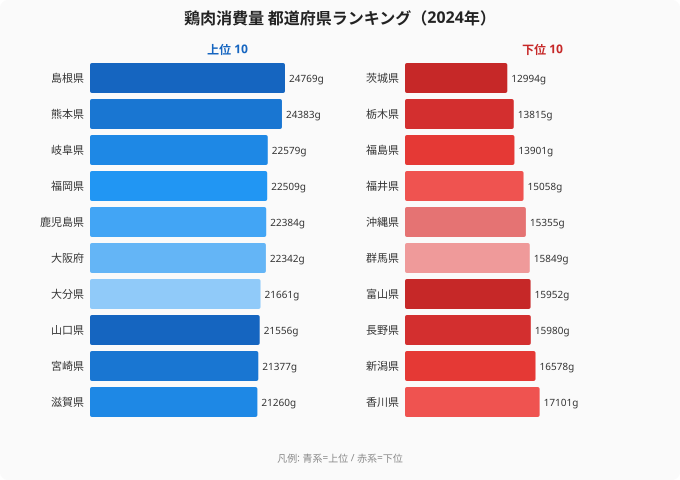

「鶏肉といえば宮崎」——地鶏のブランド、チキン南蛮、養鶏の盛んな県というイメージから、鶏肉を最も食べる県は宮崎だと思っている人は多いです。ところが2024年の総務省「家計調査」を見ると、宮崎県は鶏肉消費量で9位でした。家庭で最も鶏肉を食べていたのは、意外にも**島根県（24,769g/年）**だったのです。

産地として有名な県が消費量の首位ではない——この「ズレ」はなぜ起きるのでしょうか。そして上位を見渡すと、九州・近畿・中国地方といった西日本の県がずらりと並びます。本記事では全47都道府県の鶏肉消費量データから、産地ブランドと食卓の関係、そして西日本に消費が集中する構造を読み解いていきます。

> [!NOTE]
> データは総務省「家計調査」（都道府県庁所在市・二人以上世帯）の年間鶏肉購入量（g）。スーパー等で購入した量を集計したもので、外食やテイクアウトでの消費は含みません。つまり「家庭の食卓にどれだけ鶏肉が上るか」を映す指標です。

## 上位5と下位5 — 消費量の差は1.9倍にとどまる

最も鶏肉を食べる島根県（24,769g）と、最も少ない茨城県（12,994g）の差は約1.9倍です。1万g以上の開きがあるとはいえ、肉類のなかでは比較的小さい差にとどまります。

鶏肉は唐揚げ・煮物・鍋・チキンソテーなど調理の幅が広く、価格も牛肉・豚肉に比べて安定して安いです。そのため全国どこでも日常的に食卓に上りやすく、地域による消費量の偏りが出にくくなっています。同じ家計調査でも牛肉は地域差がはるかに大きく、鶏肉は「全国共通の家庭食材」としての性格が強いことがわかります。

上位5は島根県（24,769g）を筆頭に、熊本県（24,383g）・岐阜県（22,579g）・福岡県（22,509g）・鹿児島県（22,384g）と続きます。一方で下位5は最下位の茨城県（12,994g）から、栃木県（13,815g）・福島県（13,901g）・福井県（15,058g）・沖縄県（15,355g）が並びます。上位は西日本、下位は北関東・東北・北陸という南北の対比が一目で見て取れます。首位の島根は山陰地方の県で、隣接する鳥取（15位）とともに鶏肉文化が根づいた土地です。2位の熊本は馬肉のイメージが強いものの、鶏肉も家庭でよく食べられています。なぜこのように地域が割れるのか、上位と下位それぞれの背景を掘り下げていきましょう。

<source-link href="/ranking/chicken-consumption-quantity">47都道府県の鶏肉消費量ランキングを詳しく見る</source-link>

より大きな地域差を持つ[牛肉消費量ランキング](/ranking/beef-consumption-quantity)と比べると、鶏肉の「均質さ」が際立ちます。それでもなお、上位と下位の顔ぶれには明確な地域の偏りがあります。

> [!TIP]
> 「肉類のなかで地域差が小さい＝全国どこでも定番」という見方ができます。鶏肉は家計の節約志向が強まる局面でも需要が落ちにくく、価格弾力性が低い食材としても知られています。

## 上位の顔ぶれ — 西日本に大きく偏る

トップ10の地域分布を見ると、九州が5県（熊本・福岡・鹿児島・大分・宮崎）と半数を占め、近畿2県（大阪・滋賀）、山陰1県（島根）、東海1県（岐阜）、山陽1県（山口）という構成になります。6位以下は大阪府（22,342g）・大分県（21,661g）・山口県（21,556g）・宮崎県（21,377g）・滋賀県（21,260g）の順で、いずれも2万1,000g台に肩を並べます。上位陣の値が僅差で密集している点も、鶏肉消費の「西高東低」が地域ぐるみの傾向であることを物語っています。

なぜ西日本がこれほど上位を占めるのでしょうか。背景には鶏肉を使った郷土食の厚みがあります。九州・中国地方には鶏のすき焼き（かしわのすき焼き）、水炊き、チキン南蛮、鶏飯（けいはん）など、鶏肉を主役にした料理が数多くあります。関西の「かしわ」文化も根強く、鶏肉を日常的に使う土壌が地域に染みついています。首位の島根や2位の熊本のように、産地としての知名度が突出していない県でも上位に食い込むのは、こうした日常食としての定着があるからです。

> [!NOTE]
> 上位は西日本に大きく偏っています。九州・近畿・中国地方で構成され、関東以北で10位以内に入った県はありません。これは下位の分布と裏返しの関係になっています（後述）。

<source-link href="/ranking/chicken-consumption-quantity">鶏肉消費量の上位県の並びを確認する</source-link>

## 産地ブランド宮崎が首位でない逆説

ここで本記事の核心に触れます。**宮崎県は鶏肉消費量で9位**——日本有数の養鶏県でありながら、家庭の消費量では首位ではありません。同じく養鶏が盛んな鹿児島県も5位にとどまります。

これは「産地＝最大消費地」とは限らない、という食の地理の典型例です。宮崎・鹿児島で生産される地鶏やブロイラーの多くは、東京・大阪をはじめとする大消費地に出荷されます。地鶏のような高付加価値の鶏肉は外食産業や百貨店・贈答市場に流れ、地元スーパーでの日常的な購入とは別の経路をたどります。家計調査が捉えるのは「家庭で買って食べる量」であり、産地の出荷量や名声とは必ずしも一致しないのです。

> [!WARNING]
> 「産地として有名＝消費量が多い」と短絡するのは危険です。家計調査の消費量は購入ベースであり、生産量・出荷量とは別の指標です。産地の鶏肉は外食・加工・他地域への出荷に回る割合が大きく、地元の家庭消費に直結するとは限りません。

産地ブランドと食卓のズレは、米・果物など他の食材でも観察される現象です。生産で有名な県の暮らしを覗いてみたい人は、上位県の[島根県のプロフィール](/areas/32000)や、対照的に最下位だった[茨城県のプロフィール](/areas/08000)も併せて見てください。

## なぜ下位の北関東・東北で鶏肉が少ないのか

上位が西日本に偏り、下位が北関東・東北・北陸に集まる——この南北の構造はどこから来るのでしょうか。

下位10県の分布を見ると、北関東3県（茨城・栃木・群馬）、甲信越2県（長野・新潟）、北陸2県（富山・福井）、四国1県（香川）、沖縄1県（沖縄）、東北1県（福島）となっています。最下位は茨城県（12,994g）、続いて栃木県（13,815g）、福島県（13,901g）と、北関東・南東北が底を形成します。下位の並びは茨城（12,994g）・栃木（13,815g）・福島（13,901g）・福井（15,058g）・沖縄（15,355g）で、いずれも1万5,000g前後にとどまります。

下位地域に共通するのは、鶏肉が「主役の肉」になりにくい食文化です。ひとつには、対照的な肉の存在があります。下位グループに入る沖縄（43位）はその典型で、沖縄は豚肉消費が全国でも突出して高く、チャンプルーやソーキなど豚肉料理が食の中心にあります。鶏肉が入り込む余地が相対的に小さくなっているのです。北関東・東北についても、後述する豚肉文化の強さが鶏肉消費を押し下げている可能性があります。西日本ほど鶏肉を主役にした郷土食が厚くないことも、下位を底支えする要因と考えられます。

<source-link href="/ranking/chicken-consumption-quantity">下位県を含む鶏肉消費量の全順位を見る</source-link>

> [!TIP]
> 「かしわ」は西日本で鶏肉を指す呼び名です。関西・中国・九州で広く使われ、鶏肉が食卓に馴染んでいることの言語的な裏付けでもあります。東日本では「鶏肉」と呼ぶのが一般的で、呼称の違いと消費量の地域差はゆるやかに対応しています。

**[仮説]** 下位に北関東・東北が並ぶのは、これらの地域で豚肉文化が相対的に強く、肉の選択が豚に向かいやすいためかもしれません。ただしこれは消費量データから読み取れる地域パターンに基づく推論であり、各県の豚肉・鶏肉消費の対応関係を個別に検証する必要があります。

地域ごとの食肉文化の違いをさらに掘り下げたい人は、[牛肉消費量の地域差を扱った記事](/blog/beef-consumption-quantity)も参考になります。鶏肉とは異なる、より大きな東西の分断が見えてきます。経済・食関連の他の指標は[経済カテゴリの一覧](/category/economy)から探せます。

## データ出典

- 総務省「家計調査」 都道府県庁所在市・二人以上世帯の年間鶏肉購入量、2024年（e-Stat 経由）

調査は都道府県庁所在市を対象としており、県全体の平均とは厳密には一致しない点に留意してください。また購入量ベースのため、外食・自家消費（自家養鶏など）は含まれません。

## まとめ

- 鶏肉を最も食べる県は**島根県（24,769g/年）**、最も少ないのは**茨城県（12,994g）**で、その差は約1.9倍です。肉類のなかでは地域差が小さいといえます。
- 産地ブランドで有名な**宮崎県は9位**、鹿児島県も5位にとどまります。「産地＝最大消費地」ではないという食の地理が表れています。
- 上位10県は九州5・近畿2・山陰1・東海1・山陽1と、西日本に大きく偏ります。下位は北関東・東北・北陸に集中します。
- 西日本優位の背景には、鶏（かしわ）を使った郷土食の厚みがあります。下位地域では豚肉文化が相対的に強い可能性があります（要検証）。
- 鶏肉は価格が安定し調理の幅も広いため、全国共通の家庭食材として定着しています。
