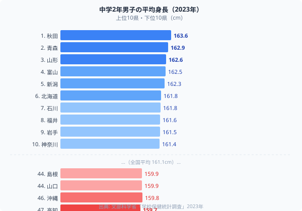
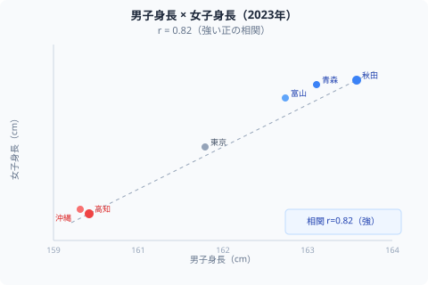

「牛乳をよく飲めば背が伸びる」──子どもの頃に言われた人は多いはずです。ところが、データを見るとこの常識が崩れます。**[高知県](/areas/39000)は牛乳消費量で全国3位（3,822円/年）にもかかわらず、中学2年生の平均身長は47位（159.7cm）で全国最下位**。

一方、身長全国1位の[秋田県](/areas/05000)（163.6cm）は牛乳消費ランキングで特段上位ではありません。何が「育つ県」を決めているのか。文部科学省「学校保健統計調査」（2023年）の47都道府県データで読み解きます。

## 「牛乳=身長」説はなぜ崩れるのか

高知県の矛盾は、単なる例外ではありません。牛乳消費量と中学生身長の都道府県相関は**r = 0.18**と極めて弱い。つまり「牛乳をよく飲む県ほど背が高い」という関係は、データから見ると存在しません。

> [!WARNING]
> 単一栄養素と身長の因果関係は、集団レベルのデータだけでは証明できません。遺伝・気候・総合的な栄養状態・運動習慣など多要因が絡み合います。「牛乳を飲めば必ず伸びる」という解釈は過度な単純化です。

## 中学2年男子の平均身長ランキング（2023年）

では実際にどこの県が高く、どこが低いのか。全国平均は**161.1cm**。47都道府県のデータを見ると明確な「北高南低」パターンが見えます。

<source-link href="/ranking/child-height-regional-gap">中学生の平均身長ランキングをもっと見る</source-link>

このデータを踏まえて、「なぜ東北・北陸が高いのか」を3つの仮説で検討します。

## 仮説1：気候（ベルクマンの法則）

生物学には「寒冷地の生物ほど体が大きくなる」**ベルクマンの法則**があります。体積に対して表面積を減らすことで、体温を逃がさない戦略です。

日本の身長分布を見ると、この法則と一致する地図が浮かびます。

- **東北トップ3**：秋田163.6cm・[青森](/areas/02000)162.9cm・山形162.6cm
- **北陸も高水準**：富山162.5cm・新潟162.3cm・石川161.8cm
- **西日本・南西は低水準**：高知159.7cm・沖縄159.8cm・島根159.9cm

年平均気温との相関を見ると、**気温が低い県ほど身長が高い傾向**（r ≈ -0.55）があります。ただし相関は中程度で、気候だけで説明できるわけではありません。

> [!NOTE]
> 学校保健統計調査は全国の学校からの標本調査です。各都道府県値は抽出サンプルに基づく推計値で、年度ごとに多少変動します。

## 仮説2：タンパク質と食文化の複合効果

東北・北陸に共通するのは**魚・大豆・発酵食品のタンパク質文化**です。

- **秋田・青森**：塩引き鮭・鱈・ホタテなど海産物に加え、比内地鶏・南部どりなど良質な動物性タンパク
- **富山**：ブリ・ホタルイカ・シロエビなどの日本海漁業
- **新潟・山形**：良質な米（炭水化物）と山菜・漬物の発酵食

一方、高知・沖縄は温暖な気候で農作物は豊富ですが、伝統的な食文化における動物性タンパク質の摂取パターンが異なります。ただしこれも定量的証明には限界があります。

## 仮説3：遺伝的基盤

身長の遺伝率は**約80%**（双子研究等から）とされ、個人レベルでは遺伝が最大要因です。都道府県レベルでも、長年にわたる定住集団の遺伝的差異が背景にある可能性があります。

東北・北陸の集団は歴史的に大陸系（弥生系）の遺伝的影響が強いとする仮説もありますが、これは学術的な議論の途上にあります。

## 東北・北陸「高身長ベルト」の構造

身長トップ10のうち**8県が東北・北陸**に集中しています（秋田・青森・山形・富山・新潟・石川・福井・岩手）。これは統計的に無視できない地理的集中です。

この8県に共通する特徴：

- **寒冷な気候**（年平均気温10〜14℃）
- **海産物・大豆の豊富な食文化**
- **歴史的な農業社会**（米・野菜・発酵食品の食習慣）
- **高い牛乳消費量**(ただし高知との矛盾がある)

> [!TIP]
> 「食育」政策の実効性を評価するとき、単一食品の消費量ではなく食文化全体のパターンを見ることが重要です。高知の事例は「牛乳＝身長」という単純な政策メッセージの限界を示しています。

## 男女共通で現れる地域差

中学2年女子の身長でも同じパターンが見られます。

- **女子1位：青森・富山**（同率155.7cm）
- **女子3位：秋田**（155.6cm）
- **女子下位**：高知・沖縄・島根・山口

男女の身長相関は**r = 0.82**と非常に高く、男子が高い県は女子も高い。これは「個人差」ではなく**地域の食文化・環境が性別を問わず体格に影響している**ことを示します。

## 50年で5cm伸びた「世代間変化」の方が大きい

地域差（3.9cm）より注目すべきは、**50年間の世代間変化**です。

- 1975年の全国平均：155.9cm
- 2023年の全国平均：161.1cm
- **変化：+5.2cm**（約50年）

現在の1位・秋田（163.6cm）と47位・高知（159.7cm）の差（3.9cm）より、50年前との差（5.2cm）の方が大きい。つまり「どの県の子どもか」より「どの時代の子どもか」の方が身長に影響します。

この世代間の身長上昇は2001〜2019年に一度横ばいになりましたが、2020年以降に再加速。**2023年は過去最高の161.1cm**を記録しました。

## 高校2年でも持続する地域差

高校2年（162.6cm全国平均）でも地域差パターンは基本的に同じです。

- **高校2年1位タイ：新潟・福井**（171.0cm）
- **高校2年47位：沖縄**（167.6cm）
- **差：3.4cm**（中学2年の3.9cmからわずかに縮小）

成長期後半になると地域差は若干圧縮されますが、構造的パターンは維持されます。

> [!NOTE]
> 体格の地域差の要因は複合的です。ランキングの順位だけで「この県の子育て環境が良い・悪い」と判断することはできません。個人の成長は都道府県平均とは別に、成長曲線（パーセンタイル曲線）で評価することが重要です。

## 政策的含意：「牛乳だけ」では変わらない

高知の事例が示すのは、身長政策の複雑さです。単一食品の消費推進（牛乳・カルシウム）より、**食文化全体・睡眠・運動・経済格差への複合的アプローチ**が必要と考えられます。

厚生労働省「健康日本21（第三次）」は健康格差縮小を目標に掲げており、「経済格差に伴う栄養格差が次世代の体格に影響する」という知見を明示しています。食文化・睡眠・運動・経済格差への複合的アプローチが、単一食品の消費推進より実効性が高いと考えられます。

## データ出典

- 文部科学省「学校保健統計調査」2023年（e-Stat）
- 総務省「家計調査」2023年（牛乳消費量）
- 気象庁観測データ（年平均気温）

