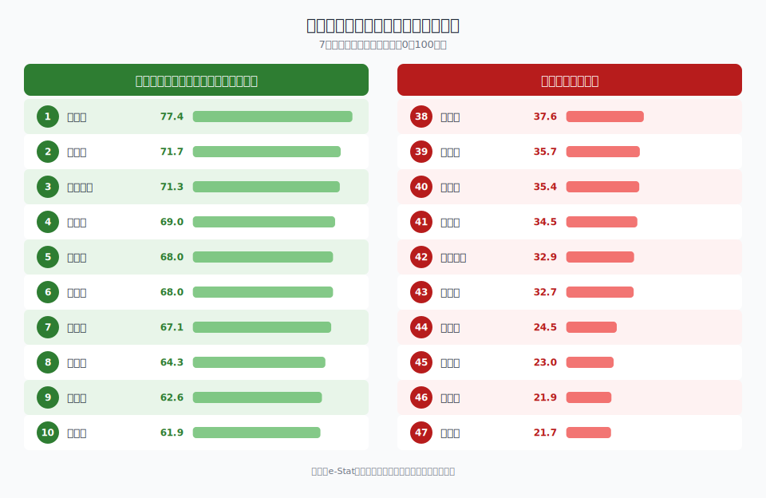
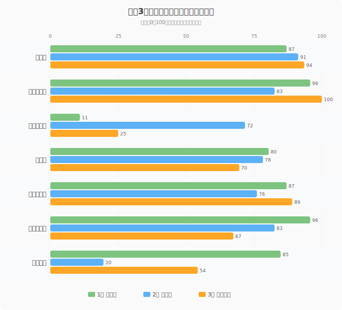

「子育てしやすい県」は、何で決まるのでしょうか。出生率が高ければ子育てしやすいのか。保育所が充実していれば十分なのか。実際には、子育て環境は**医療・福祉・就労・住環境**など複数の要素が絡み合っています。

この記事では、e-Stat（政府統計の総合窓口）のデータから**7つの指標**を選び、47都道府県の「子育てしやすさ」を総合スコアリングしました。単一指標では見えない、多面的な子育て環境の地域差をデータで読み解きます。

## 評価方法──7指標のパーセンタイル平均

> [!NOTE]
> 本ランキングは公的統計データに基づく独自の総合評価です。各指標のパーセンタイル（全国順位を0〜100点に変換）を算出し、7指標の平均値を総合スコアとしています。特定の指標に重みづけはしていません。

使用した7つの指標は以下のとおりです。

| # | 指標 | 出典年 | 方向 |
|---|---|---|---|
| 1 | [合計特殊出生率](/ranking/total-fertility-rate) | 2023年 | 高い方が良い |
| 2 | [保育所等利用率](/ranking/nursery-utilization-rate) | 2020年 | 高い方が良い |
| 3 | [乳児死亡率](/ranking/infant-mortality-rate-per-1000-births) | 2023年 | **低い方が良い** |
| 4 | [医療施設従事医師数](/ranking/physicians-in-medical-facilities-per-100k)（人口10万人当たり） | 2022年 | 高い方が良い |
| 5 | [児童福祉費](/ranking/per-capita-child-welfare-expenditure-under17-pref-municipal)（17歳以下1人当たり） | 2022年 | 高い方が良い |
| 6 | [育児をしている人の就業率](/ranking/childcare-employment-rate) | 2022年 | 高い方が良い |
| 7 | [都市公園面積](/ranking/urban-park-area-per-person)（1人当たり） | 2023年 | 高い方が良い |

乳児死亡率は「低いほど良い」指標のため、パーセンタイルを反転させています（乳児死亡率が最も低い県＝100点）。

## 総合ランキング──上位10県・下位10県

### 上位10県

| 順位 | 都道府県 | 総合スコア | 出生率 | 保育利用率 | 乳児死亡率 | 医師数 | 児童福祉費 | 育児就業率 | 公園面積 |
|---:|---|---:|---:|---:|---:|---:|---:|---:|---:|
| 1 | **島根県** | **77.4** | 1.46 | 97.7% | 2.4 | 307.6人 | 701千円 | 92.5% | 16.6m² |
| 2 | **熊本県** | **71.7** | 1.47 | 96.0% | 1.6 | 302.2人 | 674千円 | 89.5% | 8.7m² |
| 3 | **鹿児島県** | **71.3** | 1.48 | 100.2% | 2.2 | 288.7人 | 707千円 | 88.3% | 12.4m² |
| 4 | 宮崎県 | 69.0 | 1.49 | 95.2% | 2.2 | 260.8人 | 688千円 | 88.3% | 18.2m² |
| 5 | 長崎県 | 68.0 | 1.49 | 96.3% | 2.6 | 327.6人 | 663千円 | 88.5% | 11.5m² |
| 6 | 沖縄県 | 68.0 | 1.60 | 95.0% | 1.8 | 266.1人 | 733千円 | 88.0% | 10.5m² |
| 7 | 岡山県 | 67.1 | 1.32 | 94.8% | 1.0 | 324.0人 | 577千円 | 86.3% | 15.8m² |
| 8 | 高知県 | 64.3 | 1.30 | 74.5% | 1.2 | 335.2人 | 700千円 | 89.2% | 11.3m² |
| 9 | 石川県 | 62.6 | 1.34 | 87.8% | 1.6 | 286.4人 | 609千円 | 91.6% | 14.3m² |
| 10 | 徳島県 | 61.9 | 1.36 | 87.7% | 1.5 | 335.7人 | 700千円 | 88.3% | 8.0m² |

<data-source url="https://www.e-stat.go.jp/dbview?sid=0000010201" label="e-Stat 社会・人口統計体系"></data-source>

**1位は島根県**（総合スコア77.4）。出生率1.46（全国6位）、保育所等利用率97.7%（全国3位）、育児就業率92.5%（全国3位）と、**保育と就労の両立**で際立った強さを見せます。医師数も人口10万人あたり307.6人と上位で、都市公園面積も全国8位。7指標すべてで「穴がない」のが島根県の特徴です。

2位の**熊本県**は出生率が1.47と高く、乳児死亡率1.6は全国トップクラスの低さ。医師数も300人超と西日本の医療拠点としての強みが出ています。唯一の弱点は都市公園面積（8.7m²）ですが、他の6指標が軒並み高水準です。

3位の**鹿児島県**は保育所等利用率が全国唯一の**100%超**（100.2%）。定員を超えて受け入れている状態であり、保育ニーズへの対応力の高さが光ります。

### 下位10県

| 順位 | 都道府県 | 総合スコア | 出生率 | 保育利用率 | 乳児死亡率 | 医師数 | 児童福祉費 | 育児就業率 | 公園面積 |
|---:|---|---:|---:|---:|---:|---:|---:|---:|---:|
| 38 | 奈良県 | 37.6 | 1.21 | 93.2% | 2.0 | 286.8人 | 509千円 | 82.2% | 14.0m² |
| 39 | 大阪府 | 35.7 | 1.19 | 92.9% | 2.2 | 288.5人 | 660千円 | 82.7% | 5.8m² |
| 40 | 三重県 | 35.4 | 1.29 | 87.0% | 1.3 | 241.2人 | 570千円 | 83.8% | 10.1m² |
| 41 | 茨城県 | 34.5 | 1.22 | 93.6% | 1.9 | 202.0人 | 584千円 | 85.5% | 10.1m² |
| 42 | 神奈川県 | 32.9 | 1.13 | 96.7% | 2.1 | 223.0人 | 631千円 | 83.6% | 5.8m² |
| 43 | 静岡県 | 32.7 | 1.25 | 91.3% | 1.6 | 230.1人 | 510千円 | 85.0% | 9.2m² |
| 44 | 埼玉県 | 24.5 | 1.14 | 92.8% | 1.6 | 180.2人 | 566千円 | 83.0% | 7.2m² |
| 45 | 岐阜県 | 23.0 | 1.31 | 79.9% | 2.7 | 231.5人 | 502千円 | 85.9% | 10.7m² |
| 46 | 千葉県 | 21.9 | 1.14 | 89.9% | 2.1 | 209.0人 | 587千円 | 84.8% | 7.0m² |
| 47 | **愛知県** | **21.7** | 1.29 | 83.4% | 1.9 | 234.7人 | 557千円 | 82.0% | 8.0m² |

**最下位は愛知県**（総合スコア21.7）。育児就業率82.0%（全国最下位）、保育所等利用率83.4%（全国43位）、児童福祉費557千円（全国43位）と、複数の指標で下位に沈んでいます。製造業が盛んで経済的には豊かですが、育児と就労の両立支援では課題が残ります。

注目すべきは、**首都圏3県（埼玉・千葉・神奈川）がすべて42〜46位**に入っていること。人口密度の高さが公園面積や医師の充足度を押し下げ、住宅コストの高さが出生率にも影響しています。一方で**東京都は19位**と意外に健闘。児童福祉費が17歳以下1人あたり940.8千円と全国1位で、財政力の高さがスコアを押し上げています。

<ad-slot></ad-slot>

## 各指標トップ3──何に強い県か

個別指標のトップ3を見ると、各県の「強み」がより明確になります。

### 合計特殊出生率（2023年）

| 順位 | 都道府県 | 値 |
|---:|---|---:|
| 1 | 沖縄県 | 1.60 |
| 2 | 長崎県 | 1.49 |
| 2 | 宮崎県 | 1.49 |

使用指標: [合計特殊出生率](/ranking/total-fertility-rate)

沖縄県が17年連続のトップ。ただし2015年の1.96から低下傾向が続いています。

### 保育所等利用率（2020年）

| 順位 | 都道府県 | 値 |
|---:|---|---:|
| 1 | 鹿児島県 | 100.2% |
| 2 | 兵庫県 | 99.8% |
| 3 | 島根県 | 97.7% |

使用指標: [保育所等利用率](/ranking/nursery-utilization-rate)

鹿児島・兵庫はほぼ100%で、保育所のキャパシティを最大限活用しています。

### 乳児死亡率（2023年・低い方が良い）

| 順位 | 都道府県 | 値 |
|---:|---|---:|
| 1 | 岡山県 | 1.0 |
| 2 | 栃木県 | 1.2 |
| 2 | 高知県 | 1.2 |

使用指標: [乳児死亡率](/ranking/infant-mortality-rate-per-1000-births)

岡山県の1.0は全国で突出して低く、周産期医療ネットワークの充実が背景にあります。

### 医師数（人口10万人当たり・2022年）

| 順位 | 都道府県 | 値 |
|---:|---|---:|
| 1 | 徳島県 | 335.7人 |
| 2 | 高知県 | 335.2人 |
| 3 | 京都府 | 334.3人 |

使用指標: [医療施設従事医師数](/ranking/physicians-in-medical-facilities-per-100k)

四国の2県がトップ2。大学病院を中心とした医療集積が効いています。

### 児童福祉費（17歳以下1人当たり・2022年）

| 順位 | 都道府県 | 値 |
|---:|---|---:|
| 1 | 東京都 | 940.8千円 |
| 2 | 沖縄県 | 733.2千円 |
| 3 | 青森県 | 731.9千円 |

使用指標: [児童福祉費](/ranking/per-capita-child-welfare-expenditure-under17-pref-municipal)

東京都は2位の沖縄県を200千円以上引き離す圧倒的な財政投入量です。

### 育児就業率（2022年）

| 順位 | 都道府県 | 値 |
|---:|---|---:|
| 1 | 鳥取県 | 93.4% |
| 2 | 山形県 | 93.0% |
| 3 | 島根県 | 92.5% |

使用指標: [育児をしている人の就業率](/ranking/childcare-employment-rate)

山陰・北陸・東北に集中。共働きが当たり前の地域文化と、3世代同居率の高さが支えています。

### 都市公園面積（1人当たり・2023年）

| 順位 | 都道府県 | 値 |
|---:|---|---:|
| 1 | 北海道 | 27.84m² |
| 2 | 山形県 | 19.75m² |
| 3 | 宮城県 | 18.74m² |

使用指標: [都市公園面積](/ranking/urban-park-area-per-person)

北海道は2位の山形県を8m²以上引き離すトップ。広大な都市公園が人口当たりの数値を押し上げています。

## 地域パターン──「地方が強く、都市圏が弱い」のはなぜか

総合ランキングの上位を地方別に整理すると、明確なパターンが浮かび上がります。

**上位に集中する地方**
- **九州・沖縄**: 熊本（2位）、鹿児島（3位）、宮崎（4位）、長崎（5位）、沖縄（6位）──九州6県のうち5県がトップ10入り
- **山陰**: 島根（1位）、鳥取（11位）──出生率・育児就業率が全国トップクラス
- **四国**: 高知（8位）、徳島（10位）──医師数と児童福祉費で強い

**下位に集中する地方**
- **首都圏**: 埼玉（44位）、千葉（46位）、神奈川（42位）──医師密度の低さと公園面積の狭さが共通の弱点
- **中部**: 愛知（47位）、岐阜（45位）、静岡（43位）──製造業が盛んで経済的に豊かだが、育児就業率と児童福祉費が低い

この「地方優位」の構造には、いくつかの要因が考えられます。

1. **3世代同居・近居**: 地方では祖父母の育児サポートが受けやすく、育児就業率を押し上げる
2. **通勤時間の短さ**: 地方の通勤時間は都市部の半分以下。仕事と育児の両立がしやすい
3. **住居コストの低さ**: 広い家に住めるため、子どもの生活空間を確保しやすい
4. **保育所の充足**: 地方では都市部ほど保育所の不足が深刻でなく、利用率が高い

ただし、地方にも課題はあります。出生率が高くても**若者の流出**が続けば人口は減少し、医療機関の維持が困難になるリスクがあります。

<ad-slot></ad-slot>

## 出生率と何が関連するか──相関分析

出生率を左右する要因は何か。合計特殊出生率と他の6指標の相関係数を計算しました。

| 指標 | 相関係数（r） | 解釈 |
|---|---:|---|
| 育児就業率 | **+0.40** | 育児しながら働ける環境は出生率を押し上げる |
| 医師数 | +0.34 | 医療体制の充実は安心感につながる |
| 乳児死亡率 | +0.12 | ほぼ無相関（医療水準が全国的に高いため差が小さい） |
| 保育所利用率 | +0.05 | ほぼ無相関 |
| 児童福祉費 | +0.03 | ほぼ無相関 |
| 都市公園面積 | +0.01 | ほぼ無相関 |

**最も強い正の相関は「育児就業率」**（r = +0.40）。育児をしながら働ける環境が整っている県ほど出生率が高い傾向があります。これは「経済的な安心感」と「仕事を辞めなくてよい環境」が出産の後押しになっていることを示唆しています。

一方で、**児童福祉費や公園面積との相関はほぼゼロ**です。行政の財政投入や物理的環境だけでは出生率は上がらない。むしろ、共働きを支える**職場の柔軟性**や**地域の育児文化**といったソフト面が重要なのかもしれません。

> [!IMPORTANT]
> 相関係数は「因果関係」を示すものではありません。育児就業率が高い県で出生率も高い傾向がある、という事実は確認できますが、「育児就業率を上げれば出生率が上がる」とは限りません。3世代同居率・通勤時間・地域文化など、背景にある共通要因を考慮する必要があります。

<source-link href="/correlation?x=childcare-employment-rate&y=total-fertility-rate">育児就業率 × 出生率の散布図を見る</source-link>

## 注意点──このランキングの限界

本ランキングを読む際に、いくつかの注意点があります。

1. **指標の選定が結果を左右する**: 今回は7指標を選びましたが、「住宅費負担率」「通勤時間」「待機児童数」などを加えれば順位は変わります。特に待機児童数は2020年以降大幅に減少しており、最新データでは都道府県間の差が縮まっています
2. **市区町村レベルの格差**: 県単位のデータでは県内格差が見えません。同じ県でも県庁所在地と過疎地域では子育て環境が大きく異なります
3. **データの時点差**: 保育所利用率（2020年）と出生率（2023年）など、指標間で時点が異なります。コロナ禍の影響もあり、同一時点での比較ではない点に留意してください
4. **重みづけなし**: 7指標を等ウェイトで評価していますが、子育て世帯にとっての重要度は家庭ごとに異なります

> [!NOTE]
> 各指標の詳細な都道府県別ランキングは、それぞれのリンク先ページでインタラクティブに確認できます。地図・時系列グラフ・散布図で、より深く分析したい方はぜひご活用ください。

## まとめ

7つの子育て関連指標を総合すると、**島根県・熊本県・鹿児島県**がトップ3でした。九州・山陰など地方圏が上位に並ぶ一方、首都圏は医師密度と公園面積の不足から下位に集中しています。

最も注目すべき発見は、**出生率と最も相関が高いのが「育児就業率」**だったこと。お金（児童福祉費）やハコモノ（公園）よりも、育児しながら働ける環境──職場の理解、祖父母のサポート、短い通勤時間──が子育て環境の本質を握っている可能性があります。

子育てしやすい県を探している方は、総合スコアだけでなく、自分にとって重要な指標を重視して比較してみてください。

<source-link href="/ranking/total-fertility-rate">合計特殊出生率ランキングを見る</source-link>
<source-link href="/ranking/childcare-employment-rate">育児就業率ランキングを見る</source-link>
<source-link href="/ranking/nursery-utilization-rate">保育所等利用率ランキングを見る</source-link>
