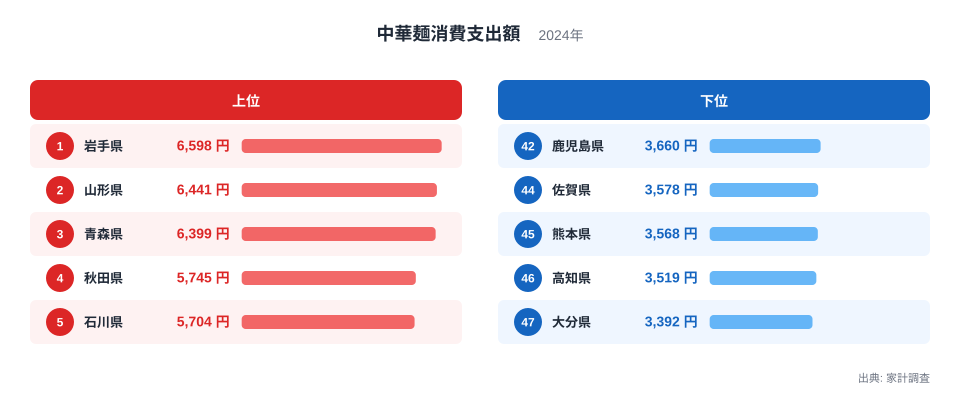
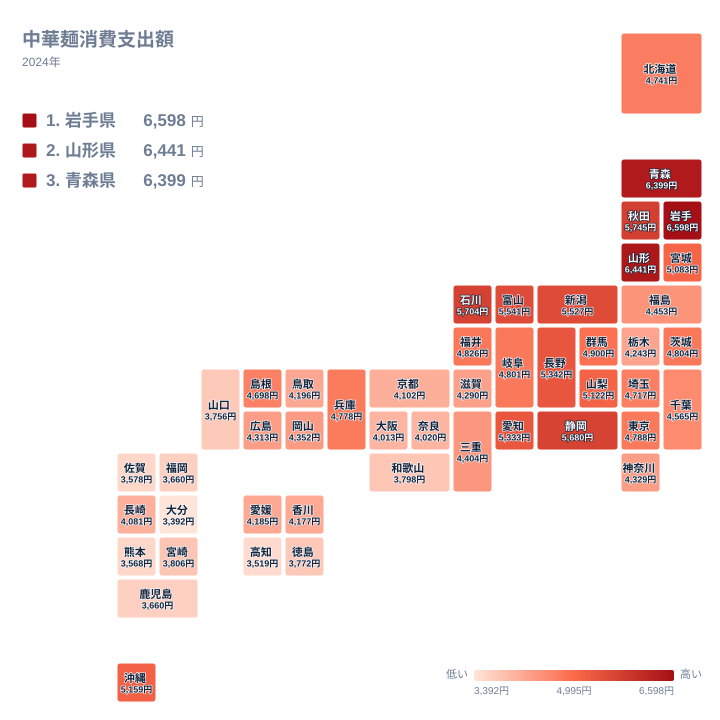

ラーメンや焼きそば、中華丼などに使われる中華麺の消費支出額は、都道府県によって大きな差があります。家計調査のデータを見ると、上位を占めるのは東北地方の県ばかりで、九州地方の県は軒並み下位に沈んでいます。この記事では、なぜこのような地域差が生まれているのかを、ランキングとタイルマップから確認していきます。

## 支出額の上位と下位を見る

<source-link href="/ranking/chinese-noodles-consumption-expenditure">中華麺消費支出額ランキングをもっと見る</source-link>

ランキングを見ると、岩手県が6,598円で1位となり、山形県が6,441円で2位、青森県が6,399円で3位に続きます。4位は秋田県で5,745円、5位は石川県で5,704円です。上位5県のうち岩手県、山形県、青森県、秋田県は東北地方の県で占められており、この地域では家庭で麺料理を作る頻度が高く、乾麺や生麺を購入して自宅で調理する食文化が根付いていると考えられます。特に岩手県はご当地グルメとして中華麺を使った料理が広く親しまれており、冬季の保存食としての需要も背景にある可能性があります。

一方、下位を見ると大分県が3,392円で最も少なく、次いで高知県3,519円、熊本県3,568円、佐賀県3,578円、福岡県3,660円と続きます。下位10県のうち大分県、熊本県、佐賀県、福岡県、宮崎県、鹿児島県は九州地方の県が占めており、1位の岩手県と比べるとおよそ2倍近い差が生じています。九州地方は豚骨ラーメンの専門店文化が強く、外食で中華麺を食べる機会が多い一方で、家庭での購入支出には反映されにくい可能性があります。

中位の県を見ると、東京都は4,788円で18位、兵庫県は4,778円で19位と、いずれも全国のちょうど中間あたりに位置しています。大都市を抱える都府県であっても、上位の東北勢や下位の九州勢のような際立った特徴は見られず、平均的な水準に収まっている点が特徴です。中華麺の消費は都市規模や人口密度よりも、その土地の気候や食習慣に強く結びついていることがこの分布からも読み取れます。

## 地理分布のタイルマップで確認する

タイルマップで全国の分布を見ると、東北地方から北陸地方にかけての日本海側と、中部地方の一部で支出額が高い傾向がはっきりと表れています。岩手県、山形県、青森県、秋田県の東北4県に加えて、石川県、富山県、新潟県といった北陸の県も上位に位置しており、冬季の積雪が多い地域で麺料理が家庭の定番として定着していることがうかがえます。長野県も5,342円で9位に入っており、内陸の寒冷地という共通点が消費傾向に影響している可能性があります。

対照的に、九州地方は全県が下位に集中しています。大分県、熊本県、佐賀県、福岡県、宮崎県、鹿児島県のいずれも下位10県に入っており、地方全体として消費額が低い傾向が明確です。これは前述の通り、外食としてのラーメン文化が発達している一方で、家庭内での中華麺の購入頻度が相対的に低いことが背景にあると考えられます。四国地方でも高知県が3,519円で46位、徳島県が3,772円で40位と低めの水準にあり、西日本全体で家庭消費が控えめな傾向が見られます。

沖縄県は5,159円で11位となっており、九州地方や四国地方とは対照的に、比較的上位に位置しています。沖縄県には沖縄そばという独自の麺料理文化があり、中華麺そのものではないものの、麺料理全般を家庭で食べる習慣が根付いていることが、この順位の背景にある可能性があります。地方区分だけで消費傾向を判断するのではなく、個々の県が持つ独自の麺料理文化にも目を向ける必要があることを示す一例です。

> [!NOTE]
> 中華麺消費支出額は、家計調査における1世帯当たりの年間支出額であり、ラーメン店などでの外食は含まれていません。あくまで家庭で購入する生麺や乾麺、即席麺以外の中華麺の支出を対象とした数値です。

> [!WARNING]
> 外食文化が発達している地域では、家庭での中華麺の購入支出が少なくても、実際の中華麺の消費量自体が少ないとは限りません。この記事のデータだけで地域の食文化全体を判断することはできない点に注意が必要です。

> [!TIP]
> 中華麺の消費傾向を読み解く際は、うどんやそばなど他の麺類の消費支出額と比較すると、その地域がどの麺料理を家庭で作る習慣が強いのかが見えやすくなります。

順位の刻みを細かく見ると、上位10県のうち石川県、富山県、新潟県、長野県といった日本海側から中部内陸にかけての県が並んでいることも目を引きます。石川県は5,704円で5位、富山県は5,541円で7位、新潟県は5,527円で8位、長野県は5,342円で9位となっており、東北4県に加えてこれらの県も家庭で麺料理を作る文化が根強いことがうかがえます。冬季に積雪が多く、保存の利く乾麺や生麺を常備しておく習慣がある地域ほど、中華麺への支出が高くなる傾向があると考えられます。逆に温暖な太平洋側や瀬戸内地域では、常備食としての需要が相対的に薄く、外食や他の食材への支出配分が優先されやすいことも、地域差の一因として挙げられます。

麺類以外の家計消費に関する統計をまとめて見たい場合は[同じカテゴリの統計一覧](/category/economy)が参考になります。1位となった[岩手県のデータ](/areas/03000)や、2位の[山形県のデータ](/areas/06000)もあわせてご覧ください。

こうして見ると、中華麺の消費量は単純な東西の対立構造ではなく、寒冷地かどうか、そして家庭で麺料理を日常的に作る文化があるかどうかという、より細かな条件によって決まっていることが分かります。

## まとめ

中華麺消費支出額は、岩手県の6,598円から大分県の3,392円まで、およそ2倍の開きがあります。上位は岩手県、山形県、青森県、秋田県といった東北地方の県が占め、寒冷地における家庭内での麺料理の定着が支出額を押し上げていると考えられます。下位は大分県、高知県、熊本県、佐賀県、福岡県といった九州・四国地方の県が占めており、外食文化の強さが家庭内消費を相対的に押し下げている可能性があります。

## データ出典

中華麺消費支出額は家計調査(2024年)による集計です。
