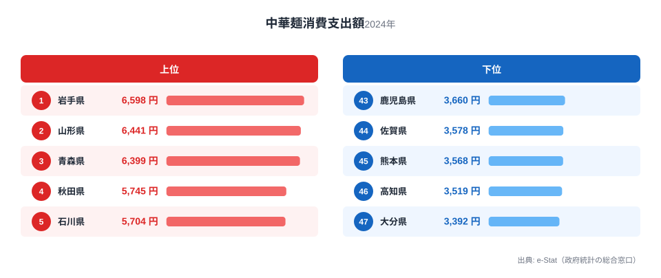

家で作って食べる中華めん──スーパーで買う生めんタイプの中華そばやラーメンの麺のことです。総務省の家計調査によると、2024年の1世帯あたり年間支出額は都道府県ごとに見ると大きな差があります。1位の岩手県は6,598円、最下位の大分県は3,392円で、実に1.9倍の開きがあります。

この記事で注目したいのは、単なる1位・最下位の対比ではありません。上位10県を見渡すと、岩手・山形・青森・秋田という東北勢に加え、石川・富山・新潟・長野といった北陸・信州勢が並び、**「寒冷地×めん食文化」という地理的なかたまり**がくっきり見えてきます。一方で下位には九州・四国の県が集中しています。家庭の食卓に並ぶ中華めんの量が、なぜここまで気候や地域の食文化と結びついているのか、データから読み解いていきます。

## 上位と下位の対比

上位5県は岩手6,598円・山形6,441円・青森6,399円・秋田5,745円・石川5,704円と、東北4県のうち3県(岩手・山形・青森)がトップ3を独占し、秋田も4位に入っています。5位の石川を含め、上位5県はすべて東北または日本海側の寒冷地です。

下位5県は高知3,519円・大分3,392円が最下位争いとなり、佐賀3,578円・熊本3,568円・鹿児島3,660円と、九州勢が下位に集中しています。全国平均に近いのは18位の東京都(4,788円)や19位の兵庫県(4,778円)で、大都市圏は中位に位置する傾向があります。1位の[岩手県](/areas/03000)は東北の中でも寒さが厳しい地域で、家庭での温かい麺料理の消費が高い水準にあることがうかがえます。

<source-link href="/ranking/chinese-noodles-consumption-expenditure">中華めん消費支出ランキングをもっと見る</source-link>

> [!NOTE]
> 本データは家計調査の「中華めん」費目で、スーパー等で購入する生めん・乾麺タイプの中華そば・ラーメンの麺を指します。外食で食べるラーメン店の「中華そば」とは別費目で集計されており、混同しないよう注意してください。

## 東北・北陸に上位が集中する理由

上位10県の顔ぶれを見ると、岩手・山形・青森・秋田(東北)、石川・富山・新潟(北陸)、長野(信州)、静岡、愛知という並びになります。共通するのは冬の寒さが厳しい地域が多いという点です。寒冷地ほど温かい麺料理を頻繁に食卓に出す傾向があるという仮説は、家計調査の他の食品費目(うどん・そば等)でも似た傾向が見られることがあり、気候と麺食文化の結びつきを示唆しています。

さらに東北勢の上位独占には、地域固有の食文化も関係していると考えられます。山形県は酒田・赤湯・米沢など複数のご当地ラーメン(中華そば)文化を持つ「ラーメン県」として知られ、外食だけでなく家庭での中華めん消費も高い水準にあります。青森県は味噌カレー牛乳ラーメンなど独自の中華そば文化があり、岩手県も冷麺やじゃじゃ麺と並んで中華めん系の麺料理が食卓に浸透している地域です。家庭内での調理習慣が定着していることが、購入量・支出額の高さに表れていると見られます。

> [!TIP]
> このデータは「家庭で作る中華めん」の支出額です。外食でラーメンを食べる頻度が高い県が必ずしも上位に来るとは限らず、家庭内調理の習慣が強い地域ほど支出が伸びる構造になっています。

## 九州・四国はなぜ下位に集中するのか

下位5県(高知・大分・佐賀・熊本・鹿児島)はいずれも九州・四国です。温暖な気候により冷たい麺類(そうめん・冷やし中華等)への支出配分が相対的に高くなる可能性や、豚骨ラーメンなど外食でのラーメン消費文化が強く家庭内調理の比重が小さい可能性が考えられますが、これらは家計調査の中華めん費目単体からは検証できない**[仮説]**です。

九州の中でも[福岡県](/areas/40000)は3,660円で42位タイと、博多ラーメンの本場でありながら家庭での中華めん支出は低い水準にとどまっています。これは「外食文化が強い地域ほど家庭内調理への支出が相対的に下がる」という構造を裏付ける一例と読めますが、他の食品費目との比較検証が必要な仮説にとどまります。

> [!WARNING]
> 家計調査は「支出額」ベースの指標のため、価格差(地域による小売価格の違い)も順位に影響します。消費量そのものの地域差とは完全には一致しない点に注意してください。

## 関連品目との対比で見える食文化の輪郭

中華めんと似た即席麺カテゴリでは、カップ麺の消費支出ランキングも公開されています。中華めん(生めん・乾麺)とカップ麺では上位県の顔ぶれが異なる場合があり、比較することで「家庭で一から作る派」と「手軽に済ませる派」の地域差が見えてくる可能性があります。

<source-link href="/ranking/cup-noodles-consumption-expenditure">カップ麺消費支出ランキングを見る</source-link>

> [!TIP]
> 中華めんの支出額が高い東北・北陸の県が、カップ麺でも同様に上位なのか、それとも生めん派とカップ麺派で顔ぶれが入れ替わるのかを見比べると、家庭での麺食習慣の違いがより立体的に見えてきます。

同じ家計調査の食品費目では、うどん・そばの消費支出にも地域差があり、中華めんとの重なりを見ると「めん類全般が強い県」と「特定のめんだけが強い県」を区別できます。うどん県として知られる[香川県](/areas/37000)は中華めんでは33位(4,177円)にとどまっており、必ずしも「めん好きの県=すべてのめんが上位」というわけではないことも興味深い点です。

<source-link href="/ranking/instant-noodles-consumption-expenditure">即席麺(インスタントラーメン)消費支出額ランキングを見る</source-link>

外食でのラーメン需要が家庭内消費にどう影響するかをより広く知りたい方は、即席麺消費の地域差を扱った記事も参考になります。家庭調理派と外食派、そして手軽な即席麺派という3つの軸で麺食文化を捉え直すと、都道府県ごとの食卓の個性がより鮮明に見えてきます。

## まとめ

- 1位は岩手県6,598円、最下位は大分県3,392円で1.9倍の差
- 上位5県は岩手・山形・青森・秋田・石川で、東北・北陸勢が独占
- 下位5県は高知・大分・佐賀・熊本・鹿児島と九州・四国に集中
- 東北勢の上位独占には寒冷地での麺食習慣とご当地ラーメン文化が関係している可能性
- 東京18位・大阪37位など大都市圏は中位から下位に位置する傾向

## データ出典

総務省統計局「家計調査」(2024年、e-Stat経由で整備)。中華めん(生めん・乾麺)の1世帯あたり年間支出額を都道府県別に集計したものです。
