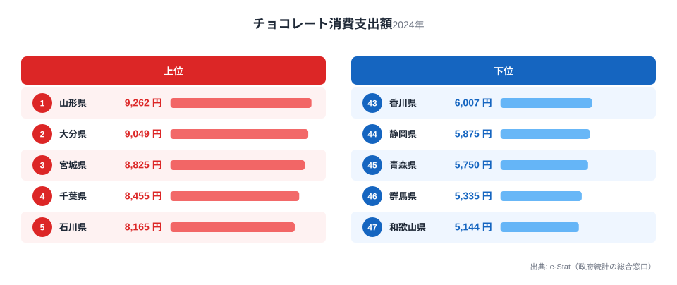

チョコレートは全国どこでも手に入るお菓子ですが、1世帯あたりの年間消費支出額を都道府県別に比べると、実は無視できない地域差があります。総務省「家計調査」（2024年）によると、1位の山形県は9,262円、最下位の和歌山県は5,144円で、その差は1.8倍にのぼります。

この記事では、チョコレート消費支出額の都道府県ランキングを上位・下位それぞれ5県ずつ見ながら、なぜ東北や北陸の県が上位に集まりやすいのかを、気候・食文化・季節需要という3つの切り口から掘り下げます。バレンタイン・ホワイトデーという年2回の贈答需要が地域差にどう影響しているかも合わせて確認します。

> [!NOTE]
> この指標は総務省「家計調査」の品目別支出額で、世帯（原則2人以上）が1年間にチョコレートに支出した金額の平均です。購入量そのものではなく「支出額」なので、単価の高い高級チョコレートを好む地域はやや過大に、安価な大袋チョコを好む地域はやや過小に出る可能性があります。

## 上位5県と下位5県

上位を見ると、1位山形県（9,262円）、2位大分県（9,049円）、3位宮城県（8,825円）、4位千葉県（8,455円）、5位石川県（8,165円）と続きます。東北（山形・宮城）が2県、加えて大分・千葉・石川と地域が分散しているのが特徴です。

<source-link href="/ranking/chocolate-consumption-expenditure">チョコレート消費支出額ランキングをもっと見る</source-link>

東北勢が上位に強い理由の1つは、冬季の寒さです。チョコレートは融点が低く、気温が高い地域では溶けやすく持ち歩きに向かない一方、冬場が長く涼しい東北・北陸は保存・携帯のハードルが低く、間食としての消費機会が年間を通じて確保されやすいと考えられます。加えて、山形県は「フルーツ王国」として知られ、果物を使ったスイーツ全般への関心が高い土地柄も、洋菓子・チョコレート菓子の消費を押し上げている可能性があります。

石川県（5位、8,165円）がトップ5入りしているのも見逃せません。金沢を中心とする石川県は和菓子・洋菓子ともに「甘味処」文化が根付いた土地で、加賀藩以来の茶菓文化を背景に、菓子全般への消費意欲が全国的に高いことで知られています。チョコレートに限らず菓子類支出全体が高い傾向があるため、単品の指標であるチョコレート消費でも上位に顔を出す形です。

## 最下位グループの顔ぶれ

下位側は、43位香川県（6,007円）、44位静岡県（5,875円）、45位青森県（5,750円）、46位群馬県（5,335円）、47位和歌山県（5,144円）という並びです。

<source-link href="/ranking/chocolate-consumption-expenditure">最下位グループの詳細を見る</source-link>

下位グループには明確な地理的偏りは見えず、四国（香川）・東海（静岡）・東北（青森）・北関東（群馬）・近畿（和歌山）とばらけています。これは、チョコレート消費が「猛暑だから低い」という単純な気候要因だけでは説明しきれないことを示しています。和歌山県はみかんなど地場の果物文化が強く、家庭内の菓子消費が果物や和菓子に寄りやすい可能性があります。青森県も東北ですがりんご産地としての性格が強く、同じ東北でも山形・宮城とは消費パターンが異なる点は興味深いところです。

> [!TIP]
> 東北の中でも順位差があります（山形1位・宮城3位 vs 青森45位・秋田41位・福島38位）。「東北=チョコ消費が高い」と単純化せず、県ごとの食文化の違いとして読むのが安全です。

## なぜ地域差が生まれるのか

### 気候要因だけでは説明できない

チョコレートは気温が高いと溶けやすく持ち運びにくいという性質上、寒冷地の方が消費しやすい面はあります。ただし今回のデータでは、比較的温暖な大分県が2位、千葉県が4位に入っており、「寒い県ほど高い」という単純な相関は成立しません。気候は一因ですが、決定要因ではなさそうです。

### バレンタイン・ホワイトデーの季節需要

チョコレート消費は2月のバレンタインデー前後に大きく跳ね上がる季節商品です。家計調査の品目別支出額は年間合計を集計したものですが、2月単月の購入額が年間支出に占める比率は他の菓子類より高いことが知られています。贈答文化への積極性（義理チョコ・ご当地チョコの購入習慣など）が地域によって異なることも、年間支出額の差に影響している可能性があります。

### 菓子文化全体の厚みとの関係 [仮説]

石川県のように、菓子類全般への支出が高い地域では、チョコレートも「その他の菓子」の一部として押し上げられている可能性があります。この仮説を検証するには、チョコレート以外の菓子（和菓子・アイスクリーム・スナック菓子など）の支出額データと突き合わせる必要があり、今回のデータだけでは確定的な結論は出せません。

> [!WARNING]
> 家計調査は世帯単位の抽出調査であり、単身世帯やコンビニでの少額購入は反映が薄くなる傾向があります。特にチョコレートのような「ついで買い」される商品は、実際の消費実態より過小に出ている可能性がある点に注意してください。

## 関連するお菓子の支出ランキング

同じ家計調査の品目別データでは、カステラなど他の菓子類の消費支出も都道府県別に比較できます。

<source-link href="/ranking/castella-consumption-expenditure">カステラ消費支出額ランキングを見る</source-link>

チョコレートとカステラのように、贈答文化や地域の菓子屋文化と結びつきやすい品目を横並びで見ると、その県が「甘いもの全般」に強いのか、特定品目だけが突出しているのかが見えてきます。上位に入った[山形県](/areas/06000)や[石川県](/areas/17000)の地域データ、家計消費全般を扱う[経済・所得カテゴリ](/category/economy)も合わせてご覧ください。

## まとめ

- 1位は山形県（9,262円）、2位大分県（9,049円）、3位宮城県（8,825円）
- 最下位は和歌山県（5,144円）、46位群馬県（5,335円）、45位青森県（5,750円）
- 1位と47位の差は1.8倍
- 東北勢（山形・宮城）が上位に強いが、東北内でも県差が大きく気候だけでは説明できない
- 石川県（5位）は菓子文化全体の厚みが背景にある可能性 [仮説]

## データ出典

総務省統計局「家計調査」（2024年、二人以上の世帯）の品目別支出額データを用いています。e-Stat（政府統計の総合窓口）経由で整備した数値です。
