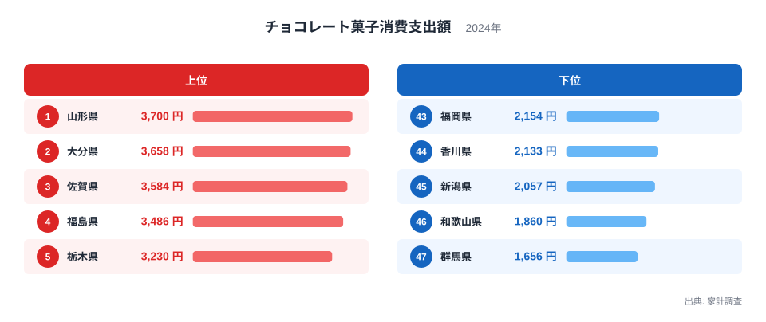
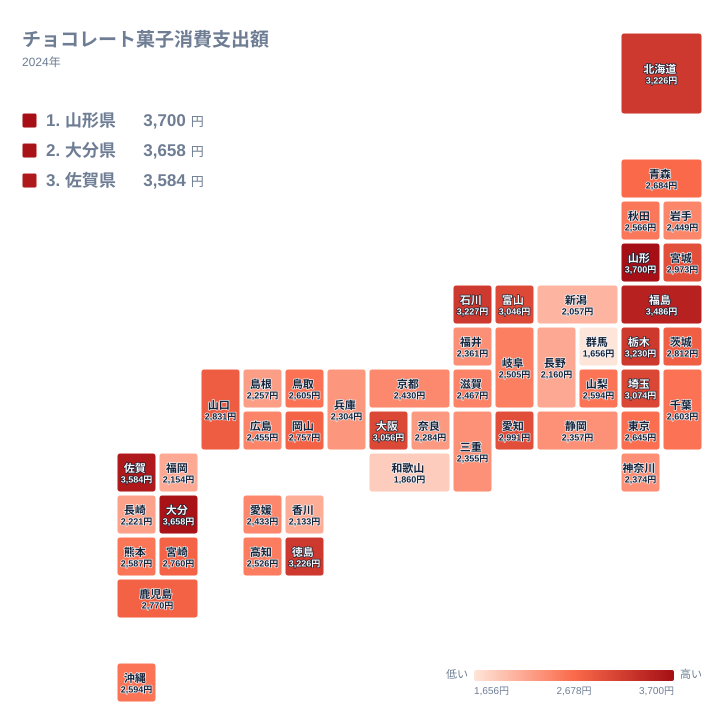

チョコレート菓子は、板チョコレートやチョコレート菓子全般を指す家計調査の分類項目です。全国の世帯が1年間にどれだけの金額をこの品目に使っているかを都道府県別に比較すると、住んでいる場所によって支出額が大きく異なることがわかります。

2024年の家計調査によると、チョコレート菓子への支出額が最も多いのは山形県で、1年間に3700円を使っています。一方、最も少ない群馬県は1656円にとどまり、その差は約2.2倍にもなります。同じチョコレート菓子という品目でも、住む県によってこれほど消費行動が違うのはなぜでしょうか。この記事では、上位と下位の県を具体的に見ながら、気候や食文化、産地との結びつきという観点から、チョコレート菓子支出に見られる地域差の背景を探っていきます。

> [!NOTE]
> 家計調査の「チョコレート菓子」は、板チョコレートやチョコレート菓子全般をまとめた区分で、チョコレートを使ったケーキや焼き菓子は別区分の洋菓子として集計されています。ここでの数値はあくまでこの区分に限った支出額です。

## 上位と下位で見るチョコレート菓子支出

<source-link href="/ranking/chocolate-snack-consumption-expenditure">チョコレート菓子消費支出額ランキングをもっと見る</source-link>

上位を見ると、1位の山形県が3700円、2位の大分県が3658円、3位の佐賀県が3584円、4位の福島県が3486円、5位の栃木県が3230円という順になっています。東北の山形県や福島県が上位に入る一方で、九州の大分県や佐賀県もわずかな差で続いており、単純に「寒い地域ほどチョコレートをよく食べる」という説明だけでは、この分布をすべて説明することはできません。山形県の詳しいデータは[山形県のデータ](/areas/06000)から、大分県の詳しいデータは[大分県のデータ](/areas/44000)から確認できます。

下位を見ると、43位の福岡県が2154円、44位の香川県が2133円、45位の新潟県が2057円、46位の和歌山県が1860円、47位の群馬県が1656円という順になっています。関東地方の内陸に位置する群馬県が最下位となっている一方、隣接する栃木県は5位で上位に入っており、同じ北関東の県同士でも支出額が大きく異なる点が目を引きます。西日本では、和歌山県や香川県のように瀬戸内海沿岸の温暖な県が下位に集まる傾向も見られます。

## 地理分布から見えるパターン

> [!WARNING]
> 家計調査は各県の全世帯を対象とした平均値であり、世帯人数や購入頻度、贈答用としての購入かどうかによって数値が上下しやすい指標です。このランキングだけで「その県の人はチョコレートが好き」と単純に結論づけることはできません。

タイルマップで全国の分布を見ると、東北地方と北陸地方、そして九州北部の県で支出額が高めに出ている一方、関東地方や中国地方、四国地方の県では低めの傾向が見られます。特に山形県、福島県、栃木県が並ぶ東北南部から北関東にかけての一帯は、上位10位以内に複数の県が入るまとまりのある高消費エリアになっています。

一方で、東京都は20位、神奈川県は34位と、人口の多い大都市圏の県は中位から下位に位置しています。都市部よりも地方の県で支出額が高い傾向がある点は、日常のおやつとしての購入だけでなく、贈答用やお土産としてのチョコレート菓子の位置づけが地域によって異なる可能性を示しています。石川県や富山県、福井県といった北陸の県も、6位から35位まで幅があり、同じ地方の中でも支出額に開きがある様子がうかがえます。

## なぜ地域差が生まれるのか

> [!TIP]
> 1位と47位だけでなく、隣り合う順位の県同士の差にも注目すると、地域的なまとまりが見えやすくなります。栃木県と群馬県のように県境を挟んで順位が大きく離れている組み合わせは、地域差の背景を考えるヒントになります。

[仮説] 山形県や福島県、栃木県といった上位県には、冬の寒さが厳しい地域が多く含まれています。温かい飲み物やお菓子を求める機会が増える寒冷な気候が、チョコレート菓子の消費を押し上げている可能性があります。ただし、この仮説だけでは、比較的温暖な九州の大分県や佐賀県が2位、3位に入っている理由を説明できません。気候以外にも、地域ごとの菓子文化や贈答習慣といった要因が重なっている可能性があり、この点はまだ検証が必要な仮説にとどまります。

チョコレート菓子は、和菓子や米菓などと並んで、日本の家庭で日常的に消費されるお菓子のひとつです。[仮説] 和菓子文化が根強い地域では、その分チョコレート菓子への支出が相対的に抑えられ、逆に洋菓子文化が浸透している地域ではチョコレート菓子への支出が伸びやすいという、品目間の代替関係が働いている可能性があります。この関係は、和菓子や米菓の消費支出額と合わせて比較することで、より具体的に検証できるはずです。

## まとめ

- 1位は山形県で、チョコレート菓子への支出額は3700円です。
- 最下位は群馬県で、支出額は1656円にとどまります。
- 1位と最下位の差は約2.2倍です。
- 東北南部から北関東、九州北部にかけての県で支出額が高い傾向が見られます。
- 隣接する栃木県と群馬県のように、近い地域でも順位が大きく分かれる県の組み合わせがあります。

他の経済分野の指標も合わせて見たい方は、[同じカテゴリの統計一覧](/category/economy)からご覧いただけます。

## データ出典

出典: 家計調査（総務省統計局）
集計年: 2024年
