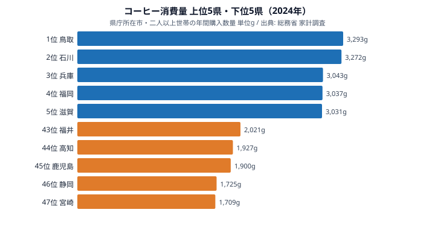

「コーヒーをよく飲むのは、寒い北国だろう」──そう思った人は多いはずだ。雪国の喫茶店文化や、寒さで温かい飲み物が欲しくなるイメージから、北海道や東北が消費量トップに来そうに感じる。

ところが、2024年の家計調査(都道府県庁所在市・二人以上世帯の年間コーヒー消費量)を見ると、その直感は裏切られる。1位は[鳥取県](/areas/31000)の3,293g、2位は石川県の3,272gで、上位を占めるのは山陰・北陸の日本海側だった。「北国の王者」と目された北海道は2,675gで20位にとどまる。最下位は[宮崎県](/areas/45000)の1,709gで、トップとの差は約1.9倍。

この記事では、47都道府県のコーヒー消費量を実データで並べ、「北国=コーヒー大国」というイメージがなぜ崩れるのか、上位・下位にどんな地域の偏りがあるのかを読み解く。

> [!NOTE]
> 本データは総務省「家計調査」の品目別年間支出・購入数量から得たもので、対象は各都道府県庁所在市の二人以上世帯です。県全体の平均ではなく「県庁所在市の世帯」が母集団である点、また外食(喫茶店)ではなく家庭での購入量(レギュラー・インスタント等)である点に注意してください。

## コーヒー消費量 上位10と下位

2024年の消費量を多い順に並べると、次のようになる。トップは鳥取県、僅差で石川県が続き、3位以降は兵庫・福岡・滋賀と地域がばらける。

注目すべきは上位の「日本海側偏重」だ。鳥取県(1位)・石川県(2位)という山陰〜北陸のラインに加え、山形県(2,772g・12位)、岩手県(2,744g・13位)が上位グループに入る。一方で、コーヒー大国のイメージが強い北海道は2,675gで20位にとどまる。「寒い地域ほど飲む」という単純な気候仮説では説明がつかない並びになっている。

<source-link href="/ranking/coffee-consumption-quantity">コーヒー消費量ランキングをもっと見る</source-link>

## 最下位グループ:なぜ南国・温暖地が下位なのか

下位5県を抜き出すと、九州・四国・東海といった比較的温暖な地域が並ぶ。

| 順位 | 都道府県 | 年間消費量 (g) |
|---|---|---|
| 43 | 福井県 | 2,021 |
| 44 | 高知県 | 1,927 |
| 45 | 鹿児島県 | 1,900 |
| 46 | 静岡県 | 1,725 |
| 47 | 宮崎県 | 1,709 |

最下位の宮崎県(1,709g・47位)と鹿児島県(1,900g・45位)は、いずれも九州南部。[静岡県](/areas/22000)(1,725g・46位)は緑茶の名産地として知られ、家庭での飲用習慣が緑茶に寄っている可能性がある。高知県(1,927g・44位)も含め、下位には温暖で茶どころ・焼酎文化の地域が目立つ。

> [!TIP]
> 下位に静岡(緑茶)・鹿児島/宮崎(焼酎)が並ぶことから、コーヒー消費量は「気温」よりも「その土地に根づいた別の飲み物文化」と競合関係にある可能性が読み取れます。コーヒーが多い=寒いから、という単純な構図ではありません。

ただし最下位の宮崎ですら年間1,709g。1位の鳥取(3,293g)との差は約1.9倍で、極端な「飲む県・飲まない県」に二分されているわけではない。47都道府県すべてが一定量を消費する、全国的に定着した飲み物だと言える。

## 発見1:「北国=コーヒー大国」イメージはなぜ崩れるのか

このランキングの最大の意外性は、寒冷地が上位を独占していない点にある。実際の上位の顔ぶれを気候で整理すると、北国仮説の弱さがはっきりする。

- 鳥取県(3,293g・1位)・石川県(3,272g・2位):日本海側だが「極寒」ではなく、山陰・北陸
- 兵庫県(3,043g・3位)・福岡県(3,037g・4位)・滋賀県(3,031g・5位):温暖〜中間気候の都市圏
- 北海道(2,675g・20位)・青森県(2,693g・18位):北国だが上位には届かない

もし「寒さ」が決定因なら、北海道・東北が上位を独占するはずだが、実際には北海道は中位(20位)。代わりに山陰・北陸の日本海側と、兵庫・福岡・千葉・愛知といった都市圏が混在している。

**[仮説]** 上位の共通項は「気温」ではなく「来客文化・在宅消費の習慣」や「世帯あたりの購入頻度」にある可能性がある。家計調査は県庁所在市の世帯購入量を測るため、喫茶店での外飲みが多い地域はむしろ家庭での購入量が抑えられることも考えられる。この仮説を確かめるには、外食(喫茶代)支出データや世帯人数との突き合わせが必要で、本ランキング単体では断定できない。

> [!WARNING]
> 家計調査の品目別データは年ごとのサンプル変動が比較的大きく、単年の順位は前後しやすい指標です。本記事は2024年単年の数値に基づいています。「鳥取が常に1位」ではなく、年によって石川・北海道・奈良・京都などが入れ替わりながら上位を形成してきた点に留意してください。トレンドを見るときは複数年での平均的な位置づけで捉えるのが安全です。

## 発見2:トップと最下位の差は約1.9倍にとどまる

地域差を語るとき「○倍の格差」という表現がよく使われるが、コーヒー消費量の場合、その倍率は意外に小さい。

- 最大:鳥取県 3,293g
- 最小:宮崎県 1,709g
- 倍率:3,293 ÷ 1,709 ≒ 1.93倍

砂糖や特定の地場食材のように「10倍以上」差がつく品目と比べると、コーヒーは全国的に均質に消費されている飲み物だと分かる。地域差は確かに存在するが、それは「飲む県・飲まない県」という断絶ではなく、「よく飲む県・そこそこ飲む県」というグラデーションだ。

それでも、最も飲む県と最も飲まない県では年間1,584g(=3,293−1,709)の差がある。一般的なレギュラーコーヒー1杯あたり約10gとすると、世帯あたり年間で約158杯分の差に相当する。日常の小さな習慣の積み重ねが、県単位では無視できない差として現れている。

## まとめ

- 2024年のコーヒー消費量1位は鳥取県(3,293g)、僅差の2位は石川県(3,272g)
- 最下位は宮崎県(1,709g)で、静岡県(1,725g)・鹿児島県(1,900g)と温暖・茶どころ・焼酎文化の地域が下位に集中
- トップと最下位の倍率は約1.9倍で、品目としては地域差が小さく全国的に定着
- 「北国=コーヒー大国」のイメージに反し、北海道は20位。上位は山陰・北陸の日本海側と都市圏が混在
- 単年の順位は変動しやすく、上位は鳥取・石川・北海道・奈良・京都などが入れ替わる(複数年で見るのが安全)

## データ出典

総務省統計局「家計調査」(品目別都道府県庁所在市・二人以上世帯の年間購入数量)。集計年は2024年。e-Stat(政府統計の総合窓口)経由で整備したデータを用いています。本記事の数値はすべて該当年の購入数量(g)に基づきます。
