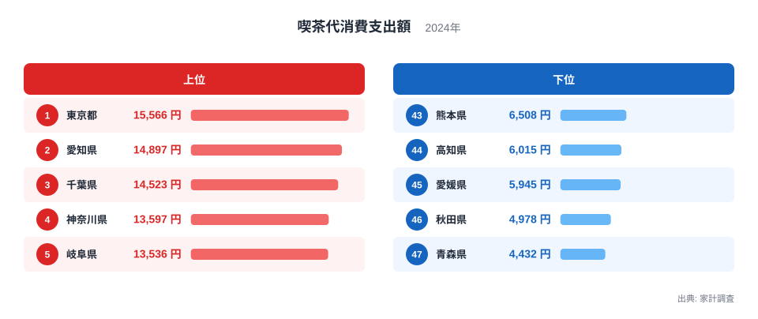
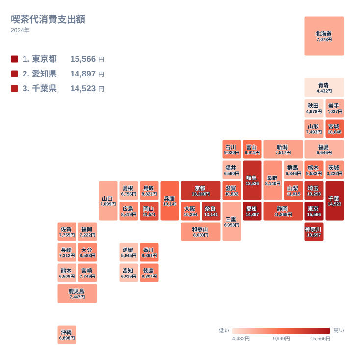

喫茶代消費支出額とは、家計調査で集計される、世帯が喫茶店やカフェで飲食にかけた1年間の支出額のことです。純粋な「コーヒー好き」の度合いだけでなく、喫茶店文化がどれだけ生活に根づいているかを映す指標でもあります。

2024年の家計調査によると、喫茶代消費支出額は都道府県で大きな差があります。1位は東京都の15,566円、最下位は青森県の4,432円で、その差は約3.5倍にのぼります。単なる都市と地方の差では説明がつかない部分もあり、上位には「喫茶店文化の聖地」として知られる愛知県や岐阜県が並びます。この記事では、なぜ特定の県で喫茶代が突出して高いのか、その地域構造を読み解きます。

## 上位と下位に見る大きな開き

<source-link href="/ranking/coffee-shop-consumption-expenditure">喫茶代消費支出額ランキングをもっと見る</source-link>

上位を見ると、東京都が15,566円で1位、愛知県が14,897円で2位、千葉県が14,523円で3位となっています。4位は神奈川県で13,597円、5位は岐阜県で13,536円です。上位5県のうち3県が首都圏（東京都・千葉県・神奈川県）で、残る2県が東海地方（愛知県・岐阜県）という構図になっています。

首都圏勢は人口密集地ゆえに喫茶店の数そのものが多く、通勤・通学の合間にカフェを利用する機会が豊富にあることが背景にあると考えられます。一方で愛知県と岐阜県は、モーニングサービスに代表される独自の喫茶店文化を持つ地域として知られています。名古屋を中心とした東海地方では、コーヒー1杯の注文でトーストや茹で卵が無料で付いてくる習慣が根づいており、喫茶店が単なる飲食の場ではなく生活インフラのような役割を果たしています。この文化的な厚みが、都市規模だけでは説明できない高い支出額を押し上げていると見られます。

下位を見ると、青森県が4,432円で最下位、秋田県が4,978円で46位、愛媛県が5,945円で45位、高知県が6,015円で44位、熊本県が6,508円で43位となっています。下位5県のうち青森県・秋田県は東北地方に位置し、寒冷な気候と喫茶店以外の飲食文化が根強い地域です。愛媛県・高知県・熊本県は九州・四国地方に位置し、いずれも喫茶代よりも家庭内での飲食を重視する消費傾向がうかがえます。

## 地理でみる喫茶代消費の分布

タイルマップで全国を見渡すと、喫茶代消費支出額が高い県は関東地方と東海地方に集中していることがわかります。特に東京都・愛知県・岐阜県・埼玉県・神奈川県・千葉県という高支出県の並びは、関東と東海が一つの帯のようにつながっている様子を示しています。

対照的に、東北地方と南九州・四国の一部は低支出のかたまりとして分布しています。青森県、秋田県、岩手県、福島県といった東北の県は軒並み下位に位置しており、地域全体として喫茶代への支出が低い傾向が明確です。地理的に離れた関東・東海の高支出クラスターと東北の低支出クラスターという対比は、単なる都市部・地方部の差ではなく、それぞれの地域が持つ独自の生活習慣や食文化の違いを映していると考えられます。

> [!NOTE]
> 喫茶代消費支出額は、家計調査における「喫茶店等での飲食」に対する年間の支出金額を示す指標です。喫茶店の数や来店回数そのものではなく、あくまで世帯単位の支出金額であるため、1回あたりの単価が高い都市部ほど数値が上振れしやすい傾向があります。

## 東海地方の喫茶店文化という真因

なぜ東海地方だけが、首都圏に匹敵するほどの喫茶代を記録しているのでしょうか。その答えの一つが、名古屋を中心に発展した独自の喫茶店文化にあります。愛知県や岐阜県では、朝の時間帯に喫茶店でコーヒーを注文すると、トーストやゆで卵、小鉢料理などが無料または低価格で付いてくる「モーニングサービス」が広く定着しています。この習慣は単発の観光資源ではなく、地域住民の日常生活に深く組み込まれており、平日の朝から喫茶店に多くの人が集まる光景が見られます。

こうした文化的背景があるからこそ、愛知県は14,897円、岐阜県は13,536円という、人口規模や都市機能だけでは説明しきれない高い支出額を記録しています。実際、岐阜県は東京都・愛知県・千葉県・神奈川県に次ぐ5位という順位であり、首都圏の主要都県と肩を並べています。これは喫茶代消費支出額が、都市の規模だけでなく地域固有の生活文化によって大きく左右されることを示す好例といえます。

> [!WARNING]
> 家計調査は全世帯を対象とした悉皆調査ではなく、標本調査に基づく推計値です。県ごとのサンプル世帯数には差があるため、特に人口の少ない県では年による変動が大きくなる場合があります。単年のランキングだけで地域の消費傾向を断定的に評価するのではなく、複数年の推移とあわせて読み解くことをおすすめします。

## 関連する消費支出との対比

喫茶代消費支出額は、他の飲食関連の消費支出と合わせて見ることで、その地域が「外食型」か「内食型」かという消費スタイルの違いを読み取ることができます。喫茶代が上位に入る東京都・愛知県・千葉県・神奈川県・岐阜県は、いずれも人口集積地または独自の外食文化を持つ地域であり、飲食にかける支出全体が高くなる傾向があります。

一方で、喫茶代が下位に位置する青森県・秋田県・愛媛県・高知県・熊本県では、外食よりも家庭内での調理や地元産の食材を活用した食生活が根強く残っていると考えられます。[仮説] 気候の違いも一因である可能性があります。東北地方の寒冷な気候では、外出して喫茶店に立ち寄るよりも自宅で温かい飲み物を用意する習慣が強いのかもしれません。この仮説については、気温データや他の家計消費項目との相関を確認する検証が必要です。

> [!TIP]
> 喫茶代消費支出額を読み解く際は、都市規模だけでなく「モーニングサービス」のような地域固有の喫茶店文化の有無に注目すると、単純な人口比較では見えてこない地域差の理由が見つかりやすくなります。

同じ経済分野の他の指標もあわせて確認したい方は、[同じカテゴリの統計一覧](/category/economy)から探すことができます。上位県である[東京都のデータ](/areas/13000)や[愛知県のデータ](/areas/23000)では、それぞれの地域の消費傾向をより詳しく見ることができます。

## まとめ

- 喫茶代消費支出額の1位は東京都で15,566円、最下位は青森県で4,432円と、約3.5倍の差があります
- 上位5県は東京都、愛知県、千葉県、神奈川県、岐阜県で、首都圏と東海地方が並んでいます
- 下位5県は青森県、秋田県、愛媛県、高知県、熊本県で、東北と九州・四国の一部に分布しています
- 愛知県・岐阜県の高支出は、モーニングサービスに代表される東海地方独自の喫茶店文化が背景にあると考えられます
- 地理的には関東・東海が高支出クラスター、東北が低支出クラスターとして分布しており、地域固有の生活文化の違いを反映しています

## データ出典

家計調査（2024年）に基づく喫茶代消費支出額のデータを使用しています。e-Stat経由で整備した統計データをもとに作成しました。
