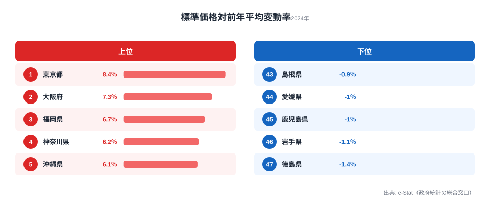
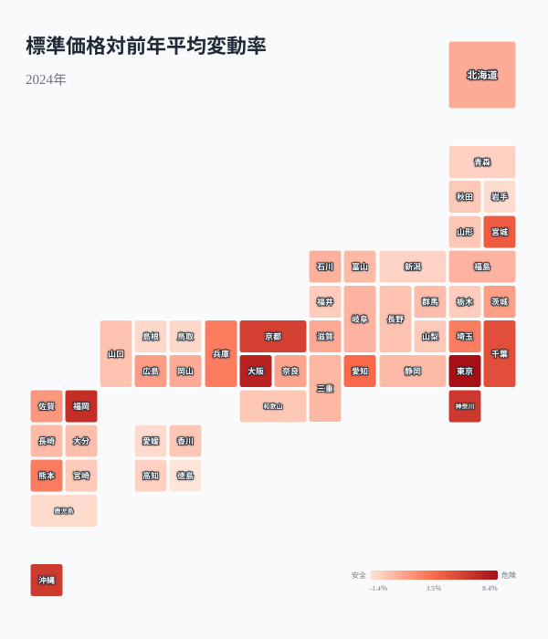
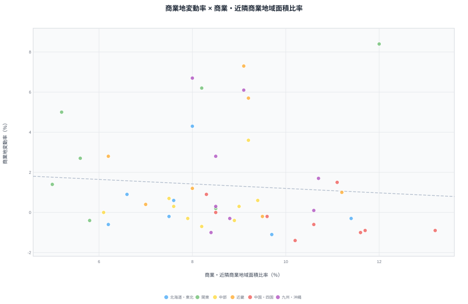
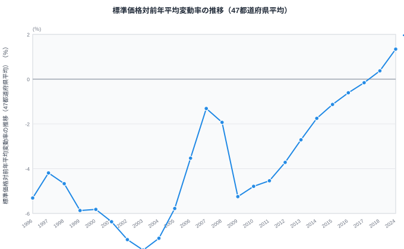
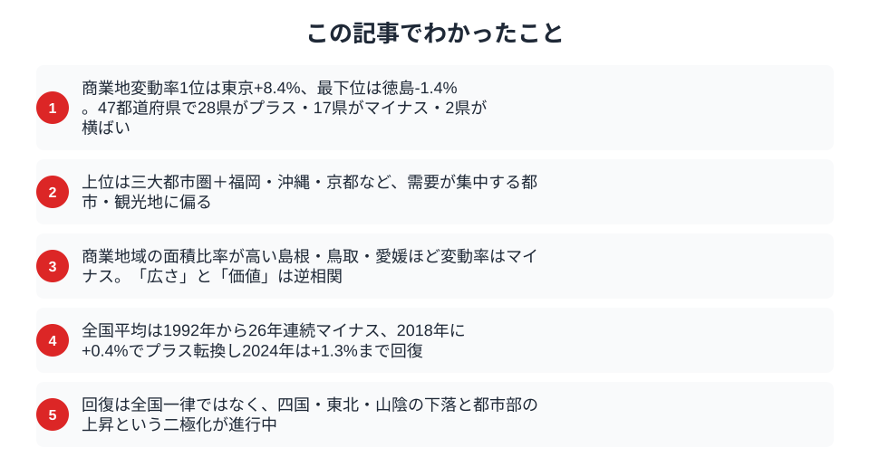

「商業地域の面積比率が高い県ほど、地価が上がりやすい」と考えられるでしょうか。2024年の変動率と2023年の面積比率を47都道府県で照合すると、相関係数は約-0.08で、明確な直線関係は見られません。東京都は面積比率12.0%・変動率+8.4%ですが、面積比率がさらに高い島根県は13.2%・変動率-0.9%です。

この記事では、2024年の商業地変動率ランキング、商業・近隣商業地域面積比率との散布図、1996年以降に観測できる都道府県平均の推移を確認します。掲載データから観測できる差と、追加資料なしには判断できない原因を分けて読み解きます。

## 商業地変動率ランキング（2024年度）

**変動率が最も高いのは[東京都](/areas/13000)で+8.4%** です。2位は大阪府で+7.3%、3位は[福岡県](/areas/40000)で+6.7%、4位は神奈川県で+6.2%、5位は沖縄県で+6.1%となっています。

**最も低いのは[徳島県](/areas/36000)で-1.4%** です。岩手県は-1.1%、愛媛県と鹿児島県は-1.0%となっています。47都道府県のうち28県がプラス、17県がマイナス、2県が0%です。47都道府県の算術平均は約+1.3%ですが、平均だけでは各県の正負を捉えられません。

> [!NOTE]
> 商業地の変動率は、商業地域に設定された標準地の鑑定評価から算出されます。県内すべての商業地や実際の取引価格をそのまま集計した値ではないため、指標の対象範囲に注意が必要です。

<source-link href="/ranking/standard-price-change-rate-commercial">商業地 標準価格対前年平均変動率ランキング</source-link>

## 都道府県マップ──商業地価の地域パターン

マップからは、上昇県と下落県の地理的な分布を確認できます。

- **上昇率が高い県**: 東京・大阪・福岡・神奈川・沖縄が上位5県です。
- **隣接県と異なる例**: 宮城県や京都府など、周辺県より高い変動率を示す県があります。
- **マイナスの県**: 徳島・愛媛・岩手・鳥取・島根などはマイナスです。ただし、マップだけでは下落の原因を特定できません。

同じ四国でも香川県は-0.2%、愛媛県は-1.0%で差があります。この差を再開発、人口動態、観光需要などに結び付けるには、それぞれの追加データが必要です。

<ad-slot></ad-slot>

## 面積比率との関係──ほぼ無相関

横軸に商業・近隣商業地域面積比率、縦軸に商業地変動率をとると、47都道府県の相関係数は約-0.08です。面積比率だけで変動率を予測できるような直線関係は見られません。

- **面積比率が高く変動率も高い例**: 東京都は面積比率12.0%・変動率+8.4%です。
- **面積比率が高く変動率が低い例**: 島根県は13.2%・-0.9%、鳥取県は11.7%・-0.9%、愛媛県は11.6%・-1.0%です。
- **面積比率が低く変動率が高い例**: 千葉県は5.2%・+5.0%、埼玉県は5.6%・+2.7%です。

同程度の面積比率でも変動率は正負に分かれています。二つの指標を並べることで「面積比率が高いほど上がる」「高いほど下がる」という単純な説明のどちらも当てはまらないことが分かります。

> [!WARNING]
> 相関係数は因果関係を示しません。また、面積比率は2023年、地価変動率は2024年の値です。地価の要因を調べるには、人口・取引件数・再開発・観光需要などを同じ地域・期間で別途検証する必要があります。

<source-link href="/ranking/commercial-and-neighborhood-commercial-area-ratio">商業・近隣商業地域面積比率ランキング</source-link>

## 1996年以降の推移

R2の現行観測値から再生成できる系列は、1996〜2018年と2024年の24時点です。各年に観測された47都道府県の値を算術平均しており、国が別途公表する全国値とは区別して読みます。

1996年は-5.31%で、系列内の最低は2003年の-7.64%です。その後は途中で後退を挟みながら、長期的にはマイナス幅が縮小し、2018年に+0.37%となりました。

2024年は+1.34%です。ただし、現行系列には2019〜2023年の観測点がないため、2018年から2024年まで毎年連続して上昇したとは判断できません。

> [!NOTE]
> この折れ線は各年の都道府県値の算術平均です。年次の全国値や欠けた期間を補間した系列ではありません。比較できる観測点だけを結んでいます。

<ad-slot></ad-slot>

## まとめ

商業地の変動率ランキング、面積比率との関係、1996年以降の観測点を整理しました。

2024年はプラスの県とマイナスの県が併存し、47都道府県平均だけでは各県の状況を説明できません。商業地域面積比率と変動率にも明確な直線関係は見られません。個別地域を評価するときは、変動率と面積比率を原因と結果として結び付けず、人口・取引・開発など別の指標も確認する必要があります。

## データ出典

- [e-Stat 社会・人口統計体系（地価公示）](https://www.e-stat.go.jp/dbview?sid=0000010212) ── 商業地標準価格対前年平均変動率（2024年、時系列は現行R2観測点から再生成）
