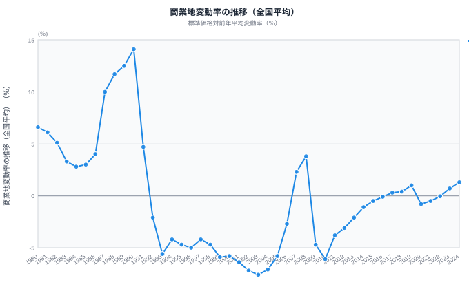

「商業地の面積が広い県ほど、地価が上がりやすい」──そう思うかもしれない。しかし実際のデータは逆だ。商業・近隣商業地域の面積比率が全国上位の島根・鳥取・愛媛は、変動率がいずれもマイナス。一方、面積比率が中位の東京は+8.4%の急上昇を記録している。

需要が集まる場所には限られた商業地に価格が殺到し、需要が薄れた地方では広大な商業地域が余剰となって値下がりする。2024年の地価公示データが示す「面積と価値の逆転」を解析する。

## 商業地変動率ランキング（2024年度）

**変動率が最も高いのは[東京都](/areas/13000)**（+8.4%）。2位の大阪府（+7.3%）、3位の[福岡県](/areas/40000)（+6.7%）と、三大都市圏に加え地方中核都市が上位を占める。4位は神奈川県（+6.2%）、5位は沖縄県（+6.1%）とインバウンド需要が旺盛な地域が続く。

**最も低いのは[徳島県](/areas/36000)**（-1.4%）。岩手県（-1.1%）、愛媛県・鹿児島県（-1.0%）と四国・東北・九州の地方県が下位に並ぶ。47都道府県のうち**28県がプラス、17県がマイナス**、2県が横ばい（0%）。全国平均は+1.3%だが、地方では3分の1以上の県で下落が続いている。

> [!NOTE]
> 商業地の変動率は、商業地域に設定された標準地の鑑定評価から算出される。駅前一等地だけでなく地方の商店街も含まれるため、県全体の「商業立地としての評価」を反映している。

<source-link href="/ranking/standard-price-change-rate-commercial">商業地 標準価格対前年平均変動率ランキング</source-link>

## 都道府県マップ──商業地価の地域パターン

マップから3つのパターンが読み取れる。

- **三大都市圏＋福岡が濃い赤**──東京・大阪・名古屋の三大都市圏に加え、福岡が+6.7%と高い上昇率。オフィス需要・商業施設開発・インバウンドが集中する都市で地価が急上昇
- **沖縄・宮城・京都の「飛び地」**──沖縄はリゾート・観光需要、宮城は仙台駅周辺の再開発、京都は観光需要とホテル開発で高い上昇率
- **四国・東北・山陰が青色**──徳島・愛媛・岩手・鳥取・島根は軒並みマイナス。人口減少と商業の空洞化が地価に直結

同じ四国でも香川県（-0.2%）と愛媛県（-1.0%）に差があり、高松の再開発効果が表れている。

<ad-slot></ad-slot>

## 面積比率との逆相関──「広さ」と「価値」は別物

横軸に商業・近隣商業地域面積比率（都市計画区域に占める商業用途地域の割合）、縦軸に商業地変動率をとると、**意外な逆相関**が浮かび上がる。

- **左上**（面積比率低×変動率高）: 東京・大阪・神奈川──商業地域の面積割合は高くないが、限られた土地に需要が集中し地価が急上昇
- **右下**（面積比率高×変動率低）: 島根・鳥取・愛媛──面積比率は全国上位だが変動率はマイナス。商業地域が広くても需要がなければ地価は下がる
- **右上**（面積比率高×変動率高）: 該当県はほぼなし──「広くて値上がりも激しい」県は存在しない

この散布図が示すのは、**商業地域の「広さ」と「価値」は全く別物**という事実だ。都市部では限られた商業地に需要が殺到して地価が上がり、地方では広い商業地域が余剰となって地価が下がる──需給の二極化が鮮明に表れている。

> [!WARNING]
> 地方の商業地域面積比率が高い背景には、高度経済成長期の都市計画で広く商業用途を指定した歴史がある。その後の人口減少・モータリゼーションで中心商店街が衰退し、商業地の供給過剰状態が続いている県が多い。

<source-link href="/ranking/commercial-and-neighborhood-commercial-area-ratio">商業・近隣商業地域面積比率ランキング</source-link>

## 約50年の推移──バブルと崩壊、そして回復

全国平均の商業地変動率は**1990年に+14.1%のピーク**を記録。バブル景気のさなか、東京・大阪を中心に商業地価が暴騰した。

しかし1992年にマイナスに転落すると、そこから**26年間にわたりマイナス圏が続いた**。最も深刻だったのは2003年の-7.6%で、バブル崩壊後の不良債権処理とデフレが商業地価を直撃した時期だ。

2007年前後にミニバブルで一時回復したが、リーマンショック（2008年）で再びマイナスに沈没。その後はアベノミクスの金融緩和を背景に徐々に回復し、**2018年に+0.4%と26年ぶりにプラス転換**を果たした。

2020年にはコロナ禍で再びマイナスに転落したが、2022年はほぼ横ばい（-0.05%）まで回復し、2023年は+0.7%、2024年は+1.3%と**回復が加速**している。

> [!NOTE]
> 2024年の+1.3%はバブル崩壊後で最高の上昇率だ。インバウンド回復、都市再開発、半導体工場誘致（熊本+2.8%）など複数の要因が重なっている。ただしこの回復が外部環境依存である点は留意が必要だ。

<ad-slot></ad-slot>

## まとめ──商業地価の二極化と投資判断

商業地の変動率ランキング・面積比率との逆相関・約50年間の時系列推移から、都道府県の商業地価の構造を整理する。

商業地価の回復は「全国一律」ではない。東京・大阪・福岡などの大都市や観光地では力強い上昇が続く一方、四国・東北・山陰では下落が止まらないという**二極化**が進んでいる。

不動産投資や出店計画を検討する際は、「全国平均+1.3%」という数字ではなく**都道府県単位の変動率**を確認することが不可欠だ。そして面積比率の高い地方県が必ずしも魅力的な投資先でないことは、散布図が如実に示している。

## データ出典

- [e-Stat 社会・人口統計体系（地価公示）](https://www.e-stat.go.jp/dbview?sid=0000010212) ── 商業地標準価格対前年平均変動率（2024年）
