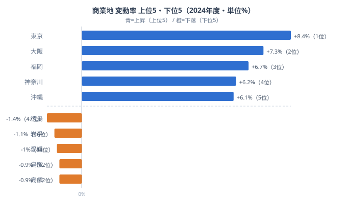

「商業地の面積が広い県ほど、地価も上がりやすい」と思うかもしれません。しかし実際のデータは、そう単純ではありません。商業・近隣商業地域の面積比率が全国上位の島根・鳥取・愛媛は、2024年の商業地変動率がいずれもマイナスでした。広い商業地を抱えながら、価格は下がっているのです。

逆に、面積比率では全国2番目に広い東京は、変動率が+8.4%と全国トップを記録しています。広さがそのまま価格上昇につながるわけでも、広さが下落をもたらすわけでもありません。鍵を握るのは「広さ」ではなく「需要が集まるかどうか」です。2024年の地価公示データから、面積と価値が一致しない地方の二極化を読み解いていきます。

## 商業地変動率──上位5と下位5（2024年度）

変動率が最も高いのは[東京](/areas/13000)で+8.4%、続いて大阪が+7.3%、福岡が+6.7%でした。4位は神奈川の+6.2%、5位は沖縄の+6.1%と、三大都市圏に地方中核都市とリゾート地が加わって上位を形成しています。一方で最も低いのは[徳島](/areas/36000)の-1.4%で、岩手が-1.1%、愛媛が-1.0%、鳥取と島根がともに-0.9%と、四国・東北・山陰の地方県が下位に並びます。

上位と下位を分けているのは、人口とオフィス・商業の集積です。東京・大阪・福岡では、駅前再開発やオフィス需要、訪日客の消費が限られた一等地に集中し、地価を押し上げています。対して下位の県では、人口減少と中心商店街の空洞化が進み、需要そのものが細っているために地価が下がり続けています。同じ地方でも、観光やリゾート需要を取り込めた沖縄が+6.1%で上位に入る点は、需要の有無が価格を決めることをよく示しています。

47都道府県のうち、変動率がプラスだったのは28県、マイナスは17県、横ばい（0%）が2県です。全国平均は+1.3%ですが、3分の1以上の県では下落が続いており、「回復」は決して全国一律ではありません。同じ四国でも香川は-0.2%と愛媛の-1.0%より下げ幅が小さく、高松駅周辺の再開発の効果がうかがえます。

> [!NOTE]
> 商業地の変動率は、商業地域に設定された標準地の鑑定評価から算出されます。駅前一等地だけでなく地方の商店街も評価対象に含まれるため、県全体の「商業立地としての評価」を反映する指標です。県内の一部都市だけが好調でも、商店街の地価が下がっていれば県平均は伸び悩みます。

> [!WARNING]
> 下位には同率順位が並びます。-1.0%は愛媛と鹿児島が44位タイ、-0.9%は鳥取と島根が42位タイです。図では面積比率の逆説（後述）に直結する愛媛・鳥取・島根を下位5に採っていますが、同率の鹿児島（-1.0%）も実質的に最下位グループに含まれる点に注意してください。順位の上下だけでなく、同じ変動率の県がまとまって沈んでいることが地方の実態です。

<source-link href="/ranking/standard-price-change-rate-commercial">商業地 標準価格対前年平均変動率ランキングをもっと見る</source-link>

## 面積比率と変動率──「広さ」は価格を決めない

ここで、もう一つの指標を重ねてみます。商業・近隣商業地域面積比率（都市計画区域に占める商業用途地域の割合）です。この比率が全国で最も高いのは島根で13.2%、次いで東京が12.0%、鳥取が11.7%、愛媛が11.6%と続きます。商業地として指定された土地の「広さ」のランキングです。

ここに先ほどの変動率を突き合わせると、興味深いことが見えてきます。島根（面積比率1位）・鳥取（3位）・愛媛（4位）は、いずれも変動率がマイナスの下位県でした。商業地として広く指定されているのに、価格は下がっているのです。「広い県ほど地価が下がる」という逆説が、ここでは確かに成立しています。

しかし、その逆説だけでは説明できないのが東京です。東京は商業地域の面積比率が全国2番目に広い12.0%でありながら、変動率は+8.4%で全国トップ。「広い＝下落」でも「広い＝上昇」でもありません。広さと価格のあいだに一本の直線は引けず、両者を分けているのは需要の厚みです。同じ「広い商業地」でも、人口とビジネスが集まる東京では地価が上がり、人口が減る島根・鳥取では地価が下がる──広さは器であって、中身の需要が価値を決めています。

> [!WARNING]
> 「面積比率が高い＝地価が下がる」と単純に結びつけるのは誤りです。東京のように面積比率が全国上位でも変動率が全国トップの県があり、面積と変動率は因果でつながっていません。地方で面積比率が高い背景には、高度経済成長期に広く商業用途を指定し、その後の人口減少とモータリゼーションで需要が追いつかなくなった歴史があります。広さは過去の都市計画の名残であり、今の地価を決めているのは現在の需要です。相関と因果を混同しないようにしてください。

<source-link href="/ranking/commercial-and-neighborhood-commercial-area-ratio">商業・近隣商業地域面積比率ランキングをもっと見る</source-link>

## 回復は二極化している──大都市と地方の分岐

2024年の全国平均+1.3%は、バブル崩壊後では最も高い上昇率です。インバウンドの回復、都市再開発、半導体工場の誘致といった複数の追い風が重なった結果でした。ただし、この回復が外部環境に依存している点には注意が必要です。

重要なのは、回復が「全国一律」ではないことです。東京・大阪・福岡などの大都市や、沖縄のような観光地では力強い上昇が続く一方、徳島・岩手・島根・鳥取・愛媛では下落が止まりません。プラス28県・マイナス17県という内訳そのものが、回復の波が一部の地域に偏っていることを物語っています。同じ「商業地」という言葉でも、県によって意味するものは大きく異なるのです。

不動産投資や出店計画を検討する際は、「全国平均+1.3%」という一つの数字ではなく、都道府県単位の変動率を確認することが欠かせません。そして、商業地域が広い地方県が必ずしも有望な投資先とは限らないことは、島根・鳥取・愛媛の例がはっきりと示しています。広さに惑わされず、その土地に需要が集まっているかを見極めることが、地価の行方を読む出発点になります。

> [!TIP]
> 地価の上昇・下落を読むときは、まずその地域の人口動態と再開発計画を合わせて確認すると見通しが立てやすくなります。同じ県でも、再開発が進む県庁所在地と、需要が細る周辺の商店街では地価の方向が逆になることが珍しくありません。県平均だけでなく、関心のある都市の標準地まで掘り下げて見るのがおすすめです。広域の都道府県比較は[商業地のカテゴリ一覧](/category/commercial)から各指標をたどれます。

## まとめ

2024年の地価公示データから読み取れる商業地価の構造を整理します。

- 変動率の上位は東京（+8.4%）・大阪（+7.3%）・福岡（+6.7%）・神奈川（+6.2%）・沖縄（+6.1%）で、人口とオフィス・商業・観光の集積がある地域が並びます。
- 下位は徳島（-1.4%）・岩手（-1.1%）・愛媛（-1.0%）・鳥取（-0.9%）・島根（-0.9%）で、四国・東北・山陰の地方県が中心です（-1.0%は鹿児島も44位タイ）。
- 商業地域面積比率1位の島根、3位の鳥取、4位の愛媛はいずれも変動率がマイナスで、「広い県ほど地価が下がる」逆説が成立します。
- ただし面積比率2位の東京は変動率が全国トップであり、広さと価格は因果でつながらず、需要の厚みが価値を決めています。
- 全国はプラス28県・マイナス17県・横ばい2県で、回復は全国一律ではなく大都市と地方で二極化しています。

## データ出典

- [e-Stat 社会・人口統計体系（地価公示）](https://www.e-stat.go.jp/dbview?sid=0000010212) ── 商業地標準価格対前年平均変動率（2024年度）／商業・近隣商業地域面積比率（2023年度）
