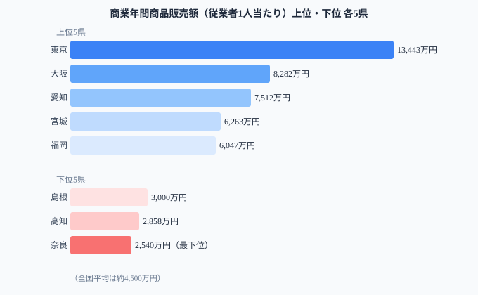
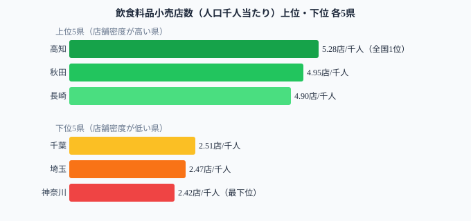
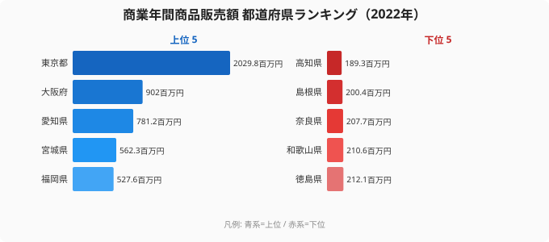

「商業が盛んな県＝便利な県」ではない。従業者1人当たりの商業販売額（商業効率）が高いのは東京・大阪・名古屋──いずれも卸売業が集積する都市圏だ。しかし、日々の暮らしに直結する飲食料品小売店の密度は、商業効率が最下位に近い高知が最も高く、商業効率1位の東京は下位に位置する。「稼ぐ力」と「生活インフラとしての商業」は、互いに逆方向に動いている。

## 従業者1人当たり販売額ランキング──東京13,443万円の実態

総務省「社会生活統計指標」のデータをもとに、**商業年間商品販売額**を「従業者1人当たり」で比較する。

<data-source url="https://www.e-stat.go.jp/dbview?sid=0000010203" label="e-Stat 社会・人口統計体系"></data-source>

**従業者1人当たりの商業販売額が最も高いのは[東京都](/areas/13000)**（13,443万円）。2位の大阪府（8,282万円）を大きく引き離し、全国平均の約3倍にあたる。3位は愛知県（7,512万円）で、上位3都府県はいずれも**卸売業の一大拠点**だ。

4位以下には宮城県（6,263万円）、福岡県（6,047万円）、広島県（5,566万円）と**各地方のブロック中枢都市**が続く。卸売の支店・営業所が集まる県は、従業者1人当たりの販売額が押し上げられる。

一方、**最も低いのは[奈良県](/areas/29000)**（2,540万円）。1位の東京都と47位の奈良県では約5.3倍の差がある。

> [!NOTE]
> この指標には卸売業と小売業の合計値が含まれる。卸売業は1件あたりの取引金額が大きいため、卸売業の集積度が高い都市ほど数値が高くなる傾向がある。

<source-link href="/ranking/annual-sales-amount-per-employee">商業年間商品販売額（従業者1人当たり）ランキング</source-link>

<ad-slot></ad-slot>

## なぜ奈良県が最下位なのか──ベッドタウム構造が生む消費の漏れ

奈良県が最下位となる要因は、隣接する大阪府への**消費の流出**（ベッドタウン構造）が大きく影響している。

奈良県の昼夜間人口比率は全国最低水準で、大阪・京都に通勤する居住者が多い。大型商業施設もターミナル駅周辺（大阪・難波・梅田等）に集積するため、買い物の多くが県外で行われる。商業販売額は「そこで買い物された金額」であり、居住人口の多さがそのまま販売額に反映されるわけではない。

> [!TIP]
> 商業販売額の低い県でも、住民の購買力が低いわけではない。奈良県の1世帯当たり年間消費支出は全国中位にある。「買い物する場所が別の県にある」という流通の偏りが数値を下げている。

<source-link href="/ranking/annual-sales-amount-per-establishment">商業年間商品販売額（事業所当たり）ランキング</source-link>

## 飲食料品小売店の密度──高知5.28店、神奈川2.42店の逆転

商業効率（販売額ランキング）とは正反対の分布を示すのが、飲食料品小売店の密度だ。

<data-source url="https://www.e-stat.go.jp/dbview?sid=0000010208" label="e-Stat 社会・人口統計体系"></data-source>

**最も密度が高いのは[高知県](/areas/39000)**（5.28店/千人）。秋田県（4.95店）、長崎県（4.90店）と続き、上位10県はすべて東北・四国・九州・沖縄の県だ。

逆に**最も低いのは神奈川県**（2.42店/千人）。埼玉県（2.47店）、千葉県（2.51店）と首都圏のベッドタウンが下位に並ぶ。高知県と神奈川県では約2.2倍の差がある。

> [!NOTE]
> 大型スーパーやショッピングモールが多い都市部では、1店舗あたりの商圏人口が大きいため千人当たりの店舗数は少なくなる。地方は個人商店や小規模スーパーが生活インフラとして点在しているため、密度が高くなる。

<source-link href="/ranking/food-retail-store-count-per-1000">飲食料品小売店数ランキング</source-link>

<ad-slot></ad-slot>

## 事業所当たり販売額──東京1事業所が地方の10倍を稼ぐ構造

事業所当たりで見ると、東京都の突出がさらに際立つ。**東京都は1事業所あたり20.3億円（2,029.8百万円）**で、2位の大阪府（9億円・902百万円）の2.3倍、全国平均の約5倍にもなる。

下位3県は高知県（189.3百万円）・島根県（200.4百万円）・奈良県（207.7百万円）。高知県の189百万円は東京都の約10分の1だ。

2指標（従業者1人当たり販売額と事業所当たり販売額）は**強い正の相関**を示しており、「従業者が稼ぐ県は事業所も大きい」という構造がある。東京都だけが他県から大きく離れた位置にあり、**商業機能の一極集中**を示している。

> [!WARNING]
> 事業所当たり販売額には東京都本社機能の取引が含まれるため、実態の商業活動よりも大きく見える場合がある。卸売業の「本社計上」ルールにより、物理的な商業活動が少なくても数値が高くなる可能性に注意。

<source-link href="/ranking/annual-sales-amount-per-establishment">事業所当たり販売額の47都道府県ランキングをもっと見る</source-link>

## 商業の「稼ぐ力」と「生活インフラ」の逆転まとめ

従業者1人当たり販売額・事業所当たり販売額・飲食料品小売店密度の3つの視点から、商業の地域差を分析した。

商業の「稼ぐ力」を決めるのは**卸売業の集積度**だ。東京・大阪・名古屋の三大都市圏に卸売機能が集約されている日本の流通構造が、都道府県間の生産性格差を生んでいる。

一方で、飲食料品小売店の密度は地方ほど高く、**効率は低くても地域の暮らしを支える小規模店舗**が日本の商業の一面を担っている。「稼ぐ力」と「生活インフラとしての商業」は、別の視点で評価する必要がある。

## データ出典

- 総務省「社会生活統計指標」（e-Stat 統計表 ID: 0000010203、0000010208）
- 商業年間商品販売額：経済産業省「商業統計調査」を統合した指標
