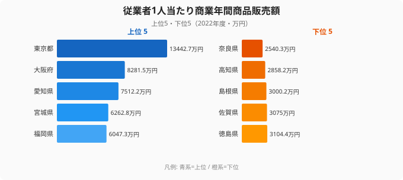
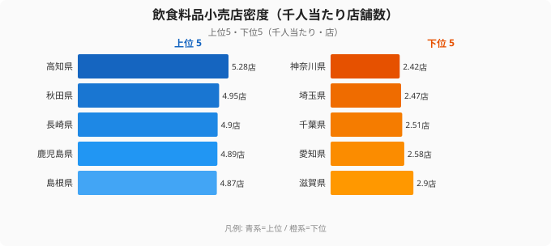
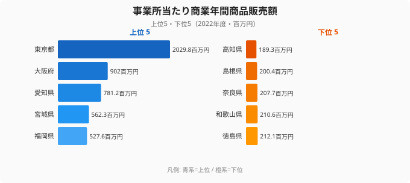

「商業が盛んな県＝便利な県」とは限りません。従業者1人当たりの商業販売額（商業効率）が高いのは東京・大阪・名古屋で、いずれも卸売業が集積する都市圏です。しかし、日々の暮らしに直結する飲食料品小売店の密度は、商業効率が下位に沈む高知が最も高く、商業効率トップの東京はむしろ下位に位置します。つまり「稼ぐ力」と「生活インフラとしての商業」は、互いに逆方向へ動いているのです。

この記事では、従業者1人当たり販売額・事業所当たり販売額・飲食料品小売店密度という3つの指標を並べ、「商業が強い県」と「店が身近な県」がなぜ一致しないのかを読み解きます。先に結論を言えば、両者を分けているのは卸売業の集積度です。卸売の取引が大都市に集中する日本の流通構造が、生産性のランキングと暮らしのランキングを正反対にしています。

## 従業者1人当たり販売額――東京13,443万円が示す商業効率の地図

総務省「社会生活統計指標」のデータをもとに、**商業年間商品販売額**を「従業者1人当たり」で比較します。働き手1人がどれだけの商品を動かしているか、いわば商業の生産性を表す指標です。

<data-source url="https://www.e-stat.go.jp/dbview?sid=0000010203" label="e-Stat 社会・人口統計体系"></data-source>

従業者1人当たりの商業販売額が最も高いのは[東京都](/areas/13000)で13,443万円です。2位の大阪府（8,282万円）を大きく引き離し、全国平均のおよそ3倍にあたります。3位は愛知県（7,512万円）で、上位3都府県はいずれも**卸売業の一大拠点**です。続く4位以下には宮城県（6,263万円）、福岡県（6,047万円）、広島県（5,566万円）と、**各地方ブロックの中枢都市**が並びます。卸売の支店・営業所が集まる県ほど、1人当たりの販売額が押し上げられているのです。

一方、最も低いのは[奈良県](/areas/29000)で2,540万円でした。トップの東京都と最下位の奈良県では約5.3倍の差があります。注目すべきは、この上位と下位の顔ぶれが「人口の多さ」や「県の豊かさ」とは必ずしも一致しない点です。商業効率を決めているのは在住人口ではなく、その県にどれだけ卸売機能が集まっているかなのです。だからこそ、ベッドタウンを多く抱える県や、卸売拠点を持たない県が下位に沈みます。

> [!NOTE]
> この指標は卸売業と小売業の合計値です。卸売業は1件あたりの取引金額が小売業よりはるかに大きいため、卸売の支店・営業所が集まる都市ほど数値が高く出ます。「店が多い・買い物が便利」という意味の指標ではない点に注意してください。

<source-link href="/ranking/annual-sales-amount-per-employee">商業年間商品販売額（従業者1人当たり）ランキングをもっと見る</source-link>

<ad-slot></ad-slot>

## なぜ奈良県が最下位なのか――ベッドタウン構造が生む消費の漏れ

奈良県が最下位となる背景には、隣接する大阪府への**消費の流出**（ベッドタウン構造）が大きく影響しています。

奈良県の昼夜間人口比率は全国でも最低水準で、大阪・京都へ通勤する居住者が多くを占めます。大型商業施設も大阪・難波・梅田といったターミナル駅周辺に集積するため、買い物の多くが県外で行われます。商業販売額はあくまで「その県で買い物された金額」であり、居住人口の多さがそのまま販売額に反映されるわけではありません。在住者が稼いだお金が県外の店で落とされれば、その分は奈良県の商業販売額には計上されないのです。

同じ構図は、首都圏のベッドタウンにも当てはまります。住む人は多くても、買い物や通勤先が都心に向かう県では、商業の「稼ぎ」が外へ漏れていきます。逆に言えば、東京や大阪のように周辺県の消費まで吸い寄せる都市ほど、商業効率の数値は高くなります。ランキングの上下は、その県の購買力ではなく、消費が「どこで落ちるか」という流通の地理を映しているのです。

> [!TIP]
> 商業販売額が低い県でも、住民の購買力が低いとは限りません。奈良県の1世帯当たり年間消費支出は全国の中位にあります。「買い物する場所が別の県にある」という流通の偏りが数値を押し下げているだけなので、生活水準の指標と取り違えないように読むのがコツです。

<source-link href="/ranking/annual-sales-amount-per-establishment">商業年間商品販売額（事業所当たり）ランキングをもっと見る</source-link>

## 飲食料品小売店の密度――高知5.28店、神奈川2.42店という逆転

商業効率の販売額ランキングとは正反対の分布を示すのが、飲食料品小売店の密度（千人当たりの店舗数）です。暮らしの近くにどれだけ食料品店があるかを表す、生活インフラの指標です。

<data-source url="https://www.e-stat.go.jp/dbview?sid=0000010208" label="e-Stat 社会・人口統計体系"></data-source>

最も密度が高いのは[高知県](/areas/39000)で千人当たり5.28店です。秋田県（4.95店）、長崎県（4.90店）と続きます。上位10県はすべて大都市圏を外れた地方の県で、東北・四国・中国・九州・沖縄、そして近畿の和歌山まで幅広く分布しています。逆に最も低いのは神奈川県（2.42店）で、埼玉県（2.47店）、千葉県（2.51店）と首都圏のベッドタウンが下位に並びます。高知県と神奈川県では約2.2倍の差があります。

ここで効いているのが、都市と地方の店舗のかたちの違いです。都市部では大型スーパーやショッピングモールに購買が集中するため、1店舗あたりの商圏人口が大きくなり、千人当たりの店舗数は少なくなります。一方、地方は人口が分散して暮らしているため、大型店だけでは生活圏をカバーできません。個人商店や小規模スーパーが点在し、それぞれが生活インフラとして機能します。前の章で見た「稼ぐ力」が下位だった高知が、この密度では1位に立つ――商業効率と店舗密度が逆転する核心がここにあります。効率の高い大型店に集約した県ほど店の数は減り、効率は低くても小さな店が散らばる県ほど店は身近になるのです。

> [!WARNING]
> 販売額のランキングと店舗密度のランキングは、順位がほぼ逆になります。効率が高い＝便利、と短絡しないでください。高い販売額は卸売の集積や大型店への集約を意味し、買い物のしやすさ（店の近さ）とは別の軸です。2つの指標は同じ「商業」でも測っているものが異なります。

<source-link href="/ranking/food-retail-store-count-per-1000">飲食料品小売店数ランキングをもっと見る</source-link>

<ad-slot></ad-slot>

## 事業所当たり販売額――東京の1事業所が地方の10倍を動かす

販売額を「事業所当たり」で見ると、東京都の突出はさらに際立ちます。

<data-source url="https://www.e-stat.go.jp/dbview?sid=0000010203" label="e-Stat 社会・人口統計体系"></data-source>

東京都は1事業所あたり2,029.8百万円（約20億円）で、2位の大阪府（902百万円）の2.3倍、全国平均のおよそ5倍にあたります。下位3県は高知県（189.3百万円）、島根県（200.4百万円）、奈良県（207.7百万円）です。高知県の189.3百万円は東京都の約10分の1にすぎず、1つの事業所が動かす金額に10倍もの開きがあることになります。

注目したいのは、従業者1人当たり販売額と事業所当たり販売額が**強い正の相関**を示している点です。「従業者が多くを稼ぐ県は、事業所1つあたりの規模も大きい」という関係が成り立ちます。両方のランキングで東京都が他県から大きく離れた位置にあり、これは**商業機能の一極集中**を物語っています。ただし、この高さをそのまま「東京の商業活動が地方の10倍活発」と読むのは早計です。卸売業は本社で取引を一括計上する慣行があり、全国を相手にした取引が東京の事業所の数値に集まりやすいからです。販売額の地図は、物理的な店舗の活気というより、商流がどこを通っているかの地図に近いと言えます。

> [!NOTE]
> 事業所当たり販売額には東京都の本社機能による取引が多く含まれます。卸売業の「本社一括計上」の慣行により、物理的な商業活動が現地で小さくても、本社のある東京の数値が大きく膨らむ場合があります。一極集中の度合いは、実態よりやや誇張されて見えることを念頭に置いてください。

<source-link href="/ranking/annual-sales-amount-per-establishment">事業所当たり販売額の47都道府県ランキングをもっと見る</source-link>

## 「稼ぐ商業」と「暮らしの商業」を分けて見る

従業者1人当たり販売額・事業所当たり販売額・飲食料品小売店密度という3つの視点から、商業の地域差を見てきました。

商業の「稼ぐ力」を決めているのは、卸売業の集積度です。東京・大阪・名古屋の三大都市圏に卸売機能が集約された日本の流通構造が、都道府県間の生産性格差を生んでいます。一方で、飲食料品小売店の密度は地方ほど高く、効率は低くても地域の暮らしを支える小規模店舗が、商業のもう一つの顔を担っています。

「商業が盛んな県」と「店が身近な県」がずれるのは、データの誤りでも例外でもなく、卸売と小売という商業の二面性が素直に表れた結果です。販売額ランキングだけを見て「便利さ」を判断したり、店舗密度だけを見て「経済の弱さ」と結論づけたりすると、地域の姿を読み違えます。稼ぐ商業と暮らしの商業は、別々のものさしで評価する必要があるのです。

## データ出典

- 総務省「社会生活統計指標」（e-Stat 統計表 ID: 0000010203、0000010208）
- 商業年間商品販売額：経済産業省「商業統計調査」を統合した指標
