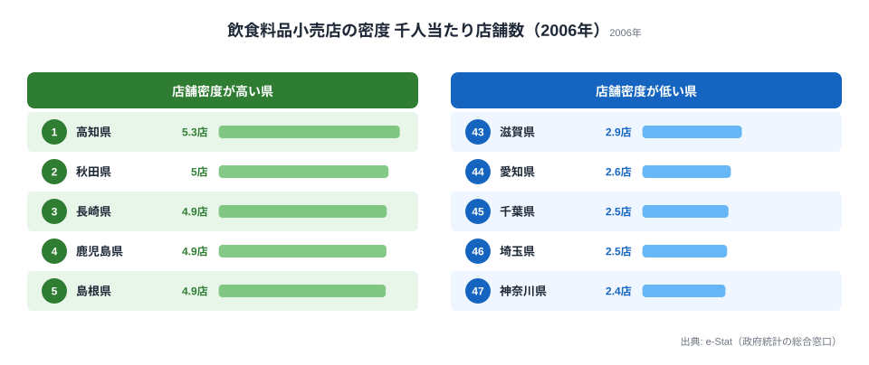
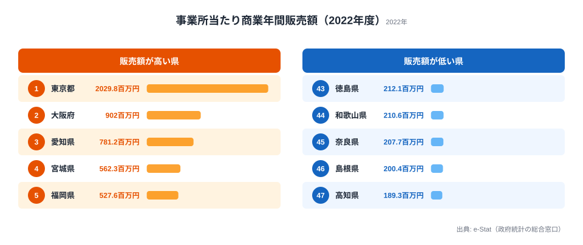

「商業が盛んな県＝便利な県」とは限りません。従業者1人当たりの商業販売額（商業効率）が高いのは東京・大阪・名古屋──いずれも卸売業が集積する都市圏です。しかし、日々の暮らしに直結する飲食料品小売店の密度は、商業効率が最下位に近い高知が最も高く、商業効率1位の東京は下位に位置します。「稼ぐ力」と「生活インフラとしての商業」は、互いに逆方向に動いているのです。この記事では、従業者1人当たり・事業所当たりの販売額と、飲食料品小売店の密度という3つの視点から、その逆転構造を可視化します。

## 従業者1人当たり販売額ランキング──東京13,443万円の実態

総務省「社会生活統計指標」のデータをもとに、**商業年間商品販売額**を「従業者1人当たり」で比較します。

<data-source url="https://www.e-stat.go.jp/dbview?sid=0000010203" label="e-Stat 社会・人口統計体系"></data-source>

**従業者1人当たりの商業販売額が最も高いのは[東京都](/areas/13000)**（13,443万円）です。2位の大阪府（8,282万円）を大きく引き離し、全国平均の約3倍にあたります。3位は愛知県（7,512万円）で、上位3都府県はいずれも**卸売業の一大拠点**となっています。

4位以下には宮城県（6,263万円）、福岡県（6,047万円）、広島県（5,566万円）と**各地方のブロック中枢都市**が続きます。卸売の支店・営業所が集まる県は、従業者1人当たりの販売額が押し上げられます。商社や問屋を経由して大量の商品が動く卸売業は、1人の従業者が扱う取引金額が小売業に比べて桁違いに大きく、その集積度がこの指標をほぼ決めていると言えます。

一方、**最も低いのは[奈良県](/areas/29000)**（2,540万円）で、46位は高知県（2,858万円）、45位は島根県（3,000万円）と続きます。1位の東京都と47位の奈良県では約5.3倍の差があります。卸売業の拠点を持たない県ほど、従業者1人当たりの販売額は低くとどまる傾向がはっきりと表れています。

> [!NOTE]
> この指標には卸売業と小売業の合計値が含まれる。卸売業は1件あたりの取引金額が大きいため、卸売業の集積度が高い都市ほど数値が高くなる傾向がある。

<source-link href="/ranking/annual-sales-amount-per-employee">商業年間商品販売額（従業者1人当たり）ランキング</source-link>

<ad-slot></ad-slot>

## なぜ奈良県が最下位なのか──ベッドタウム構造が生む消費の漏れ

奈良県が最下位となる要因は、隣接する大阪府への**消費の流出**（ベッドタウン構造）が大きく影響しています。

奈良県の昼夜間人口比率は全国最低水準で、大阪・京都に通勤する居住者が多くなっています。大型商業施設もターミナル駅周辺（大阪・難波・梅田等）に集積するため、買い物の多くが県外で行われます。商業販売額は「そこで買い物された金額」であり、居住人口の多さがそのまま販売額に反映されるわけではありません。同じ近畿圏でも、卸売の拠点を抱える大阪と、消費を大阪に依存する奈良とでは、商業販売額の意味がまったく異なるのです。

> [!TIP]
> 商業販売額の低い県でも、住民の購買力が低いわけではない。奈良県の1世帯当たり年間消費支出は全国中位にある。「買い物する場所が別の県にある」という流通の偏りが数値を下げている。

<source-link href="/ranking/annual-sales-amount-per-establishment">商業年間商品販売額（事業所当たり）ランキング</source-link>

## 飲食料品小売店の密度──高知5.28店、神奈川2.42店の逆転

商業効率（販売額ランキング）とは正反対の分布を示すのが、飲食料品小売店の密度です。

<data-source url="https://www.e-stat.go.jp/dbview?sid=0000010208" label="e-Stat 社会・人口統計体系"></data-source>

**最も密度が高いのは[高知県](/areas/39000)**（5.28店/千人）です。秋田県（4.95店）、長崎県（4.90店）と続き、上位は東北・四国・九州の地方県が占めています。

逆に**最も低いのは神奈川県**（2.42店/千人）です。埼玉県（2.47店）、千葉県（2.51店）と首都圏のベッドタウンが下位に並びます。高知県と神奈川県では約2.2倍の差があります。販売額では大都市が圧倒していたのに、こと「店舗の数」になると地方が逆転する──ここに商業の二面性が現れています。

> [!NOTE]
> 大型スーパーやショッピングモールが多い都市部では、1店舗あたりの商圏人口が大きいため千人当たりの店舗数は少なくなります。地方は個人商店や小規模スーパーが生活インフラとして点在しているため、密度が高くなります。

> [!WARNING]
> 飲食料品小売店の密度は2006年時点のデータです。前章・次章の販売額（2022年度）とは調査年が異なるため、3指標を同一年として比較しないでください。店舗密度はその後の人口減少・大型店出店でさらに変動している可能性があります。

<source-link href="/ranking/food-retail-store-count-per-1000">飲食料品小売店数ランキング</source-link>

<ad-slot></ad-slot>

## 事業所当たり販売額──東京1事業所が地方の10倍を稼ぐ構造

事業所当たりで見ると、東京都の突出がさらに際立ちます。**東京都は1事業所あたり20.3億円（2,029.8百万円）**で、2位の大阪府（9億円・902百万円）の2.3倍、全国平均の約5倍にもなります。

下位3県は高知県（189.3百万円）・島根県（200.4百万円）・奈良県（207.7百万円）です。高知県の189百万円は東京都の約11分の1にとどまります（1位と47位の差は約10.7倍）。

2指標（従業者1人当たり販売額と事業所当たり販売額）は**強い正の相関**を示しており、「従業者が稼ぐ県は事業所も大きい」という構造があります。東京都だけが他県から大きく離れた位置にあり、**商業機能の一極集中**を示しています。とりわけ事業所当たりの指標は、巨大な卸売事業所が1件あるだけで県の平均を大きく引き上げるため、東京の突出は卸売の本社・基幹拠点が集まっていることの裏返しと読めます。

> [!WARNING]
> 事業所当たり販売額には東京都本社機能の取引が含まれるため、実態の商業活動よりも大きく見える場合がある。卸売業の「本社計上」ルールにより、物理的な商業活動が少なくても数値が高くなる可能性に注意。

<source-link href="/ranking/annual-sales-amount-per-establishment">事業所当たり販売額の47都道府県ランキングをもっと見る</source-link>

## 商業の「稼ぐ力」と「生活インフラ」の逆転まとめ

従業者1人当たり販売額・事業所当たり販売額・飲食料品小売店密度の3つの視点から、商業の地域差を分析しました。要点は次の5つです。

- 従業者1人当たり販売額の1位は東京都13,443万円、最下位は奈良県2,540万円で、その差は約5.3倍
- 事業所当たり販売額でも東京都が20.3億円で突出し、最下位の高知県189百万円とは約10.7倍の差
- 飲食料品小売店の密度（2006年）は高知県5.28店/千人が1位、神奈川県2.42店/千人が最下位で約2.2倍差
- 「稼ぐ力」を決めるのは卸売業の集積度で、上位は東京・大阪・名古屋と各地方の中枢都市に集中
- 「店舗の密度」は地方ほど高く、商業効率と生活インフラとしての密度は逆方向に動く

商業の「稼ぐ力」を決めるのは**卸売業の集積度**です。東京・大阪・名古屋の三大都市圏に卸売機能が集約されている日本の流通構造が、都道府県間の生産性格差を生んでいます。

一方で、飲食料品小売店の密度は地方ほど高く、**効率は低くても地域の暮らしを支える小規模店舗**が日本の商業の一面を担っています。「稼ぐ力」と「生活インフラとしての商業」は、別の視点で評価する必要があります。

## データ出典

- 総務省「社会生活統計指標」（e-Stat 統計表 ID: 0000010203、0000010208）
- 商業年間商品販売額：経済産業省「商業統計調査」を統合した指標
