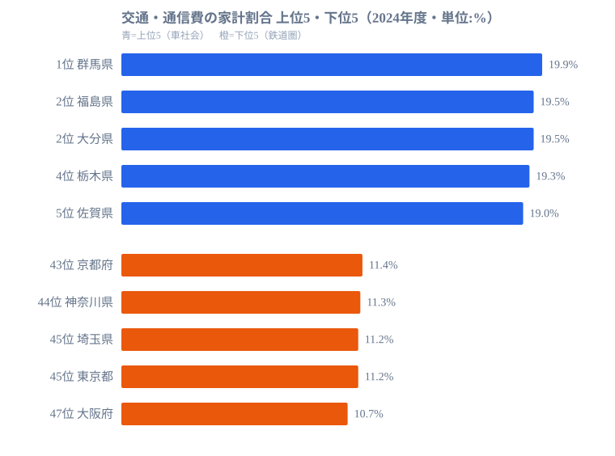

「格安SIMに乗り換えれば通信費が安くなる」──都市生活者にはその通りですが、地方では家計の交通・通信費の大半を占めるのは通信費ではありません。自動車の購入費・維持費・ガソリン代です。

消費支出に占める交通・通信費の割合は、[群馬県](/areas/10000)の19.9%（全国で最も高い水準）と[大阪府](/areas/27000)の10.7%（最も低い水準）で約1.9倍の差があります。そして「携帯電話契約数が多い都市部ほど、交通・通信費割合がむしろ低い」という逆説的な構造がデータから浮かびます。この記事では、地域差の真因がスマホ料金ではなく移動手段の構造にあることを読み解きます。

> [!NOTE]
> 「交通・通信費」は家計調査の費目で、自動車購入費・維持費・ガソリン代・公共交通機関運賃・携帯電話料金・インターネット接続料・郵便料金などを含む広い区分。「通信費」だけを取り出した指標ではない点に注意。本記事の割合は二人以上世帯の消費支出に対する比率（2024年度）。

## 上位は車社会の北関東・九州、下位は大都市圏

最も割合が高い群馬県（19.9%）を筆頭に、福島県（19.5%）、大分県（19.5%）、栃木県（19.3%）、佐賀県（19.0%）と、公共交通機関が限られ**車が生活必需品**の県が上位に並びます。北関東・東北・九州に固まっている点が特徴です。

一方、割合が最も低いのは大阪府（10.7%）で、[東京都](/areas/13000)（11.2%）、埼玉県（11.2%）、神奈川県（11.3%）、京都府（11.4%）と大都市圏が下位を占めます。鉄道・バスなど公共交通が整備された地域では、自動車を持たない、あるいは持っても利用頻度が低いため、自動車関連費用を抑えられます。その結果、交通・通信費全体の割合が低くなります。

なぜこれほど上位と下位が地理で割れるのでしょうか。鍵は「移動に車が要るかどうか」です。群馬のように鉄道網が限られる県では、通勤・買い物・通院のいずれにも自家用車が欠かせません。車は購入時にまとまった出費があり、その後も車検・自動車税・保険・ガソリン代が毎月かかり続けます。家計に占める固定費として積み上がるため、消費支出に対する比率が押し上げられます。逆に大阪・東京のように鉄道で生活が完結する地域では、この固定費がそもそも発生しないか、定期券などの相対的に小さな支出に置き換わります。同じ「移動」でも、車社会と鉄道社会では家計へのインパクトが構造的に異なるのです。

この差は食費（地域差で約1.1〜1.2倍）や住居費（約1.5倍）と比べても大きく、交通・通信費は**最も地域差が大きい家計費目の一つ**といえます。家計の固定費を考えるうえで、住む地域の交通環境が無視できない変数になっていることがわかります。

<source-link href="/ranking/transport-communication-expenditure-ratio-multi-person-households">47都道府県の交通・通信費割合ランキングをもっと見る</source-link>

## 携帯電話契約数との逆相関──真因はスマホではない

もし交通・通信費割合の高さが「通信費」によるものなら、スマホ契約が多い地域ほど割合が高くなるはずです。ところが実際のデータはその逆を示します。携帯電話契約数が多い都市部ほど、交通・通信費割合は**むしろ低い**のです。群馬・福島のような上位県は通信契約が突出して多いわけではなく、東京・大阪のような契約数の多い都市部が下位に並びます。

この逆相関は、交通・通信費の主因が「通信費」ではなく**「交通費（特に自動車関連）」**であることを示しています。地方で割合が高い原因はスマホ料金の高さではなく、車の購入費・維持費・ガソリン代が消費支出に占める比率の大きさにあります。通信費はむしろ全国でならされつつあり、地域差を生む主役にはなっていません。携帯電話契約数の地域分布を見ると、この構造はさらにはっきりします。

> [!WARNING]
> 「交通・通信費が高い＝通信費が高い」と読み違えないこと。この費目は自動車関連費が大半を占めるため、順位の高低はスマホ料金ではなく車依存度をほぼ反映しています。割合が低い大都市圏も、通信費を切り詰めているのではなく、自動車費がそもそも小さいだけです。

<source-link href="/ranking/mobile-phone-contract-count-per-1000">47都道府県の携帯電話契約数ランキングをもっと見る</source-link>

## 全国平均は20年以上ほぼ横ばい──「相殺の構造」

地域差は大きい一方で、全国平均は2000年代以降、長期にわたって**13〜15%の狭い範囲**で推移しています。スマートフォンの普及で通信費は確実に増えているのに、合計の割合が大きく動かないのはなぜでしょうか。

背景には「相殺の構造」があります。スマホ普及で通信費が増える一方、同時期に軽自動車・ハイブリッド車の普及でガソリン代が下がり、新車購入サイクルの長期化で自動車関連費用が抑えられてきました。交通費の減少と通信費の増加が打ち消し合い、合計としてはほぼ横ばいに見えるのです。つまり「横ばい」は安定ではなく、内訳が入れ替わりながら釣り合っている状態だと読むべきです。2020年前後にやや低下した局面は、外出自粛で移動が減った影響が大きく、その後は回復しています。

> [!TIP]
> 家計の交通・通信費を節約するポイントは地域で正反対になります。**都市部**では格安SIMへの乗り換えやサブスク見直しが効きます。**地方**では車の維持費やガソリン代の削減（カーシェア・EV活用・複数台を1台に集約）が本質的な対策です。「全国共通の節約術」は存在しないと考えるのが安全です。

## 移動手段の構造が家計を決める

群馬と大阪の差は、突き詰めれば「車社会と鉄道社会」の差です。群馬では日常の移動に車が必要なため、車の購入・維持・燃料費が家計に重くのしかかります。大阪では電車・バスで移動できるため、自動車関連費用を削れます。同じ日本でも、住む地域の交通インフラが家計の固定費構造を大きく左右していることが、このデータからはっきり読み取れます。

ここで注意したいのは、地方で割合が高いことが単なる「節約の問題」ではない点です。公共交通が整備されていない地域では、車を持たないと就業・医療・買い物のすべてに支障が出ます。その「インフラ依存コスト」が家計の最大費目として積み上がっているのです。カーシェアリングやMaaS（モビリティ・アズ・ア・サービス）の地方展開が進めば、この割合を構造的に下げられる可能性があります。一方で、5G通信や光ファイバーの整備がいくら進んでも、主因が自動車関連である限り、通信インフラの改善だけでは家計負担は下がりません。「地方の通信費問題」と語られるとき、本当に効くのは通信インフラより移動コストへの対策だ、というのがこのデータの示唆です。

家計を見直すうえでも、政策を考えるうえでも、出発点は「自分の地域は車社会か鉄道社会か」を見極めることにあります。費目名にある「通信」に引きずられず、移動の構造に目を向けることが、的を射た対策への近道です。

## データ出典

- [e-Stat 家計調査（2024年度）](https://www.e-stat.go.jp/dbview?sid=0000010212) ── 交通・通信費割合、携帯電話契約数
