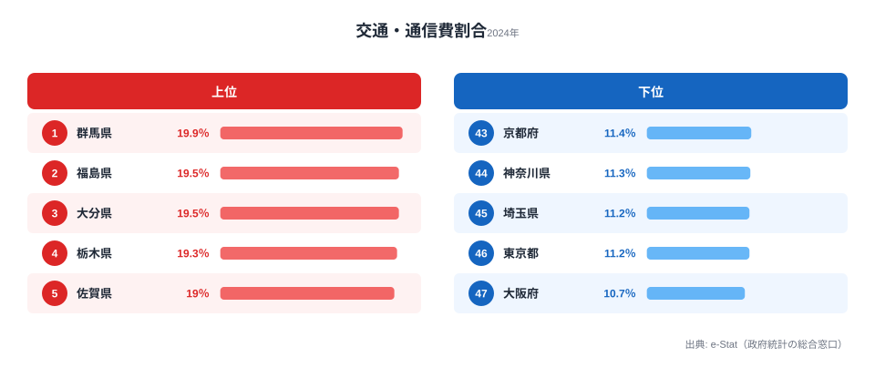
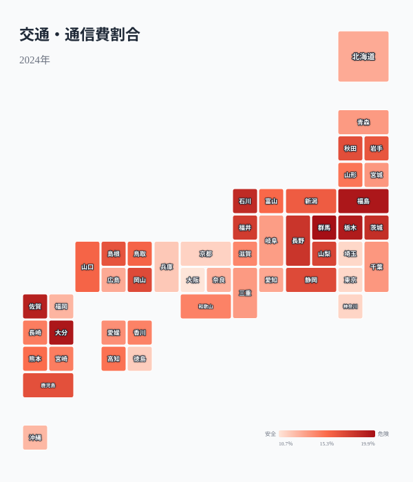
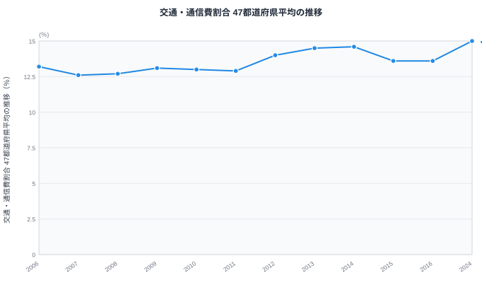
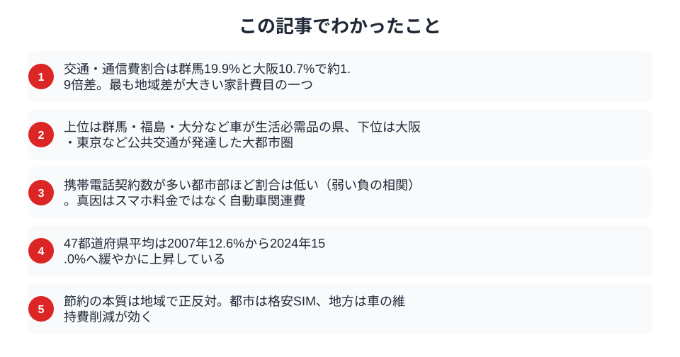

「格安SIMに乗り換えれば通信費が安くなる」──都市生活者にはその通りだが、地方では家計の交通・通信費の大半を占めるのは通信費ではない。自動車の購入費・維持費・ガソリン代だ。

消費支出に占める交通・通信費の割合は、[群馬県](/areas/10000)の19.9%（全国1位）と[大阪府](/areas/27000)の10.7%（最下位）で約1.9倍の差がある。そして「携帯電話契約数が多い都市部ほど、交通・通信費割合が低い」という逆説的な構造がデータから浮かぶ。地域差の真因を解析する。

> [!NOTE]
> 「交通・通信費」は家計調査の費目で、自動車購入費・維持費・ガソリン代・公共交通機関運賃・携帯電話料金・インターネット接続料・郵便料金などを含む広い区分だ。「通信費」だけを取り出した指標ではない点に注意。

## 全国ランキング──上位は車社会の北関東・九州

1位の群馬県（19.9%）を筆頭に、福島県（19.5%）、大分県（19.5%）、栃木県（19.3%）、佐賀県（19.0%）と、公共交通機関が限られ**車が生活必需品**の県が上位に並ぶ。

下位は大阪府（10.7%）、[東京都](/areas/13000)（11.2%）、埼玉県（11.2%）、神奈川県（11.3%）と大都市圏が占める。鉄道・バスなど公共交通が整備された地域では、自動車関連費用を抑えられるため、交通・通信費全体の割合が低くなる。

この差は食費（約1.1〜1.2倍）や住居費（約1.5倍）と比較しても大きく、交通・通信費は**最も地域差が大きい家計費目の一つ**だ。

<source-link href="/ranking/transport-communication-expenditure-ratio-multi-person-households">47都道府県の交通・通信費割合ランキングをもっと見る</source-link>

## 地域分布マップ──車依存度が色に出る

マップを見ると、三大都市圏（東京・大阪・名古屋）が薄い色、北関東・東北・九州が濃い色というパターンが鮮明だ。この分布は「自動車保有率」のマップとほぼ一致する。

中部地方の愛知県は車保有率が高いにもかかわらず比較的低い割合に収まっている点が特徴的だ。所得水準が高いため、交通費の絶対額は大きくても消費支出全体に占める割合は相対的に低くなるためだ。

<ad-slot></ad-slot>

## 携帯電話契約数との逆相関──真因はスマホではない

散布図からは、交通・通信費割合と携帯電話契約数に**負の相関**が読み取れる。携帯電話契約数が多い都市部ほど、交通・通信費割合はむしろ低いのだ。

この逆説的な結果は、交通・通信費の主因が「通信費」ではなく**「交通費（特に自動車関連）」**であることを示す。地方で交通・通信費割合が高い原因はスマホ料金の高さではなく、車の購入費・維持費・ガソリン代が消費支出に占める比率の大きさだ。

> [!TIP]
> 家計の交通・通信費を節約するポイントは地域で根本的に異なる。**都市部**では格安SIMへの乗り換えやサブスク見直しが効果的。**地方**では車の維持費やガソリン代の削減（カーシェア・EV活用・複数台を1台に集約）が本質的な対策になる。「全国共通の節約術」は存在しない。

<source-link href="/ranking/mobile-phone-contract-count-per-1000">47都道府県の携帯電話契約数ランキングをもっと見る</source-link>

## 時系列トレンド──20年間ほぼ横ばいの全国平均

全国平均は2000年の13.1%から2024年の14.1%まで、20年以上にわたって**13〜15%の狭い範囲**で推移している。

この安定の背景には「相殺の構造」がある。スマートフォンの普及で通信費は確実に増加しているが、同時期に軽自動車・ハイブリッド車の普及でガソリン代が減少し、新車購入サイクルの長期化で自動車関連費用が抑制されている。交通費の減少と通信費の増加が相殺され、合計としてはほぼ横ばいとなっている。

2020年にやや低下しているのはコロナ禍による外出自粛の影響で、2022年以降は回復している。

> [!WARNING]
> 2024年以降はEV普及・自動車税制改正・通信費の格安化などが重なり、この「相殺の構造」が変わる可能性がある。特に地方では、EV普及で燃料コストが下がれば交通・通信費割合が縮小する可能性がある。

<ad-slot></ad-slot>

## まとめ──移動手段の構造が家計を決める

交通・通信費割合ランキングから見えてきた構造を整理する。

群馬と大阪の差は「車社会と鉄道社会」の差だ。群馬では日常の移動に車が必要なため、車の購入・維持・燃料費が家計に重くのしかかる。大阪では電車・バスで移動できるため、自動車関連費用を削れる。交通・通信費の地域差を理解することは、家計の最適化だけでなく、地方の生活コスト問題を政策的に議論する際にも重要な視点だ。

## 政策的含意──モビリティの格差は生活コストの格差

地方で交通・通信費割合が高いことは、単なる「節約の問題」ではなく構造的な生活コスト格差を意味する。公共交通が整備されていない地域では、車を持たないと就業・医療・買い物のすべてに支障をきたす。その「インフラ依存コスト」が家計の最大費目として積み上がっている。

カーシェアリングやMaaS（モビリティ・アズ・ア・サービス）の地方展開が進めば、地方の交通・通信費割合を構造的に下げる可能性がある。一方で、5G通信や光ファイバーの整備が進んでも、地方の交通・通信費の主因が自動車関連である限り、通信インフラ改善だけでは家計負担は下がらない。

政策立案者が「地方の通信費問題」を語るとき、本当に問題なのは「通信費」ではなく「移動コスト」だというデータの示唆は重要だ。

## データ出典

- [e-Stat 家計調査（2024年度）](https://www.e-stat.go.jp/dbview?sid=0000010212) ── 交通・通信費割合、携帯電話契約数
