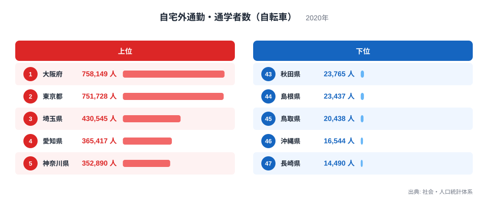
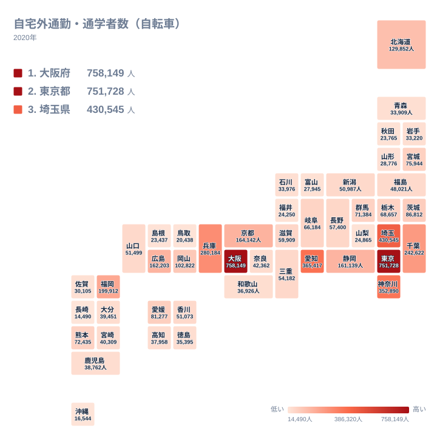

自宅外通勤・通学者数（自転車）は、自宅以外の勤務先や学校に通う際に、自転車を主な交通手段として利用している人の実数を示す指標です。社会・人口統計体系がまとめた2020年の数値をもとに、47都道府県それぞれの人数が公表されています。

全国で最も数値が大きいのは大阪府で、758,149人にのぼります。反対に最も小さいのは長崎県で、14,490人にとどまります。両者を比べると約52倍の開きがあり、同じ国内でありながら自転車通勤・通学の実数にこれほどの差が生まれていることが分かります。

この記事では、上位と下位の顔ぶれを具体的に見ながら、どのような条件が自転車での通勤・通学を増やし、あるいは減らしているのかを読み解いていきます。人口の大きさだけでは説明できない地域の特徴にも注目します。

## 自転車通勤・通学者数の上位はどこか

<source-link href="/ranking/commute-by-bicycle">自宅外通勤・通学者数（自転車）ランキングをもっと見る</source-link>

上位5都府県は、大阪府758,149人、東京都751,728人、埼玉県430,545人、愛知県365,417人、神奈川県352,890人の順に並んでいます。大阪府と東京都はどちらも70万人を超えており、3位の埼玉県以下と比べても数値の水準がひとつ抜けています。

この上位グループを見渡すと、大阪府と東京都という二大都市圏の中心に加えて、その通勤圏にあたる埼玉県や神奈川県、そして中京圏の中心である愛知県が並んでいることが分かります。いずれも人口が多く、駅や職場、学校までの距離が比較的短い市街地が広がっている地域です。[仮説] 平坦な市街地が多く、鉄道網が発達しているため、自宅から最寄り駅までの区間を自転車で移動し、そこから電車に乗り換えるという通勤・通学の形が定着しやすいことが、上位の数値を押し上げている可能性があります。

大阪府と東京都がほぼ並ぶ水準にある一方で、3位の埼玉県は43万人台と、上位2都府県の6割にも届きません。これは、この指標が人口の実数をそのまま反映する値であり、都府県そのものの人口規模の差が数値の差にそのまま表れやすいことを示しています。人口が特に多い二大都市圏が突出し、それに続く県との間に段差が生じる構造になっています。

## 自転車通勤・通学者数の下位グループの特徴

下位5県は、43位の秋田県23,765人、44位の島根県23,437人、45位の鳥取県20,438人、46位の沖縄県16,544人、47位の長崎県14,490人という順になっています。上位の大阪府や東京都と比べると、いずれも数万人規模にとどまっており、実数としての差がはっきりと表れています。

下位に並ぶ県には、いくつか共通する地理的な特徴があります。島根県と鳥取県は中国地方の日本海側に位置し、山地が多く人口密度が低い地域です。秋田県は東北地方の日本海側にあり、冬季には積雪や路面の凍結が生じる地域です。沖縄県は多くの島々からなり、県内の移動でも海を挟む場合があります。長崎県も離島や半島が多く、通勤先や通学先までの距離が自転車での移動には長くなりやすい地形を持っています。

[仮説] これらの県では、通勤や通学の距離が自転車で移動できる範囲を超えやすいことや、自動車を主な移動手段とする生活が定着していることが、自転車利用の実数を押し下げている可能性があります。また秋田県のように積雪のある地域では、冬季に自転車での通勤・通学が難しくなることも一因として考えられます。この点はいずれも仮説であり、今回のデータだけでは断定できません。

## 地理分布から見える自転車通勤・通学の偏り

都道府県ごとの数値をタイルマップで並べると、関東から東海、近畿にかけての帯状の地域で数値が大きく、東北の日本海側や中国地方の山陰、四国の一部、福岡県を除く九州の多くの県と沖縄で数値が小さいという偏りが見えてきます。大都市圏を含む地域が濃い色になり、そこから離れるにつれて色が薄くなっていく傾向があります。

この分布は、単純に人口の多さを反映している部分と、地形や気候の違いを反映している部分の両方が重なっていると考えられます。関東や近畿、東海の各都府県は人口が多いだけでなく、平野部が広く、都市部の移動距離が比較的短いという条件も重なっています。一方で、山陰や東北の日本海側、離島を抱える地域は、人口の少なさに加えて、地形や気候の面でも自転車での移動が難しい条件が重なっている可能性があります。

四国4県を見ると、香川県が51,073人で25位、徳島県が35,395人で34位、高知県が37,958人で32位となっているのに対し、愛媛県だけが81,277人で15位と、他の3県よりも大きく上の順位に入っています。同じ四国の中でも、愛媛県だけが突出して高い数値を示しているのが、このタイルマップから読み取れる特徴のひとつです。

## この記事でわかったこと

自宅外通勤・通学者数（自転車）の全国順位を見ると、単純な人口の大小だけでは説明しきれない地域差が浮かび上がってきます。同じ地方の中でも順位が大きく分かれる県があり、地形や都市構造の違いが数値に表れていることがうかがえます。

愛媛県が四国の中で単独で高い順位に入っている点は、この指標の興味深い特徴のひとつです。[仮説] 松山市を中心とした平野部の広さや、坂の少ない市街地の構造が、自転車での通勤・通学のしやすさにつながっている可能性があります。ただしこれは仮説であり、今回のデータだけでは地形や都市構造との関係を直接確認することはできません。

もう一つの発見は、大阪府と東京都の水準が突出して高く、3位以下の県との差が大きいという点です。この二大都市圏だけが70万人を超える水準にあり、3位の埼玉県との間にも大きな差があります。全国順位を見る際には、上位数県の水準そのものが特別に高いことを踏まえて数値を読む必要があります。

[同じカテゴリの統計一覧](/category/tourism) では、自宅外通勤・通学者数（自転車）と同じ社会・人口統計体系に含まれる他の指標も確認できます。とくに1位の[大阪府のデータ](/areas/27000)と、僅差で2位の[東京都のデータ](/areas/13000)を見比べると、二大都市圏それぞれの通勤・通学の傾向の違いをより詳しく確認できます。

> [!NOTE]
> この指標は、通勤・通学の際に自転車を主な交通手段として利用すると回答した人の実数を集計したものです。割合ではなく実数であるため、人口の多い都道府県ほど数値が大きくなりやすく、都道府県間の単純な大小比較には人口規模の違いが含まれていることに注意が必要です。

> [!WARNING]
> このデータは2020年の国勢調査にもとづいており、新型コロナウイルス感染症の影響で通勤・通学の形が変化していた時期の数値です。感染拡大の前後で自転車の利用状況が変わった可能性があるため、他の年の数値や体感的な印象と単純に比較することはできません。

> [!TIP]
> 実数のままでは人口が多い都府県ほど上位に来やすいため、都道府県ごとの人口で割ってみると、自転車通勤・通学の浸透度合いに近い見方ができます。実数が大きい大阪府や東京都だけでなく、四国の中で単独で高い順位に入る愛媛県のように、人口規模のわりに数値が目立つ県にも注目すると、地域ごとの特徴がより見えてきます。

## まとめ

- 1位は大阪府で758,149人です
- 47位は長崎県で14,490人で、1位との差は約52倍です
- 上位は大阪府、東京都、埼玉県、愛知県、神奈川県という大都市圏の都府県で占められています
- 下位は秋田県、島根県、鳥取県、沖縄県、長崎県という、山地や離島を抱える地域が占めています
- 四国の中で愛媛県だけが15位と高い順位に入っている点が、この指標の特筆すべき特徴です

## データ出典

出典: 社会・人口統計体系（2020年）
