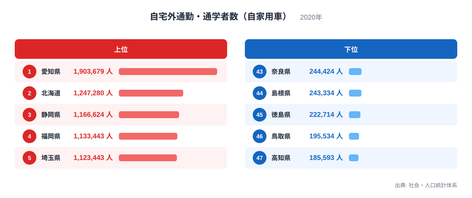
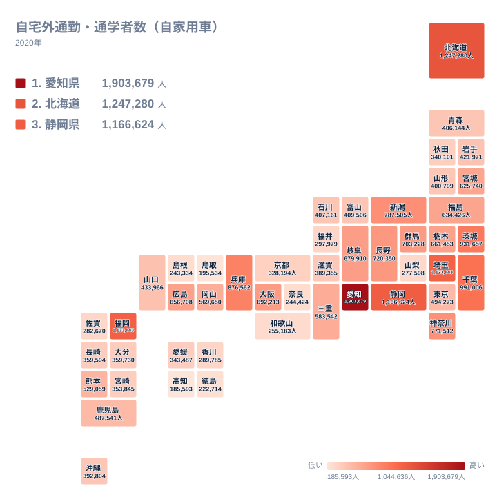

毎朝、自宅を出て職場や学校へ向かう人が何で移動するかは、その地域にどんな交通手段が用意されているかで決まります。2020年の集計では、自家用車で自宅外へ通勤・通学する人が最も多かったのは愛知県で1,903,679人でした。

ところが、日本で最も人口の多い東京都は494,273人で22位にとどまります。人口では東京都が愛知県を大きく上回るにもかかわらず、自家用車で移動する人の数では逆転しています。この記事では、その逆転がどこから生まれているのかを、都道府県別のデータからたどります。

> [!WARNING]
> ここで扱うのは自家用車で通勤・通学する人の「人数」であり、県民に占める割合ではありません。人口が多い県ほど数字が大きくなりやすい指標です。この記事では人数の順位と、人口規模との食い違いに注目して読み進めます。

## 自動車通勤者が多い県、少ない県

まず上位と下位を確認します。

<source-link href="/ranking/commute-by-car">自宅外通勤・通学者数（自家用車）ランキングをもっと見る</source-link>

上位は愛知県が1,903,679人、北海道が1,247,280人、静岡県が1,166,624人、福岡県が1,133,443人、埼玉県が1,123,443人と並びます。人口規模の大きい県が上位に来るのは自然ですが、その並び方には偏りがあります。

下位は高知県が185,593人、鳥取県が195,534人、徳島県が222,714人、島根県が243,334人、奈良県が244,424人です。人口の少ない県が並ぶ一方で、奈良県のように人口規模がそれほど小さくない県も含まれています。

注目すべきは中位から上位にかけての並びです。人口が全国で最も多い東京都は22位、2番目に多い神奈川県は771,512人で10位、3番目の大阪府は692,213人で13位です。人口の順位と自動車通勤者数の順位が、上位県ほど大きくずれています。

## 鉄道が密なほど、クルマは選ばれない

この食い違いを地図で見ると、構図がはっきりします。

ここで見ているのはあくまで人数であり、人口の順位とどれだけずれているかが読みどころです。東京都と大阪府は、周辺の県より色が薄くなっています。この2つの都府県には、都心へ向かう鉄道路線が高い密度で敷かれています。地下鉄と私鉄とJRが網の目のように重なり、駅から職場まで歩ける範囲に事業所が集まっているため、通勤にクルマを使う必要がありません。

さらに、都心部では駐車場の確保に費用がかかり、道路の混雑も激しくなります。鉄道の方が所要時間の見通しが立ちやすく、費用も抑えられるという条件が重なると、自家用車は通勤の選択肢から外れていきます。

対照的に、愛知県が全国で最も多い背景には2つの条件が重なっているとみられます。1つは県内に自動車産業の工場が広く分布していることです。工場は鉄道駅から離れた場所に立地することが多く、朝夕の交代勤務にも対応しなければならないため、通勤手段はクルマが前提になります。もう1つは、名古屋市の都心部を除けば鉄道の路線密度が首都圏ほど高くないことです。県内の移動を担う主役が自動車になります。

北海道が2位、静岡県が3位という並びも、同じ見方で捉えられます。北海道は市街地の間の距離が長く、冬季の気象条件も重なって、日常の移動が自動車に依存します。静岡県は東西に長い県土に工業地帯が点在し、住まいと職場の組み合わせが多方向に広がるため、放射状の鉄道網では通勤需要を吸収しきれません。

> [!NOTE]
> この数字には通勤者と通学者の両方が含まれます。自分で運転する人だけでなく、家族の運転する車で移動する人も自家用車の利用に数えられるため、学校や職場の立地と送迎の慣行が県ごとの数字を動かします。

## 埼玉と千葉が上位に入る意味

上位に埼玉県が1,123,443人で5位、千葉県が991,006人で6位、茨城県が931,657人で7位と、首都圏の県が並んでいる点も見逃せません。

これらの県は東京都心へ向かう鉄道路線を持っていますが、その路線は都心方向にしか伸びていません。県内の隣の市へ移動しようとすると、いったん都心方向へ出て乗り換えるか、本数の少ない路線を使うことになります。県内で完結する通勤には鉄道が使いにくく、自家用車が選ばれます。

つまり同じ首都圏でも、都心へ通う人は鉄道を、県内で働く人はクルマを使うという二層の構造があります。埼玉県や千葉県の数字の大きさは、県内で働く人の多さを映しています。

対して奈良県が43位にとどまるのは、県内の人口が北部に集中し、その北部が大阪へ向かう鉄道の沿線に収まっているためです。県の面積に対して人が住む範囲が限られており、その範囲を鉄道が覆っています。

> [!TIP]
> この指標を読むときは、人口規模と合わせて見ると意味が立ち上がります。人口の順位より自動車通勤者数の順位が高い県では、県内の移動が自動車に依存していると考えられます。逆に人口の順位より低い県では、鉄道網が通勤需要を吸収しています。東京都と愛知県の逆転は、この読み方の典型例です。

## 数字から見えること

自家用車で通勤・通学する人の数は、単に県の人口を映した数字ではありません。鉄道網がどこまで通勤需要を吸収できているか、職場が駅の近くに集まっているか、それとも郊外へ分散しているかという、地域の空間のかたちが数字に表れます。

自動車通勤の多さは、道路の整備、駐車場の需要、燃料費の家計負担、そして交通事故のリスクにも関わります。県の交通政策や都市計画を考えるとき、この数字は出発点の一つになります。

上位の[愛知県のデータ](/areas/23000)と[北海道のデータ](/areas/01000)を見ると、産業構造と人口分布の違いが確認できます。人の移動に関わる[観光カテゴリの統計一覧](/category/tourism)も合わせて見ると、県ごとの人の動き方が立体的に見えてきます。

## データ出典

- 社会・人口統計体系（2020年）自宅外通勤・通学者数（自家用車）
