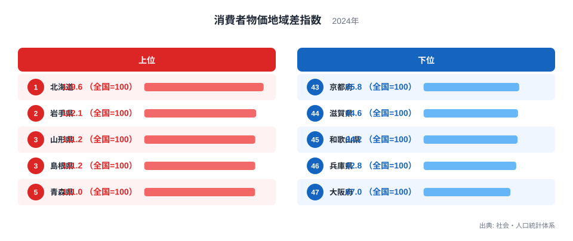
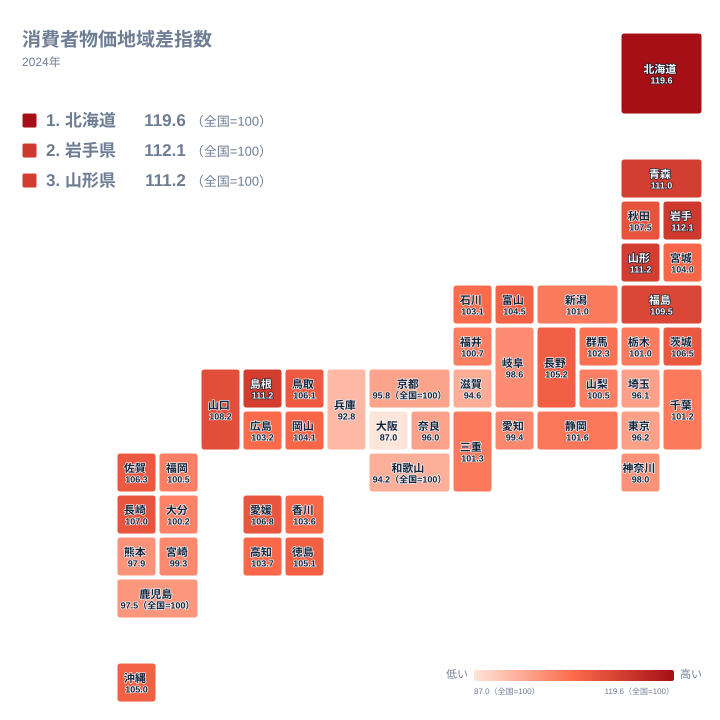

電気代やガス代、水道料金といった光熱・水道にかかる費用は、暮らす都道府県によって物価の水準そのものが違います。総務省の社会・人口統計体系が公表する消費者物価地域差指数は、全国平均を100とした指数で、この光熱・水道に関する地域ごとの物価水準の高さを表しています。

2024年の数値を見ると、最も高い北海道は119.6で、最も低い大阪府は87でした。同じ光熱・水道という支出項目でありながら、指数には30ポイント以上の開きがあります。この記事では、どの県が高く、どの県が低いのか、そしてその差がどこから生まれているのかを、実際の数値をもとに読み解いていきます。

先に結論を一つ示すと、指数が高い上位の県には北海道や東北、山陰など、冬の寒さが厳しい地域が集まっています。逆に指数が低い下位の県には近畿地方が目立ちます。この地域的な偏りの背景には、暖房需要の大きさとエネルギー供給の構造が関わっていると考えられます。

## 上位と下位に見る格差の大きさ

<source-link href="/ranking/consumer-price-difference-index-utilities">消費者物価地域差指数ランキングをもっと見る</source-link>

上位を見ていくと、北海道は119.6で全国1位です。2位は岩手県で112.1、3位は山形県で111.2、4位は島根県で111.2、5位は青森県で111となっています。北海道は2位の岩手県と比べても7ポイント以上高く、突出した存在であることがわかります。上位5県のうち4県が東北地方に位置しており、寒冷地に指数の高さが集中している様子がうかがえます。

一方、下位を見ると景色が大きく変わります。43位は京都府で95.8、44位は滋賀県で94.6、45位は和歌山県で94.2、46位は兵庫県で92.8、そして最下位の47位は大阪府で87です。下位5県のうち4県が近畿地方に位置しており、こちらも地域的なまとまりが見られます。大阪府の87という数値は、全国平均を13ポイントも下回っており、47都道府県の中で最も物価水準が低い状態です。

北海道と大阪府を単純に比べると、119.6対87という開きになります。同じ光熱・水道という項目でこれだけの差がつくのは、単なる誤差ではなく、気候条件やエネルギー供給の構造といった構造的な要因が働いていると見るのが自然です。

## 地理分布で見えてくる寒冷地と大都市圏の差

地図で全国の分布を確認すると、指数の高い県が北海道と東北、そして山陰地方に散らばっていることがわかります。青森県は111、福島県は109.5、秋田県は107.5と、東北6県のうち複数の県が上位に入っています。島根県が111.2で4位に入っているのも目を引きます。島根県は山陰地方に位置し、冬の積雪や日本海側特有の寒さが影響している可能性があります。

対照的に、指数が低い県は近畿地方を中心にまとまっています。京都府、滋賀県、和歌山県、兵庫県、大阪府という近畿の府県が軒並み下位に並んでおり、これほど地域が偏るケースは他の指標ではあまり見られません。近畿地方は都市部が多く人口密度が高いため、エネルギーの供給インフラが効率的に整備されやすく、価格が下がりやすい環境にあると考えられます。

奈良県も96で42位、京都府も95.8で43位と、近畿の各府県は軒並み全国平均を下回っています。これに対して四国や九州の県は、愛媛県が106.8で10位、長崎県が107で9位など、中位から上位にかけて分布しており、近畿ほどはっきりした低さは見られません。

## なぜ北海道が突出して高くなるのか

北海道の指数がここまで高い理由として考えられるのは、冬の暖房需要の大きさです。北海道は本州の多くの地域よりも冬の気温が低く、暖房を使う期間も長くなります。灯油やガス、電気による暖房費がかさむことで、光熱費全体の水準が押し上げられていると見られます。

また、電力会社やガス事業者の供給区域が都道府県ごとに分かれていることも、指数の違いに影響していると考えられます。北海道は本州から海で隔てられているため、他地域と電力網が陸続きでつながっておらず、独立した供給体制のもとで料金が決まる面があります。こうした地理的な条件が、料金水準の違いにつながっている可能性があります。

なお、これらの要因はあくまで一般的に考えられる背景であり、指数の変動を完全に説明するものではありません。実際の料金は電力会社ごとの料金プランや燃料調達の状況によっても変わるため、この点は仮説として捉えてください。

## 近畿地方が低くなる背景

近畿地方の指数が低い背景としては、都市化による供給効率の高さが挙げられます。大阪府や兵庫県、京都府は人口が集中する都市圏を抱えており、電力やガス、水道のインフラが密に整備されています。利用者一人あたりの供給コストが下がりやすく、料金にも反映されやすいと考えられます。

さらに、近畿地方は北海道や東北ほど冬の寒さが厳しくないため、暖房にかかるエネルギー消費量そのものが少なく済むという面もあります。夏の冷房需要はあっても、暖房ほどの長期間・高負荷の使用にはならないことが多く、これも光熱費の水準を抑える要因になっていると考えられます。

## この記事でわかったこと

- 消費者物価地域差指数（光熱・水道）は、最も高い北海道が119.6、最も低い大阪府が87で、30ポイント以上の開きがあります。
- 上位5県のうち4県が東北地方に位置し、寒冷地で指数が高くなる傾向が見られます。
- 下位5県のうち4県が近畿地方に位置し、都市化が進んだ地域で指数が低くなる傾向が見られます。
- 北海道が突出して高い背景には、冬の暖房需要の大きさと独立した電力供給体制があると考えられます。
- 近畿地方が低い背景には、都市部への人口集中によるインフラ効率の高さがあると考えられます。

## 統計を読むときの注意点

> [!NOTE]
> 消費者物価地域差指数は全国平均を100とした相対的な指数であり、光熱・水道にかかる県ごとの物価水準の高さを表しています。実際の支出金額そのものではなく、あくまで価格水準の比較であることに注意してください。

> [!WARNING]
> この指数は都道府県庁所在市など主要な都市で調査された小売価格をもとに算出されています。そのため、同じ県内でも地方部と都市部では実際の光熱・水道費が指数と異なる場合があります。

> [!TIP]
> 電力会社や都市ガス事業者の供給区域は都道府県の境界と必ずしも一致しません。指数の高低を読み解くときは、都市ガスとプロパンガスの普及率の違いや、地域の電力会社の料金体系も合わせて確認すると理解が深まります。

こうした地域差は、光熱・水道だけでなく他の消費支出の項目にも表れます。[同じカテゴリの統計一覧](/category/economy)では、経済に関するさまざまな指標を確認できます。上位に入った[北海道のデータ](/areas/01000)や[岩手県のデータ](/areas/03000)を見ると、光熱・水道以外の指標との関係も見えてきます。

## データ出典

出典は社会・人口統計体系（2024年）です。消費者物価地域差指数は、全国の都道府県庁所在市などで調査された小売価格をもとに、総務省統計局が算出しています。
