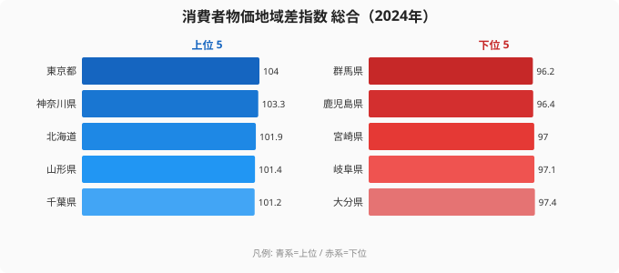
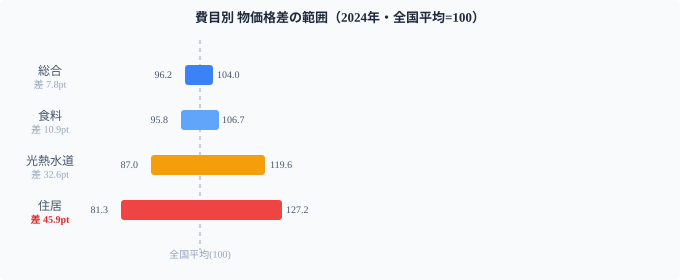
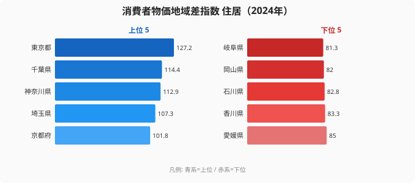

「地方に移住すれば生活コストが下がる」──この言説は正確でしょうか。数字を見ると、答えは「費目によって大きく変わる」です。

総務省「消費者物価地域差指数」（2024年）を費目別に分解すると、住居費の格差は総合の6倍に達する一方、食料費の格差は住居費の4分の1以下にとどまります。「物価が高い・安い」というざっくりしたイメージを費目で解像度を上げると、移住・節約の判断に直結する構造が見えてきます。

> [!NOTE]
> 消費者物価地域差指数は、各都道府県の物価水準を全国平均＝100として指数化したものです。100超が全国より高く、100未満が安いことを示します。総務省「小売物価統計調査」に基づく2024年データを使用しています。費目別指数は総合、食料、住居、光熱・水道の4費目で比較します。「指数の差」は割合の差とほぼ等しいと読むと、後半の家計試算が直感的に理解できます。

## 総合ランキング──1位と47位の差はわずか7.8pt

まず総合の物価水準を見ていきます。

1位の東京（104.0）と最安の群馬（96.2）の差は**7.8ポイント**。年収400万円なら物価の地域差は年間32万円程度で、「地方に移住すると劇的に安くなる」という体感は、総合指数では裏付けられません。日々の物価が高いか安いかは、地域差よりも家計の使い方で決まる部分が大きいということです。

注目すべきは**北海道が全国3位**の高物価であることです。「北海道は物価が安い」というイメージとは逆です。なぜ寒冷地の北海道が高物価になるのか——その答えは記事後半の光熱・水道費にあります。総合指数は4費目を平均してしまうため、こうした「どの費目が効いているか」は分解しないと見えません。

<source-link href="/ranking/consumer-price-difference-index-overall">47都道府県の消費者物価地域差指数（総合）ランキング</source-link>

## 費目分解──住居費が格差の「主役」

総合の差が小さく見える理由は、住居費の格差が他費目と「平均化」されているからです。費目別に分解すると格差の正体が露わになります。

<data-source url="https://www.e-stat.go.jp/dbview?sid=0000010212" label="e-Stat 社会・人口統計体系"></data-source>

**住居費の格差は45.9ポイント**。これは総合格差（7.8pt）の約6倍です。図を見れば、住居の帯（最大〜最小の幅）だけが突出して長く、食料・光熱の幅はその内側に収まっているのが一目でわかります。移住による生活コスト削減の大部分は、住居費の節約で説明されます。逆に言えば「家賃を下げる移住」以外では、コスト削減効果は限定的です。費目ごとに「動く幅」がまるで違うことこそ、この記事の核心です。

## 住居費──首都圏が突出、「家賃差」が物価格差の正体

住居費の指数で見ると、首都圏が上位を独占します。

東京（127.2）と最安の岐阜（81.3）の差は45.9ポイント。月額家賃15万円なら、東京から岐阜への移住で**月約7万円の住居費削減**になる計算です（指数比で概算）。上位は東京・千葉・神奈川・埼玉と首都圏が並び、地価と家賃の高さがそのまま指数に表れています。住居費こそが「東京は物価が高い」という体感の正体であり、総合指数の地域差のほとんどを生み出している費目です。

> [!WARNING]
> 「住居費が安い」は「家賃が安い」と実質的に同義ですが、家賃だけを見て移住を決めるのは危険です。通勤可能な職場の有無・収入水準も同時に変わるため、住居費だけを切り取ると生活全体の経済性が見えません。「住居費削減分 > 収入減少分」かどうかを試算することが必要です。

<source-link href="/ranking/consumer-price-difference-index-housing">47都道府県の住居物価指数ランキング</source-link>

<ad-slot></ad-slot>

## 食料費──「農業県が安い」「離島が高い」の構造

食料費では、住居費とは異なる地理的パターンが現れます。

**最高値は沖縄県（106.7）**。離島という立地が輸送コストに直結し、食料品全般が高くなっています。2位は東京都（103.0）、3位は福井県（102.5）で、同値の島根県（102.5）も上位に並びます。積雪地帯で流通コストが高い日本海側の構造です。

一方、**最安は長野県（95.8）**で、群馬県（96.0）が続きます。農業生産力の高い県は地産地消の恩恵で食料費が低く抑えられています。

**食料格差はわずか10.9ポイント**（沖縄106.7 vs 長野95.8）。住居費の4分の1以下で、全国の食料費はかなり均一化されています。流通網の発達で「どこでも同じ値段で買える」食品が増えた結果であり、移住による食費の節約効果は小さいといえます。同じ物価でもインフレの効き方は県で違う点は[都道府県で異なるインフレの型](/blog/cpi-change-regional-pattern)に詳しく載っています。

<source-link href="/ranking/consumer-price-difference-index-food">47都道府県の食料物価指数ランキング</source-link>

## 光熱・水道費──「北海道高物価の正体」

北海道が全国3位の高物価（総合101.9）であることの正体は、ここにあります。

**北海道の光熱・水道費指数は119.6で全国1位**。岩手（112.1）、山形（111.2）、青森（111.0）と東北勢が続きます。年間を通じた暖房需要が数字に直結しています。

逆に**最安は大阪府（87.0）**。温暖な気候と都市ガスの普及が効いています。北海道と大阪の差は32.6ポイントで、月額光熱費1万5千円なら北海道は約5千円高い計算です。光熱費は気候という動かせない条件に縛られるため、移住で「下げる」のが最も難しい費目でもあります。

> [!TIP]
> 北海道の住居物価指数は全国36位（平均以下）です。つまり「北海道は家賃は安いが光熱費が高い」という構造で、総合では高物価になっています。北海道への移住は「家賃削減メリット」が光熱費増加で一部相殺される点に注意が必要です。固定費の地域差は[家計の交通・通信費の地域差](/blog/communication-cost-burden)と合わせて見ると、移住後の家計が立体的に見えてきます。

<source-link href="/ranking/consumer-price-difference-index-utilities">47都道府県の光熱・水道物価指数ランキング</source-link>

## 食料 × 住居の4タイプ──費目の組み合わせで読む生活コスト

2費目の交差で47都道府県を4タイプに分類できます。

- **両方高い（食料↑・住居↑）**：東京・神奈川・千葉。家賃も食費も高い都市圏の典型。
- **食料高・住居安（食料↑・住居↓）**：島根・福井・鳥取。日本海側に多い独自構造。
- **両方安い（食料↓・住居↓）**：群馬・長野・岐阜。農業×低地価の相乗効果で生活コストが最も下がる。
- **食料安・住居高（食料↓・住居↑）**：埼玉。東京通勤圏で農産地にも近い、ハイブリッド型。

「移住で生活コストを下げたい」なら、「両方安い」ゾーンの群馬・長野・岐阜が最も効果的です。たとえば[群馬県の地域プロフィール](/areas/10000)を見ると、総合・住居・食料のいずれも全国平均以下にそろっています。ただしこの3県はいずれも東京圏の通勤圏外で、収入水準と照らし合わせた判断が必要になります。

<ad-slot></ad-slot>

## まとめ──費目で変わる「移住の経済合理性」

消費者物価地域差指数を4費目で分解した結果を整理します。

- **総合差は7.8pt（約8%）**: 「地方は安い」は事実だが体感ほど大きくない
- **住居費差は45.9pt**: 物価格差の大部分を説明する。家賃削減が移住の最大メリット
- **食料費差は10.9pt**: 農業県が安い構造だが格差は小さく、移住の節約効果は限定的
- **光熱水道差は32.6pt**: 北海道など寒冷地が高く、家賃の安さを一部相殺する

移住の経済合理性は「どの費目を重視するか」で変わります。住居費の節約を最大化したいなら岐阜・長野・群馬。食料費を抑えたいなら農業県。寒冷地は家賃が安くても光熱費がかさむ点に注意が必要です。物価以外の暮らしの指標もあわせて比べたいなら[経済カテゴリのランキング一覧](/category/economy)から探せます。

## データ出典

- 総務省「消費者物価地域差指数」（e-Stat 社会・人口統計体系 ID: 0000010212）
- データ年度: 2024年
