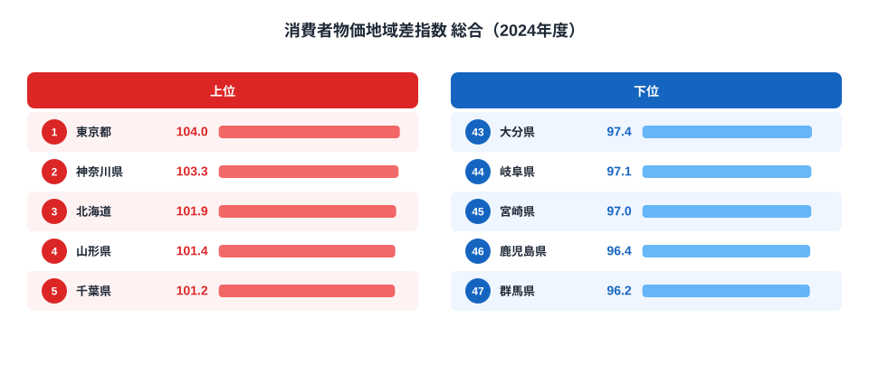
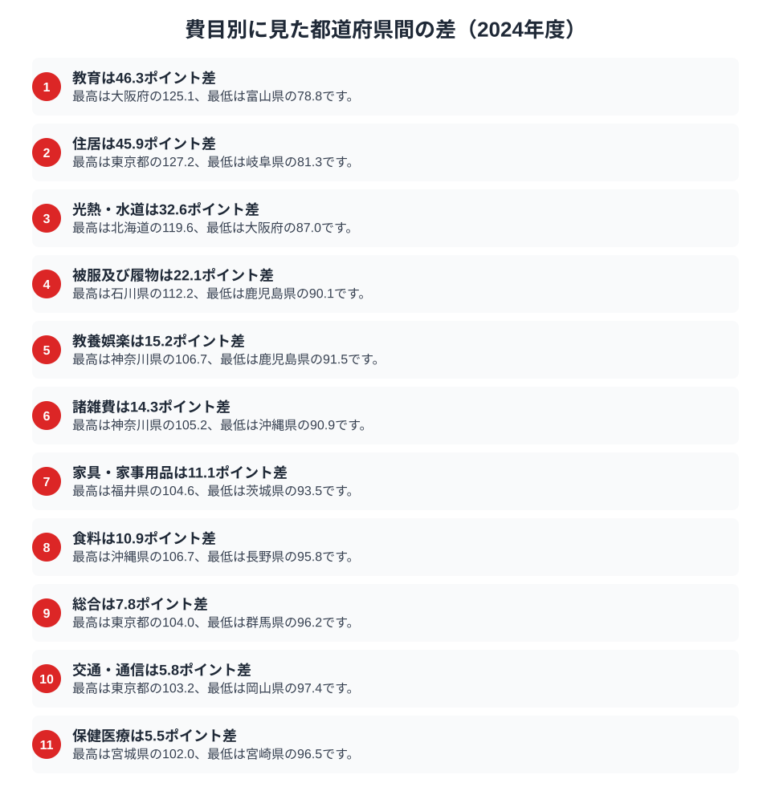
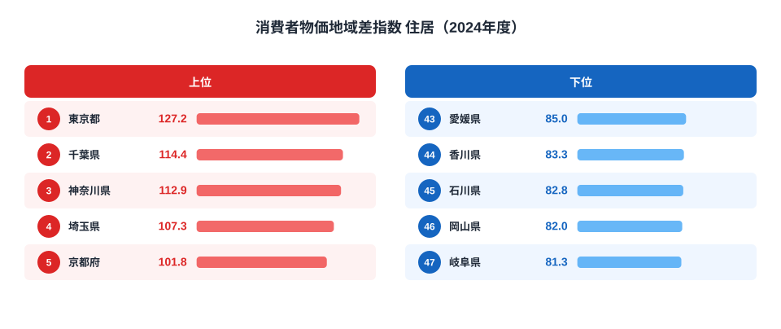
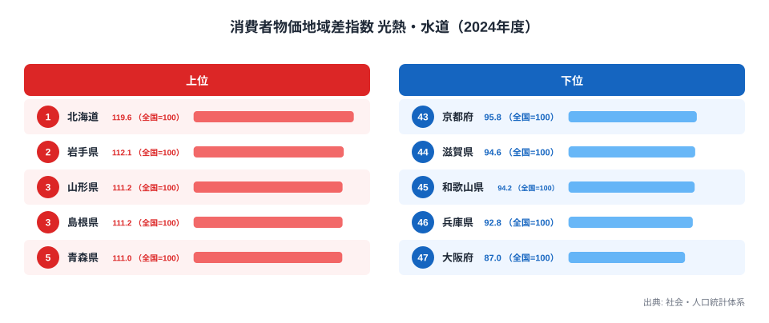

「地方に移住すれば生活コストが下がる」──この言説は正確でしょうか。数字を見ると、答えは「費目によって大きく変わる」です。

消費者物価地域差指数（2024年度）の総合は、最高の東京都が104.0、最低の群馬県が96.2で、差は7.8ポイントしかありません。ところが費目別に見ると、教育は最高の大阪府と最低の富山県の差が46.3ポイント、住居は最高の東京都と最低の岐阜県の差が45.9ポイントに達し、どちらも総合の差の約6倍です。一方、食料の差は10.9ポイントで、教育や住居の4分の1以下にとどまります。「物価が高い・安い」というざっくりしたイメージを費目に分けて見ると、移住や節約を考えるときに何を見るべきかが見えてきます。

> [!NOTE]
> 消費者物価地域差指数は、全国平均の物価水準を100として、都道府県の物価水準を比べた指数です。100を超えれば全国平均より高く、100を下回れば安いことを示します。年次は年度の表記で、この記事の数値はすべて2024年度です。総合と住居の指数には持家の帰属家賃が含まれないため、持ち家の人の住居コストは反映されません。総合は10費目を含む全体をまとめた指数で、費目ごとの構成比（ウエイト）がこのデータにないため、10費目の差から総合の差を計算することはできません。

## 総合ランキング──1位と47位の差はわずか7.8ポイント

まず総合の物価水準を見ていきます。

1位の東京都は104.0、最も低い群馬県は96.2で、差は**7.8ポイント**です。指数は全国平均を100とした水準なので、東京都は全国平均より4.0ポイント高く、群馬県は3.8ポイント低いと読めます。差の7.8ポイントは全国平均の約8%に当たり、「地方に移住すると劇的に安くなる」という体感は、総合指数では裏付けられません。

上位は東京都、神奈川県、北海道、山形県、千葉県の順で、2位の神奈川県は103.3です。注目すべきは**北海道が全国3位**の101.9であることで、4位の山形県も101.4と、首都圏以外の道県が上位に入っています。「北海道は物価が安い」というイメージとは逆の結果です。下位は群馬県に続いて鹿児島県が96.4、宮崎県が97.0、岐阜県が97.1、大分県が97.4で、九州の3県が入っています。

総合で3位に入る北海道も、費目ごとに見ると住居は低く、光熱・水道は高いというように、高さの出方が違います。総合の指数は多くの費目をまとめた値なので、費目ごとの大きな差は混ざり合って見えにくくなります。次の節で、費目を分けて確かめます。

<source-link href="/ranking/consumer-price-difference-index-overall">47都道府県の消費者物価地域差指数（総合）ランキング</source-link>

## 費目分解──差が大きいのは教育と住居

総合の差が小さく見えるのは、費目ごとに地域差の大きさがまるで違い、総合の指数ではそれらが混ざっているためです。指数が公表されている10費目すべてについて、最高と最低の差を大きい順に並べました。総合の7.8ポイントも並べています。

差が最も大きいのは教育の46.3ポイントで、住居の45.9ポイントがわずか0.4ポイント差で続きます。この2費目は、3番目の光熱・水道の32.6ポイントとも13ポイント以上離れています。以下、被服及び履物が22.1ポイント、教養娯楽が15.2ポイント、諸雑費が14.3ポイント、家具・家事用品が11.1ポイント、食料が10.9ポイントと続き、交通・通信は5.8ポイント、保健医療は5.5ポイントにとどまります。総合の差の7.8ポイントより大きい費目は10費目のうち8つあり、教育と住居は総合のおよそ6倍です。費目ごとに「動く幅」がこれほど違うことが、この記事の核心です。

最高と最低の県も、費目ごとに入れ替わります。最高側は、総合・住居・交通・通信が東京都ですが、教育は大阪府、光熱・水道は北海道、食料は沖縄県です。大阪府は教育で最高の125.1、光熱・水道では最低の87.0と、同じ府でも費目によって正反対の位置にあります。最低側は、教育が富山県、住居が岐阜県、食料が長野県、総合が群馬県と、費目ごとに別の県が並びます。

教育の差は、10費目のなかで最大です。最高は大阪府の125.1で、和歌山県が119.0、京都府が116.8、滋賀県が115.0、神奈川県が110.8と続き、上位5府県のうち4府県を近畿が占めます。最低は富山県の78.8で、群馬県が80.1、山口県が80.7、秋田県が84.5、愛媛県が86.5です。全国平均の100を超えるのは12府県にとどまります。子育て世帯が移住先を比べるときは、住居と並んで確認したい費目です。ただし、差が授業料などの制度の違いによるのか、通う学校の種類の違いによるのかは、この指数だけでは確かめられません。

ここで注意したいのは、最高と最低の差が大きいことと、総合の差への影響が大きいことは別の話だという点です。総合に占める各費目の割合はこのデータにないため、教育や住居の差が総合の差をどれだけ生んでいるのかは、この記事では計算できません。手がかりとして、住居の上位4位を占める東京都、千葉県、神奈川県、埼玉県は、総合でも1位、5位、2位、8位に入っています。住居の高さが総合を押し上げている可能性がありますが、このデータだけでは確かめられません。

あわせて見る: [消費者物価地域差指数（教育）ランキング](/ranking/consumer-price-difference-index-education)

## 住居──首都圏が突出する費目

住居の指数で見ると、首都圏が上位を占めます。

東京都が127.2で1位、2位は千葉県の114.4、3位は神奈川県の112.9、4位は埼玉県の107.3で、首都圏の1都3県が上位4位を占めます。5位は京都府の101.8で、全国平均の100を超えるのは6位の山形県の100.1を含めて6都府県だけです。残る41道府県は100以下で、住居が高いのは一部の地域に限られています。

一方、最低は岐阜県の81.3で、岡山県が82.0、石川県が82.8、香川県が83.3、愛媛県が85.0と続きます。東京都と岐阜県の差は45.9ポイントです。指数の比で見ると、岐阜県の住居は東京都の約64%の水準で、81.3を127.2で割った値です。首都圏が上位に並ぶ背景として家賃水準の高さなどが関わっている可能性がありますが、このデータだけでは確かめられません。

> [!WARNING]
> 住居の指数には持家の帰属家賃が含まれず、消費者物価指数（CPI）の住居とは対象が異なります。持ち家の人にとっての住居コストの差は、この指数からは読み取れません。また指数は全国平均を100とした水準の比較で、家賃の実額や移住による削減額に換算することはできません。通勤先や収入も県によって変わるため、住居の差だけで移住の損得は決まりません。

<source-link href="/ranking/consumer-price-difference-index-housing">47都道府県の消費者物価地域差指数（住居）ランキング</source-link>

## 食料──沖縄が最高、差は10.9ポイント

食料では、住居とは異なる地理的パターンが現れます。

**最高値は沖縄県の106.7**です。2位は東京都の103.0、3位は福井県の102.5で、島根県も同じ102.5で続き、5位の鳥取県は102.4です。首都圏の東京都だけでなく、日本海側の福井県・島根県・鳥取県や沖縄県も上位に入ります。

一方、**最安は長野県の95.8**で、群馬県が96.0で続き、茨城県は97.4です。**食料の差は10.9ポイント**にとどまり、教育や住居の4分の1以下です。食料の指数は95.8から106.7の間に収まっており、価格水準の面では、食費の節約を目的にした移住で期待できる幅は小さいと言えます。

最高の沖縄県や最低の長野県・群馬県がなぜその水準になるのかは、この指数だけでは説明できません。離島を含む沖縄県では輸送の費用、長野県や群馬県では農産物の産地の近さが関わっている可能性がありますが、確かめるには品目別の価格や流通のデータが別に必要です。物価の上がり方が県によって違う点は、[都道府県で異なるインフレの型](/blog/cpi-change-regional-pattern)で扱っています。

<source-link href="/ranking/consumer-price-difference-index-food">47都道府県の消費者物価地域差指数（食料）ランキング</source-link>

## 光熱・水道──北海道が最高

北海道は総合で全国3位の101.9ですが、光熱・水道では119.6で全国1位です。

**北海道の光熱・水道は119.6で全国1位**です。2位は岩手県の112.1、3位は山形県の111.2で、島根県も同じ111.2、5位は青森県の111.0と続きます。上位5県のうち、北海道と東北の3県が4県を占めます。

逆に**最低は大阪府の87.0**で、兵庫県が92.8、和歌山県が94.2、滋賀県が94.6、京都府が95.8と近畿の府県が並びます。北海道と大阪府の差は32.6ポイントで、教育の46.3ポイントと住居の45.9ポイントに次ぐ3番目の大きさです。総合で1位の東京都でも、光熱・水道は96.2で40位と全国平均を下回ります。費目ごとに高い県が入れ替わることが、ここでも確かめられます。

北海道や東北で高い背景として暖房に使うエネルギーの需要が関わっている可能性がありますが、気温や使用量のデータはここにないため、確かめられません。実際、上位10位には島根県が3位、山口県が7位、長崎県が9位、愛媛県が10位と、北海道・東北以外の県も入っています。暖房の需要だけでは説明しきれない部分があり、気温、暖房の設備、料金の仕組みなどの別のデータで確かめる必要があります。大阪府が低い理由も、このデータだけでは説明できません。

> [!TIP]
> 北海道の住居は87.1で全国36位と平均を下回りますが、食料は102.3で6位、光熱・水道は119.6で1位です。総合の101.9がどの費目から来ているかは、費目ごとの構成比（ウエイト）がこのデータにないため、この記事では分解できません。移住先を比べるときは、住居だけでなく光熱・水道も合わせて見る価値があります。固定費の地域差は、[家計の交通・通信費の地域差](/blog/communication-cost-burden)と合わせて見ると、移住後の家計の見通しが立てやすくなります。

<source-link href="/ranking/consumer-price-difference-index-utilities">47都道府県の消費者物価地域差指数（光熱・水道）ランキング</source-link>

## 食料 × 住居の4タイプ──費目の組み合わせで読む物価水準

食料と住居の2費目を、全国平均の100を境に分けると、47都道府県は4タイプに分かれます。分類は、この記事で使った食料と住居の2024年度の指数から数えたものです。

- **両方高い**（食料・住居とも100超）：東京都、神奈川県、山形県、京都府、千葉県の5都府県です。
- **食料高・住居安**（食料が100超、住居が100以下）：沖縄県、福井県、島根県、鳥取県、北海道など17道県です。
- **両方安い**（食料・住居とも100以下）：群馬県、長野県、岐阜県など24県で、最も多いタイプです。
- **食料安・住居高**（食料が100以下、住居が100超）：埼玉県の1県だけです。

「物価の低い県に移住したい」なら、「両方安い」24県が出発点になります。食料が最も低い長野県、住居が最も低い岐阜県、総合が最も低い群馬県はいずれもこのタイプです。ただし、この分類は食料と住居の2費目だけで、光熱・水道を見ていません。24県のうち15県は光熱・水道が全国平均の100を上回り、岩手県は112.1で2位、青森県は111.0で5位、福島県は109.5で6位、秋田県は107.5で8位、長野県は105.2で14位、群馬県は102.3で24位です。食料・住居・光熱・水道の3費目とも100以下なのは、兵庫県、大阪府、和歌山県、滋賀県、鹿児島県、奈良県、岐阜県、愛知県、宮崎県の9府県だけです。

たとえば群馬県は、総合が96.2、住居が89.8、食料が96.0で、この3つは全国平均を下回りますが、光熱・水道は102.3で全国平均を上回ります。[群馬県の地域プロフィール](/areas/10000)で、ほかの指標も見られます。ただし収入や仕事の有無は指数に含まれないため、物価の低さだけで移住先を決めることはできません。

## まとめ──費目で変わる「移住の経済合理性」

消費者物価地域差指数（2024年度）を費目別に分けた結果を整理します。

- **総合の差は7.8ポイント**: 東京都の104.0と群馬県の96.2で、全国平均の約8%です
- **教育の差は46.3ポイント**: 大阪府の125.1と富山県の78.8で、10費目のなかで最大です。差が制度の違いによるのかは、このデータだけでは確かめられません
- **住居の差は45.9ポイント**: 東京都の127.2と岐阜県の81.3で、教育に次ぐ2番目の大きさです。首都圏の1都3県が上位4位を占めます
- **光熱・水道の差は32.6ポイント**: 北海道が最高の119.6、大阪府が最低の87.0で、3番目の大きさです。北海道は住居が36位でも総合が3位になります
- **食料の差は10.9ポイント**: 沖縄県の106.7から長野県の95.8までで、教育や住居の4分の1以下です

移住の経済性は、どの費目を重視するかで変わります。差が大きいのは教育と住居ですが、指数は支出額そのものではなく、持ち家か賃貸か、子どもの有無、収入がどう変わるかによっても結論は変わります。総合の下位には群馬県・鹿児島県・宮崎県などが並びますが、北海道や山形県のように地方でも平均を上回る県があり、「地方に移れば安くなる」とは言い切れません。物価以外の暮らしの指標もあわせて比べたいなら、[経済カテゴリのランキング一覧](/category/economy)から探せます。
