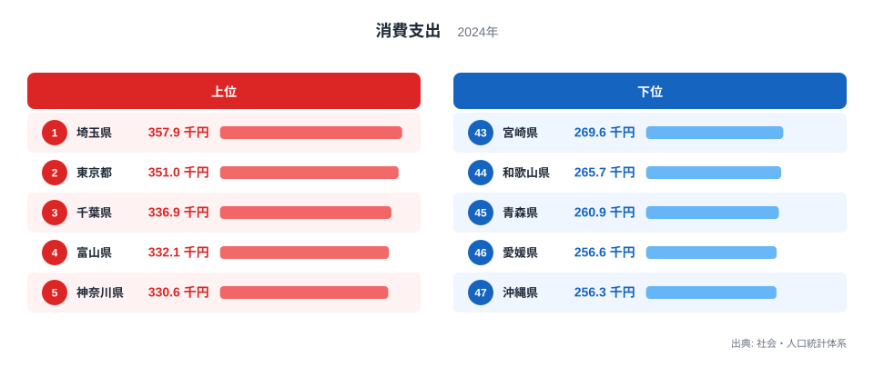
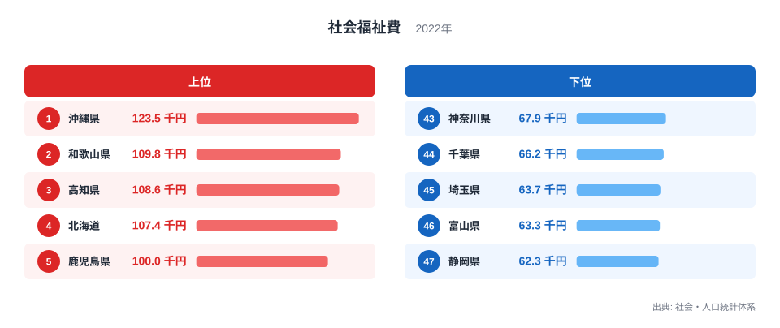
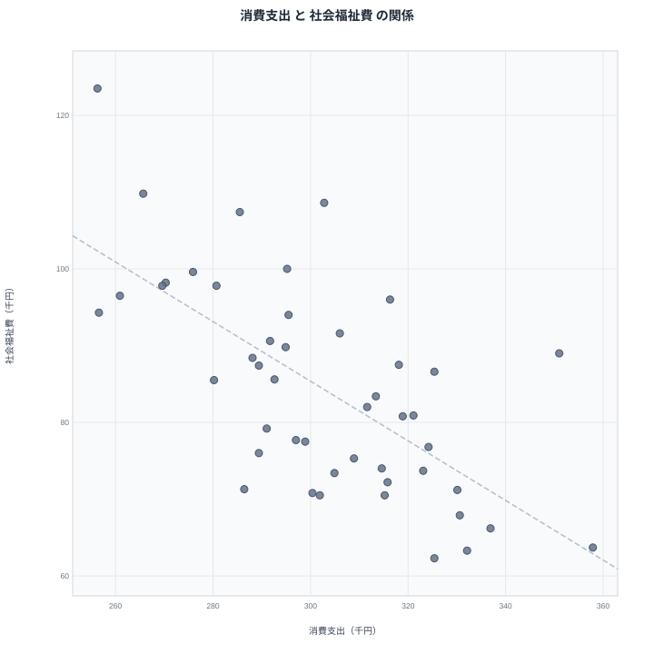

二人以上の世帯における1か月あたりの消費支出には、都道府県ごとに大きな開きがあります。2024年のデータでは、最も多い埼玉県が357.9千円、最も少ない沖縄県が256.3千円となっており、その差は約1.4倍にのぼります。単に「豊かな県ほど支出が多い」と考えたくなりますが、話はそう単純ではありません。

同じ都道府県の一人当たり社会福祉費（都道府県・市町村計、2022年）を並べてみると、消費支出が多い県ほど社会福祉費が少なく、消費支出が少ない県ほど社会福祉費が多いという、逆向きの傾向が見えてきます。この記事では、消費支出と社会福祉費という性格の異なる2つの指標を重ね合わせ、どのような地域パターンが浮かび上がるのか、そしてその背景に何があり得るのかを整理します。

まず消費支出の上位と下位を確認し、続けて社会福祉費の上位と下位を見ます。そのうえで散布図で2つの指標の関係を可視化し、見かけの相関がなぜ生まれるのかを、確認できる範囲の事実と仮説に分けて考えます。

## 消費支出の上位と下位

<source-link href="/ranking/consumption-expenditure-multi-person-households-per-month">消費支出ランキングをもっと見る</source-link>

消費支出の上位5県は、1位が埼玉県で357.9千円、2位が東京都で351千円、3位が千葉県で336.9千円、4位が富山県で332.1千円、5位が神奈川県で330.6千円です。埼玉県、東京都、千葉県、神奈川県という首都圏の1都3県が上位5県のうち4つを占めており、そこに中部地方の富山県が加わる形になっています。

首都圏の県が上位に集まる背景としては、物価水準や住宅費の水準が全国平均より高く、消費支出の名目額そのものが押し上げられている可能性が考えられます。また富山県については、持ち家率や共働き世帯の割合が高い地域として知られており、世帯当たりの可処分所得が比較的大きいことが影響しているかもしれません。ただしこれらはデータから直接確認できる関係ではないため、あくまで一つの見方として捉えてください。

下位5県は、47位が沖縄県で256.3千円、46位が愛媛県で256.6千円、45位が青森県で260.9千円、44位が和歌山県で265.7千円、43位が宮崎県で269.6千円です。沖縄県と愛媛県はわずか0.3千円の差で並んでおり、下位グループは西日本と東北にまたがっているため、単純な地域ブロックだけでは説明しきれない分布になっています。

## 社会福祉費の上位と下位

社会福祉費の上位5県は、1位が沖縄県で123.5千円、2位が和歌山県で109.8千円、3位が高知県で108.6千円、4位が北海道で107.4千円、5位が鹿児島県で100千円です。沖縄県は消費支出では最下位でしたが、社会福祉費では全国で最も高い金額になっており、この2つの指標で正反対の順位を取っています。

上位5県には、消費支出の下位5県にも登場した沖縄県、和歌山県のほか、高知県、北海道、鹿児島県が並びます。いずれも人口減少や高齢化が全国平均より進んでいるとされる地域を含んでおり、生活保護や高齢者福祉、児童福祉といった分野の需要が相対的に大きいことが、社会福祉費を押し上げている一因として考えられます。

下位5県は、47位が静岡県で62.3千円、46位が富山県で63.3千円、45位が埼玉県で63.7千円、44位が千葉県で66.2千円、43位が神奈川県で67.9千円です。埼玉県、千葉県、神奈川県という首都圏の3県と、消費支出で上位だった富山県が、社会福祉費では逆にそろって下位に位置しています。首都圏に近く現役世代の人口比率が高い地域では、福祉需要そのものが相対的に小さく抑えられている可能性があります。

## 消費支出と社会福祉費の関係

散布図にすると、消費支出が多い県ほど社会福祉費が少なく、消費支出が少ない県ほど社会福祉費が多いという、右下がりの傾向がはっきり見えます。消費支出で1位の埼玉県は社会福祉費で45位、3位の千葉県は44位、5位の神奈川県は43位、4位の富山県は46位と、消費支出上位5県のうち4県が社会福祉費の下位5県に含まれています。反対に、社会福祉費で1位の沖縄県は消費支出で47位、2位の和歌山県は44位と、こちらも逆向きの対応関係が見られます。

ただしこの関係は完全ではありません。たとえば高知県は消費支出で23位の302.8千円と中位に位置していますが、社会福祉費では3位の108.6千円と上位に入っています。すべての県が右下がりの直線にきれいに乗っているわけではなく、消費支出の水準だけで社会福祉費の水準が決まるわけではないことが分かります。

大切なのは、この右下がりの傾向がそのまま「消費支出が少ないから社会福祉費が増える」という因果関係を意味するわけではない、という点です。両方の指標がそれぞれ別の要因、たとえば人口の年齢構成や地域の産業構造から影響を受けた結果として、たまたま逆向きに動いて見えている可能性も十分にあります。相関が見えることと、一方が他方の原因であることは、切り分けて考える必要があります。

## なぜ逆の関係になるのか

[仮説] 消費支出が多い埼玉県、千葉県、神奈川県、富山県は、いずれも大都市への通勤圏や持ち家率の高い地域を含んでおり、現役で働く世代の比率が相対的に高いことが考えられます。現役世代の比率が高い地域では、生活保護や介護、児童福祉といった社会福祉費の対象となる需要そのものが小さくなりやすく、結果として一人当たりの社会福祉費が低く抑えられている可能性があります。

[仮説] 一方で社会福祉費が多い沖縄県、和歌山県、高知県、北海道、鹿児島県は、人口減少や高齢化が進んでいるとされる地域を多く含んでいます。高齢者福祉や生活保護の対象となる世帯の比率が高まれば、財政上の社会福祉費は増える方向に働きます。同時にこうした地域では現役世代の所得水準が伸び悩みやすく、消費支出も抑えられる傾向があるとすれば、消費支出と社会福祉費が逆向きに動くことの説明の一つになり得ます。

これらはいずれも仮説であり、[社会福祉費ランキング](/ranking/per-capita-social-welfare-expenditure-pref-municipal)や関連する年齢構成のデータとあわせて検証する必要があります。[埼玉県のデータ](/areas/11000)や[東京都のデータ](/areas/13000)を個別に見ると、同じ首都圏でも消費支出や社会福祉費の水準に差があることが分かるため、県ごとの事情も踏まえて読み解くことをおすすめします。より広い視点で比較したい場合は、[同じカテゴリの統計一覧](/category/economy)から他の経済指標もあわせて確認してください。

## まとめ

- 消費支出は埼玉県が357.9千円で1位、沖縄県が256.3千円で47位となっており、その差は約1.4倍です。
- 社会福祉費は沖縄県が123.5千円で1位、静岡県が62.3千円で47位となっており、その差は約2.0倍です。
- 消費支出の上位5県のうち4県（埼玉県、千葉県、富山県、神奈川県）が、社会福祉費では下位5県に入っています。
- 社会福祉費の上位5県には沖縄県、和歌山県、高知県、北海道、鹿児島県が並び、消費支出の下位グループと一部重なっています。
- 高知県のように消費支出が中位でも社会福祉費が上位に入る県もあり、両指標の関係は一様ではありません。

> [!NOTE]
> 消費支出は二人以上の世帯における1か月あたりの支出額で、税金や社会保険料といった非消費支出は含まれていません。単月ではなく、月平均として集計された値であることに注意してください。

> [!WARNING]
> 消費支出は2024年、社会福祉費は2022年のデータであり、集計年が2年ずれています。同じ年の変化を比較しているわけではないため、単年の出来事が両方の数値に同時に反映されているとは限りません。

> [!TIP]
> 社会福祉費は都道府県と市町村の歳出を合わせた一人当たり金額で、生活保護、高齢者福祉、児童福祉など幅広い分野を含みます。金額の大小だけを見るのではなく、その地域の年齢構成や人口の動きとあわせて読むと、数字の意味がより見えやすくなります。

## データ出典

消費支出は社会・人口統計体系（2024年）、社会福祉費は社会・人口統計体系（2022年）を出典としています。いずれもe-Stat経由で整備されたデータです。
