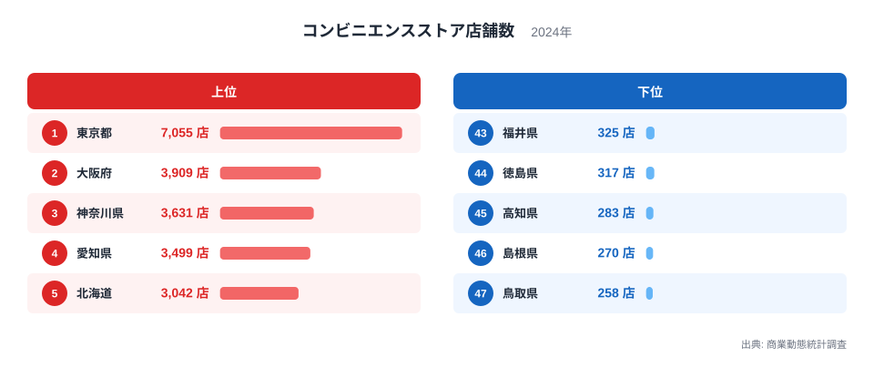
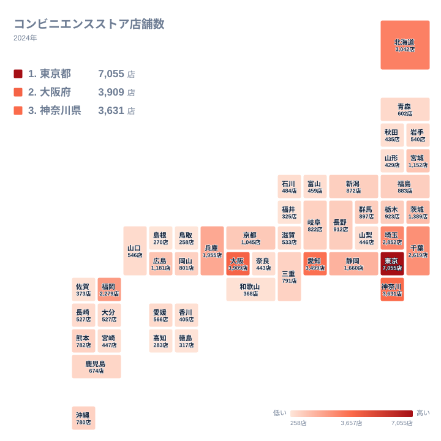

コンビニエンスストアは、駅前にも住宅街にも郊外の幹線道路沿いにもあり、日本中どこでも見かける存在です。ところが都道府県別の店舗数を比べると、その分布は一様ではありません。商業動態統計調査の2024年データによると、店舗数がもっとも多い都道府県ともっとも少ない都道府県の間には、数十倍という開きがあります。

この記事では全47都道府県のコンビニエンスストア店舗数を上位と下位に分けて可視化し、なぜこれほどの差が生まれるのかを人口規模と商圏構造から読み解きます。単純な人口比較だけでは説明しきれない、地方特有の事情も見えてきます。

## コンビニ店舗数の上位と下位

<source-link href="/ranking/convenience-store-count-commercial">コンビニエンスストア店舗数ランキングをもっと見る</source-link>

上位に並ぶのは、いずれも人口が集中する大都市圏です。東京都がもっとも多く7,055店を数え、大阪府、神奈川県、愛知県と続きます。北海道も3,042店を抱えて5位に入りますが、これは道内の人口が札幌市に集中していても、広い面積の各地域に生活拠点があるため、道全体としての店舗数が積み上がる結果だと考えられます。

一方で下位を見ると、鳥取県、島根県、高知県、徳島県、福井県が並びます。これらの県はいずれも人口が少なく、店舗の出店を支えるだけの商圏人口が限られています。コンビニの出店は基本的に一定の商圏人口と交通量を前提に決まるため、人口の絶対数が少ない県では自然と店舗数も少なくなる傾向があります。

上位と下位を見比べると、店舗数の差は単純な人口比だけでは説明しきれません。東京都は人口も突出していますが、通勤・通学で流入する昼間人口や観光客の存在も店舗数を押し上げる要因になっていると考えられます。

埼玉県、千葉県、福岡県、兵庫県、静岡県も上位10位以内に入っており、いずれも大都市圏に隣接するか、県内に人口100万人規模の都市を抱えています。埼玉県と千葉県は東京都のベッドタウンとして人口が集積し、通勤者の生活動線上にコンビニが多く出店される構図になっています。福岡県は九州最大の都市である福岡市を抱え、九州全域からの流入人口も店舗需要を押し上げていると考えられます。

## なぜ都市部にコンビニが集中するのか

コンビニエンスストアの出店戦略は、狭い範囲に複数店舗を集中させるドミナント方式が一般的です。同じチェーンの店舗を近接させることで、物流コストを抑えながら認知度を高める仕組みです。この方式は人口密度が高い都市部でこそ効果を発揮するため、東京都や大阪府、神奈川県のような都市圏では店舗数が急速に積み上がります。

愛知県が4位に入っている点も見逃せません。愛知県は製造業を中心とした産業集積があり、名古屋市を中心に昼間人口が多く、通勤・通学者や工場勤務者の需要が店舗数を支えています。単に人口が多いだけでなく、働く人が多く行き交う地域であることが、コンビニの立地条件と重なっていると読み取れます。

## コンビニ店舗数の地理分布

地図で全国の分布を見ると、店舗数が多い県は太平洋側の主要都市を中心に帯状に連なっていることがわかります。東京都から神奈川県、愛知県、大阪府へと続く地域は、いわゆる太平洋ベルトと呼ばれる産業と人口の集積地帯とほぼ重なります。

反対に店舗数が少ない県は、山陰地方や四国の内陸部に加えて、北陸の福井県にも見られます。鳥取県や島根県は人口減少と高齢化が進む地域として知られており、若年層の流出が続くことで商圏人口そのものが縮小しているという背景もあります。地図から読み取れるのは、コンビニの店舗数が経済活動の密度をそのまま映し出す指標になっているという点です。

九州地方に目を移すと、福岡県が突出して多い一方、九州の他の県は中位から下位に散らばっています。熊本県は中位に位置し、福岡都市圏への近さと熊本市という県内の中核都市を併せ持つことが、店舗数を一定水準に保っている要因だと考えられます。地図全体を俯瞰すると、単一の大都市を持つ県と、複数の中核都市を分散して抱える県とでは、店舗の広がり方そのものが異なることが見えてきます。

## 人口の少なさだけでは説明できない下位県の事情

下位の県を詳しく見ると、単純な人口規模だけでは説明できない要素も浮かび上がります。徳島県や高知県は四国の中でも人口が少ない県ですが、山間部が多く集落が分散しているため、一つの店舗がカバーできる商圏が限られてしまいます。都市部のように徒歩圏内に数千人規模の需要が見込める場所は少なく、車での来店が前提になる立地が多くなります。

このため、下位の県では店舗数そのものは少なくても、住民一人あたりで見た利便性が必ずしも低いとは限りません。店舗数のランキングだけを見て「コンビニが不便な県」と単純に断定するのは早計だと言えます。実際には人口密度や道路網の整備状況もあわせて見る必要があります。

秋田県や山形県も下位グループに近い水準にとどまっており、東北地方全体で人口減少が進んでいることが背景にあると考えられます。一方で宮城県は東北地方の中核都市である仙台市を抱えるため、東北の中では突出して店舗数が多く、地方であっても中核都市の有無が店舗数を大きく左右することがわかります。地方における店舗数の差は、県全体の人口だけでなく、県内に核となる都市を持つかどうかによっても左右されていると言えます。

## まとめ

都道府県別のコンビニエンスストア店舗数は、人口規模と経済活動の密度を色濃く反映しています。東京都、大阪府、神奈川県、愛知県、北海道の上位5県はいずれも人口集積地か産業集積地であり、鳥取県、島根県、高知県、徳島県、福井県の下位5県は人口の少なさと集落の分散が店舗数を抑える要因になっています。ランキングを地図で確認すると、太平洋側の都市圏に店舗が連なる一方、山陰や四国の内陸部で店舗数が伸び悩む構図がはっきりと見えてきます。単純な人口比較だけでなく、昼間人口や産業構造も合わせて見ることで、コンビニ店舗数の地域差をより深く理解できます。

> [!NOTE]
> この統計は商業動態統計調査による店舗数の集計で、フランチャイズ店舗も直営店舗も区別せず合算されています。同じ「1店舗」でも、都市部の小型店と郊外の広い駐車場を備えた店舗では商圏の広さが大きく異なる点に注意してください。

> [!WARNING]
> この統計はコンビニエンスストア全店を合算した数値であり、同一チェーンが近接して出店するドミナント方式による店舗の偏在は反映されていません。観光地では季節によって来店需要が大きく変動しますが、年間を通じた店舗数の集計にはその変動が表れにくい点にも注意してください。

> [!TIP]
> 店舗数を人口で割った人口あたりの店舗数で見ると、都道府県別の順位は入れ替わることがあります。単純な店舗数だけでなく、住民一人あたりの視点でも確認すると、より実態に近い利便性が見えてきます。

コンビニエンスストアの分布をより詳しく知りたい方は、[同じカテゴリの統計一覧](/category/commercial)から他の商業関連の指標も確認できます。上位県の詳細は[東京都のデータ](/areas/13000)や[大阪府のデータ](/areas/27000)からご覧いただけます。

## データ出典

商業動態統計調査（2024年）
