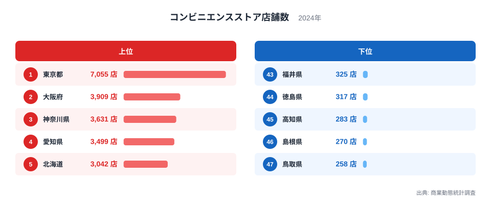
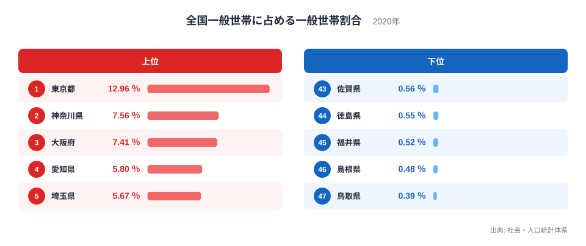
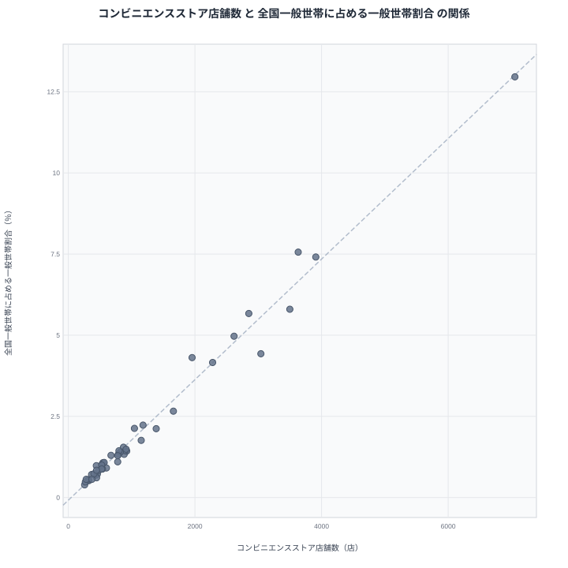

コンビニエンスストアは私たちの生活に欠かせない存在になりました。都道府県別に店舗数を見ると、その分布には大きな差があります。この差は単に人が多いか少ないかだけで説明できるものでしょうか。

この記事では、コンビニエンスストア店舗数と、全国一般世帯に占める一般世帯割合という2つの指標を突き合わせます。全国一般世帯に占める一般世帯割合は、その都道府県にどれだけ多くの世帯が集中しているかを示す指標です。実はこの2つは、どちらも都道府県の人口規模と切り離せない指標であるため、強い相関が見られること自体は驚く結果ではありません。この記事の狙いは相関の強さを確認することではなく、その一致からわずかに外れる県を見つけ、人口規模だけでは説明できない要因がどこに潜んでいるかを考えることにあります。

## コンビニエンスストア店舗数の分布

まずはコンビニエンスストア店舗数そのものを見ていきます。

<source-link href="/ranking/convenience-store-count-commercial">コンビニエンスストア店舗数ランキングをもっと見る</source-link>

商業動態統計調査の2024年のデータによりますと、コンビニエンスストア店舗数の全国トップは東京都で、店舗数は7,055店に達しています。2位は大阪府で3,909店、3位は神奈川県で3,631店、4位は愛知県で3,499店、5位は北海道で3,042店となっており、上位には大都市圏を抱える都道府県が並んでいます。

一方で下位に目を向けますと、鳥取県が258店で最も少なく、島根県が270店、高知県が283店、徳島県が317店、福井県が325店と続きます。上位1位の東京都と下位1位の鳥取県を比べますと、その差は27倍以上に開いています。これは単純な店舗数の差というよりも、都道府県の規模そのものの違いを反映していると考えられます。

上位の県はいずれも人口が多く、消費行動が活発な都市部を抱えています。コンビニエンスストアは日常的な買い物の受け皿として機能するため、人が集まる場所ほど店舗数が積み上がっていく構造にあります。逆に下位の県は人口規模が小さく、店舗の絶対数も自然と少なくなる傾向があります。

順位を細かく見ますと、6位の埼玉県は2,852店、7位の千葉県は2,619店、8位の福岡県は2,279店、9位の兵庫県は1,955店と、いずれも大都市圏または政令指定都市を抱える都道府県が続いています。10位の静岡県は1,660店で、ここから先は千店台へと数字が下がっていき、地方部の県との差が段階的に広がっていく様子が見て取れます。

## 全国一般世帯に占める一般世帯割合の分布

次に、比較対象となる全国一般世帯に占める一般世帯割合を見ていきます。

社会・人口統計体系の2020年のデータによりますと、この割合の全国トップも東京都で、12.96%を占めています。2位は神奈川県で7.56%、3位は大阪府で7.41%、4位は愛知県で5.8%、5位は埼玉県で5.67%となっており、こちらも大都市圏の都道府県が上位を占めています。

下位を見ますと、鳥取県が0.39%で最も低く、島根県が0.48%、福井県が0.52%、徳島県が0.55%、佐賀県が0.56%と続きます。この割合が高いということは、全国の世帯のうちその都道府県に居住する世帯の比率が高いことを意味しており、東京都だけで全国の世帯の1割強を抱えている計算になります。

上位・下位の顔ぶれは、コンビニエンスストア店舗数のランキングとかなり重なっています。東京都が両方とも1位、鳥取県が両方とも最下位という並びは偶然とは考えにくいものです。

さらに順位を見ますと、6位は千葉県の4.97%、7位は北海道の4.43%、8位は兵庫県の4.31%、9位は福岡県の4.16%、10位は静岡県の2.66%と続きます。コンビニエンスストア店舗数のランキングでは北海道が5位、兵庫県が9位だったのに対し、この割合では北海道が7位、兵庫県が8位となっており、細部では順位の入れ替わりも見られます。それでも全体としては同じ都道府県が上位・下位の常連として繰り返し登場する構図に変わりはありません。

## 見かけの相関の裏にある構造

先に触れたとおり、コンビニエンスストア店舗数と全国一般世帯に占める一般世帯割合は、どちらも都道府県の人口規模と切り離せない指標です。そのため、この2つを並べて「強い相関がある」と示すだけでは、当たり前の結果を確認したに過ぎません。以下では散布図で全体像を確認したうえで、この一致が本当に何を意味しているのかを掘り下げます。

散布図を見ますと、コンビニエンスストア店舗数が多い県ほど全国一般世帯に占める一般世帯割合も高い傾向がはっきりと確認できます。東京都は両方の指標で突出した値を示し、右上に大きく離れて位置しています。神奈川県、大阪府、愛知県、埼玉県といった上位県も、店舗数と世帯割合がともに高い位置に集まっています。

しかし、この相関を「コンビニエンスストアが多いから世帯が集まる」あるいは「世帯が多いからコンビニエンスストアが増える」という単純な因果関係として読むのは誤りです。実際にこの2つの指標を動かしている真因は、どちらも都道府県の人口規模そのものだと考えられます。人口が多い都道府県は世帯数も多くなりますし、消費需要も大きくなるため店舗数も増えます。つまり両者は「人口規模」という共通の背景要因によって同じ方向に動いているのであり、直接の因果関係ではありません。言い換えれば、2つの指標の順位がほぼ重なること自体は驚くには当たらない結果であり、この記事で本当に見るべきは重ならなかった部分だと言えます。

## 人口規模だけでは説明できない県

2つのランキングの順位を都道府県ごとに突き合わせますと、人口規模という共通の土台だけでは説明しきれない差が見えてきます。

青森県は店舗数ランキングで26位です。同じ青森県は全国一般世帯に占める一般世帯割合のランキングでは31位にとどまっています。世帯シェアの順位よりも店舗数の順位のほうが上位に来ており、人口規模の割にコンビニエンスストアの店舗網が厚い県だと言えます。山梨県も同様の傾向を示しており、店舗数ランキングでは36位ですが、同じ山梨県は世帯割合のランキングでは41位です。先に見た北海道も、店舗数ランキングでは5位、世帯割合のランキングでは7位と、店舗数の順位のほうが上に来る例のひとつです。地方であっても、生活の拠点としてコンビニエンスストアが積極的に配置されている地域があることがうかがえます。

逆の傾向を示す県もあります。奈良県は店舗数ランキングで37位です。同じ奈良県は全国一般世帯に占める一般世帯割合のランキングでは30位につけています。世帯シェアの順位のほうが店舗数の順位より上に来ており、世帯の集中度に比べると店舗数は控えめだと言えます。新潟県も店舗数ランキングでは19位、同じ新潟県は世帯割合のランキングでは15位と、同じ方向のズレを示しています。こうした県では、近隣の大都市圏への買い物需要の流出や、地域内での店舗展開の戦略といった、人口規模だけでは説明できない要因が働いている可能性があります。

このように、2つの指標がほぼ同じ人口規模を映しているからこそ、両者の順位がわずかにずれる県にこそ独自の分析価値があります。相関の強さそのものよりも、その相関から外れる県に着目することが、この2指標を並べて見る意義だと言えます。

## まとめ

コンビニエンスストア店舗数と全国一般世帯に占める一般世帯割合は、いずれも東京都を筆頭に大都市圏の都道府県で高く、地方の県で低いという似た分布を示しています。この一致は、どちらの指標も都道府県の人口規模という共通の背景要因によって動いているためであり、それ自体は驚くべき発見ではありません。むしろこの記事で見えてきたのは、青森県や山梨県、北海道のように人口規模の割に店舗数の順位が高い県、逆に奈良県や新潟県のように世帯シェアに比べて店舗数の順位が低い県が存在するという点です。都道府県別のデータを比較する際は、見かけの相関の強さだけでなく、その相関から外れる県にこそ目を向けることが大切です。

> [!NOTE]
> コンビニエンスストア店舗数は商業動態統計調査に基づく数値で、フランチャイズ店を含む集計です。全国一般世帯に占める一般世帯割合は社会・人口統計体系のデータで、その都道府県の世帯数が全国の一般世帯総数に占める比率を示しています。単位が「店」と「％」で異なるため、値そのものを直接比較することはできません。

> [!WARNING]
> 全国一般世帯に占める一般世帯割合は、その都道府県の世帯総数が全国の一般世帯総数に占める比率であり、世帯1つあたりに店舗がいくつあるかという店舗密度を示す指標ではありません。この記事で見た順位のズレも、世帯当たりの店舗数を直接表しているわけではない点にご注意ください。また2つの指標は調査年が異なり、コンビニエンスストア店舗数は2024年、全国一般世帯に占める一般世帯割合は2020年のデータです。同一時点の比較ではないため、経年変化の影響を含んでいる可能性もあります。

> [!TIP]
> 2つの指標がほぼ同じ人口規模を映している場合、相関の強さそのものよりも、順位が入れ替わっている県に注目すると新しい発見につながります。同じような分布を示す指標を比べるときは、一致点よりもズレに着目する視点を持つと、都道府県ごとの特徴が見えやすくなります。

## 関連するデータ

- [全国一般世帯に占める一般世帯割合ランキング](/ranking/ratio-of-general-households-to-national)
- [同じカテゴリの統計一覧](/category/commercial)
- [東京都のデータ](/areas/13000)
- [大阪府のデータ](/areas/27000)

## データ出典

- 商業動態統計調査（2024年）
- 社会・人口統計体系（2020年）
