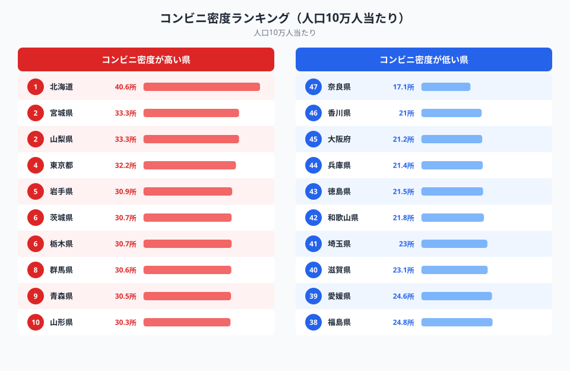
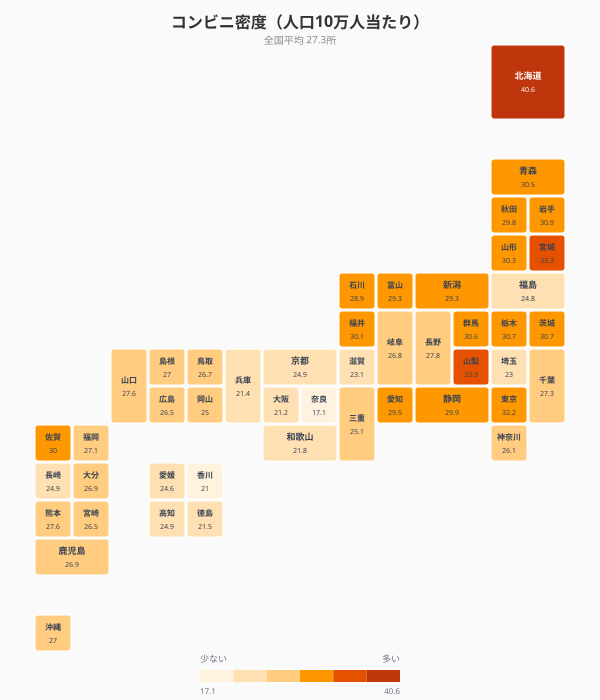
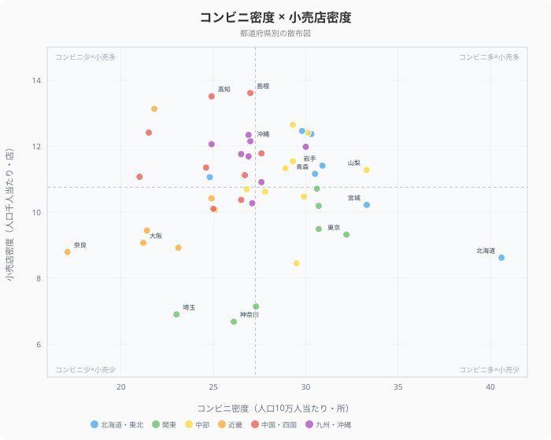

「近くにコンビニがある安心感」──都会では当たり前のこの感覚が、地域によってまったく違います。しかも意外なことに、人口が多い大都市圏ほどコンビニ密度は低いのです。

この記事では、総務省の統計データから**コンビニ密度**（人口10万人当たりの店舗数）を都道府県別に比較し、小売店密度との関係も含めて「コンビニが地域インフラになる県」の特徴を明らかにします。

## コンビニ密度ランキング（人口10万人当たり）

<data-source url="https://www.e-stat.go.jp/dbview?sid=0000010208" label="e-Stat 社会・人口統計体系"></data-source>

**コンビニ密度1位は[北海道](/areas/01000)**（40.6所/10万人）。2位の宮城県・山梨県（33.3所）を大きく引き離し、全国平均（27.4所）の約1.5倍です。3位以下も岩手県（30.9所）、茨城県・栃木県（30.7所）、群馬県（30.6所）と北関東・東北勢が続きます。

一方、**最も少ないのは[奈良県](/areas/29000)**（17.1所）。香川県（21.0所）、大阪府（21.2所）、兵庫県（21.4所）と近畿圏が下位に集中しています。1位の北海道と47位の奈良県では**約2.4倍の差**があります。

> [!NOTE]
> ここでのコンビニ密度は「人口10万人当たりの店舗数」です。面積当たりではなく人口当たりで比較しているため、広大な北海道が1位になるのは「人口に対して店舗が多い」ことを意味します。北海道は面積広大なため人口密度は全国44位と低く、1店舗あたりのカバー面積が大きい一方、人口比での店舗数は突出して多い構造になっています。

北海道が突出する要因を掘り下げると、3つの構造的な背景が見えてきます。第一に**自動車依存の交通体系**で、鉄道やバスの代替交通が少ないため、ドライブスルー型・ロードサイド型コンビニが生活の拠点になっています。第二に**個人商店の撤退**で、地方の人口減少にともない食料品店・ドラッグストアが縮小し、コンビニが日用品全般を扱う「よろず屋」として機能しています。第三に**観光需要の集中**で、道内の観光地にも多数の出店があり、通年の消費者人口を上回る店舗数を支えています。

近畿圏が下位に並ぶのは、私鉄沿線の発達した商店街や駅前のスーパーマーケットがコンビニの役割を代替しているためです。[大阪府](/areas/27000)（21.2所/10万人）や兵庫県（21.4所）は人口密度が高く、絶対的な店舗数は多くても人口当たりでは抑えられます。また駅から徒歩で商業施設へアクセスできる都市構造では、コンビニ以外の選択肢が豊富で、コンビニへの依存度が相対的に低くなります。

> [!TIP]
> コンビニ密度が高い地域ほど「便利」と思いがちですが、密度の高さは他の小売インフラが少ないことの裏返しでもあります。生活利便性を評価するには、コンビニ・スーパー・薬局・個人商店を合わせた「小売インフラ全体の密度」で見ることが大切です。

## 都道府県マップ──コンビニの「地域パターン」

<data-source url="https://www.e-stat.go.jp/dbview?sid=0000010208" label="e-Stat 社会・人口統計体系"></data-source>

マップから3つのパターンが読み取れます。

- **北海道が突出して濃い色**──広い道内で自動車移動が前提の生活圏では、ロードサイドのコンビニが生活インフラとして不可欠
- **東北・北関東ベルトが上位**──岩手・青森・山形・茨城・栃木・群馬が30所前後で密集。車社会の地方都市でコンビニが「よろず屋」の役割を担う
- **近畿圏が薄い色**──奈良・大阪・兵庫・香川が下位に並ぶ。私鉄沿線の商店街やスーパーが代替機能を果たしている

人口密度が高い大阪府（45位）や埼玉県（41位）が下位圏内に入る一方、人口密度が低い岩手県（5位）や青森県（9位）が上位に入る点は注目に値します。

<ad-slot></ad-slot>

## コンビニ密度 × 小売店密度──散布図で見る構造の違い

<data-source url="https://www.e-stat.go.jp/dbview?sid=0000010208" label="e-Stat 社会・人口統計体系"></data-source>

横軸にコンビニ密度、縦軸に小売店密度（人口千人当たり）をとると、各県の商業構造の違いが見えてきます。

- **右下（コンビニ多い×小売少ない）**: 北海道・宮城・茨城・栃木──個人商店が少なくコンビニが代替する「コンビニ依存型」
- **左上（コンビニ少ない×小売多い）**: 島根・高知・和歌山・富山──地元の個人商店が健在で、コンビニの出店余地が限られる「商店街型」
- **左下（コンビニ少ない×小売少ない）**: 奈良・埼玉・神奈川──大都市近郊でスーパーや大型店に集約された「ベッドタウン型」
- **右上（コンビニ多い×小売多い）**: 山梨・山形・福井──多様な小売形態が共存する「地方バランス型」

北海道はコンビニ密度が突出して高い（40.6所）一方、小売店密度は全国43位（8.62店/千人）と低く、コンビニが個人商店に代わる生活拠点として機能していることがわかります。

## まとめ

コンビニ密度の都道府県ランキングと小売店密度との相関から、地域の商業インフラの構造を分析しました。

コンビニ密度の地域差は、単なる出店戦略の違いではなく、その地域の**交通手段・商店街の有無・生活圏の広さ**を反映しています。車社会の地方では「移動の途中に寄れるコンビニ」が不可欠であり、鉄道中心の都市圏では駅前のスーパーや商店街がその役割を担います。

「コンビニが多い＝便利」とは限りません。むしろコンビニ密度が高い地域は、他の小売インフラが弱い裏返しとも言えます。地域の生活利便性を測るには、コンビニ・小売店・大型店を総合的に見る視点が重要です。

<source-link href="/ranking/convenience-store-count-per-100k">コンビニ数の都道府県ランキングを見る</source-link>

<source-link href="/ranking/retail-store-count-per-1000">小売店数の都道府県ランキングを見る</source-link>

<source-link href="/ranking/large-retail-store-count-per-100k">大型小売店数の都道府県ランキングを見る</source-link>

<source-link href="/ranking/department-supermarket-count-per-100k">百貨店・総合スーパー数の都道府県ランキングを見る</source-link>

## データ出典

本記事のデータはe-Stat（政府統計の総合窓口）を基に作成しています。

本記事の対象データ: [関連カテゴリ](/category/commercial)
