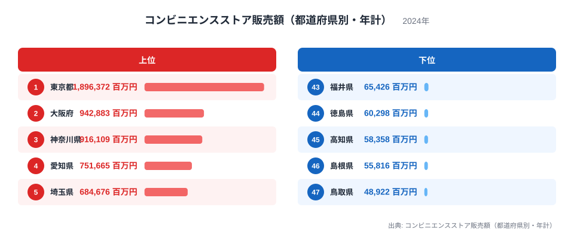
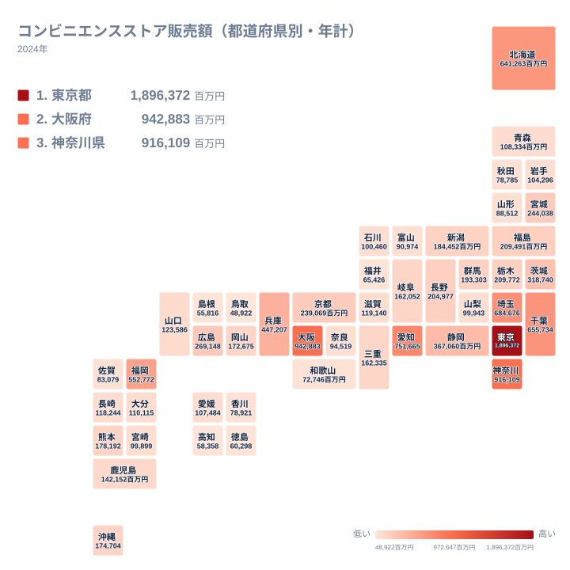

コンビニエンスストア販売額は、その都道府県にあるコンビニ全店の年間の売上を合計した金額です。2024年の全国データを見ると、1位の東京都は1,896,372百万円、47位の鳥取県は48,922百万円となっており、その差は約38.8倍にのぼります。同じ業態の店が全国どこにでもあるにもかかわらず、これほどの開きが生まれる理由は何でしょうか。この記事では、上位と下位の顔ぶれを地理と人口の視点から読み解いていきます。

## コンビニ販売額が多い都道府県

<source-link href="/ranking/convenience-store-sales-monthly">コンビニエンスストア販売額（都道府県別・年計）ランキングをもっと見る</source-link>

上位5県を見ると、東京都が1,896,372百万円で断トツの1位となっています。2位は大阪府で942,883百万円、3位は神奈川県で916,109百万円、4位は愛知県で751,665百万円、5位は埼玉県で684,676百万円と続きます。この顔ぶれには、はっきりとした共通点があります。いずれも日本の三大都市圏を形成する都府県であり、人口が集中している地域だということです。

コンビニの売上はまず店舗数に比例し、店舗数はさらに人口や昼間の来街者数に比例します。東京都は昼間に周辺県からも人が集まる首都であり、オフィス街や駅前に高密度でコンビニが立地しています。大阪府や愛知県も同様に、大都市圏の中心として通勤者や買い物客が集中し、24時間営業の店舗が数多く稼働できる環境が整っています。神奈川県と埼玉県は東京都に隣接するベッドタウンとしての性格を持ちながら、それぞれ横浜市やさいたま市といった政令指定都市を抱えており、独自に大きな消費規模を持っています。つまり上位県は、単に人口が多いだけでなく、通勤・通学・買い物といった人の流れが集中する場所を抱えている点で共通しているのです。

## コンビニ販売額が少ない都道府県

地理分布のタイルマップを見ると、販売額が少ない県は日本列島の中でも特定の地域に偏っていることが分かります。47位は鳥取県で48,922百万円、46位は島根県で55,816百万円、45位は高知県で58,358百万円、44位は徳島県で60,298百万円、43位は福井県で65,426百万円となっており、いずれも中国地方の日本海側、四国、北陸のいずれかに属する県です。

これらの県に共通するのは、人口の絶対数が少ないことに加えて、大きな都市圏の中心から離れているという地理的な条件です。鳥取県と島根県は全国で最も人口の少ない県に数えられ、県内に大規模な商業集積地が育ちにくい構造を抱えています。高知県と徳島県は四国の中でも山地の割合が高く、可住地が海沿いの限られた平野部に集中するため、店舗網を広げる余地そのものが小さくなります。福井県は北陸の中では比較的人口規模があるものの、隣接する石川県や富山県と商圏が分散し、単独の都道府県としての合計額では上位県に及びません。人口減少が進む地域ほど、コンビニという生活インフラの売上規模も小さくならざるを得ないという構造が、この地図から浮かび上がってきます。

## なぜここまで差がつくのか

東京都と鳥取県の差である約38.8倍という数字は、単純な人口差だけでは説明しきれません。ここに効いてくるのが、昼間人口と店舗の稼働率という要素です。東京都には通勤や観光で他県から人が流入するため、住民登録人口以上に消費が生まれます。深夜も含めて客足が絶えないため、1店舗あたりの売上も高くなりやすく、それが県全体の合計額をさらに押し上げます。

一方で鳥取県のような県では、店舗自体は生活に必要な数だけ設置されていても、1店舗が対応する商圏人口が小さく、深夜帯の来客も限られます。店舗網の密度そのものが違うだけでなく、1店舗ごとの売上効率にも差が生まれやすいという点が、都市部と地方の格差をさらに広げていると考えられます。[仮説] ここで示した昼間人口や店舗稼働率の影響は、都市構造から推測される要因であり、今回のデータ単独で検証したものではない点にご留意ください。

## まとめ

- 1位は東京都で1,896,372百万円、47位は鳥取県で48,922百万円と、約38.8倍の差があります。
- 上位5県は東京都、大阪府、神奈川県、愛知県、埼玉県で、いずれも三大都市圏に属しています。
- 下位5県は鳥取県、島根県、高知県、徳島県、福井県で、中国地方の日本海側、四国、北陸に偏っています。
- 販売額の差は人口規模だけでなく、昼間人口の流入や店舗の稼働効率とも関係している可能性があります。
- 詳しい都道府県別の数値は[同じカテゴリの統計一覧](/category/commercial)や、[東京都のデータ](/areas/13000)、[大阪府のデータ](/areas/27000)からご覧いただけます。

> [!NOTE]
> この指標は都道府県内にある全てのコンビニエンスストアの年間販売額を合計した金額であり、1店舗あたりの平均売上ではありません。人口が多い県ほど店舗数自体も多くなるため、県全体の合計額が大きくなりやすい点に注意してください。

> [!WARNING]
> 商業動態統計におけるコンビニエンスストアの分類は、大手チェーンの直営店とフランチャイズ店を含む一定の調査対象基準に基づいています。地域ごとに小規模な独立系店舗の扱いが異なる場合があり、県境をまたぐ商圏の消費が居住地側ではなく店舗の所在地側に計上される点にもご注意ください。

> [!TIP]
> 都道府県別の順位をそのまま比較するだけでなく、その県の人口や昼間人口と合わせて見ると、コンビニの店舗網がどれだけ稠密かをより正確に読み取ることができます。

## データ出典

コンビニエンスストア販売額（都道府県別・年計）、2024年のデータをもとに作成しています。
