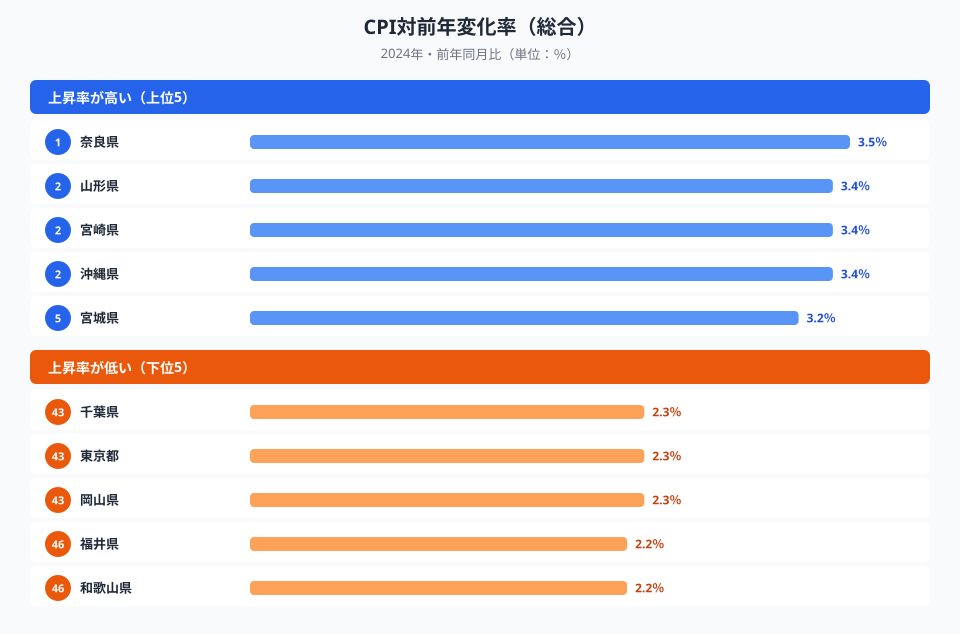
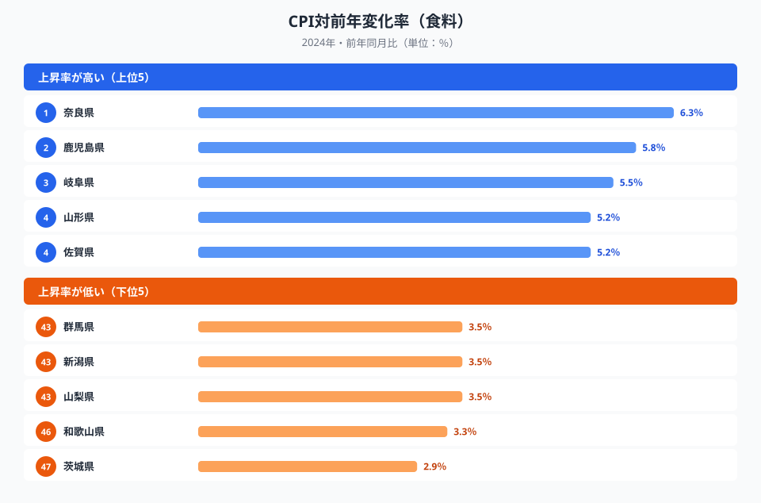
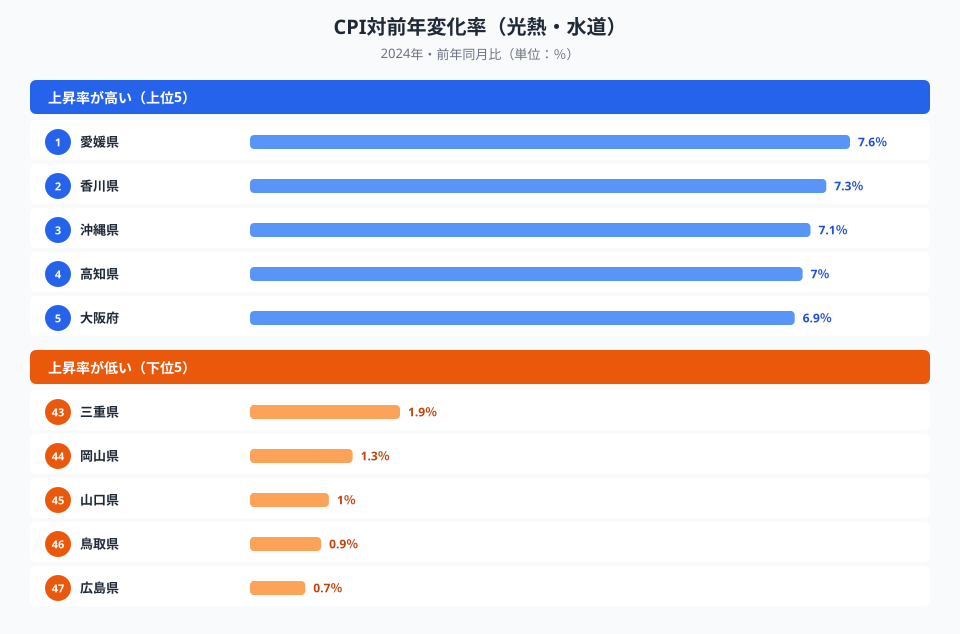

「今年の物価上昇は2.7%」──このひとつの数字が、全国どこでも同じ意味を持つわけではありません。都道府県ごとに「何が上がっているか」が根本的に異なり、家計への影響も、打つべき対策も逆になるケースがあるのです。

奈良県（CPI変化率3.5%・総合トップ）のインフレ主因は食料品の高騰です。一方、愛媛県のインフレ主因は光熱・水道費の急騰にあります。同じ「インフレが厳しい県」でも、食料品を節約すべきか、電力契約を見直すべきかで、対策は正反対になります。2024年の最新データから、インフレの「型」を読み解いていきます。

> [!NOTE]
> 消費者物価指数（CPI）の対前年変化率とは、前年同月比で物価がどれだけ動いたかを示す指標です。総合のほか、食料・光熱水道・住居・教育など費目別にも算出されます。本記事は総務省「消費者物価指数」の2024年値（e-Stat 社会生活統計指標）を用いています。なお同じ「変化率」でも費目によって基準（家賃・授業料など）が異なる点に注意してください。

## まず総合ランキングを見る──地方が上位、首都圏は低い

総合で見ると、最も物価上昇率が高いのは**奈良県の3.5%**でした。全国平均（2.7%）を大きく上回ります。続いて山形・宮崎・沖縄が3.4%で並び、宮城・佐賀が3.2%、岩手・長野・香川・福岡が3.1%と、上位は地方圏でほぼ占められています。

一方、最も上昇率が低いのは**福井県と和歌山県の2.2%**でした。岡山・千葉・東京が2.3%、茨城が2.4%と、大都市圏や関東のCPI変化率は意外なほど低い水準にとどまっています。東京は2.3%で、全国平均すら下回っています。

ここで注目したいのは、総合で見るとトップと最下位の差がわずか1.3ポイントしかない点です。「全国どこでも似たようなインフレ」に見えてしまいます。ところが、この小さな差の内側に「インフレの型」の大きな違いが隠れています。地方が上位を占めるのは、外食比率が低く、食料品を自炊で消費する割合が高いため、食品価格の上昇をダイレクトに受けやすいからだと考えられます。逆に大都市圏は、価格変動の小さいサービスや家賃のウエイトが相対的に大きく、総合では穏やかに見えるのです。つまり総合の数字だけを見ていると、「県ごとに何が起きているか」を完全に見落としてしまいます。

<source-link href="/ranking/cpi-change-rate-total">CPI対前年変化率（総合）の47都道府県ランキングをもっと見る</source-link>

<ad-slot></ad-slot>

## 食料で見ると地方が突出する──「自炊県」ほど効く

総合では1.3ポイントの差だった格差が、食料に絞ると一気に広がります。食料のCPI変化率は**奈良県の6.3%が最高**で、鹿児島5.8%、岐阜5.5%、山形・佐賀・熊本5.2%と続きます。総合トップの奈良は、食料でもトップでした。つまり奈良のインフレは「食料が引っ張る型」だとはっきり分かります。

下位を見ると、**茨城県の2.9%が最も低く**、和歌山3.3%、群馬・新潟・山梨3.5%が並びます。最高と最低の差は3.4ポイントで、総合の2倍以上に開きます。

上位に地方の県が集中するのは、外食より自炊の比率が高い地域ほど、生鮮食品や加工食品の値上がりを家計が直に受け止めるためだと考えられます。逆に首都圏の県が下位に並ぶのは、外食・中食の比重が大きく、食材価格の上昇が一段クッションを置いて反映されるからでしょう。同じ「物価高」でも、奈良のような自炊県では食卓の負担として、首都圏では外食価格としてじわじわ効いてくる──効きどころが県によって違うのです。

<source-link href="/ranking/cpi-change-rate-food">CPI対前年変化率（食料）の47都道府県ランキングをもっと見る</source-link>

## 光熱・水道で見ると四国・北陸が突出する──隣県でも大差がつく

費目を光熱・水道に切り替えると、地図が一変します。最高は**愛媛県の7.6%**で、香川7.3%、沖縄7.1%、高知7.0%、大阪・徳島6.9%と、四国勢が上位を席巻します。北陸も福井6.6%、富山6.5%、石川6.4%と高水準です。総合では穏やかだった愛媛が、光熱・水道に絞ると一気にトップに立つ点が、この記事のいちばんの発見です。

ところが下位を見ると、**広島県の0.7%が最低**で、鳥取0.9%、山口1.0%、岡山1.3%、三重1.9%と、これも中国地方を中心に並びます。最高の愛媛と最低の広島の差は6.9ポイントにも達し、食料の格差をさらに上回ります。同じ中国・四国エリアでも、愛媛と広島のように隣り合う地域で大きく差がつくのが光熱・水道の特徴です。

ここまで差が開く主因は、電力・ガス会社の料金改定タイミングが地域ごとに異なることにあると考えられます。エネルギー価格は世界市場で動いても、各家庭の請求額に反映される時期は供給会社の規制料金改定に左右されます。改定が2024年に重なった地域は変化率が跳ね上がり、前年に済ませた地域は落ち着く──この「タイミングのズレ」が、隣県でも大差がつく構造を生んでいます。電気代主導でインフレを感じている愛媛・香川の家計にとっては、食料品の節約より電力プランの見直しのほうが効く、ということになります。

<source-link href="/ranking/cpi-change-rate-utilities">CPI対前年変化率（光熱・水道）の47都道府県ランキングをもっと見る</source-link>

> [!TIP]
> 「何が上がっているか」は県によってまるで違います。食料主導の奈良・鹿児島か、エネルギー主導の愛媛・香川か。インフレ対策を考えるときは、総合指数ではなく費目別の変化率を確認するのが近道です。食料主導なら買い方・自炊の工夫、エネルギー主導なら電力・ガスのプラン見直しと、打ち手そのものが変わります。

<ad-slot></ad-slot>

## 住居と教育──「下がっている」費目もある

費目によっては、むしろ前年より下がっているケースもあります。住居の変化率は宮崎県の2.8%が最高で、山梨2.0%、岩手・奈良・鳥取が1.8%と続きます。一方で大都市圏は東京0.7%、大阪0.8%と意外に低い水準です。これは、CPIの住居が家賃を中心に算出され、持ち家の資産価値（地価・住宅価格の高騰）を含まないためです。タワーマンションの価格が上がっても、CPIの住居項目には直接は乗りません。福井県は-1.0%とマイナスで、栃木・新潟（-0.3%）、石川（-0.2%）なども下落しています。

教育に至っては、東京都が-6.4%という異例の急落を記録しました。教育費が前年から大きく下がった形で、高校授業料の実質無償化など政策的な要因が影響していると考えられます。上位は宮城2.8%、静岡2.3%、福島1.9%。一方で山口（-0.2%）、和歌山（-0.3%）、徳島（-0.8%）もマイナスでした。教育の変化率は最高の宮城2.8%から最低の東京-6.4%まで、実に9.2ポイントもの差があります。これは政策の地域差・タイミングが、物価統計の費目別変化率に直接表れた例だといえます。

> [!WARNING]
> 変化率の高さ＝家計の打撃の大きさ、とは限りません。実際の負担増は「変化率×消費支出額」で決まります。たとえば変化率の高い奈良（3.5%・消費支出318万円）の月負担増は約11,100円。一方、変化率の低い埼玉（2.5%・消費支出357.9万円）でも月約8,900円の負担増になります。大都市圏は「変化率は低いが支出が大きい」、地方は「変化率は高いが支出が小さい」という構造で、金額ベースでは意外に均衡します。ただし所得水準を加味すると、地方のほうが実質的な負担は重くなりやすい点に注意してください。なお消費支出は[消費支出ランキング](/ranking/consumption-expenditure-multi-person-households-per-month)、費目割合は[光熱・水道費割合ランキング](/ranking/utilities-expenditure-ratio-multi-person-households)で確認できます。

## まとめ──「型」を知れば対策が変わる

「全国の消費者物価指数が前年比2.7%上昇」──このひとつの数字の裏には、都道府県ごとにまったく異なるインフレの構造が隠れています。本記事で見えてきたことを整理します。

- 総合で見るとトップ奈良（3.5%）と最下位の福井・和歌山（2.2%）の差はわずか1.3ポイントで、「全国どこでも似たインフレ」に見えます。
- ところが費目別に分解すると、食料で3.4ポイント、光熱・水道で6.9ポイント、教育で9.2ポイントと、格差は数倍に広がります。
- 食料は奈良・鹿児島など地方が突出し、光熱・水道は愛媛・香川など四国・北陸が突出します。上がっている費目が県ごとに違うのです。
- 食料主導の地域は買い方や自炊の工夫が、エネルギー主導の地域は電力・ガスのプラン見直しが効きます。総合指数だけでは、この違いは見えません。

物価のニュースで「2.7%」という全国値を聞いたら、まずは自分の県で「何が上がっているのか」を費目別に確かめてみてください。インフレの「型」を知ることが、家計を守る最初の一歩になります。あわせて[物価が最も高い県・安い県](/blog/price-index-high-low-prefecture)や[所得の都道府県格差](/blog/per-capita-income-gap)も読むと、地域ごとの暮らしのコスト構造がより立体的に見えてきます。

## データ出典

- 総務省「消費者物価指数」（2024年・対前年変化率）
- [e-Stat 社会生活統計指標（家計）](https://www.e-stat.go.jp/dbview?sid=0000010212)
