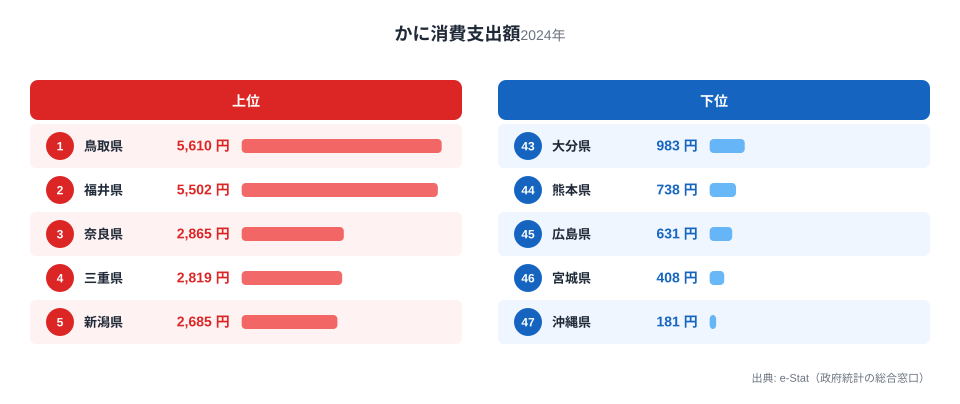
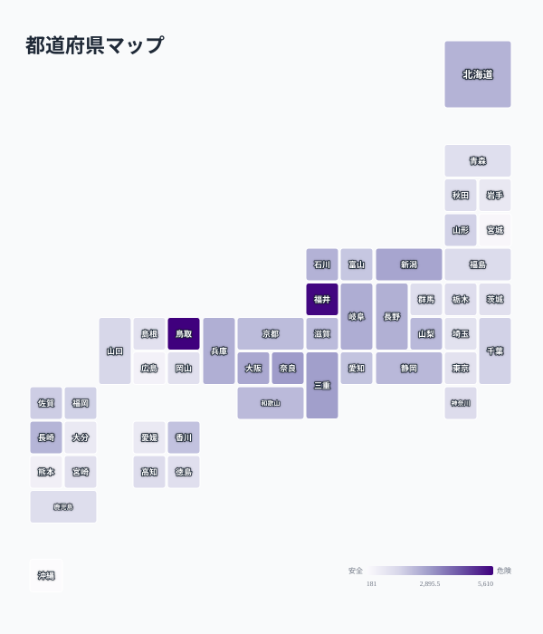

「かに」と聞いて多くの人が思い浮かべるのは、冬の日本海で水揚げされる松葉ガニやズワイガニではないでしょうか。総務省の家計調査によると、都道府県庁所在地別の1世帯あたりかに消費支出額は最大で31.0倍もの差があります。

全国1位は鳥取県の5,610円で、最下位の沖縄県181円を大きく引き離しています。ここまでは「日本海側の産地が強い」という予想通りの結果です。ところが2位は福井県5,502円と鳥取に肉薄する一方、3位には内陸県の奈良県2,865円が入り込みます。海に面していない奈良がなぜ全国有数のかに消費地になっているのか、この記事ではその理由を産地・流通・食文化の3つの視点から探ります。

> [!NOTE]
> この統計は家計調査（総務省統計局）の「かに」支出額（生鮮・加工品を含む）です。都道府県庁所在市及び政令指定都市の2人以上の世帯を対象とした調査であり、県全体の消費実態そのものではなく、県庁所在地の家計動向を表す点に注意してください。

## 上位と下位の顔ぶれ

<source-link href="/ranking/crab-consumption-expenditure">かに消費支出額ランキングをもっと見る</source-link>

上位を見ると、[鳥取県](/areas/31000)5,610円、[福井県](/areas/18000)5,502円と、松葉ガニ（ズワイガニ）の名産地が1位・2位を占めています。鳥取県境港市は日本有数の水揚げ量を誇る漁港で、冬になると松葉ガニ漁が解禁され、地元での消費量も跳ね上がります。福井県も同様にブランドガニ「越前ガニ」の産地であり、地元の食卓に日常的にかにが並ぶ土地柄です。魚介類全般の消費傾向は[かつお・かき消費量の地域差を扱った記事](/blog/bonito-vs-oyster-fish-map)でも詳しく取り上げています。

一方、下位を見ると宮城県408円、沖縄県181円が最下位に沈んでいます。沖縄はそもそも寒海性のズワイガニの産地から遠く、気候的にも「かにを食べる冬の味覚」という文化的な結びつきが弱いと考えられます。宮城県は三陸沿岸の水産県ではあるものの、主力の水産物はかつお・さんま・かきなど別の魚介類であり、かにの消費文化は根付いていないようです。

## なぜ内陸の奈良が3位に入るのか

上位10位の顔ぶれをよく見ると、3位[奈良県](/areas/29000)2,865円、4位三重県2,819円、9位長野県2,467円と、海に面していない、あるいは日本海に面していない県が複数入っています。これは「産地=消費地」という単純な図式では説明できません。

[仮説] 一つの理由として考えられるのが、正月や年末年始の贈答文化です。かには「ハレの日の食材」として、正月料理や年始の来客用に購入される割合が高い水産物です。奈良県は関西圏の中でも比較的所得水準が高い世帯が多く、京都・大阪の中央卸売市場を経由した高級食材の流通網にアクセスしやすい立地にあります。内陸県であっても、贈答用・お祝い用としてかにを購入する需要が県庁所在地（奈良市）に集中している可能性があります。検証には家計調査の購入頻度データ（月別支出額の内訳）を確認する必要があり、今後の課題とします。

> [!TIP]
> かにのように「産地と消費地が一致しない」品目は珍しくありません。牛肉や果物などの高級食材も、生産地よりも大都市圏や富裕層の多い地域で消費支出額が高くなる傾向があります。産地バイアスだけで順位を予測すると外れることが多い点は覚えておくとよいでしょう。

## 太平洋側・都市部との落差

<source-link href="/ranking/crab-consumption-expenditure">かに消費支出額の全47都道府県を見る</source-link>

地図にすると、かに消費支出額が日本海側に濃く集まる構図がはっきり見えます。鳥取・福井を筆頭に、石川・富山・島根といった日本海に面した産地県が色濃く並び、そこに内陸の奈良・三重・長野が飛び地のように加わります。一方で太平洋側の都市圏（東京・神奈川・愛知）は色が薄く、九州南部・沖縄はほとんど白に近い状態です。産地の近さと贈答文化という2つの要因が重なった、独特の分布と言えます。

かに消費支出額のランキングで際立つのは、日本海側（鳥取・福井・石川・富山）が軒並み上位に入る一方、太平洋側の都市圏（東京40位1,225円、神奈川27位1,427円、愛知19位2,049円）は中位から下位に沈んでいる点です。これは都市部の世帯が魚介類全般を専門店やスーパーで購入する機会は多いものの、かに特有の「冬の贈答品・郷土料理」という文化的な結びつきが薄いことを示しています。

[北海道](/areas/01000)は11位2,402円と、かにの一大産地でありながら上位10位には入りませんでした。北海道は毛ガニやタラバガニなど多様なかに種があり、地元消費だけでなく道外への出荷・贈答用途が多いため、県庁所在地（札幌市）の家計調査ベースの支出額としては突出しない可能性があります。食に関する他の統計は[家計消費のカテゴリ一覧](/category/economy)でも横断的に確認できます。

> [!WARNING]
> 家計調査は都道府県庁所在市及び政令指定都市の世帯を対象とするため、産地であっても県庁所在地から離れた漁村部の消費実態は反映されません。北海道のように広域で漁業拠点が分散する地域は、県庁所在地の数値だけで「かに文化の強さ」を測ると実態とズレる場合があります。

## この記事でわかったこと

- 全国1位は鳥取県5,610円、最下位は沖縄県181円で、31.0倍の格差がある
- 2位福井県5,502円は鳥取に肉薄しており、いずれも松葉ガニ・越前ガニの名産地
- 3位奈良県2,865円は内陸県ながら上位に入り、贈答文化や流通網の影響が示唆される
- 日本海側の産地県が上位を占める一方、太平洋側の都市圏（東京・神奈川・愛知）は中位から下位に位置する
- 北海道は主要産地でありながら11位にとどまり、道外出荷・贈答用途が多いことが背景と考えられる

## データ出典

総務省統計局「家計調査（家計収支編）」都道府県庁所在市及び政令指定都市別データ（2024年）を基に集計しています。e-Stat（政府統計の総合窓口）経由で取得したデータを stats47.jp が独自に整備しました。
