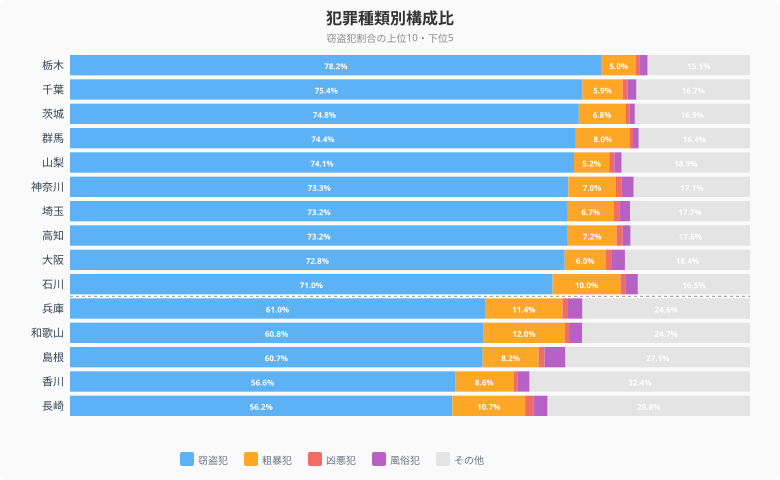
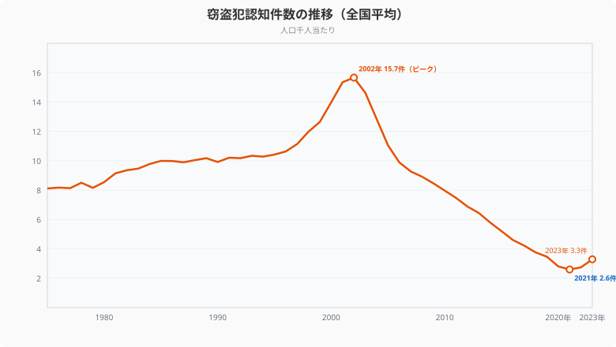

「住む場所を選ぶとき、治安は気になる」──そんな人は多いはずです。しかし都道府県の治安を客観的に比べるデータは、意外と見つけにくいもの。

この記事では、警察庁の犯罪統計を使い、**窃盗犯認知件数**（人口千人当たり）を軸に都道府県の治安を比較します。さらに検挙率や犯罪の種類別構成比も加え、「犯罪が少ない県」と「犯罪を捕まえる力が強い県」の違いを明らかにします。

## 窃盗犯認知件数ランキング（人口千人当たり）

<data-source url="https://www.e-stat.go.jp/dbview?sid=0000010211" label="e-Stat 社会・人口統計体系"></data-source>

**窃盗犯認知件数が最も多いのは大阪府**（6.65件/千人）。大阪に続いて茨城県（5.24件）・群馬県（5.21件）・埼玉県（4.96件）・栃木県（4.92件）・千葉県（4.52件）の順で続きます。大阪は全国平均の約2倍に達しています。

一方、**最も少ないのは[長崎県](/areas/42000)** で1.68件。岩手県、秋田県と東北・九州の県が下位に並びます。1位の大阪府と47位の長崎県では **約4倍の差** があります。

> [!NOTE]
> 窃盗犯は刑法犯全体の約6-7割を占める最大の犯罪類型です。窃盗犯の多寡は、その地域の治安を最もよく反映する指標のひとつです。

## 都道府県マップ──犯罪の「地域パターン」

> [!NOTE]
> 「窃盗犯認知件数」は届け出があった件数をもとにしており、未届けの被害は含まれません。都市部ほど被害届を出す傾向があるため、認知件数だけで治安を単純比較するのは難しい面があります。検挙率も合わせて見ることで、より実態に近い治安の姿が浮かび上がります。

<data-source url="https://www.e-stat.go.jp/dbview?sid=0000010211" label="e-Stat 社会・人口統計体系"></data-source>

マップから2つのパターンが読み取れます。

- **大都市圏＋北関東ベルト**が濃い色──大阪・兵庫・愛知に加え、茨城・群馬・栃木の北関東3県が目立つ
- **東北・北陸・九州**が薄い色──長崎・岩手・秋田・富山・山形が全国でも低水準

北関東が上位に入る背景には、幹線道路沿いの車上荒らしや住宅侵入窃盗が多い点が指摘されています。

<ad-slot></ad-slot>

## 検挙率ランキング──「捕まえる力」の地域差

<data-source url="https://www.e-stat.go.jp/dbview?sid=0000010211" label="e-Stat 社会・人口統計体系"></data-source>

犯罪が起きたとき、どれだけ犯人を捕まえられるか。**検挙率が最も高いのは[島根県](/areas/32000)** で72.7%。秋田県、鳥取県と人口の少ない県が上位を占めます。

逆に **最も低いのは大阪府** で26.7%。[栃木県](/areas/09000)、茨城県と、窃盗犯認知件数が多い県は検挙率も低い傾向があります。

## 検挙率×窃盗犯認知件数──4象限で見る都道府県の治安

<data-source url="https://www.e-stat.go.jp/dbview?sid=0000010211" label="e-Stat 社会・人口統計体系"></data-source>

横軸に窃盗犯認知件数、縦軸に検挙率をとり、全国平均で4象限に分けると、各県の治安の「タイプ」が見えてきます。

- **右下**（犯罪多い×検挙率低い）: 大阪・茨城・栃木・群馬──最も警戒が必要なゾーン
- **左上**（犯罪少ない×検挙率高い）: 島根・秋田・鳥取・岩手──治安の優等生
- **右上**（犯罪多い×検挙率高い）: 該当県はほぼなし──犯罪が多い県ほど検挙が追いつかない構造
- **左下**（犯罪少ない×検挙率低い）: 一部の県──犯罪が少ないため検挙実績も限定的

この散布図は「犯罪の多さ」と「捕まえる力」が**逆相関**にあることを示しています。犯罪が集中する都市部では、件数が多すぎて警察のリソースが追いつかないという構造的な課題があります。

<ad-slot></ad-slot>

## 犯罪の「中身」が違う──種類別構成比

<data-source url="https://www.e-stat.go.jp/dbview?sid=0000010211" label="e-Stat 社会・人口統計体系"></data-source>

刑法犯認知件数の内訳は、都道府県によって大きく異なります。

- **窃盗犯の割合が高い県**: 栃木県（78.2%）、千葉県（75.4%）、茨城県（74.8%）──車上荒らしや侵入窃盗が多い地域
- **粗暴犯の割合が高い県**: 山形県（16.3%）、北海道（15.6%）──暴行・傷害の割合が高い
- **凶悪犯の割合が高い県**: 岩手県（1.68%）、宮崎県（1.33%）──件数自体は少ないが割合は高い

犯罪件数だけでなく「どんな犯罪が多いか」も、地域の治安を考える上で重要な視点です。

## 約50年の推移──犯罪は減っている？

<data-source url="https://www.e-stat.go.jp/dbview?sid=0000010211" label="e-Stat 社会・人口統計体系"></data-source>

全国平均の窃盗犯認知件数は、**2002年の15.67件/千人をピークに急減**し、2021年には2.59件と約6分の1にまで減少しました。しかし**2022年から反転上昇**し、2023年は3.29件。コロナ禍の行動制限解除後、外出機会の増加とともに窃盗犯が増加に転じています。

検挙率も同様のパターンを描いています。犯罪件数が急増した2000年前後に検挙率は30%を割り込みましたが、件数減少とともに回復し、2020年には54.7%まで上昇。しかし2022年以降は再び低下傾向にあります。

<ad-slot></ad-slot>

## まとめ

窃盗犯認知件数・検挙率・犯罪種類別構成比の3つの視点から、都道府県の治安を分析しました。

治安が良い県の共通点は、**人口が少なく、地域コミュニティのつながりが強い**こと。逆に犯罪が多い県は大都市圏か幹線道路沿いの県で、匿名性の高さと人口密度が犯罪を誘発しています。

2002年のピークから20年間続いた犯罪減少トレンドが2022年に底を打ち、ふたたび増加に転じた点は注目に値します。コロナ後の社会変化が治安にどう影響するか、今後のデータに注目です。

<source-link href="/ranking/criminal-recognition-count-of-theft-crime-rate">窃盗犯認知件数の47都道府県ランキングを見る</source-link>

<source-link href="/ranking/criminal-arrest-rate">刑法犯検挙率の47都道府県ランキングを見る</source-link>

## データ出典

本記事のデータはe-Stat（政府統計の総合窓口）を基に作成しています。
