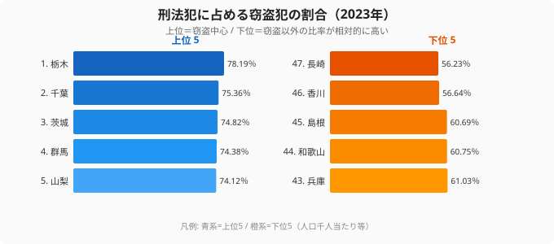

「住む場所を選ぶとき、治安は気になる」──そう考える人は多いはずです。しかし都道府県の治安を客観的に比べるデータは、意外と見つけにくいものです。

この記事では、警察庁の犯罪統計（2023年）を使い、**窃盗犯認知件数**（人口千人当たり）を軸に都道府県の治安を比較します。さらに踏み込んで見えてくるのは、「犯罪が多い県ほど犯人を捕まえられていない」という逆相関の構造です。犯罪の少なさと検挙の強さは、必ずしも同じ県で両立していません。その理由まで、3つのデータから読み解いていきます。

## 窃盗が多いのはどこか──認知件数ランキング

<source-link href="/ranking/theft-offenses-recognized-per-1000">窃盗犯認知件数（人口千人当たり）の47都道府県ランキングをもっと見る</source-link>

**窃盗犯認知件数が最も多いのは大阪府**で、人口千人当たり6.65件です。大阪に続くのは茨城県（5.24件）・群馬県（5.21件）・埼玉県（4.96件）・栃木県（4.92件）で、上位5県のうち茨城・群馬・栃木・埼玉と4県が関東に集中しています。茨城・群馬・栃木の北関東3県がそろって上位に並ぶのが特徴で、これに大阪と埼玉、さらに6位の千葉県（4.52件）を加えると、犯罪が多い県は「大都市圏」と「北関東ベルト」のふたつに大きく分かれます。

一方、**最も少ないのは[長崎県](/areas/42000)**で1.68件です。岩手県（1.69件）・秋田県（1.75件）・大分県（1.76件）・島根県（1.83件）と、東北・九州・山陰の県が下位に並びます。最多の大阪府と最少の長崎県では**約4倍の差**があり、同じ日本でも住む県によって窃盗被害に遭うリスクの目安は大きく変わります。北関東が上位に入る背景には、幹線道路沿いの車上荒らしや住宅侵入窃盗が多い点が指摘されています。匿名性が高く人の出入りが多い地域ほど、窃盗が起きやすい傾向があるのです。

> [!NOTE]
> 窃盗犯認知件数は、警察が「届け出を受けて把握した」窃盗の件数です。実際に被害を受けても届け出ない人がいれば件数には含まれません。都市部ほど被害届を出しやすいという指摘もあり、認知件数だけで治安を単純比較するのは難しい面があります。だからこそ、次に見る「検挙率」と合わせて読むことが重要になります。

## 捕まえる力はどこが強いか──検挙率ランキング

<source-link href="/ranking/criminal-arrest-rate">刑法犯検挙率の47都道府県ランキングをもっと見る</source-link>

犯罪が起きたとき、どれだけ犯人を捕まえられるか。それを示すのが検挙率です。**検挙率が最も高いのは[島根県](/areas/32000)**で72.7%。秋田県（67.9%）・鳥取県（67.6%）・山形県（65.0%）・奈良県（60.5%）と、人口の少ない県が上位を占めます。事件の総数が少ない県では、1件1件に警察のリソースを十分に振り向けられるため、検挙率が高くなりやすいと考えられます。

逆に、**検挙率が最も低いのは大阪府**で26.7%にとどまります。栃木県（29.0%）・茨城県（30.1%）・千葉県（31.5%）・埼玉県（31.8%）と、検挙率の下位に並ぶのは、いずれも先ほどの窃盗犯認知件数で上位だった県ばかりです。大阪・茨城・栃木・埼玉・千葉は、犯罪が多い側にも、捕まえる力が弱い側にも、両方に顔を出しています。ここに、この記事の核心である「逆相関」が浮かび上がります。

> [!WARNING]
> 検挙率が低いことは「警察の能力が低い」ことを直接には意味しません。窃盗は強盗や殺人に比べて検挙が難しく、窃盗の割合が高い県ほど全体の検挙率は構造的に下がります。次の章で見るとおり、検挙率下位の県は窃盗が刑法犯に占める割合も高いため、検挙率の数字は「犯罪の中身」とセットで読む必要があります。

## なぜ犯罪が多い県ほど捕まらないのか

ふたつのランキングを重ねると、明確なパターンが見えてきます。**窃盗犯認知件数が多い県ほど、検挙率が低い**のです。

- **犯罪が多く・検挙率も低いゾーン**: 大阪府（窃盗1位・検挙率47位）、栃木県（窃盗5位・検挙率46位）、茨城県（窃盗2位・検挙率45位）、千葉県（窃盗6位・検挙率44位）、埼玉県（窃盗4位・検挙率43位）。最も警戒が必要な県が、ここにそろって集まっています。
- **犯罪が少なく・検挙率も高いゾーン**: 島根県（窃盗43位・検挙率1位）、秋田県（窃盗45位・検挙率2位）、山形県（窃盗42位・検挙率4位）。治安の優等生といえる県です。

犯罪が集中する都市部や北関東では、件数が多すぎて警察のリソースが追いつかず、1件当たりに割ける捜査の手が薄くなります。さらに、件数の多い窃盗ほど検挙が難しいため、犯罪が多い県は二重の意味で検挙率が下がりやすい構造を抱えています。一方、事件数の少ない県は1件1件に丁寧に対応でき、地域コミュニティのつながりが強いことも目撃情報の集まりやすさにつながります。「犯罪が少ない」と「捕まえる力が強い」が同じ県で重なるのは、偶然ではなく構造的な理由があるのです。

> [!TIP]
> 引っ越し先の治安を測るなら、認知件数だけでなく検挙率も合わせて見るのがコツです。認知件数が多くても検挙率が高ければ「犯罪は起きるが解決されやすい」県、認知件数が多く検挙率も低ければ「犯罪が起きて泣き寝入りになりやすい」県と読み替えられます。この記事の上位5県の多くは後者に当たります。

## 犯罪の「中身」が違う──窃盗が占める割合

<source-link href="/ranking/criminal-recognition-count-of-theft-crime-rate">刑法犯に占める窃盗犯の割合の47都道府県ランキングをもっと見る</source-link>

検挙率の差を生む一因が、犯罪の「中身」の違いです。刑法犯のうち窃盗犯が占める割合を見ると、県によってかなり差があります。**窃盗の割合が最も高いのは[栃木県](/areas/09000)**で78.19%。千葉県（75.36%）・茨城県（74.82%）・群馬県（74.38%）・山梨県（74.12%）と、北関東を中心に「犯罪のほとんどが窃盗」という県が並びます。これらは先ほど検挙率が低かった県とほぼ重なります。窃盗中心の県ほど検挙率が下がるという、検挙率ランキングの背景がここで裏づけられます。

逆に**窃盗の割合が最も低いのは長崎県**で56.23%。香川県（56.64%）・島根県（60.69%）・和歌山県（60.75%）・兵庫県（61.03%）と続きます。これらの県では窃盗以外の犯罪が相対的に多いことになりますが、そもそもの認知件数自体が少ない県も含まれるため、割合の低さがただちに「危険」を意味するわけではありません。割合（中身）と件数（量）は別の軸として読み分ける必要があります。窃盗の割合が高い栃木と低い長崎では、犯罪の起こり方そのものが異なっているのです。

## まとめ

窃盗犯認知件数・検挙率・窃盗構成比の3つの2023年データから、都道府県の治安を分析しました。要点は次のとおりです。

- 窃盗犯認知件数が最も多いのは大阪府（6.65件/千人）、最も少ないのは長崎県（1.68件）で、その差は約4倍です。
- 検挙率が最も高いのは島根県（72.7%）、最も低いのは大阪府（26.7%）です。
- 窃盗が多い県ほど検挙率が低いという逆相関があり、大阪・栃木・茨城・千葉・埼玉が「犯罪が多く・捕まりにくい」側に集中します。
- 治安の優等生は島根・秋田・山形で、「犯罪が少なく・検挙率も高い」を両立しています。
- 検挙率の差の一因は、犯罪に占める窃盗の割合の違いにあります。栃木は78.19%が窃盗である一方、長崎は56.23%にとどまります。

治安が良い県の共通点は、人口が少なく、地域コミュニティのつながりが強いことです。逆に犯罪が多い県は大都市圏か幹線道路沿いの県で、匿名性の高さと人口密度が窃盗を誘発し、件数の多さが検挙の手を薄くしています。引っ越しや暮らしの安全を考えるなら、認知件数と検挙率の両方を見ることをおすすめします。さらに地域の暮らしを多面的に比べたい方は、[安全・環境カテゴリのランキング一覧](/category/safetyenvironment)も合わせてご覧ください。

## データ出典

本記事のデータはe-Stat（政府統計の総合窓口）を基に作成しています。

- 警察庁「犯罪統計」（社会・人口統計体系、2023年）
- e-Stat 政府統計の総合窓口
