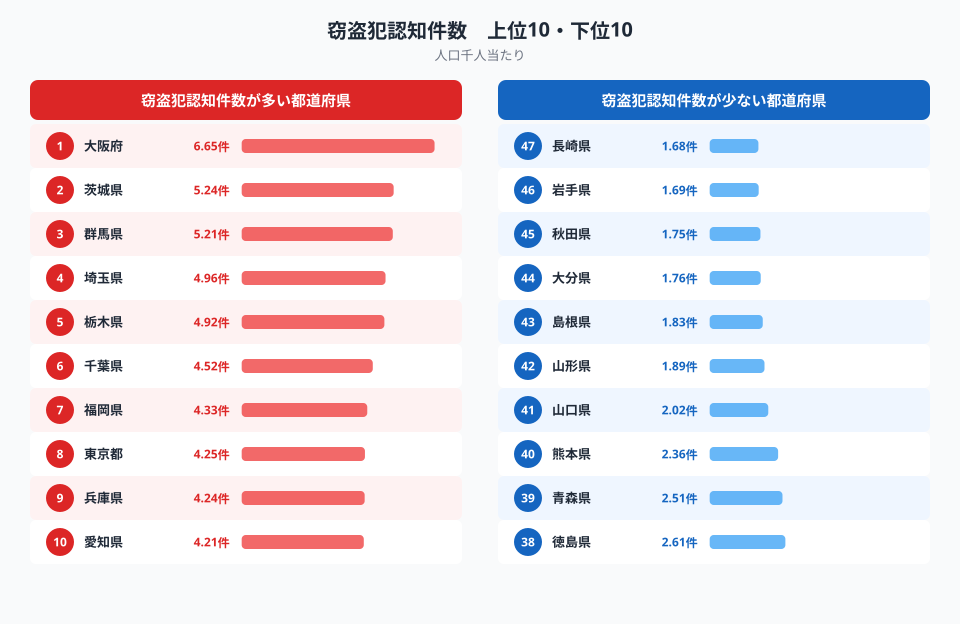
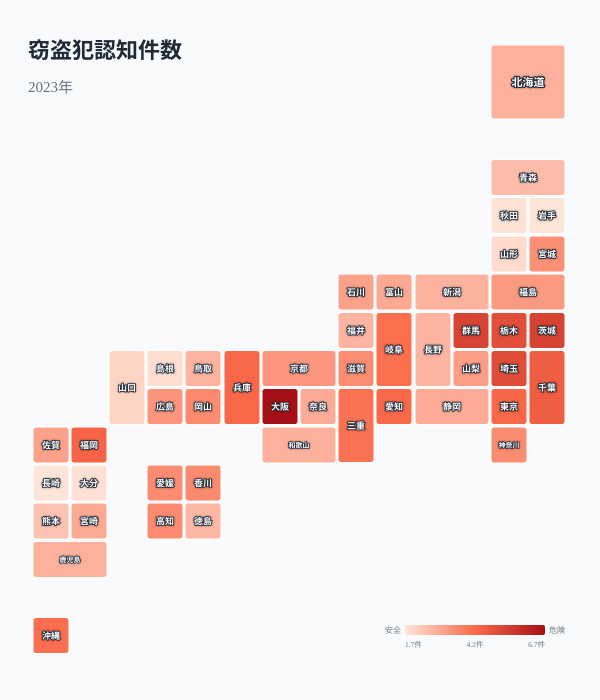
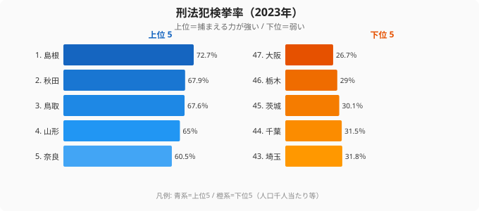
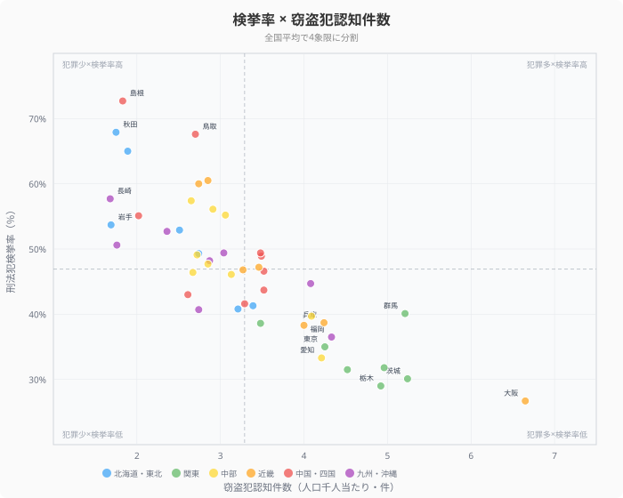
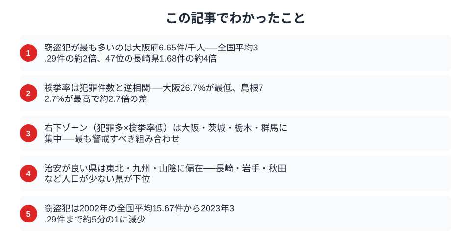

「住む場所を選ぶとき、治安は気になる」──そんな人は多いはずです。しかし都道府県の治安を客観的に比べるデータは、意外と見つけにくいものです。

この記事の核心を先に言ってしまうと、**「犯罪が多い県ほど、犯人を捕まえる力（検挙率）が低い」という逆相関**が、47都道府県のデータからはっきり見えてきます。窃盗犯が最も多い大阪府は、検挙率では47位の最下位。逆に窃盗犯が少ない島根県は検挙率で全国トップです。つまり治安の「悪さ」は、件数の多さと取り締まりの追いつかなさという二重の構造で説明できるのです。

警察庁の犯罪統計をもとに、**窃盗犯認知件数**（人口千人当たり）と**刑法犯検挙率**の2つを軸に、「犯罪が少ない県」と「犯罪を捕まえる力が強い県」がどう重なり、どうズレるのかを順に見ていきます。

## 窃盗犯認知件数ランキング（人口千人当たり）

**窃盗犯認知件数が最も多いのは大阪府**（6.65件/千人）。続いて茨城県（5.24件）・群馬県（5.21件）・埼玉県（4.96件）・栃木県（4.92件）が並びます。大阪は全国平均の3.29件に対して約2倍の水準です。

一方、**最も少ないのは[長崎県](/areas/42000)**で1.68件。岩手県（1.69件）、秋田県（1.75件）と東北・九州の県が下位に固まっています。1位の大阪府と47位の長崎県では**約4倍の差**があり、同じ日本でも「窃盗に遭う確率」は住む場所で大きく変わることがわかります。

上位を見て意外に感じるのは、東京都が8位（4.25件）にとどまり、大阪・茨城・群馬・埼玉・栃木が上回っている点です。人口が集中する大都市ほど犯罪が多そうに思えますが、人口千人当たりに直すと、むしろ**北関東の県が大阪に次ぐ多発地帯**になります。これは「都市の規模」だけでは治安を説明できないことを示しています。

> [!NOTE]
> 窃盗犯は刑法犯全体の約6〜7割を占める最大の犯罪類型です。空き巣・自転車盗・車上ねらいなど身近な被害がここに含まれるため、窃盗犯の多寡はその地域で生活者が体感する治安を最もよく反映する指標のひとつです。

<source-link href="/ranking/theft-offenses-recognized-per-1000">窃盗犯認知件数の47都道府県ランキングを見る</source-link>

## 都道府県マップ──犯罪の「地域パターン」

地図にすると、ランキングの数字だけでは見えにくい2つのパターンが浮かび上がります。

- **大都市圏＋北関東ベルト**が濃い色──大阪・兵庫・愛知の大都市圏に加え、茨城・群馬・栃木の北関東3県がまとまって濃く染まる
- **東北・北陸・九州**が薄い色──長崎・岩手・秋田・山形・富山が全国でも最も低い水準に沈む

北関東がベルト状に濃くなる背景としては、関東平野を貫く幹線道路沿いに住宅地と物流拠点が広がり、自動車を使った車上ねらいや住宅への侵入窃盗が起きやすい環境がある点が指摘されています。一方で東北・九州の下位県は、人口密度が低く住民同士の顔が見える地域が多いため、見知らぬ人の出入りに気づきやすく、犯行のハードルが上がりやすいと考えられます。**犯罪の多発は「人口の多さ」よりも「移動のしやすさと匿名性」に左右される**という見方が、この地図からは読み取れます。

> [!WARNING]
> 「窃盗犯認知件数」は被害届が出された件数をもとにしており、届け出のない被害は含まれません。都市部ほど被害届を出しやすい傾向があるため、認知件数だけで治安を単純比較するのは難しい面があります。だからこそ、次に見る「検挙率」と合わせて読むことで、より実態に近い治安の姿が浮かび上がります。

<ad-slot></ad-slot>

## 検挙率ランキング──「捕まえる力」の地域差

犯罪が起きたとき、どれだけ犯人を捕まえられるか。**検挙率が最も高いのは[島根県](/areas/32000)**で72.7%。秋田県（67.9%）、鳥取県（67.6%）と、人口の少ない県が上位を占めます。

逆に**最も低いのは大阪府**で26.7%。[栃木県](/areas/09000)（29.0%）、茨城県（30.1%）と続き、**窃盗犯認知件数が多かった県がそのまま検挙率の下位に並ぶ**構図になっています。1位の島根（72.7%）と47位の大阪（26.7%）では約2.7倍の開きがあります。

なぜ人口の少ない県ほど検挙率が高いのでしょうか。理由のひとつは、**1件あたりに割ける捜査リソースの差**です。犯罪件数が少ない県では、警察官1人が同時に抱える事件が少なく、一件一件を丁寧に追える。さらに地域コミュニティのつながりが強く、目撃情報や顔の見える人間関係が捜査の手がかりになりやすい。逆に犯罪が集中する大都市では、件数の多さに人員が追いつかず、検挙率が構造的に下がりやすいのです。

<source-link href="/ranking/criminal-arrest-rate">刑法犯検挙率の47都道府県ランキングを見る</source-link>

## 検挙率×窃盗犯認知件数──4象限で見る都道府県の治安

横軸に窃盗犯認知件数、縦軸に検挙率をとり、全国平均（窃盗3.29件・検挙率46.9%）で4象限に分けると、各県の治安の「タイプ」がくっきり分かれます。

- **右下**（犯罪多い×検挙率低い）: 大阪・茨城・栃木・群馬・埼玉──件数が多いのに捕まえる力が弱い、最も警戒が必要なゾーン
- **左上**（犯罪少ない×検挙率高い）: 島根・秋田・鳥取・山形・奈良──犯罪が少なく、起きても捕まえられる「治安の優等生」
- **右上**（犯罪多い×検挙率高い）: 該当する県はほぼ存在しない──犯罪が多い県ほど検挙が追いつかないという構造の裏返し
- **左下**（犯罪少ない×検挙率低い）: ごく一部の県のみ

この散布図の最大のメッセージは、点が**左上から右下へ右肩下がりに分布している**ことです。つまり「犯罪の多さ」と「捕まえる力」は逆相関にあります。犯罪が集中する都市部では件数が多すぎて警察のリソースが追いつかず、件数の多さと検挙率の低さが重なってリスクが二重に高まる。逆に田舎の県は、そもそも犯罪が少ないうえに起きても高い確率で解決される、という好循環が働いているのです。

> [!TIP]
> 治安を1つの数字で判断せず、「件数（巻き込まれる確率）」と「検挙率（解決される確率）」の2軸で見るのがコツです。同じ「犯罪が少なめ」の県でも、検挙率が高い島根型と、検挙率が平均的な県とでは、被害に遭ったあとの安心感が変わってきます。

<ad-slot></ad-slot>

## 約20年で犯罪は減った──ただし足元では反転の兆し

全国平均の窃盗犯認知件数は、長期で見ると大きく減りました。1978年以降のデータをたどると、**2002年の15.67件/千人をピーク**に、2023年には3.29件まで約5分の1に減少しています。防犯カメラの普及、自動車・住宅の防犯性能の向上、地域の見守り活動などが重なり、20年あまりかけて窃盗は着実に減ってきたといえます。

ただし、これは「治安がもう心配ない」という話ではありません。減少は全国で均一に進んだわけではなく、大阪や北関東のように依然として全国平均の1.5〜2倍の水準にとどまる県が残っています。**全体のトレンドが下向きでも、住む場所による格差はむしろ際立ったまま**だという点が、地域別データを見る意味です。

## まとめ

窃盗犯認知件数・検挙率・両者の相関という3つの視点から、都道府県の治安を分析しました。

治安が良い県の共通点は、**人口が少なく、地域コミュニティのつながりが強い**こと。犯罪そのものが起きにくいうえに、起きても高い検挙率で解決されます。逆に犯罪が多い県は大都市圏か幹線道路沿いの北関東で、匿名性の高さと移動のしやすさが犯行を誘発し、件数の多さが検挙率の低さに直結しています。

治安を考えるときは「件数の少なさ」だけでなく「捕まえる力」も合わせて見る——それが、引っ越し先や暮らしの安心感を判断するうえで欠かせない視点です。都道府県別の安全・環境にまつわる指標をさらに見比べたい方は、[安全・環境カテゴリ](/category/safetyenvironment)もあわせてご覧ください。

## データ出典

本記事のデータはe-Stat（政府統計の総合窓口）の社会・人口統計体系をもとに作成しています。窃盗犯認知件数・刑法犯検挙率はいずれも2023年の値です。
