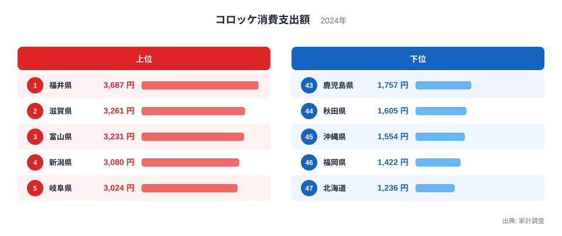
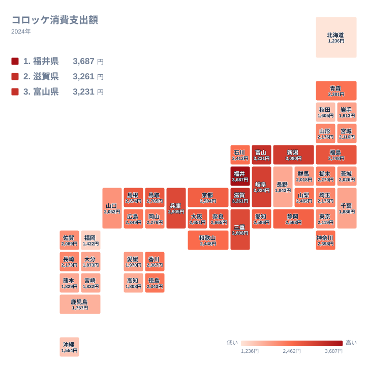

家庭のおかずやお弁当の定番であるコロッケも、消費支出額を都道府県別に見ると地域差がはっきりと表れます。家計調査のデータでは、福井県が全国で最も多くコロッケに支出しており、下位の北海道とはおよそ3倍もの開きがあります。この記事では、なぜコロッケの消費に地域差が生まれているのかを、ランキングとタイルマップから確認していきます。

## 支出額の上位と下位を見る

<source-link href="/ranking/croquette-consumption-expenditure">コロッケ消費支出額ランキングをもっと見る</source-link>

ランキングを見ると、福井県が3,687円で1位となり、滋賀県が3,261円で2位、富山県が3,231円で3位に続きます。4位は新潟県で3,080円、5位は岐阜県で3,024円です。上位5県のうち福井県、富山県、新潟県は北陸地方の県で、隣接する滋賀県と岐阜県を含めると上位5県が地理的にひとつながりになります。ここまで狭い範囲に集中する指標は多くありません。ただしこの統計はコロッケへの支出額を集計したもので、家庭で買われているのか惣菜として買われているのかまでは区別していないため、購入の形態までは読み取れません。

一方、下位を見ると北海道が1,236円で最も少なく、次いで福岡県1,422円、沖縄県1,554円、秋田県1,605円、鹿児島県1,757円と続きます。1位の福井県と比べると北海道はおよそ3倍近い差があります。北海道はじゃがいもの一大産地であり、コロッケの原料には事欠かない土地柄ですが、家庭での揚げ物調理自体を控える傾向や、他の惣菜への支出配分が影響している可能性があります。

中位に位置する県を見ると、東京都は2,119円で29位、大阪府は2,651円で12位となっており、大都市圏でも順位に差があります。どちらも上位5県には入らず、大阪府は12位、東京都は29位で、2つの大都市圏の間にも17位分の開きがあります。人口規模や都市の大きさでは、この差も上位の北陸への集中も説明できません。

## 地理分布のタイルマップで確認する

タイルマップで全国の分布を見ると、支出額が多い都道府県は北陸地方から近畿地方、東海地方にかけて連続して分布していることが分かります。福井県と富山県の北陸2県に加え、滋賀県、兵庫県といった近畿の県、岐阜県、新潟県、三重県といった中部の県も上位10県に入っており、日本海側から太平洋側にかけての中部地方一帯でコロッケの消費が活発であることがうかがえます。鳥取県と島根県が9位と10位に入っている点も、中国地方の日本海側が同じ消費傾向を共有していることを示しています。

対照的に、北海道、東北地方、九州地方、沖縄県では支出額が低めの傾向が見られます。北海道は47位、秋田県は44位、鹿児島県は43位、沖縄県は45位、福岡県は46位と、いずれも下位に集中しています。下位に並ぶのは北陸から地理的に離れた地域ですが、なぜ離れると支出額が下がるのかを説明できる材料はこの統計にありません。四国地方でも高知県が42位、愛媛県が35位と低めの水準にあり、西日本の一部と北海道・東北・九州・沖縄が全体として支出額の低い地域を形成しています。

東北地方の中でも福島県は2,748円で8位と上位に入っており、東北全体が一様に低いわけではありません。同じ東北でも秋田県は44位で、福島県との間には36位分の開きがあります。地方区分でひとくくりにすると、この差が見えなくなってしまいます。

> [!NOTE]
> コロッケ消費支出額は、家計調査における1世帯当たりの年間支出額であり、スーパーや精肉店で購入する惣菜としてのコロッケを対象としています。飲食店での外食や家庭での手作り分は含まれていません。

> [!WARNING]
> この記事のデータは2024年の単年の値であり、季節ごとの購入頻度の変動や年による変化は反映されていません。北陸地方が上位を占める理由をこの統計から特定することはできません。原材料であるじゃがいもの主産地である北海道が最下位であることからも、産地との関係は読み取れません。

> [!TIP]
> コロッケの消費傾向を読み解く際は、じゃがいもの産出額ランキングと比較すると、原料の産地と消費地が必ずしも一致しないことが見えてきます。

順位を上から順に追うと、1位の福井県から10位の島根県まではおおむね数百円刻みで緩やかに減少していく一方、その先の中位から下位にかけても急激な落ち込みは見られません。むしろ全体として1位から47位まで連続的に減少していく分布になっており、特定の県だけが極端に突出しているわけではないのが特徴です。上位県だけが飛び抜けているのではなく、47県が連続した帯のように並んでいます。順位が近い県どうしの差はごくわずかなので、隣り合う順位の優劣を論じる意味はほとんどありません。

コロッケ以外の家計消費に関する統計をまとめて見たい場合は[同じカテゴリの統計一覧](/category/economy)が参考になります。1位となった[福井県のデータ](/areas/18000)や、2位の[滋賀県のデータ](/areas/25000)もあわせてご覧ください。

産地との関係を疑うなら、じゃがいもの主産地である北海道が最下位である点が手がかりになります。原料が身近にあることと、出来合いのコロッケに支出することは別の行動です。手作りする世帯が多ければ、原料は買っても惣菜としての支出は増えません。この統計は完成品への支出だけを数えているため、産地であることがむしろ支出額を押し下げる方向に働く可能性もあります。

## まとめ

コロッケ消費支出額は、福井県の3,687円から北海道の1,236円まで、およそ3倍の開きがあります。上位は福井県、滋賀県、富山県、新潟県、岐阜県が占め、5県が地理的にひとつながりになります。下位は北海道、福岡県、沖縄県、秋田県、鹿児島県です。上位の集中は明確ですが、その理由をこの統計だけで説明することはできません。

## データ出典

コロッケ消費支出額は家計調査(2024年)による集計です。
