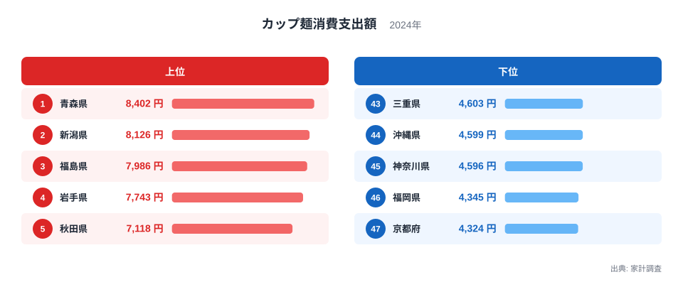
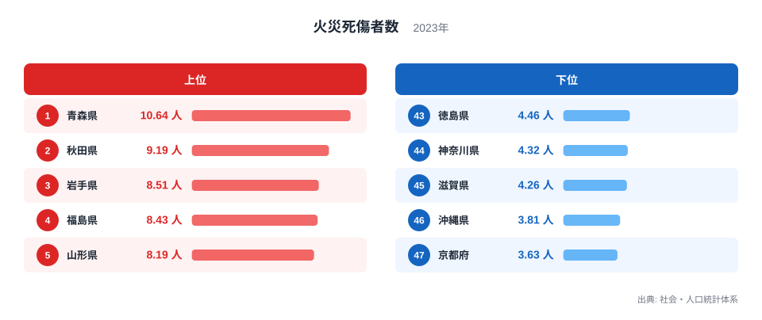
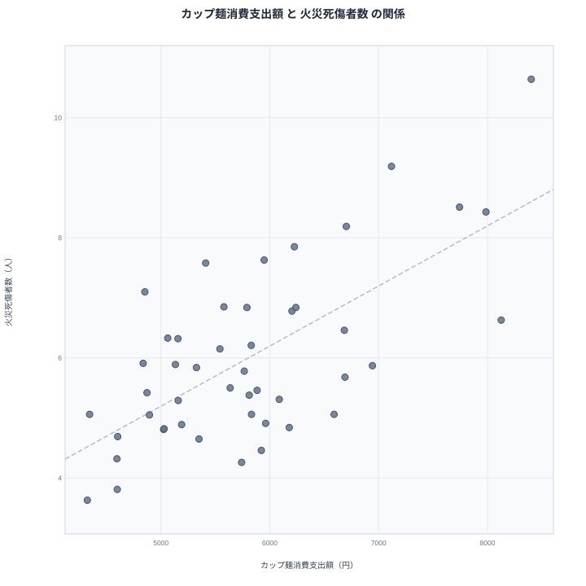

家計調査によるカップ麺消費支出額のランキングと、社会・人口統計体系による火災死傷者数のランキングを重ねてみると、上位の顔ぶれがよく似ていることに気づきます。青森県、秋田県、岩手県、福島県、山形県といった東北地方の県が、どちらのランキングでも軒並み上位に並んでいるのです。この一致は単なる偶然でしょうか、それとも何か共通の理由があるのでしょうか。47都道府県の実データをもとに、見かけの相関の裏側を探っていきます。

## カップ麺消費支出額の地域差

<source-link href="/ranking/cup-noodles-consumption-expenditure">カップ麺消費支出額ランキングをもっと見る</source-link>

家計調査によるカップ麺消費支出額で全国1位となっているのは青森県で、年間8,402円を支出しています。2位は新潟県で8,126円、3位は福島県で7,986円と続き、4位の岩手県は7,743円、5位の秋田県は7,118円です。上位5県のうち4県が東北地方に集中している点が目立ちます。青森県の他の統計データは[青森県のデータ](/areas/02000)からも確認できます。

一方で最も支出額が少ないのは京都府で、4,324円にとどまっています。46位の福岡県は4,345円です。この2県に続く順位の県も、おおむね4,600円台前半で並んでいます。上位の青森県と下位の京都府を比べると、支出額には約1.9倍の開きがあります。この指標は都道府県庁所在市の二人以上世帯を対象にした年間支出額なので、単身世帯や県庁所在市以外に住む世帯の消費は集計に含まれていません。2位の新潟県について詳しく知りたい方は[新潟県のデータ](/areas/15000)もあわせてご覧ください。

上位10県の顔ぶれをあらためて見ると、青森県、新潟県、福島県、岩手県、秋田県、宮城県、山形県と、東北6県すべてが含まれています。8位の大阪府、9位の高知県、10位の富山県だけが東北地方以外の県で、上位はほぼ東北で占められている状態です。カップ麺は調理に時間がかからず、寒い季節にすぐ温かい食事を用意できる点で、積雪や低温の期間が長い地域と相性が良い食品だと考えられます。

> [!NOTE]
> カップ麺消費支出額は家計調査の都道府県庁所在市・二人以上世帯だけを対象にした年間支出額です。単身世帯や、県庁所在市以外に住む世帯の消費は集計に含まれていないため、県全体の実態とは差がある可能性があります。

## 火災死傷者数の地域差

社会・人口統計体系による火災死傷者数でも、上位に東北の県が並びます。1位は青森県で10.64人、2位は秋田県で9.19人、3位は岩手県で8.51人、4位は福島県で8.43人、5位は山形県で8.19人となっています。この5県はいずれもカップ麺消費支出額でも上位10位以内に入っており、両方のランキングで顔ぶれが重なり合っています。

下位を見ると、最も少ないのは京都府の3.63人で、次いで沖縄県が3.81人、滋賀県が4.26人、神奈川県が4.32人、徳島県が4.46人と続きます。青森県と京都府を比べると、火災死傷者数には約2.9倍の差があります。この指標は人口当たりの数値なので、単純な人口規模の差だけでは説明がつかない地域差が背景にあると考えられます。全47都道府県の順位は[火災死傷者数ランキング](/ranking/fire-damage-casualties-per-population)で確認できます。

## 見かけの相関を散布図で確認する

2つの指標を散布図に重ねると、カップ麺消費支出額が多い県ほど火災死傷者数も多いという緩やかな右肩上がりの傾向が見て取れます。東北の県がそろって右上に集まり、近畿や首都圏の県が左下に集まる形になっています。この図だけを見ると、まるでカップ麺の消費量が火災の増加に関係しているかのように映るかもしれません。

> [!WARNING]
> 2つの指標が同じ方向に動いて見えても、一方がもう一方の原因であるとは限りません。カップ麺を食べる量が火災を増やしているのではなく、別の共通する要因が両方の数値を押し上げている可能性のほうが高いと考えられます。相関関係と因果関係は分けて考える必要があります。

散布図の左下に目を向けると、京都府や大阪府、東京都、神奈川県といった大都市を抱える都府県が集まっています。これらの地域は冬の気温が比較的高く、暖房器具を使う期間も短めです。人口が多い分だけ火災死傷者数が増えそうに思えますが、この指標は人口当たりで示されているため、単純な人口規模の差では説明できません。むしろ気候条件が寒冷地とは逆に働き、火災リスクを引き下げている側面があると考えられます。

## 相関の裏にある共通要因

カップ麺の消費と火災死傷者の間に直接の結びつきを想定するのは無理があります。むしろ注目すべきなのは、両方のランキングで上位に来る県に共通する特徴です。東北地方は冬季の気温が低く、暖房器具やストーブを長時間使う期間が全国のなかでも長い地域にあたります。灯油ストーブや電気ストーブなど、燃焼や発熱をともなう暖房器具の使用頻度が上がれば、それだけ火災のリスクも高まりやすくなります。

同時に、寒冷地では調理の際に体を温める即席麺やカップ麺のような食品が好まれやすいという食文化の面も考えられます。加えて、東北地方は高齢化率が全国平均より高い県が多く、高齢者の世帯では暖房器具の使用や火の取り扱いに関する事故のリスクが相対的に高くなる傾向も指摘されています。カップ麺消費支出額と火災死傷者数は、どちらも「寒冷な気候」と「高齢化」という共通の背景を映し出している可能性が高く、両者が直接つながっているわけではありません。

> [!TIP]
> 2つのランキングを比べるときは、上位・下位の顔ぶれが似ているかどうかだけでなく、その背景にある気候や人口構成といった共通の要因まで踏み込んで考えると、数字の裏側がより見えやすくなります。[同じカテゴリの統計一覧](/category/economy)では、カップ麺以外の家計調査データも比較できます。

## まとめ

- カップ麺消費支出額の1位は青森県で8,402円、最下位は京都府で4,324円です。
- 火災死傷者数の1位は青森県で10.64人、最下位は京都府で3.63人です。
- 両方のランキングで青森県、秋田県、岩手県、福島県、山形県といった東北の県が上位に並んでいます。
- 散布図では緩やかな右肩上がりの相関が見られますが、これは相関であって因果関係を示すものではありません。
- 背景には寒冷な気候による暖房器具の使用頻度の高さや、東北地方の高齢化率の高さといった共通要因があると考えられます。

## データ出典

- カップ麺消費支出額: 家計調査（2024年）
- 火災死傷者数: 社会・人口統計体系（2023年）
