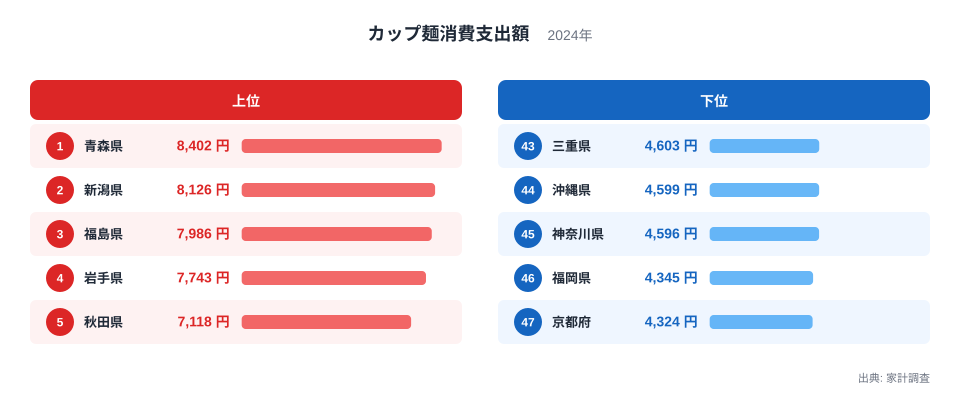
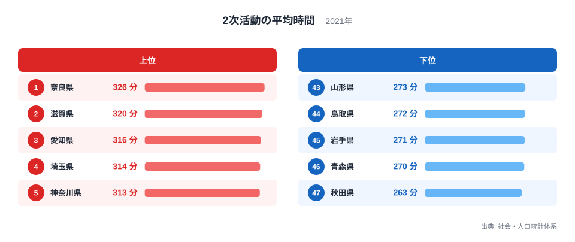
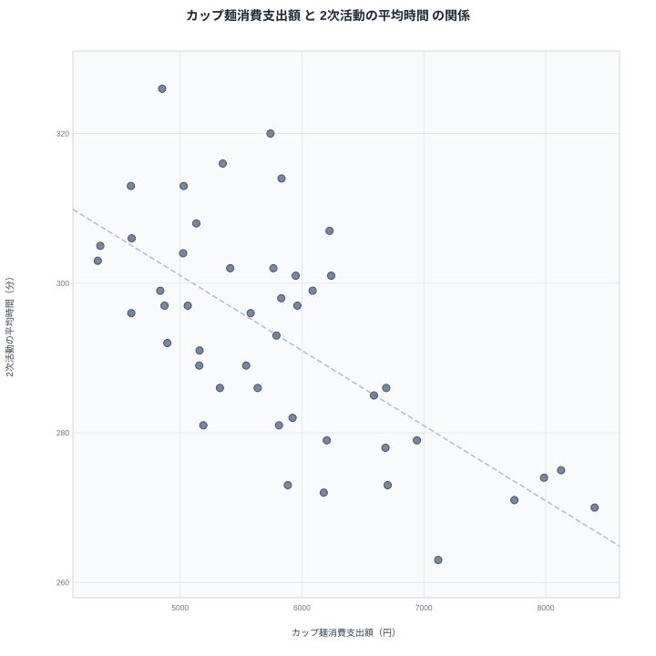

家計調査によるカップ麺消費支出額のランキングと、社会・人口統計体系による2次活動の平均時間のランキングを重ねてみると、興味深い逆向きの一致が見えてきます。カップ麺消費支出額の上位に入る青森県、岩手県、秋田県は、2次活動の平均時間ではそろって下位に沈んでいるのです。カップ麺の消費が多い県ほど2次活動の時間が短くなるのは偶然でしょうか、それとも何か共通の理由があるのでしょうか。47都道府県の実データをもとに、見かけの相関の裏側を探っていきます。

## カップ麺消費支出額の地域差

<source-link href="/ranking/cup-noodles-consumption-expenditure">カップ麺消費支出額ランキングをもっと見る</source-link>

カップ麺は調理にほとんど時間がかからず、洗い物も少なく済む食品です。家事にかけられる時間の長さと支出額に関係がありそうかを見るまえに、まず家計調査によるカップ麺消費支出額の全国順位を確認しておきます。もっとも支出額が多いのは青森県で、年間8,402円です。僅差で2位につけているのは新潟県で8,126円、3位は福島県で7,986円と続き、4位の岩手県は7,743円、5位の秋田県は7,118円です。上位5県のうち4県を東北地方の県が占めており、短時間で用意できる食品への支出が全国のなかでも突出して多い地域だとわかります。青森県の他の統計データは[青森県のデータ](/areas/02000)からも確認できます。

下位に目を向けますと、もっとも支出額が少ないのは京都府で、4,324円にとどまります。46位の福岡県は4,345円で、この2府県に続く順位の県もおおむね4,600円台前半に集まっています。上位の青森県と下位の京都府を比べますと、支出額には約1.9倍の開きがあります。調理や後片付けにかかる手間が少ないカップ麺は、家事にかけられる時間が限られている世帯ほど選びやすい食品だと考えられます。2位の新潟県について詳しく知りたい方は[新潟県のデータ](/areas/15000)もあわせてご覧ください。

> [!NOTE]
> ここでのカップ麺消費支出額は、家計調査の都道府県庁所在市・二人以上世帯だけを対象にした年間の支出額です。一人暮らしの世帯や、県庁所在市以外に住む世帯の消費行動までは反映されていない点にご留意ください。

## 2次活動の平均時間の地域差

社会・人口統計体系による2次活動の平均時間は、家事や育児、買い物といった生活を営むうえで欠かせない活動に費やす時間を示す指標で、この記事では女性・非有業者を対象にした数値を扱っています。全国1位は奈良県で326分、2位は滋賀県で320分、3位は愛知県で316分、4位は埼玉県で314分、5位は神奈川県で313分となっており、いずれも近畿や中部、首都圏の都府県が上位を占めています。

下位を見ると、最も短いのは秋田県の263分で、46位の青森県が270分、45位の岩手県が271分、44位の鳥取県が272分、43位の山形県が273分と続きます。カップ麺消費支出額の上位5県だった青森県、岩手県、秋田県の3県が、そろって2次活動の平均時間でも下位5県に入っており、両方のランキングで逆向きに重なり合っています。1位の奈良県と最下位の秋田県を比べると、2次活動の平均時間には63分の差があります。全47都道府県の順位は[2次活動の平均時間ランキング](/ranking/secondary-activity-avg-time-unemployed-female)で確認できます。

> [!TIP]
> 2次活動の平均時間は「女性・非有業者」に限定した値です。働いている女性や男性を含めた数値ではないため、県全体の生活時間の傾向をそのまま示すものではない点を踏まえて読み解くと誤解を避けられます。

## 見かけの逆相関を散布図で確認する

2つの指標を散布図に重ねると、カップ麺消費支出額が多い県ほど2次活動の平均時間が短いという、右肩下がりの緩やかな傾向が見て取れます。東北の県がそろって右下に集まり、近畿や中部、首都圏の都府県が左上に集まる形になっています。この図だけを見ると、カップ麺を多く消費する暮らしが家事や育児にかける時間を減らしているかのように映るかもしれません。

> [!WARNING]
> グラフ上で右肩下がりの関係が見えても、カップ麺の消費が2次活動の時間を直接短くしているとは断定できません。逆に2次活動の時間が短いからカップ麺を選んでいる、とも言い切れません。両方の数値を同時に動かしている、もっと別の要因が背景にある可能性を考える必要があります。

散布図の左上に位置する奈良県や滋賀県、愛知県は、カップ麺消費支出額では下位から中位に位置しながら、2次活動の平均時間では上位に入っています。これらの県は近畿や中部の都市圏に近く、共働き世帯や単身赴任世帯など、家庭内での役割分担のあり方が東北地方とは異なる可能性があります。地域ごとの世帯構成の違いが、2次活動の時間差に表れていると考えられます。

## 相関の裏にある共通要因

カップ麺の消費と2次活動の時間の間に直接の結びつきを想定するのは無理があります。むしろ注目すべきなのは、両方のランキングで特徴的な数値を示す県に共通する暮らし方です。東北地方は三世代同居をはじめとする多世代世帯の割合が比較的高い地域とされており、家事や育児といった2次活動が世帯内の複数の人で分担されやすく、非有業者の女性1人あたりの負担時間が短くなりやすい可能性があります。

一方でカップ麺消費支出額の高さは、冬季の気温が低く暖房の効いた室内ですぐに温かい食事を用意できる点や、積雪の多い地域で買い物の頻度を抑えられる保存食としての利便性が背景にあると考えられます。カップ麺消費支出額と2次活動の平均時間は、どちらも「東北地方の気候と世帯構成」という共通の背景を映し出している可能性が高く、両者が直接つながっているわけではありません。

## まとめ

- カップ麺消費支出額の1位は青森県で8,402円、最下位は京都府で4,324円です。
- 2次活動の平均時間は1位が奈良県で326分、最下位が秋田県で263分です。
- カップ麺消費支出額の上位5県のうち青森県、岩手県、秋田県の3県が、2次活動の平均時間では下位5県に入っています。
- 散布図では右肩下がりの逆相関が見られますが、これは相関であって因果関係を示すものではありません。
- 背景には東北地方の多世代同居の割合や、寒冷な気候によるカップ麺の利便性の高さといった共通要因があると考えられます。[同じカテゴリの統計一覧](/category/economy)では、家計調査に基づく他の消費データも比較できます。

## データ出典

- カップ麺消費支出額: 家計調査（2024年）
- 2次活動の平均時間（女性・非有業者）: 社会・人口統計体系（2021年）
