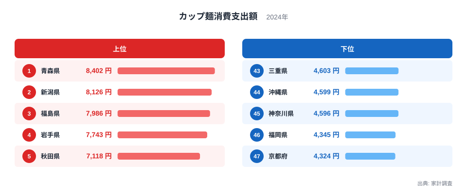
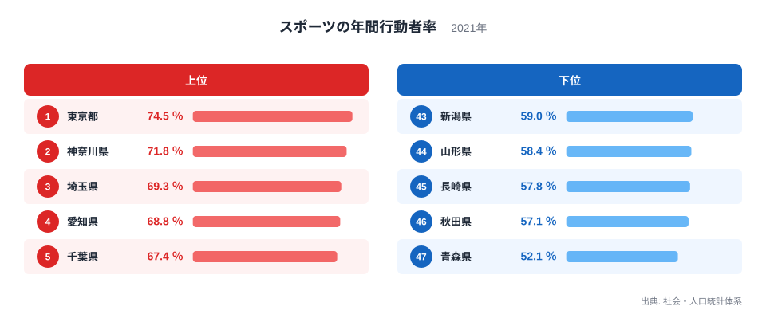
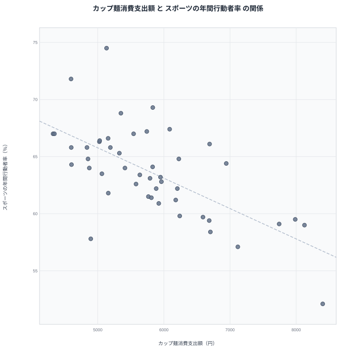

忙しい日々のなかで手軽に食事を済ませたいとき、カップ麺は頼れる存在です。その一方で、運動習慣がある人ほど食事に手をかける傾向があるとよく言われます。この2つの生活習慣には本当に関係があるのでしょうか。この記事では2024年のカップ麺消費支出額と2021年のスポーツの年間行動者率を都道府県別に並べ、その重なりを確かめていきます。

先に結論を示すと、両者にはかなりはっきりした逆の傾向が見られます。カップ麺消費支出額が最も多い青森県は、スポーツの年間行動者率でも最も低い順位です。この記事では、この符合が何を意味しているのか、単純な因果関係で片づけずに丁寧に見ていきます。

## カップ麺消費支出額の上位と下位

<source-link href="/ranking/cup-noodles-consumption-expenditure">カップ麺消費支出額ランキングをもっと見る</source-link>

カップ麺消費支出額の1位は青森県で8,402円です。2位は新潟県で8,126円、3位は福島県で7,986円と、東北や北陸の県が上位に集まっています。積雪が多く冬の外出がしにくい地域では、保存が利いてすぐに用意できるカップ麺の需要が高まりやすいと考えられます。実際、上位10県のうち岩手県、秋田県、宮城県、山形県も含まれており、東北6県の多くが上位に位置しています。

一方、最下位は京都府で4,324円です。46位は福岡県で4,345円、45位は神奈川県で4,596円と、西日本の大都市圏や近畿地方の府県が下位に並んでいます。上位の青森県と下位の京都府のあいだには、4,078円という2倍近い開きがあります。

## スポーツの年間行動者率の上位と下位

スポーツの年間行動者率の1位は東京都で74.5％です。2位は神奈川県で71.8％、3位は埼玉県で69.3％と、首都圏の都県が上位を占めています。首都圏はスポーツジムや運動施設へのアクセスが良く、健康志向の高い住民も多いことが背景にあると考えられます。

一方、最下位は青森県で52.1％です。46位は秋田県で57.1％、45位は長崎県で57.8％と、東北や九州の一部の県が下位に並んでいます。1位の東京都と47位の青森県のあいだには、22.4ポイントもの開きがあります。

## 見かけの相関と真因

散布図を見ると、カップ麺消費支出額が多い県ほどスポーツの年間行動者率が低いという右下がりの傾向がうっすらと見えます。青森県はカップ麺消費支出額で1位、スポーツの年間行動者率で最下位という、両極端の位置にあります。新潟県もカップ麺消費支出額で2位、スポーツの年間行動者率では43位と、下位側に位置しています。

> [!WARNING]
> カップ麺消費支出額とスポーツの年間行動者率のあいだに見える逆の傾向は相関であって、片方がもう片方の原因になっているわけではありません。カップ麺を食べているから運動しない、という単純な因果関係として読むのは早計です。

この逆の傾向の背景には、気候と都市化という2つの独立した要因が重なっている可能性があります。東北や北陸のように冬の寒さが厳しく積雪も多い地域では、屋外でのスポーツ活動がしにくい季節が長く続きます。同時に、保存が利いて調理の手間がかからないカップ麺は、こうした気候条件のもとで重宝されやすい食品です。つまり、カップ麺消費支出額とスポーツの年間行動者率は、どちらも冬の気候という共通の背景から間接的に影響を受けていると考えられ、片方がもう片方を直接引き起こしているわけではありません。

また、首都圏のようにスポーツの年間行動者率が高い地域は、運動施設が充実しているだけでなく、外食や中食の選択肢も豊富です。カップ麺以外の食事の選択肢が多いことも、カップ麺消費支出額が相対的に低くなる一因かもしれません。

## 例外的な県から見える別の要因

すべての県がこの傾向に沿っているわけではありません。福岡県はカップ麺消費支出額で最下位から2番目の46位でありながら、スポーツの年間行動者率でも9位という中位にとどまっています。都市部でありながらカップ麺消費支出額が低く、スポーツの年間行動者率も突出して高くはないという福岡県の位置は、気候と都市化だけでは説明しきれない地域独自の食文化や生活習慣が関わっている可能性を示しています。

> [!TIP]
> 47都道府県のランキングを重ねて読むときは、上位・下位の集まり方だけでなく、傾向から外れる県にも注目すると、単純な図式では捉えきれない地域の個性が見えてきます。

## 47都道府県を俯瞰して見えること

カップ麺消費支出額とスポーツの年間行動者率を47都道府県で並べると、両者が単純な因果関係でつながっているわけではないことがわかります。もしカップ麺を食べることが運動不足に直結するのであれば、順位はもっとくっきりと逆転しているはずですが、実際には福岡県のような例外も存在し、傾向には幅があります。それでも上位県・下位県の顔ぶれを見比べると、東北や北陸のように冬が厳しい地域はカップ麺消費支出額で上位に、首都圏のように運動施設が充実した地域はスポーツの年間行動者率で上位に、それぞれ偏っていることがわかります。

この偏りをどう読むかが重要です。カップ麺消費支出額の高さは、単に食生活の傾向を示しているだけであり、それ自体が悪いことを意味するものではありません。冬の寒さが厳しく買い物や外出の頻度が制限される地域では、保存が利き調理が簡単な食品が生活の知恵として選ばれているとも考えられます。同様に、スポーツの年間行動者率の低さも、運動施設へのアクセスのしにくさや気候条件など、個人の意識だけでは変えにくい構造的な要因が背景にある可能性があります。

## 地域の生活基盤という視点

カップ麺消費支出額とスポーツの年間行動者率の両方に影響を与えている要因として、地域の生活基盤の違いも見逃せません。都市部では公共交通機関が発達し、徒歩や自転車での移動も日常的な運動になりますが、地方部では自動車移動が中心になりやすく、意識的にスポーツの時間を作らないと体を動かす機会が減ってしまいます。同時に、都市部はコンビニエンスストアや飲食店の選択肢が豊富で、カップ麺以外の食事の代替手段も多く用意されています。

こうした生活基盤の違いを踏まえると、カップ麺消費支出額とスポーツの年間行動者率の逆の傾向は、地域そのものの都市化の度合いという1つの背景から間接的に生まれている可能性が高いと考えられます。どちらの指標も、住んでいる場所の環境によって選択の幅が変わってくるという点で共通しています。

## データ出典

カップ麺消費支出額は家計調査の2024年データ、スポーツの年間行動者率は社会・人口統計体系の2021年データを使用しています。

> [!NOTE]
> スポーツの年間行動者率は、過去1年間に何らかのスポーツを行った10歳以上の人の割合を示す指標です。頻度や競技の種類までは区別していないため、運動の強度や継続性を示す指標ではない点に注意が必要です。

[スポーツの年間行動者率ランキング](/ranking/sports-annual-participation-rate-10plus)や[同じカテゴリの統計一覧](/category/economy)もあわせてご覧ください。カップ麺消費支出額1位の[青森県のデータ](/areas/02000)、2位の[新潟県のデータ](/areas/15000)では、それぞれの県の他の指標も確認できます。
