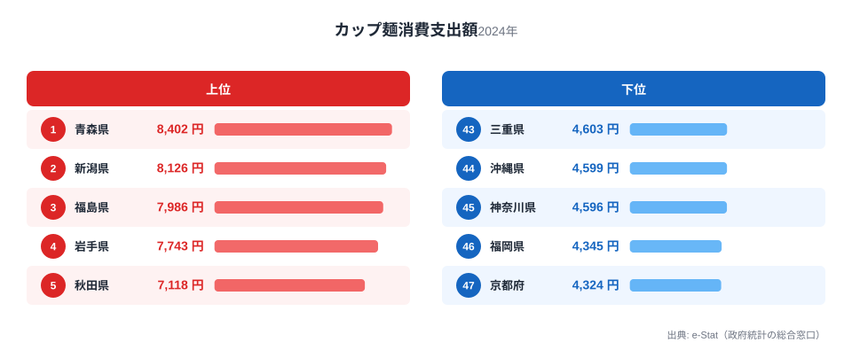

1世帯あたりのカップ麺消費支出額は、都道府県によって最大1.9倍の差があります。総務省家計調査(2024年)によると、1位の青森県は年間8,402円、最下位の京都府は4,324円でした。

とくに目を引くのは、支出額の上位7県がすべて東北地方（青森・福島・岩手・秋田・宮城・山形）と北陸の新潟県で占められている点です。この記事では、なぜカップ麺の消費が寒冷地に集中するのか、家計調査のデータから構造を読み解きます。

## 上位と下位の県

上位を見ると、1位青森8,402円、2位新潟8,126円、3位福島7,986円、4位岩手7,743円、5位秋田7,118円と、いずれも7,000円台後半から8,000円台に集中しています。さらに6位宮城6,943円、7位山形6,703円までを合わせると、上位7県のうち6県を東北地方(青森・福島・岩手・秋田・宮城・山形)が占めています。

> [!NOTE]
> この統計は「消費支出額」であり「消費量(個数)」ではありません。カップ麺の店頭価格は地域差が小さいため、支出額の差はほぼそのまま購入量の差と読み替えられますが、厳密には価格差の影響もわずかに含まれます。

一方で下位を見ると、47位京都4,324円、46位福岡4,345円、45位神奈川4,596円、44位沖縄4,599円、43位三重4,603円と、大都市圏や西日本の県が目立ちます。京都・福岡・神奈川はいずれも人口の多い都市部を抱える県で、外食・中食の選択肢が豊富な地域です。全県の順位は[カップ麺消費支出額ランキング](/ranking/cup-noodles-consumption-expenditure)で確認できます。

<source-link href="/ranking/cup-noodles-consumption-expenditure">カップ麺消費支出額ランキングをもっと見る</source-link>

## 東北・北陸に集中する理由

東北6県のうち5県が上位10位以内という偏りは偶然とは考えにくい水準です。背景として考えられるのは、冬季の厳しい寒さです。カップ麺は熱湯を注ぐだけで温かい食事が短時間で用意でき、雪や凍結で外出が難しい日でも自宅で完結します。積雪期間が長い青森・新潟・福島・秋田・山形といった地域で支出額が高いのは、この即時性・保存性の価値が反映されている可能性があります。

> [!TIP]
> 気候と即席麺の関係を見るなら、[即席麺の消費量ランキング](/blog/instant-noodles-consumption-prefecture-gap)も合わせて確認すると、同じ寒冷地パターンが再現されるかどうかを比較できます。

<source-link href="/blog/instant-noodles-consumption-prefecture-gap">即席麺の消費量ランキングの記事を読む</source-link>

もう一つの視点は価格と利便性です。カップ麺は1個あたり100〜200円台で購入でき、調理の手間もほぼゼロです。全体の消費支出額(食料・住居・光熱費などを含む家計全体の支出)が低い水準にある地域ほど、割安で満足感を得やすい食品への依存度が相対的に高まりやすい傾向があります。単身世帯や高齢者世帯の比率が高い地方では、大量の食材をまとめ買いして調理するより、必要な分だけをすぐ用意できるカップ麺の利便性が評価されやすいとも考えられます。

> [!WARNING]
> 「消費支出が低い県ほどカップ麺への支出が多い」という関係は、あくまで観測される傾向であって因果関係を証明するものではありません。世帯構成(単身世帯の割合)や共働き率、外食産業の集積度など、他の要因が絡んでいる可能性があります。[仮説]として捉えてください。厳密な検証には世帯属性別のクロス集計が必要です。

## 北海道が上位に入らない意外性

「寒冷地=カップ麺消費が多い」という仮説からすると、北海道が上位に来ると予想しがちですが、実際の順位は19位・5,884円で中位にとどまります。東北6県より低く、全国平均に近い水準です。

この結果は、単純な「寒ければ寒いほど多い」という説明では足りないことを示しています。北海道は道内での食文化の多様性が高く、味噌ラーメンなど独自の麺文化が根付いていることや、道民の食料消費支出全体の構成比が東北諸県とは異なることが影響している可能性があります。気候だけでなく、地域固有の食習慣も合わせて見る必要があります。

家計全体の消費支出額の地域差を見たい場合は、関連記事の[生活費が高い県ランキング](/blog/household-consumption-expenditure-ranking)も参考になります。カップ麺だけでなく食料費全体の傾向を照らし合わせることで、地域ごとの家計構造がより立体的に見えてきます。

## まとめ

- 1位は青森県 8,402円、47位は京都府 4,324円で、1.9倍の差
- 上位7位のうち6県が東北・新潟県で占められ、寒冷地への偏りが顕著
- 下位は京都・福岡・神奈川など大都市圏の県が中心
- 積雪・寒冷という気候要因に加え、家計全体の支出水準や食文化の違いも背景にあると考えられる[仮説]
- 北海道は19位で中位にとどまり、「寒冷地=一律に高い」わけではない

## データ出典

総務省統計局「家計調査」(2024年、都道府県庁所在市および政令指定都市)をもとに、e-Stat(政府統計の総合窓口)経由で集計しました。
