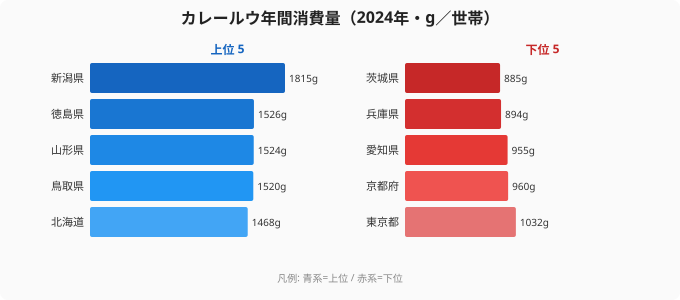

「国民食」と呼ばれるカレー。どの家の食卓にも当たり前に並ぶ料理だからこそ、消費量に大きな県差があるとは想像しにくいものです。ですが2024年の家計調査を見ると、その思い込みは裏切られます。

カレールウの年間消費量（都道府県庁所在市の二人以上世帯）は、1位の新潟県が1,815g、最下位の茨城県が885g。その差は930g、倍率にして**2.05倍**にのぼります。同じ「カレー好き」を自認する国の中で、住む県によって買うルウの量がここまで違うのです。

さらに上位を眺めると、新潟・山形・北海道・福島といった雪国や米どころが顔を並べる一方、愛知・兵庫・京都・東京といった大都市圏が下位に沈んでいます。この記事では、カレールウ消費の県差を可視化し、「なぜ雪国・米どころで多いのか」を探っていきます。

> [!NOTE]
> ここでの「カレールウ消費量」は家計調査における**都道府県庁所在市の二人以上世帯**の年間購入量（g）。世帯あたりの数値であり、外食のカレーやレトルトカレーは含まない。県全体ではなく県庁所在市のサンプルである点に注意。「ルウを買って家で作る量」を測っている指標だと押さえておくと、後半の解釈がぶれない。

## カレールウ消費量ランキング──上位5県と下位5県

突出しているのは新潟県の1,815gです。2位の徳島県（1,526g）を約290gも引き離す独走で、米どころ・新潟がカレールウでも全国トップに立っています。続く山形県（1,524g）、鳥取県（1,520g）、北海道（1,468g）と、上位には日本海側・寒冷地が目立ちます。

新潟が頭ひとつ抜けるのには、米どころならではの事情があります。カレーは「カレーライス」としてご飯と一体で食べられる料理であり、主食の米を大量に消費する家庭ほど、それに合わせるルウの購入量も増えやすくなります。加えて新潟は冬の降雪が長く、一度に大鍋で作って数日かけて温め直せるカレーが、寒い季節の家庭料理として合理的に機能します。米・寒さ・作り置き文化という三つの条件が重なる新潟は、カレールウ消費の「最適県」と言えます。

ただし上位は北国だけではありません。徳島・鳥取・香川・佐賀・鹿児島といった雪の少ない西日本・山陰・四国・九州の県も食い込んでおり、「単純に北が多い」とは言い切れません。家庭で一から料理する習慣が根づいた地方ほど、ルウの購入量が伸びる傾向が読み取れます。鶏肉や牛肉でも地方の消費量が都市部を上回る例は多く、[牛肉消費量の県差](/blog/beef-consumption-prefecture-gap)や[鶏肉消費量の県差](/blog/chicken-consumption-prefecture-gap)と並べて見ると、「家で作る地方／買って済ます都市」という共通の構図が浮かびます。

<source-link href="/ranking/curry-roux-consumption-quantity">カレールウ消費量ランキングをもっと見る</source-link>

## 下位グループ：大都市圏が軒並み沈む

図の下半分が示すとおり、最下位は茨城県の885g。これに兵庫県（894g）、愛知県（955g）、京都府（960g）、東京都（1,032g）が続きます。

注目したいのは、**兵庫・愛知・京都・東京という大都市圏が軒並み下位に並んでいる**点です。人口の多い都市部ほど外食・中食（惣菜やレトルト）の選択肢が豊富で、家庭でルウを買って一から作る機会が相対的に少なくなります。コンビニやカレー専門店、レトルトの品揃えが充実するほど、「ルウを買う」という行為そのものが減るのは自然な帰結です。最下位の茨城県も、首都圏に近く食の外部化が進みやすい立地です。

逆に言えば、この指標は「カレーを食べる量」ではなく「カレーを家で作る量」を映しています。大都市の住民がカレーを食べていないわけではありません。その多くを外食やレトルトに置き換えている、と読むのが正確です。

> [!TIP]
> このランキングは「世帯がスーパーで買うルウの量」であり、「カレーをよく食べるか」とは必ずしも一致しない。外食やレトルトでカレーを楽しむ県は、ルウの購入量としては低く出やすい。食の地域性をもっと俯瞰したいなら[食文化の都道府県マップ](/blog/food-culture-prefecture-map)も合わせて読むと、品目ごとの「作る／買う」の差が見えてくる。

## 発見：上位は「雪国・米どころ」、下位は「大都市圏」

上位と下位を並べると、ひとつの構図が浮かびます。上位は新潟・山形・福島・北海道といった雪国や米どころが中心で、下位は東京・愛知・兵庫・京都といった大都市圏が中心です。「主食の米を多く食べ、家で一から料理し、寒さで作り置きが活きる地方」と「外食・中食に置き換わった都市」という対比です。

> [!NOTE]
> **[仮説]** 雪国・寒冷地でカレールウ消費が多いのは、(1) 一度に大量調理して温め直せるカレーが寒冷地・降雪期の家庭料理として合理的、(2) 米どころでは「カレーライス」としてご飯と組み合わせる食習慣が根づきやすい、といった要因が考えられる。一方、大都市圏で少ないのは外食・中食の選択肢の多さによる「食の外部化」が背景にある可能性がある。いずれも本データだけでは因果を確定できず、気温・降雪量・外食率などとの突き合わせによる検証が必要。

ただし、この構図には例外も多くあります。秋田県は36位（1,097g）、宮城県は37位（1,092g）と、東北でありながら下位に沈んでいます。逆に徳島県（2位）、鳥取県（4位）、香川県（8位）、佐賀県（10位）など、雪の少ない西日本・山陰・四国・九州の県も上位に並びます。つまり「北日本だから多い」という単純な説明は成り立たず、新潟を頂点とする日本海側・米どころの強さと、大都市圏の弱さが同時に効いていると見るのが実態に近いと言えます。トップの[新潟県の地域プロフィール](/areas/15000)を他の食料指標と重ねると、米・酒・農産加工の強さがカレールウ消費の背景と地続きであることが確認できます。

## まとめ

- カレールウ消費量1位は**新潟県の1,815g**で、2位以下を大きく引き離す独走。
- 最下位は**茨城県の885g**。1位との差は930g、倍率は**2.05倍**にのぼる。
- 上位には新潟・山形・北海道・福島など雪国・米どころが多く並ぶ。
- 下位には東京・愛知・兵庫・京都など大都市圏が集中し、最下位は茨城。
- ただし秋田36位・宮城37位など東北の例外も多く、「北日本だから多い」とは言い切れない。日本海側・米どころの強さと大都市圏の弱さが同時に効いている。

カレールウという身近な一品目でも、米どころ・気候・都市化の度合いが消費量に刻まれています。ほかの食料品でも同じ地域性が現れるかは、[食料消費に関する経済カテゴリ](/category/economy)のランキング群と並べて確かめてみてください。

## データ出典

総務省統計局「家計調査」（2024年）。都道府県庁所在市の二人以上世帯における年間カレールウ購入量（g）を、e-Stat 経由で取得・整備しました。県庁所在市のサンプルに基づく値であり、県全体・外食・レトルトは含みません。
