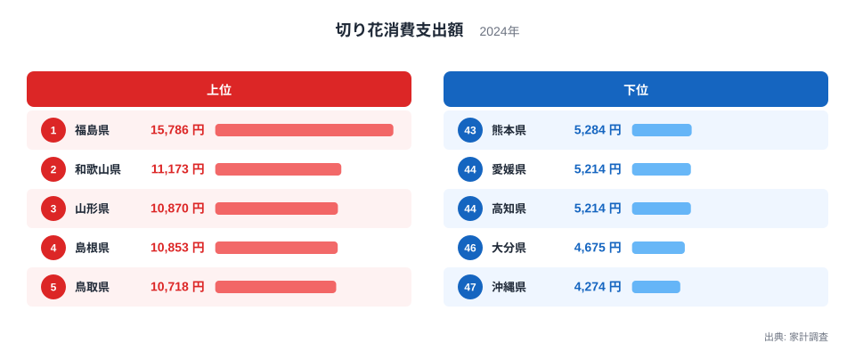
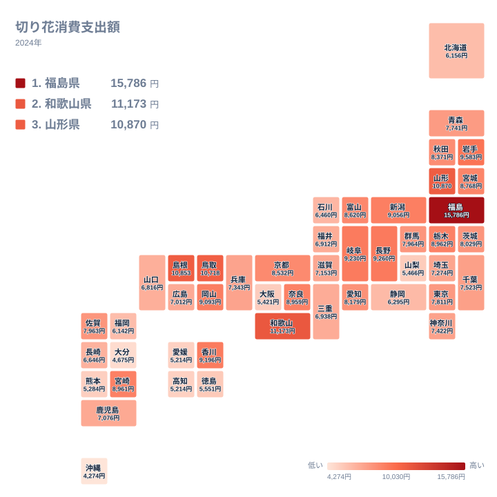

仏花やお供え、贈答用として使われる切り花の消費支出額を都道府県別に見ると、福島県が他のどの都道府県とも比べものにならないほど突出して高い水準にあります。家計調査のデータでは、福島県の支出額が突出して高く、2位の和歌山県のおよそ1.4倍にあたります。この一極集中ぶりは他の食品や日用品の消費データではあまり見られない特徴です。この記事では、切り花消費の地域差とその背景を、ランキングとタイルマップから確認していきます。

## 支出額の上位と下位を見る

<source-link href="/ranking/cut-flowers-consumption-expenditure">切り花消費支出額ランキングをもっと見る</source-link>

ランキングを見ると、福島県が15,786円で1位となり、2位の和歌山県11,173円との差は4,613円にも達しています。3位は山形県で10,870円、4位は島根県で10,853円、5位は鳥取県で10,718円です。福島県の突出ぶりは際立っており、2位から5位までの県が10,000円台で接近しているのに対し、福島県だけが単独で15,000円台に位置しています。切り花の消費は仏事や墓参りの習慣と結びつきが強く、福島県では季節ごとの供花文化が特に根強く残っていることが背景にあると考えられます。

一方、下位を見ると沖縄県が4,274円で最も少なく、次いで大分県4,675円、高知県5,214円、愛媛県5,214円、熊本県5,284円と続きます。高知県と愛媛県はともに5,214円で並んでおり、四国地方や九州地方の一部で切り花への支出が控えめな傾向が見られます。沖縄県は本州とは異なる気候風土や仏事の慣習を持つ地域であり、切り花よりも他の供物や独自の花文化が用いられている可能性があります。

中位に目を移すと、東京都は7,811円で23位、大阪府は5,421円で42位と、同じ大都市圏でも大きな開きがあります。東京都は全国のほぼ中間に位置している一方、大阪府は下位10県に近い水準にとどまっており、首都圏と近畿圏という2つの大都市圏の間でも消費傾向が異なることが分かります。切り花の支出額は、都市の規模そのものよりも、その土地に根付いた供花や贈答の慣習に強く左右されていると考えられます。

## 地理分布のタイルマップで確認する

タイルマップで全国の分布を見ると、支出額が多い都道府県は東北地方から中国地方にかけて広く分散していることが分かります。福島県は1位、山形県は3位、岩手県は6位、宮城県は15位、秋田県は18位で、東北地方の県が軒並み上位20位以内に入っています。一方で和歌山県、島根県、鳥取県、岡山県、香川県といった近畿・中国・四国地方の県も上位10県に名を連ねており、特定の地方に偏っているというよりも、地域ごとの仏事文化や花き産業の集積状況が個別に影響していると考えられます。

対照的に、沖縄県、大分県、高知県、愛媛県、熊本県といった九州・四国地方の南部は下位に集中しています。九州地方は大阪府も42位に位置しており、都市部であっても支出額が低めになる傾向が見られます。これは切り花の消費が贈答や仏事といった慣習に強く依存するため、都市化の度合いよりも地域固有の文化的背景が支出額を左右していることを示していると考えられます。

> [!NOTE]
> 切り花消費支出額は、家計調査における1世帯当たりの年間支出額であり、仏花や供花としての利用に加え、贈答用やインテリア用としての購入も含まれます。用途別の内訳はこの数値からは分かりません。

> [!WARNING]
> 福島県が突出して高い水準にある背景を、この記事のデータだけから断定することはできません。仏事の慣習や花き産業の集積状況など複数の要因が考えられますが、いずれも仮説の域を出ないものであり、追加の検証が必要です。

> [!TIP]
> 切り花の消費傾向を読み解く際は、都道府県別の花き産出額ランキングと比較すると、生産地と消費地が一致しているかどうかを確認する手がかりになります。

順位の刻みを見ると、2位から10位までの各県は互いに近い水準で連なっており、この帯の中では突出した県は見当たりません。突出しているのは1位の福島県だけで、それ以外は緩やかに減少していく分布になっています。1つの県だけが極端に飛び抜けている構造は、他の食品消費データではあまり見られないため、切り花という品目特有の背景を探る価値があるといえます。

切り花以外の家計消費に関する統計をまとめて見たい場合は[同じカテゴリの統計一覧](/category/economy)が参考になります。1位となった[福島県のデータ](/areas/07000)や、2位の[和歌山県のデータ](/areas/30000)もあわせてご覧ください。

切り花の消費支出額は、生産地としての実績よりも、その土地でどれだけ頻繁に仏花や供花を買い求める習慣が続いているかによって決まる面が大きいと考えられます。福島県が突出して高い理由をこの記事のデータだけで断定することはできませんが、東北地方全体が上位に偏っている事実は、寒冷地における仏事文化の根強さを示す一つの手がかりといえます。今後、他の供花関連品目や地域の年中行事に関するデータと突き合わせることで、さらに背景を掘り下げられる余地が残されています。単一の要因に飛びつかず、複数の指標を並べて比較する姿勢が、統計データを正しく読み解くうえで欠かせない視点だといえます。

## まとめ

切り花消費支出額は、福島県の15,786円が2位の和歌山県11,173円を大きく引き離す形で1位となっており、この差は他の食品消費データではあまり見られない一極集中の形です。上位には福島県、和歌山県、山形県、島根県、鳥取県が並び、東北・近畿・中国地方の各地で仏事文化や花き産業が支出額を押し上げていると考えられます。下位には沖縄県、大分県、高知県、愛媛県、熊本県といった九州・四国地方の県が並んでおり、地域固有の慣習の違いが消費差の背景にあると見られます。切り花の消費支出額という一見地味な指標からも、都道府県ごとの生活文化の違いが色濃く映し出されている点は、統計データの興味深い一面といえるでしょう。

## データ出典

切り花消費支出額は家計調査(2024年)による集計です。
