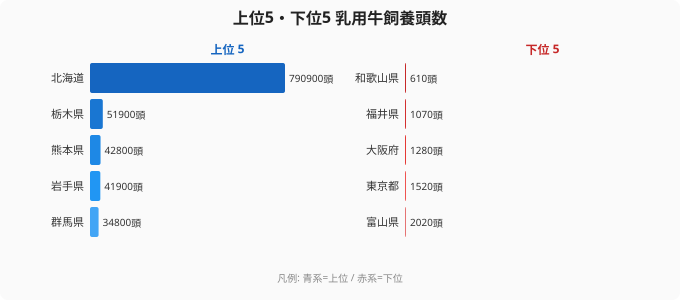

「牛乳の消費量が多い都市ほど、乳用牛の飼養頭数が少ない」──このパラドックスが、2018年の都道府県別データに鮮明に刻まれている。

農林水産省の畜産統計によると、北海道の乳用牛飼養頭数は790,900頭。これは47都道府県（沖縄除外の46道府県）の合計のうち、実に**約59.7%**を1道だけで占める数字だ。2位の栃木県が51,900頭であることを考えると、その差は約15倍。日本の酪農地図は、「北海道とそれ以外」という極端な二分構造になっている。

その一方で、下位に名を連ねるのは東京（1,520頭・43位）、大阪（1,280頭・44位）といった日本最大の牛乳消費地である都市圏だ。消費地と生産地がここまで乖離するのはなぜか。そして北海道への一極集中はどのような力学で形成されたのか。本記事では、ランキングの数字を起点に、日本の酪農構造の深部を読み解いていく。

## 乳用牛飼養頭数ランキング2018｜北海道の圧倒的独占と下位の顔ぶれ

<source-link href="/ranking/dairy-cattle-count">乳用牛飼養頭数ランキングの全件データを見る</source-link>

2018年の上位5道県と下位5県を並べると、格差の規模が一目で伝わる。

[北海道](/areas/01000)の790,900頭がいかに突出しているかは、2位以降と比較すれば明らかだ。2位の[栃木県](/areas/09000)は51,900頭で、北海道の6.6%に過ぎない。3位熊本県42,800頭、4位岩手県41,900頭、5位群馬県34,800頭と続くが、いずれも北海道の1割にも満たない。上位5道県の合計でさえ、北海道1道に届かない。

下位5県はまったく異なる顔ぶれだ。42位富山県2,020頭、43位東京都1,520頭、44位大阪府1,280頭、45位福井県1,070頭、46位（最下位）和歌山県610頭。最下位の和歌山県と北海道の差は**1,297倍**に達する。

> [!NOTE]
> 本データは農林水産省「畜産統計」(2018年2月1日時点調査)に基づく乳用牛の飼養頭数。乳用牛とはホルスタイン種を中心とした搾乳目的の牛を指し、肉用牛とは区別される。沖縄県は2018年統計の調査対象外のため本ランキングは46道府県が対象。また、都道府県の数値は事業所ベースではなく飼養地ベースで集計されている点に留意が必要だ。

上位2位以内に入る2道県の共通点は「冷涼な気候」と「広大な農地」だが、3位熊本・4位岩手はそれぞれ九州・東北の代表的な畜産地帯であり、北海道型の大規模経営とは異なる形で頭数を維持している。

## 東京・大阪が最下位グループに並ぶ逆説──消費地が生産地になれない構造的理由

最下位グループの顔ぶれを改めて確認すると、2つの異なるパターンが浮かび上がる。

**パターン1: 都市型（東京・大阪）**

東京都と大阪府はそれぞれ日本最大・第2位の牛乳消費地でありながら、乳用牛の飼養数は底を這う。東京都1,520頭、大阪府1,280頭という数字は、大規模農場1件分にも満たないレベルだ。

理由は単純かつ根本的だ。乳用牛の飼養には広大な牧草地が必要であり、都市部では土地コストが桁違いに高い。1頭の乳牛が必要とする放牧面積は一般的に0.5〜1.0ヘクタール程度とされる。東京都内でこれを確保するコストは、酪農経営として成立しないレベルに達している。

さらに搾乳・貯乳・冷却に必要な施設の維持コスト、周辺住民への臭気問題、廃水処理の規制など、都市環境での酪農には物理的・制度的な障壁が積み重なる。現在東京都内に残る少数の農場は、緑地保全や教育目的の側面が強く、商業酪農としての規模拡大余地はほぼない。

**パターン2: 気候・地形型（和歌山・福井・富山）**

和歌山県（610頭）・福井県（1,070頭）・富山県（2,020頭）はいずれも面積規模や気候帯の観点から「酪農に向かない」という構造的条件を抱えている。

和歌山県は温暖湿潤な気候で夏季の高温多湿が激しく、乳牛（特にホルスタイン種）には負担が大きい。ホルスタイン種は冷涼な気候を好み、20〜25℃を超えると泌乳量が著しく低下する「熱ストレス」を受けやすいとされている。

福井・富山は日本海側の降雪地帯で農地は存在するものの、傾斜地が多く大規模な牧草地の造成に適した平坦地が限られる。また、製造業が主要産業として発展してきた歴史的経緯から、農地の酪農転用が進まなかった背景もある。

> [!WARNING]
> 下位県の頭数が少ないことを「酪農が衰退した」と単純に解釈するのは注意が必要だ。東京・大阪は元来酪農適地ではなく、「減少した」のではなく「もともと少なかった」ケースが多い。また2018年のデータは単年次のスナップショットであり、1990年代以降の全国的な酪農農家数減少・規模拡大という長期トレンドの途中段階の数値でもある。長期的な変化を見るには複数年の時系列比較が不可欠だ。

## なぜ北海道に一極集中するのか──気候・土地・集積効果の3要因

北海道が全国の約6割を独占する構造は、単に「昔からそうだった」という惰性ではなく、明確な3つの力学が重なった結果だ。

**要因1: 気候の根本的な適性**

乳牛の生産性は気温に強く依存する。北海道の年平均気温は8〜10℃程度で、ホルスタイン種の適温帯（10〜20℃）に近い。夏季も最高気温が25℃を超える日が少なく、泌乳量の季節変動が本州と比べて小さい。

**要因2: 土地規模と牧草生産性**

北海道の総農地面積は約115万ヘクタールで、全国農地の約25%を占める（2018年農業センサス）。このうち牧草地・採草地の割合が高く、酪農の主要飼料である生草・乾草を安価に確保できる。大規模な土地利用が可能なため、1農場あたりの飼養頭数を増やすほど固定費の単位コストが下がる「規模の経済」が強く働く。

**要因3: 産業集積の自己強化**

酪農が集積すると、飼料供給・獣医サービス・乳製品加工・物流インフラの事業者も集積する。これにより農家は必要なサービスを低コストで調達でき、新規就農や規模拡大のハードルが下がる。

北海道には専門の農業高校・大学・研究機関が集中し、酪農技術の人材育成・普及も充実している。乳業メーカーの大規模工場が道内に集積することで、生乳の安定した引き取り先も確保されている。

この3要因が相互に強化し合う「正のフィードバックループ」が数十年かけて積み上がった結果が、現在の59.7%独占という数字だ。

> [!TIP]
> 乳用牛のランキングと合わせて確認したいのが「農業産出額」や「耕地面積」のランキングだ。北海道は乳用牛以外の畜産（肉用牛・豚）でも上位に位置し、農業産出額全体でも1位を占める。「酪農の強さ」は農業全体の強さとどう連動しているかを見ることで、北海道の農業構造の全体像が浮かび上がる。[農業カテゴリ](/category/agriculture)では乳用牛以外の畜産・耕種農業のランキングも横断的に確認できる。

## まとめ──数字が語る日本酪農の地理的必然

2018年の乳用牛飼養頭数から読み取れる構造をまとめると、次のようになる。

- **北海道790,900頭が全国比59.7%を独占**。2位栃木の約15倍、最下位和歌山の1,297倍という非対称な分布
- **上位グループ**は北海道・栃木・熊本・岩手・群馬で構成され、冷涼な気候と広大な農地という条件を共有している
- **下位グループ**は「都市圏（東京・大阪）」と「温暖・狭隘地形（和歌山・福井・富山）」という異なる2パターンに分かれる
- 東京・大阪が下位になるのは「酪農が衰退した」のではなく、**土地コスト・気候・規制の複合的な構造的制約**による
- 北海道への集積は「気候適性 × 土地規模 × 産業集積の自己強化ループ」という3要因が数十年かけて積み上がった必然の結果だ

[北海道の農業](/areas/01000)がいかに特異な存在かを示す指標として、乳用牛飼養頭数は最もわかりやすいデータの一つだ。[栃木県](/areas/09000)が2位に位置する背景には、関東の気候条件と那須・日光高原などの冷涼地帯の活用という地域戦略がある。[農業カテゴリ](/category/agriculture)では乳用牛以外の畜産・耕種農業のランキングも横断的に確認でき、都道府県ごとの農業の強みの違いが浮かび上がる。

## データ出典

農林水産省「畜産統計」2018年（2018年2月1日現在）。e-Stat 経由で整備。沖縄県は調査対象外のため本ランキングは46道府県を対象とする。
