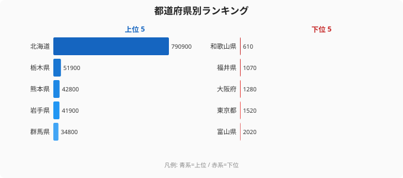

「最も牛乳を消費する都市が、最も乳用牛を飼養できない」──この逆説が、2018年の都道府県別データに数字として刻まれています。

農林水産省の畜産統計によると、東京都の乳用牛飼養頭数は1,520頭（43位）、大阪府は1,280頭（44位）です。日本最大の牛乳消費地であるはずの大都市圏が、46道府県中ほぼ最下位グループに並んでいます。一方でランキング1位の北海道は790,900頭と、全国合計の約59.7%を1道だけで占めています。

この記事のテーマは「なぜ北海道が強いか」ではありません。「**なぜ消費地が生産できないのか**」という問いです。需要と供給の乖離がこれほど極端な農産物は、日本では乳用牛以外にほとんど存在しません。その構造的な理由を、ランキングの数字を起点に読み解いていきます。

## 乳用牛飼養頭数ランキング2018｜消費地が下位に並ぶ地図

<source-link href="/ranking/dairy-cattle-count">乳用牛飼養頭数ランキングの全件データを見る</source-link>

2018年の上位5道県と下位5県を並べると、地理的な偏りの構造が鮮明に見えます。

1位は北海道790,900頭、2位は[栃木県](/areas/09000)51,900頭、3位熊本県42,800頭、4位[岩手県](/areas/03000)41,900頭、5位群馬県34,800頭と続きます。北海道の突出ぶりは際立っており、2位栃木の飼養数は北海道の6.6%に過ぎません。

下位5県は42位富山県2,020頭、43位[東京都](/areas/13000)1,520頭、44位[大阪府](/areas/27000)1,280頭、45位福井県1,070頭、46位和歌山県610頭です。最下位和歌山と1位北海道の差は**約1,297倍**に達します。

> [!NOTE]
> 本データは農林水産省「畜産統計」(2018年2月1日時点調査)に基づく乳用牛（めす）の飼養頭数です。乳用牛はホルスタイン種を中心とした搾乳目的の牛を指し、肉用牛とは区別されます。沖縄県は2018年統計の調査対象外のため本ランキングは46道府県が対象です。

上位5道県と下位5県を地理的に見ると、上位は「北日本・高冷地」に集中し、下位は「南関東大都市圏・温暖地・日本海沿岸」に集まります。これは偶然ではなく、酪農という産業の物理的な制約を反映しています。

## なぜ東京・大阪は乳用牛を飼えないのか──3つの構造的障壁

東京（43位・1,520頭）と大阪（44位・1,280頭）が最下位グループに並ぶ理由は、需要の多寡とは無関係の構造的な制約です。

**障壁1: 土地コストと面積要件**

乳用牛1頭の飼養には、放牧用・飼料栽培用を合わせて0.5〜1.0ヘクタール程度の農地が必要とされています。東京都内の農地地価は1ヘクタールあたり数千万〜数億円に達する地域も珍しくなく、この土地コストだけで酪農経営の採算が成立しません。現在都内に残る農場の多くは、農業体験・教育目的の小規模施設であり、商業的な生乳生産を担うものではありません。

大阪府も状況は似ており、可用農地の絶対量が少なく、残存農地の地価も高水準です。牛舎・搾乳施設・冷却タンクを整備するための設備投資コストが土地コストと重なり、採算ラインを大幅に超えます。

**障壁2: 都市環境の規制と近隣問題**

酪農施設は、ふん尿による臭気・排水・ハエの発生を伴います。人口密集地では、近隣住民への生活環境影響が大きく、自治体の農地・農業関連条例や環境規制のハードルも高くなります。都市圏では、農業振興地域の指定自体が限られており、新規に酪農施設を建設する用地を法的に確保することが困難です。

**障壁3: 生乳輸送のコスト構造**

生乳は鮮度が命であり、搾乳後すぐに冷却して輸送する必要があります。都市圏の場合、搾乳から消費者の食卓までの距離が近いように見えますが、都市部の酪農場は規模が小さいため、乳業メーカーの集乳ルートに乗りにくく、輸送コストが割高になります。大規模産地（北海道・栃木・群馬など）では集乳効率が高く、長距離輸送のコストを補ってなお競争力があります。

> [!WARNING]
> 東京・大阪の飼養頭数が少ないことを「酪農業が廃れた」と解釈するのは正確ではありません。これらの都市はもともと大規模酪農の適地ではなく、「衰退した」のではなく「構造的に育ちにくい」状況です。日本全体の乳用牛頭数は1990年代以降、農家数の減少と1農場あたりの規模拡大が同時進行しており、大都市圏での廃業もその文脈の中にあります。

## 上位グループが「冷涼かつ広大」な地域に集まる理由

下位の「都市圏・温暖地」と対照的に、上位は「冷涼な気候と広大な農地」を持つ地域が並びます。

**北海道（790,900頭・1位）**

年平均気温8〜10℃程度の冷涼な気候は、ホルスタイン種の適温帯（10〜20℃）と重なります。夏季でも高温の日が少なく、熱ストレスによる泌乳量の低下が本州と比べて抑えられます。総農地面積は約115万ヘクタールで全国の約25%を占め、牧草地・採草地の確保が容易です。規模の経済が働きやすく、1農場あたりの飼養頭数も全国平均を大きく上回ります。

**栃木・群馬（2位・5位）**

関東北部に位置するこれらの県は、那須高原・榛名高原といった標高700〜1,200mの冷涼な高原地帯を擁しています。都市部への生乳輸送距離が短く、気候的な適性と市場へのアクセスを両立できる希少な立地です。栃木県（51,900頭）は、大消費地である首都圏に近いという地理的な優位性から、輸送コストを抑えた生乳供給が可能になっています。

**熊本・岩手（3位・4位）**

九州・東北のそれぞれの代表的な畜産地帯で、阿蘇高原（熊本）・岩手内陸部（岩手）など冷涼な高原地帯が酪農適地になっています。いずれも農地単価が北海道並みに低く、大規模経営が成立しやすい条件を備えています。

<source-link href="/ranking/dairy-cattle-count">上位10・下位10の全データはランキングページで確認できます</source-link>

## 消費地と生産地の乖離──乳用牛に特有の逆説

米・野菜・果物では、消費地に近い産地が強い「産消近接」型の農産物が多いです。なぜ乳用牛だけが、消費地から最も遠い北海道に集中するのでしょうか。

理由は乳用牛が「**土地集約型かつ環境感応型**」という点にあります。つまり、広い農地と冷涼な気候の両方が必要で、どちらが欠けても経済的な飼養が難しくなります。都市圏はこの2条件の両方を満たせない地域です。

また、「産地から消費地まで冷蔵輸送で翌日届く」というインフラが整備されたことで、遠距離生産の制約が消えました。北海道から本州への生乳輸送は一部で行われており（バター・チーズ等の乳製品としての形態が主流）、生乳の産地消費規制が緩和されてきた経緯もあります。

> [!TIP]
> 乳用牛と対照的に見ると興味深いのが「ブロイラー（肉用若鶏）」です。ブロイラーは飼養施設がコンパクトで短期飼育が可能なため、消費地に近い地域でも競争力があります。農産物ごとに「土地・気候・輸送の制約」がどう異なるかを比較すると、[農業カテゴリ](/category/agriculture)の各ランキングが別の意味を持って見えてきます。

## まとめ──消費地と生産地が逆転する構造的な必然

2018年の乳用牛飼養頭数から見えた逆説の構造をまとめます。

- **北海道790,900頭（1位）・和歌山610頭（46位）で約1,297倍の開き**。全国比では北海道だけで59.7%を占めます
- **最大消費地の東京は43位（1,520頭）・大阪は44位（1,280頭）**。牛乳需要と乳用牛飼養数が逆相関しています
- 東京・大阪が下位になる理由は「酪農の衰退」ではなく、**土地コスト・環境規制・採算構造という構造的な制約**です
- 上位の北海道・栃木・熊本・岩手・群馬はいずれも「**冷涼な気候 + 広大な農地**」という2条件を満たしています
- 乳用牛は「土地集約型かつ環境感応型」という産業特性ゆえに、**消費地と生産地が乖離する農産物の典型例**です

[北海道](/areas/01000)が圧倒的な1位となる背景は別記事「[乳用牛は北海道が6割独占｜なぜ酪農だけ一極集中するのか](/blog/dairy-cattle-hokkaido-monopoly)」で詳しく読み解いています。この記事で扱った「なぜ消費地が生産できないか」と合わせることで、日本酪農の地理的構造が立体的に見えてきます。[農業カテゴリ](/category/agriculture)ではほかの畜産・耕種農業のランキングも横断的に確認できます。

## データ出典

農林水産省「畜産統計」2018年（2018年2月1日現在）。e-Stat 経由で整備。沖縄県は調査対象外のため本ランキングは46道府県を対象とします。
