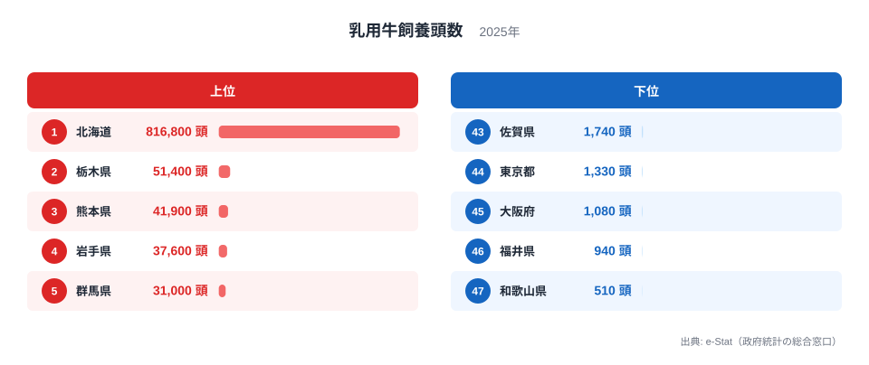
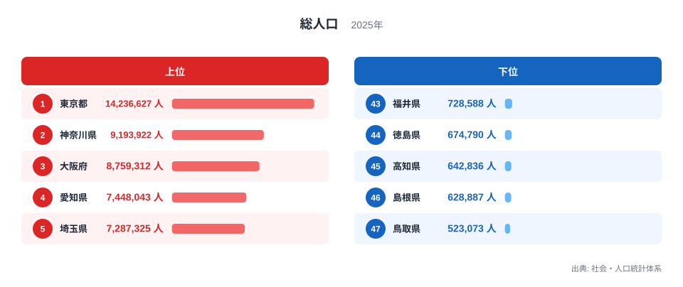
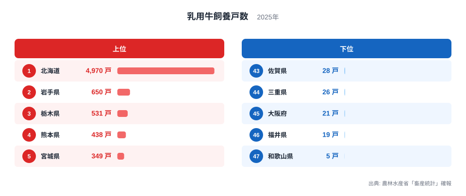

人口が最も多い東京都は、乳用牛をどれだけ飼っているのでしょうか。2025年の都道府県別データで見ると、東京都の乳用牛飼養頭数は1,330頭で44位でした。人口3位の大阪府も1,080頭で45位です。東京都と大阪府は牛乳を飲む人も多いと考えるのが自然ですが、牛を飼う頭数では47都道府県の下位に並んでいます。

一方で、1位の北海道は816,800頭です。47都道府県の合計1,293,090頭のうち63.2%を1道で占め、北海道を除く46都府県を全部足した476,290頭の約1.7倍にあたります。

この記事の問いは「なぜ東京と大阪で少ないのか」です。先に答えの要点を書きます。乳用牛の頭数は、乳用牛を飼う飼養者の戸数と、1戸あたりの頭数を掛け合わせた値です。この2つに分けると、東京都は戸数が37位と下位寄りで、1戸あたりの頭数が47都道府県で最小でした。大阪府は戸数が45位で、福井県・和歌山県・佐賀県を含む下位の都府県では、戸数の少なさが目立ちます。人口の多さとの関係は、人口の多い県ほど頭数も多いという総数の見方と、人口で割ると逆向きになる見方で食い違うため、人口の多さだけでは説明できません。

## 乳用牛飼養頭数ランキング2025｜北海道が突出し、下位に東京・大阪が並ぶ

<source-link href="/ranking/dairy-cattle-count">乳用牛飼養頭数ランキングの全件データを見る</source-link>

2025年の上位5道県は、1位が北海道の816,800頭、2位が[栃木県](/areas/09000)の51,400頭、3位が熊本県の41,900頭、4位が[岩手県](/areas/03000)の37,600頭、5位が群馬県の31,000頭です。2位の栃木県は北海道の6.3%にとどまり、北海道は栃木県の約15.9倍にあたります。

下位5都府県は、43位が佐賀県の1,740頭、44位が[東京都](/areas/13000)の1,330頭、45位が[大阪府](/areas/27000)の1,080頭、46位が福井県の940頭、47位が和歌山県の510頭です。1位の北海道と最下位の和歌山県の差は約1,602倍で、下位5都府県を全部足した5,600頭でも北海道のわずか0.7%です。

> [!NOTE]
> 乳用牛飼養頭数は、農林水産省「畜産統計調査」にもとづく乳用牛（めす）の飼養頭数の合計です。肉用牛は含みません。生乳の生産量や牛乳の消費量ではなく、飼われている牛の頭数そのものを数えた値で、人口や面積で割っていない実数のランキングです。沖縄県を含む47都道府県が対象です。

偏りは1位だけにとどまりません。上位5道県の合計978,700頭で全体の75.7%、上位10道県の合計1,074,600頭で83.1%を占めます。1万頭以上を飼っているのは19位の福島県までの19道県で、5,000頭に届かない都府県は21あります。47都道府県のちょうど中央にあたる24位は三重県の7,040頭で、北海道の約116分の1です。

北海道を除く46都府県の中でも地域差があります。茨城県・栃木県・群馬県の北関東3県の合計は105,300頭で、福岡・佐賀・長崎・熊本・大分・宮崎・鹿児島の九州7県の94,130頭や、青森・岩手・宮城・秋田・山形・福島の東北6県の87,680頭を上回ります。一方、埼玉県・千葉県・東京都・神奈川県の南関東4県は36,130頭で、同じ関東でも北関東の約3分の1です。ただし南関東の中でも千葉県は25,200頭で6位と上位に入っており、南関東だから少ない、とは言い切れません。

上位の顔ぶれには冷涼な気候や広い土地を持つ地域が多い可能性がありますが、気温や農地のデータはこの記事では使っていないため、確かめられていません。

## 人口との関係は、見る尺度で向きが変わる

<source-link href="/ranking/total-population">総人口ランキングの全件データを見る</source-link>

牛乳の需要の目安として、2025年の総人口を並べます。人口は1位が東京都の14,236,627人、2位が神奈川県の9,193,922人、3位が大阪府の8,759,312人、4位が愛知県の7,448,043人、5位が埼玉県の7,287,325人です。なお、2つの値は調査の時点が同じではありません。総人口は令和7年国勢調査の値で、基準日は2025年10月1日です。乳用牛の頭数と戸数は畜産統計の値で、調査時点は2025年2月1日現在です。どちらも2025年の値ですが約8か月のずれがあるため、この記事では順位を大まかに見比べる目的にだけ使います。

この5都府県の乳用牛飼養頭数の順位は、東京都が44位、神奈川県が31位、大阪府が45位、愛知県が8位、埼玉県が25位です。人口が多いのに乳用牛も上位に入っているのは愛知県で、17,800頭を飼っています。人口6位の千葉県は25,200頭で、乳用牛も6位です。人口9位の北海道は、乳用牛で1位です。

人口が少ない側にも例外があります。人口が最も少ない鳥取県は乳用牛飼養頭数が22位の8,520頭、人口46位の島根県は18位の10,500頭です。人口が少ないから乳用牛も少ない、とも言えません。

47都道府県すべてで、人口の順位と乳用牛飼養頭数の順位の相関係数を計算すると約0.3でした。この値は1に近いほど2つの順位が同じ向きに並び、負の値なら逆向きに並ぶことを表します。約0.3は、人口が多い都道府県ほど乳用牛もやや多いという弱い正の関係です。ただし、総数どうしの比較には、都道府県の規模の違いが共通の背景として混ざります。規模の大きな都道府県は、人口も頭数も大きくなりやすいためです。この値は、人口が多いと牛が少ないのかを、そのまま測ったものではありません。

そこで、乳用牛飼養頭数を人口10万人あたりに直して比べました。東京都は9.3頭で47位、大阪府は12.3頭で46位、神奈川県は41.2頭で45位となり、人口の多い上位3都府県が、そのまま下位3都府県になります。47都道府県全体では、人口10万人あたり約1,052頭です。愛知県は総数では8位でも、人口10万人あたりでは239.0頭で32位に下がり、千葉県も総数6位に対して402.7頭で23位です。人口の順位と人口10万人あたり頭数の順位の相関係数は−0.28で、北海道を除くと−0.33でした。人口が多い都道府県ほど、人口10万人あたりの頭数は少ない向きに変わります。

人口で割った値は、分母の人口が大きい都道府県ほど小さくなりやすい性質があり、−0.28という向きの一部は割り算の仕組みから生じます。総数では人口の多い都道府県ほど牛もやや多く、人口で割ると人口の多い都道府県ほど牛が少なくなるという、尺度によって向きが変わる関係です。東京都と大阪府の少なさは人口の多さだけでは説明できませんが、人口との関係がないとも言えません。

> [!WARNING]
> ここでの人口は、牛乳の需要の目安にすぎません。実際の牛乳の消費量は年齢構成や食習慣でも変わります。また、相関係数は2つの順位が同じ向きに動くかどうかを示すだけで、人口が乳用牛の頭数を決めている、あるいはその逆だという因果までは示しません。

## 下位5都府県は、戸数と1戸あたり頭数に分けて見る

<source-link href="/ranking/dairy-cattle-holdings">乳用牛飼養戸数ランキングの全件データを見る</source-link>

頭数は、乳用牛を飼う飼養者の戸数と、1戸あたりの頭数を掛け合わせた値です。そこで、同じ畜産統計の乳用牛飼養戸数を使い、頭数を戸数で割って1戸あたりの頭数を求めました。47都道府県の戸数の合計は11,322戸で、1戸あたりでは約114頭になります。北海道は4,970戸で47都道府県の戸数の合計の43.9%、頭数では63.2%を占め、1戸あたりでは約164頭と、北海道を除く46都府県の約75頭の2倍以上です。

> [!NOTE]
> 乳用牛飼養戸数は、搾乳を目的とする乳用牛を飼養している飼養者の戸数です。法人の数ではありません。1戸あたり頭数は、頭数の表と戸数の表が別のため、この記事で割り算して求めた値です。頭数が10頭単位に丸められている県では、誤差が出やすくなります。

乳用牛飼養戸数の下位5都府県は、47位が和歌山県の5戸、46位が福井県の19戸、45位が大阪府の21戸、44位が三重県の26戸、43位が佐賀県の28戸です。頭数の下位5都府県のうち、東京都を除く佐賀県・大阪府・福井県・和歌山県の4府県は、戸数でも下位5に入っています。47都道府県で頭数の順位と戸数の順位の相関係数を計算すると0.93で、戸数の多い都道府県ほど頭数も多い関係がはっきり出ます。頭数の順位と1戸あたり頭数の順位の相関係数は0.40にとどまり、頭数の差は1戸あたりの規模より戸数の差に沿って並んでいます。例外もあり、三重県は戸数が44位と少ないのに、頭数は24位と47都道府県のちょうど中央にあります。

東京都と大阪府を分けて見ます。東京都は40戸で37位と、戸数だけなら下位寄りにとどまり、山梨県と同じ戸数です。ところが1戸あたりでは約33頭で、47都道府県で最小です。これは47都道府県合計の約114頭の3割に届かない規模で、東京都の頭数が44位まで下がるのは、戸数が少ないことに加えて、1戸あたりの頭数も最小という2つが重なったためと読めます。大阪府は21戸で45位、1戸あたりは約51頭で39位です。福井県も19戸で46位、1戸あたり約49頭で41位で、どちらも戸数が少なく、1戸あたりも47都道府県合計の約114頭の半分に届きません。

人口の少ない側の福井県・和歌山県・佐賀県は、福井県が19戸、和歌山県が5戸、佐賀県が28戸と、戸数の少なさが目立ちます。和歌山県は戸数が最少の5戸ですが、1戸あたりは約102頭で47都道府県の5位にあたり、47都道府県合計の約114頭に近い規模です。佐賀県は1戸あたり約62頭で31位です。人口の多さだけを理由にすると、この3県の少なさは説明がつきません。

戸数が少ないことは、頭数が少ないことを別の角度から言い直した面があります。なぜ戸数が少ないのかについて、東京都と大阪府では、牛舎や飼料用の農地を広く確保しにくい、住宅が近く臭気や排水への配慮が欠かせない、といった都市ならではの事情が重なっている可能性があります。ただし、このデータだけでは確かめられません。福井県・和歌山県・佐賀県が少ない理由も、このデータからは読み取れません。理由を確かめるには、農地の広さなど別の指標との比較が必要です。

あわせて見る: [耕地面積ランキング](/ranking/cultivated-area)

## まとめ──東京と大阪の少なさは、人口の多さだけでは説明できない

2025年の乳用牛飼養頭数から読み取れたことをまとめます。

- 1位の北海道は816,800頭、最下位の和歌山県は510頭で、約1,602倍の差があります。
- 北海道1道で47都道府県の合計の63.2%を占め、上位5道県では75.7%に達します。
- 東京都は1,330頭で44位、大阪府は1,080頭で45位です。人口は1位と3位ですが、人口4位の愛知県は8位、6位の千葉県は6位と、人口の多い都府県がすべて少ないわけではありません。
- 人口の順位と乳用牛の順位の相関係数は約0.3で弱い正の関係でしたが、人口10万人あたりに直すと東京都・大阪府・神奈川県が下位3都府県になり、相関係数は−0.28と向きが変わります。
- 頭数の順位は戸数の順位に沿って並び、相関係数は0.93です。東京都は戸数が37位と下位寄りで、1戸あたり約33頭は47都道府県で最小です。大阪府・福井県・和歌山県・佐賀県は、戸数が下位5に入っています。
- 戸数がなぜ少ないのかは、このデータだけでは確かめられません。

北海道への集中が乳用牛だけのことなのかは、肉用牛・豚・採卵鶏・耕地面積の全国に占める割合と比べた[北海道の乳用牛の集中を他の畜産と比べた記事](/blog/dairy-cattle-hokkaido-monopoly)で確かめています。ほかの畜産や農作物のランキングは[農林水産業カテゴリ](/category/agriculture)、人口に関するランキングは[人口・世帯カテゴリ](/category/population)から探せます。

## データについて

この記事の数値は、乳用牛飼養頭数、乳用牛飼養戸数、総人口の2025年の都道府県別の値から計算しています。乳用牛の頭数と戸数は畜産統計にもとづく値で、調査時点は2025年2月1日現在です。総人口は令和7年国勢調査にもとづく値で、基準日は2025年10月1日です。

- 合計は、47都道府県の乳用牛飼養頭数を足した値です。割合はその頭数を合計で割った値、倍率は北海道の頭数を最下位の和歌山県の頭数で割った値です。
- 北関東3県、九州7県、東北6県、南関東4県の合計は、本文に挙げた県の値を足した値です。
- 1戸あたり頭数は、乳用牛飼養頭数を乳用牛飼養戸数で割った値です。頭数と戸数は取り込み元の表が別で、割り算はこの記事で行ったため、公表されている別の集計値とは一致しない場合があります。47都道府県全体の値は、頭数の合計を戸数の合計で割っています。
- 人口10万人あたり頭数は、乳用牛飼養頭数を総人口で割って10万を掛けた値です。47都道府県全体の値は、頭数の合計を人口の合計で割っています。
- 相関係数は、2つの値の順位から計算した値です。人口と頭数、人口と人口10万人あたり頭数、頭数と戸数、頭数と1戸あたり頭数の4組を計算しました。同じ値の県には平均の順位を使いました。
- 掲載されている乳用牛飼養頭数は、1万頭未満が10頭単位、1万頭以上が100頭単位にそろっています。公表値が丸められている可能性があり、足し合わせた合計や割合にはその分の誤差が含まれます。1戸あたり頭数は、戸数が少ない県ほどこの丸めの影響を受けやすくなります。
- 乳用牛飼養戸数は丸めの影響で、47都道府県の合計が全国値と一致しない場合があります。
