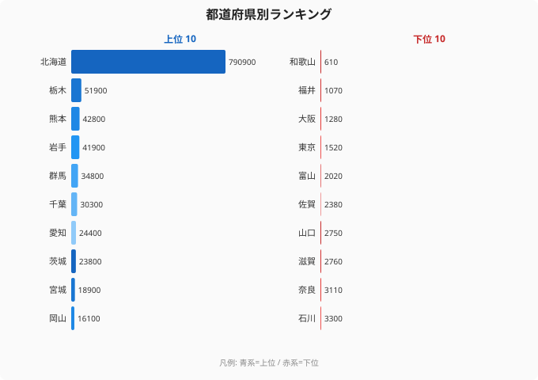

「牛乳といえば[北海道](/areas/01000)」——多くの人が持つこのイメージは、データで見ると「イメージ」どころか圧倒的な現実だった。

2018年の乳用牛飼養頭数を47都道府県で比べると、北海道は **790,900頭**。2位の栃木県（51,900頭）の約15倍、最下位の[和歌山県](/areas/30000)（610頭）とは実に **1,297倍** もの開きがある。米や野菜、果樹といった他の農産物では、ここまで極端な一極集中は起きない。

なぜ酪農だけが、これほど1つの地域に偏るのか。本記事では上位・下位の顔ぶれと、その背後にある「酪農という産業の特殊な制約」を読み解いていく。読み終えると、「北海道が強い」のではなく「北海道以外が酪農に向きにくい」という逆向きの構造が見えてくる。

> [!NOTE]
> 本データは農林水産省「畜産統計」（2018年）に基づく、乳用牛（めす）の飼養頭数合計。e-Stat（政府統計の総合窓口）経由で整備した値です。沖縄県は当該年の集計対象に含まれず、46道府県のランキングとなっています。

## 乳用牛飼養頭数 上位10と最下位

まず全体像を見る。上位10道県と最下位5県を並べると、1位北海道の突出ぶりが一目でわかる。

数字を積み上げると偏りの異常さがはっきりする。46道府県の合計は約132万頭。そのうち北海道1道だけで **59.7%** を占める。上位10道県を足してもおよそ108万頭で、その大半が北海道の取り分だ。

2位以下の顔ぶれにも傾向がある。栃木・群馬・千葉・茨城（関東圏）と、熊本・岩手・宮城（東北・九州）が並ぶ。これらは「大消費地である首都圏に近い」か「広い飼料畑を確保できる」かのどちらか、あるいは両方を満たす地域だ。乳用牛飼養頭数ランキングのより詳しい順位は、関連ランキングで確認できる。

<source-link href="/ranking/dairy-cattle-count">乳用牛飼養頭数ランキングをもっと見る</source-link>

## 最下位グループに共通する「都市」と「温暖」

最下位5県を見ると、上位とは対照的な構造が浮かぶ。富山（2,020頭）、東京（1,520頭）、大阪（1,280頭）、福井（1,070頭）、そして最下位の和歌山（610頭）——上のチャート右側に並ぶこれらの顔ぶれは、下位に沈むのは2タイプに大別できることを示している。

ひとつは **大都市圏**。東京・大阪は地価が高く、牛舎や飼料畑に使える広い土地を確保しにくい。糞尿処理や臭気の問題で、人口密集地での大規模酪農はそもそも成立しづらい。

もうひとつは **温暖・狭隘な地域**。和歌山は果樹（みかん・梅）が農業の主力で、乳用牛の出る幕が少ない。乳用牛（ホルスタイン）は暑さに弱く、夏が長く高温になる地域では飼養効率が落ちる。沖縄が集計対象から外れていること自体が、この「暑さに弱い」という制約を象徴している。

## なぜ酪農だけが一極集中するのか

同じ農業でも、米や野菜のランキングはここまで偏らない。乳用牛だけが1道で6割を占めるのには、酪農固有の理由がある。

**理由1：涼しい気候の優位。** 乳用牛は高温に弱く、暑熱ストレスで乳量が落ちる。冷涼な北海道はこの一点で他地域に対して構造的に有利だ。

**理由2：広大な土地と自給飼料。** 酪農は牛1頭あたりに必要な飼料も土地も大きい。北海道は1戸あたりの経営規模が大きく、牧草地を自前で確保しやすい。これは農業の「強さ」を面積でも金額でも押し上げる。実際、農業産出額でも北海道は1兆3,478億円で全国1位（2023年度）と、酪農を含む畜産がその土台になっている。

**理由3：規模の経済と集積。** 集乳・加工・物流の拠点が集まるほど、新たな酪農家も集まりやすい。一度できた集積は自己強化する。

> [!WARNING]
> 本データは2018年時点の頭数で、頭数の「絶対量」を示すもの。1戸あたりの規模や経営効率は別の指標で見る必要があります。また飼養頭数は離農や規模拡大で年々変動するため、最新の構造を断定する根拠にはしない方が安全です。

> [!TIP]
> 「総額（頭数）が大きい＝産業として効率的」とは限りません。農業の強さは総額・1人当たり・面積当たりで勝者が入れ替わります。同じ北海道でも、土地効率の物差しに変えると順位が大きく動くことが知られています。下の関連記事で、その逆説を確認してみてください。

## まとめ

- 乳用牛飼養頭数1位は **北海道（790,900頭）**、最下位は **和歌山県（610頭）** で約 **1,297倍** の格差。
- 北海道1道で全国（46道府県）の **59.7%** を占める、農産物の中でも突出した一極集中。
- 2位栃木（51,900頭）でも1位の約15分の1。上位は関東圏と東北・九州の一部に限られる。
- 下位は **大都市圏（東京・大阪）** と **温暖・狭隘な地域（和歌山）** の2タイプ。
- 集中の真因は「北海道が強い」より「冷涼な気候・広い土地・集積」という酪農固有の制約で、他地域が向きにくいこと。

## データ出典

農林水産省「畜産統計」（2018年）。e-Stat（政府統計の総合窓口）経由で整備。乳用牛（めす）の飼養頭数合計。沖縄県は当該年の集計対象外。

本記事の対象データ: [関連カテゴリ](/category/agriculture)
