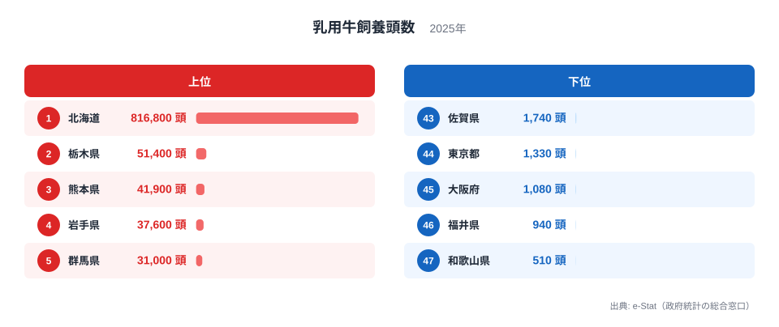
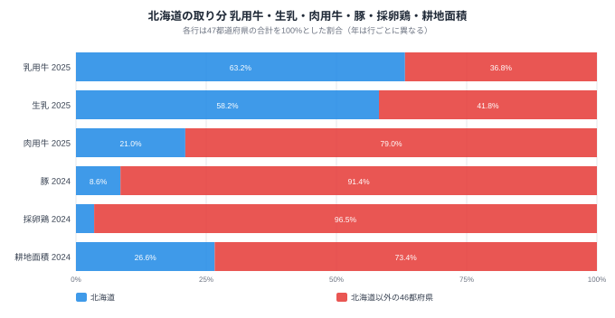

「牛乳といえば[北海道](/areas/01000)」というイメージは、乳用牛の頭数で見ても当てはまるのでしょうか。2025年2月1日現在の乳用牛飼養頭数を47都道府県で比べると、北海道は816,800頭で1位でした。47都道府県の合計は1,293,090頭で、北海道だけで63.2%を占めます。北海道以外の46都府県をすべて足した476,290頭と比べても、北海道は約1.7倍です。

2位の[栃木県](/areas/09000)は51,400頭で、北海道は約15.9倍にあたります。最下位の[和歌山県](/areas/30000)は510頭で、北海道とは約1,602倍の差があります。

この記事の問いは、タイトルのとおり「6割もの集中が起きているのは乳用牛だけなのか」です。肉用牛、豚、採卵鶏の頭数と耕地面積について、北海道が占める割合を並べて確かめます。結論を先に書くと、この記事で比べた範囲では、北海道の取り分が農地の割合を大きく上回るのは乳用牛と、その生産物である生乳だけでした。さらに、北海道の乳用牛の63.2%は、飼養戸数の割合43.9%と、1戸あたりの頭数が47都道府県全体の約1.44倍という2つの積に分けられます。ただし、なぜ北海道に戸数も規模も集まるのかという理由までは、このデータでは答えられません。確かめられることと確かめられないことを分けて書きます。

> [!NOTE]
> 乳用牛飼養頭数は、農林水産省「畜産統計調査」にもとづく乳用牛（めす）の飼養頭数の合計で、2025年2月1日現在の値です。沖縄県を含む47都道府県が対象で、この記事の割合は47都道府県の合計に対する値です。

## 乳用牛飼養頭数ランキング2025｜2位から5位を足しても北海道の5分の1

<source-link href="/ranking/dairy-cattle-count">乳用牛飼養頭数ランキングの全件データを見る</source-link>

2025年の1位は北海道の816,800頭で、2位の[栃木県](/areas/09000)は51,400頭、3位の[熊本県](/areas/43000)は41,900頭、4位の[岩手県](/areas/03000)は37,600頭、5位の群馬県は31,000頭です。2位から5位の4県を足しても161,900頭で、北海道の約5分の1にとどまります。2位の栃木県でも、47都道府県の合計に占める割合は4.0%で、上位5道県は北海道だけが飛び抜けて多い並びです。

下位は、43位の佐賀県が1,740頭、44位の[東京都](/areas/13000)が1,330頭、45位の大阪府が1,080頭、46位の福井県が940頭、47位の[和歌山県](/areas/30000)が510頭です。5都府県を全部足しても5,600頭で、北海道の0.7%にしかなりません。下位がなぜ少ないのかは、このランキングだけでは確かめられません。頭数を飼養戸数と1戸あたりの頭数に分けて下位の都府県を見た結果は、[乳用牛の頭数と飼養戸数を都道府県別に比べた記事](/blog/dairy-cattle-count)にまとめています。この記事では、同じ分け方を北海道の側に当てはめて、集中の中身を後の節で確かめます。

## 北海道の取り分を、ほかの家畜と農地の広さで比べる

6割という数字が大きいのかどうかは、物差しがないと判断できません。そこで、乳用牛と同じ畜産統計調査の肉用牛・豚・採卵鶏、乳用牛から搾る生乳の生産量、農地の広さの目安として耕地面積を選び、北海道が47都道府県の合計の何%を占めるかを並べました。耕地面積は農地全体の総面積で、牛の飼料を育てる土地だけを取り出した値ではないため、あくまで目安です。図の6つの値は、それぞれの指標で取り込まれている最新の年を使っているため、年がそろっていません。年の内訳は図のあとの注意書きに書きました。

いちばん大きいのは乳用牛の63.2%で、生乳の生産量も58.2%を北海道が占めます。物差しにした耕地面積の取り分は、図の最下行の26.6%です。乳用牛の取り分は、農地の取り分の約2.4倍にあたります。一方、肉用牛は544,700頭で21.0%と、耕地面積の取り分を下回ります。豚は752,200頭で8.6%、採卵鶏は4,524千羽で3.5%で、どちらもさらに低い値です。ほかの行の取り分は、最下行の26.6%と見比べてください。牛・豚・採卵鶏のなかで、北海道の取り分が農地の取り分を大きく上回るのは乳用牛だけで、乳用牛から搾る生乳でも同じでした。

タイトルの問いに、この範囲で答えると「はい」です。ほかの家畜や農地の広さと比べて北海道の取り分が突き出ていたのは乳用牛と生乳で、同じ牛でも肉用牛は2割ほどでした。生乳は乳用牛から搾るので、この2つは別々の集中が2つ見つかったのではなく、同じ酪農の集中を頭数と生産量で見たものと読めます。ただし、肉用牛には肥育を目的に飼う乳用種も含まれるため、肉用種だけの取り分ではありません。また、比べたのは5つの指標と耕地面積だけで、米や野菜、馬や羊など、ほかの農畜産物は調べていません。「酪農だけ」と言えるのは、あくまで今回の範囲に限った話です。

> [!WARNING]
> 図の6つの値は、年も基準もそろっていません。各行は、その指標で取り込まれている最新の年を使っています。乳用牛と肉用牛は2025年2月1日現在の頭数、生乳は2025年1〜12月の年間生産量、豚と採卵鶏は2024年2月1日現在の頭数、耕地面積は2024年度の値です。豚と採卵鶏が2024年なのは、2025年は農林業センサスの実施年にあたり、畜産統計調査の豚と採卵鶏の調査が休止されたためです。耕地面積が2024年度なのは、このサイトで扱っている耕地面積の最新の年度が2024年度で、2025年度の値がまだ無いためです。年のずれは最大で1年です。この記事が読み取るのは、乳用牛と生乳が耕地面積の取り分を30ポイント以上上回るという大きな差と、肉用牛・豚・採卵鶏が耕地面積の取り分より低いという並びで、1ポイント単位の差は比べていません。頭数はある時点の在庫、生乳は1年間の生産量なので、乳用牛の割合と生乳の割合を引き算したり、1頭あたりの生産量を計算したりすることはできません。

あわせて見る: [肉用牛飼養頭数ランキング](/ranking/beef-cattle-count) / [豚飼養頭数ランキング](/ranking/pig-count) / [採卵鶏の成鶏めす飼養羽数ランキング](/ranking/layer-hen-count) / [生乳生産量ランキング](/ranking/raw-milk-production) / [耕地面積ランキング](/ranking/cultivated-area)

## 北海道の6割は、飼う戸数と1戸あたりの規模に分けられる

なぜ北海道の乳用牛は6割を超えるのでしょうか。頭数は、乳用牛を飼う飼養者の戸数に、1戸あたりの頭数を掛けたものです。そこで、北海道の頭数の割合を「戸数の割合」と「1戸あたりの頭数が47都道府県全体の何倍か」の2つに分けてみます。

2025年2月1日現在の[乳用牛飼養戸数](/ranking/dairy-cattle-holdings)は、北海道が4,970戸で、47都道府県の合計11,322戸の43.9%を占めます。頭数の63.2%と比べると、戸数だけなら4割強にとどまります。1戸あたりの頭数は、北海道が約164頭で、47都道府県全体の約114頭の約1.44倍です。戸数の割合43.9%に1.44倍を掛けると63.2%になり、頭数の割合と一致します。

つまり、北海道の頭数の集中は、飼う戸数が全体の4割を超えていることに、1戸あたりの規模の大きさが上乗せされた結果として説明できます。北海道を除く46都府県の1戸あたり頭数は約75頭なので、これと比べると北海道の約164頭は2倍以上です。ただし、頭数の表と戸数の表は取り込み元が別なので、戸数の割合と1戸あたりの頭数は、この記事で割り算して求めた値です。

この分け方で分かるのは、頭数の中身までです。なぜ北海道に戸数が多く、1戸あたりの規模も大きいのかは分かりません。気候、牛の飼料を育てられる土地の広さ、牛乳を集めて工場へ運ぶ仕組みなどが関係している可能性があります。ただし、気温や牧草地の面積、乳業工場の立地は今回のデータに含まれていないため、確かめられていません。確かめるには、これらの指標を都道府県別に集めて、北海道を除く46都府県の中でも同じ傾向があるかを見る必要があります。

## 北海道を除くと、関東・九州・東北の順に多い

北海道に集まった残りの36.8%は、どこにあるのでしょうか。都道府県を地方別に足し合わせて確かめます。北海道に次いで多いのは関東7都県の141,430頭で、47都道府県の合計の10.9%です。次いで九州7県が94,130頭で7.3%、東北6県が87,680頭で6.8%、中部9県が61,100頭で4.7%、中国5県が44,280頭で3.4%、近畿7府県が28,760頭で2.2%、四国4県が15,340頭で1.2%、沖縄県が3,570頭で0.3%です。

北海道を除いて最大の地方である関東7都県を全部足しても、北海道の17.3%にすぎません。北海道の816,800頭は、関東の合計の約5.8倍にあたります。北海道の頭数は、どの地方の合計と比べても5倍以上の差があります。

地方の合計は、1つの県が引っ張っていることがあります。関東は栃木県の51,400頭が地方合計の36.3%、九州は熊本県の41,900頭が44.5%、東北は岩手県の37,600頭が42.9%を占めます。同じ関東地方でも、栃木県は51,400頭、東京都は1,330頭で、約39倍の差があります。「関東は乳用牛が多い」と地方のくくりだけで言うと、県ごとの大きな差が隠れてしまいます。

## まとめ──北海道の6割は、比べた範囲では乳用牛と生乳だけ

2025年の乳用牛飼養頭数から読み取れたことをまとめます。

- 乳用牛飼養頭数は、1位の北海道が816,800頭、最下位の和歌山県が510頭で、約1,602倍の差があります。
- 北海道だけで47都道府県の合計の63.2%を占め、北海道以外の46都府県の合計の約1.7倍です。2位から5位の4県を足しても、北海道の約5分の1です。
- 北海道の63.2%は、乳用牛飼養戸数の割合43.9%と、1戸あたりの頭数が47都道府県全体の約1.44倍という2つの積に分けられます。飼う戸数の多さに、1戸あたりの規模の大きさが上乗せされた形です。
- 北海道の取り分が耕地面積の26.6%を大きく上回るのは、乳用牛の63.2%と生乳の58.2%だけでした。肉用牛は21.0%、豚は8.6%、採卵鶏は3.5%です。
- 北海道を除くと、関東141,430頭、九州94,130頭、東北87,680頭の順に多くなります。ただし関東の中でも栃木県と東京都は約39倍の差があり、地方のくくりでは県ごとの差が隠れます。
- 北海道に戸数が多く、1戸あたりの規模も大きい理由は、気温・牧草地・乳業工場のデータを使っていないため、確かめられていません。

## データについて

この記事の割合や倍率は、都道府県別の値から計算しています。

- 割合は、北海道の値を47都道府県の値の合計で割った値です。この合計は47都道府県の値を足したもので、公表されている全国値とは丸めの違いで一致しない場合があります。倍率は、大きい値を小さい値で割った値です。
- 乳用牛飼養戸数は2025年2月1日現在の、乳用牛を飼養する飼養者の戸数で、法人の数ではありません。戸数の割合は北海道の戸数を47都道府県の戸数の合計で割った値、1戸あたりの頭数は乳用牛飼養頭数を乳用牛飼養戸数で割った値です。47都道府県全体の1戸あたり頭数は頭数の合計を戸数の合計で割り、北海道を除く46都府県の値は合計から北海道を引いて同じように割っています。頭数の割合は、戸数の割合と、1戸あたりの頭数が47都道府県全体の何倍かという倍率の積に等しくなります。
- 頭数の表と戸数の表は取り込み元が別で、1戸あたりの頭数はこの記事で割り算した値なので、公表されている別の集計値とは一致しない場合があります。
- 乳用牛飼養頭数と肉用牛飼養頭数は2025年2月1日現在、豚飼養頭数と採卵鶏の成鶏めす飼養羽数は2024年2月1日現在の値です。肉用牛は肉用種と乳用種を含みます。採卵鶏は成鶏めす1,000羽以上の飼養者が調査の対象で、羽数の単位は千羽です。
- 生乳生産量は2025年1〜12月の年間の量で、処理場・工場への出荷分と、自家飲用や子牛のほ乳用などの未出荷分を含みます。耕地面積は2024年度の総面積です。
- 地方別の合計は、都道府県コードの順で、北海道、東北6県、関東7都県、中部9県、近畿7府県、中国5県、四国4県、九州7県、沖縄県に分けて足した値です。中部は新潟県から愛知県まで、近畿は三重県から和歌山県までです。
- 公表されている乳用牛飼養頭数は丸められた値で、足し合わせた合計や割合にはその分の誤差が含まれる可能性があります。乳用牛飼養戸数も丸めの影響で、47都道府県の合計が全国値と一致しない場合があります。
