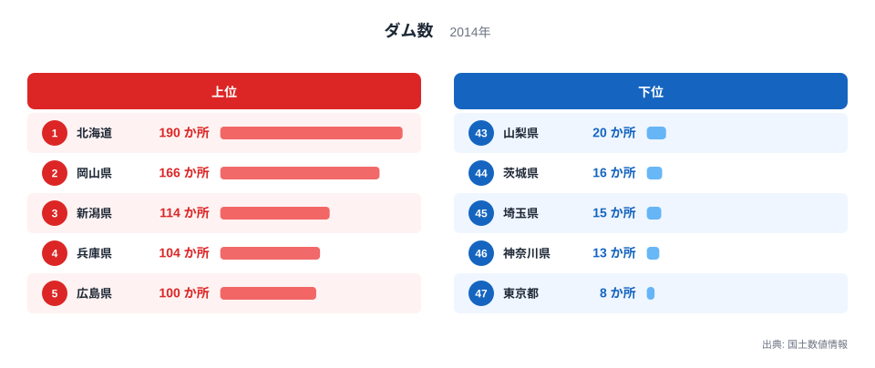
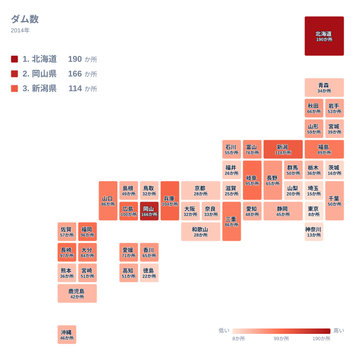

日本各地の川には、治水や利水のために建設されたダムが数多く存在します。都道府県ごとにその数を並べてみると、人口の多さとはまったく別の論理で分布していることに気づきます。特に、内陸の乾いた気候を持つ県や広大な山地を抱える県が上位に並ぶ一方で、首都圏を中心とした平野の県は下位に集まる傾向があります。ここでは国土数値情報のダムデータをもとに、その分布の背景を読み解きます。

## 上位と下位を分ける差

<source-link href="/ranking/dam-count">ダム数ランキングをもっと見る</source-link>

全国で最もダムが多いのは北海道で、190か所を数えます。2位は岡山県の166か所、3位は新潟県の114か所、4位は兵庫県の104か所、5位は広島県の100か所と続きます。広い土地に多くの河川を抱える北海道が突出しているのは想像しやすい一方、瀬戸内海に面した岡山県が新潟県や兵庫県を上回って2位に入っている点は意外に映るかもしれません。

反対に、最もダムが少ないのは東京都で、8か所にとどまります。46位は神奈川県の13か所、45位は埼玉県の15か所、44位は茨城県の16か所、43位は徳島県の22か所と続き、首都圏の主要な県がそろって下位に並んでいます。人口が集中する平野部の県ほどダムの数が少なくなっているのは、山地の少なさと土地利用の違いを映した結果だといえます。

6位の長崎県は97か所で、面積の割に多くのダムを抱えている県のひとつです。入り組んだリアス海岸と多数の半島・離島を抱える長崎県は、大きな河川に恵まれず、地域ごとに独立した水源を確保する必要があったため、小規模なダムが各地に分散して整備されてきたと考えられます。反対に、北海道に次いで広い面積を持つ岩手県は、53か所で21位にとどまっています。面積の広さがそのままダムの多さに直結するわけではなく、山地の急峻さや降水量、農業用水の需要規模といった条件の違いが、ダムの立地を左右していることがうかがえます。

> [!NOTE]
> このダム数は国土数値情報に登録された堤高15メートル以上のダムを対象に集計しています。農業用のため池や小規模な堰は含まれないため、地域によっては水利施設の総数とは一致しない点に注意が必要です。

## 地理でみる分布

地図で見ると、ダムの多い地域は北海道と中国地方、そして中部から近畿にかけての山間部に広がっていることがわかります。岡山県が166か所と多いのは、瀬戸内海式気候による少雨傾向のもとで、古くから農業用水や生活用水を安定的に確保するための貯水施設が数多く整備されてきた土地柄が背景にあると考えられます。同じ瀬戸内地域の広島県が100か所で5位、香川県が65か所で17位に入っているのも、同様の気候条件と関係していそうです。

7位の福岡県が96か所という多さを抱えている背景には、渇水への警戒感という歴史的な要因があります。1978年から翌年にかけて福岡市は深刻な水不足に見舞われ、長期間にわたる給水制限を経験しました。この記憶を教訓として、その後の福岡県では都市用水の安定供給を目的にダムの計画的な整備が進められてきたと考えられます。

一方、東京都や神奈川県、埼玉県のようにダムが少ない県は、いずれも平野が広く山地が少ないという地形上の制約があります。ダムを建設するには一定の落差や谷地形が必要なため、平坦な地形が中心の首都圏では、そもそも建設できる場所が限られています。

> [!WARNING]
> ダムの数は、その都道府県が使う水の量とは直結しません。東京都の水道用水の多くは、利根川水系や多摩川水系にある群馬県や山梨県のダムから供給されており、行政区域内のダム数だけでは水資源の依存関係を読み取ることはできません。

## なぜこの順位になるのか

首都圏の県がダム数で下位に並ぶ背景には、地形だけでなく水の使い方そのものの違いもあります。人口が集中する平野部の県は水の消費量が多い一方で、その水源となるダムは行政区域を越えた上流の県に立地していることが少なくありません。つまりダムの数が少ないからといって、その県が水資源に恵まれているとは限らないという点が、この指標を読むうえで重要な視点になります。

最下位の東京都は、都心部だけでなく多摩地域に丘陵地を抱えているにもかかわらず、ダム数はわずか8か所にとどまっています。これは都内に水源そのものが乏しいというより、都民が使う水の大半を、行政区域の外にある利根川水系や多摩川水系のダム群に依存してきた、長年にわたる水行政の構造を反映した結果だと考えられます。

北海道が190か所という圧倒的な数を誇っているのは、広大な面積に加えて、開拓期以降に治水・農業用水確保のための土地基盤整備が段階的に進められてきた歴史とも関係しています。[インフラ関連の統計一覧](/category/infrastructure)を見ると、道路網や港湾などの指標でも北海道が独自の傾向を示しており、広い国土をどう整備してきたかという視点で他の指標とあわせて比較すると理解が深まります。岡山県の分布傾向を詳しく知りたい場合は、[岡山県のデータ](/areas/33000)から他の指標もあわせて確認できます。[北海道のデータ](/areas/01000)も同様に参照できます。

> [!TIP]
> 上位県の顔ぶれを見るときは、単純な数の多さだけでなく、その地域の年間降水量や河川の流れ方といった気候条件をあわせて考えると、なぜそこにダムが集中しているのかという理由がより立体的に見えてきます。同じ地域でも川が短く急なのか、緩やかで大きな水系を持つのかによって、必要とされるダムの規模と数は変わってきます。

新潟県が114か所で3位に入っているのも、日本海側特有の多雪地帯という条件と関係しています。冬季の積雪を治水面でどう管理するかという課題は、太平洋側の県とは異なる形でダム整備の必要性を高めてきました。兵庫県が104か所で4位に入っているのも、地形の複雑さと無縁ではありません。瀬戸内海側と日本海側の両方に水系を持ち、六甲山地から瀬戸内海へ流れ込む急流河川では豪雨時の治水対策が、播磨地方の農業地帯では利水対策が、それぞれ別の目的でダムの整備を後押ししてきたと考えられます。広島県も、山地と平野が入り組んだ地形の中で複数の水系を管理する必要から多くのダムを抱えるに至っています。都道府県ごとの地形や気候の違いが、そのままダムの数という形で表面化しているのがこのランキングの特徴です。

## まとめ

- ダム数の1位は北海道で190か所、最下位は東京都の8か所です。
- 2位は岡山県の166か所で、瀬戸内海式気候による少雨傾向が背景にあると考えられます。
- 3位は新潟県の114か所、4位は兵庫県の104か所、5位は広島県の100か所です。
- 神奈川県、埼玉県、茨城県など首都圏の県は平野が広く山地が少ないため、下位に集まっています。
- ダムの数はその県の水利用量とは直結せず、行政区域を越えた水源との関係にも注意が必要です。長崎県の97か所は面積の割に多く、岩手県の53か所は面積の割に少ない、という対照的な例もあります。

## データ出典

- 国土数値情報（2014年）
