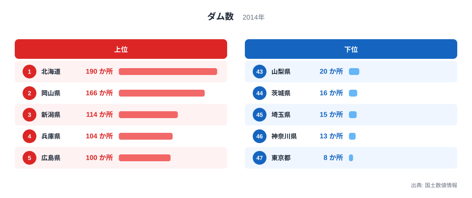
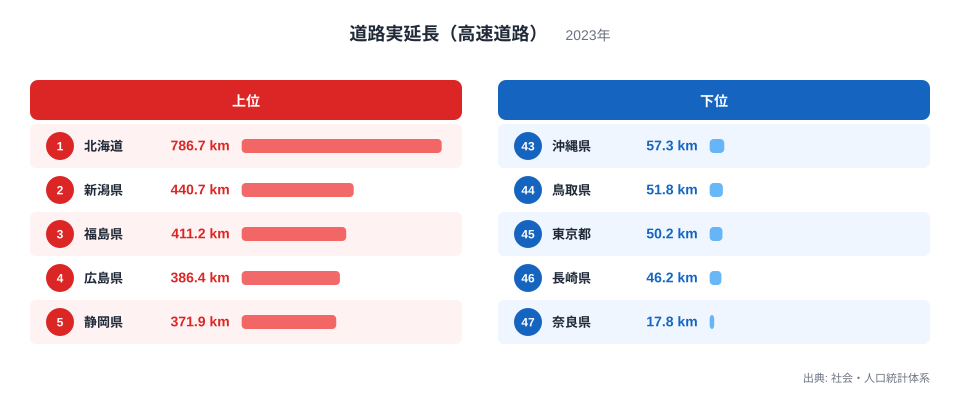
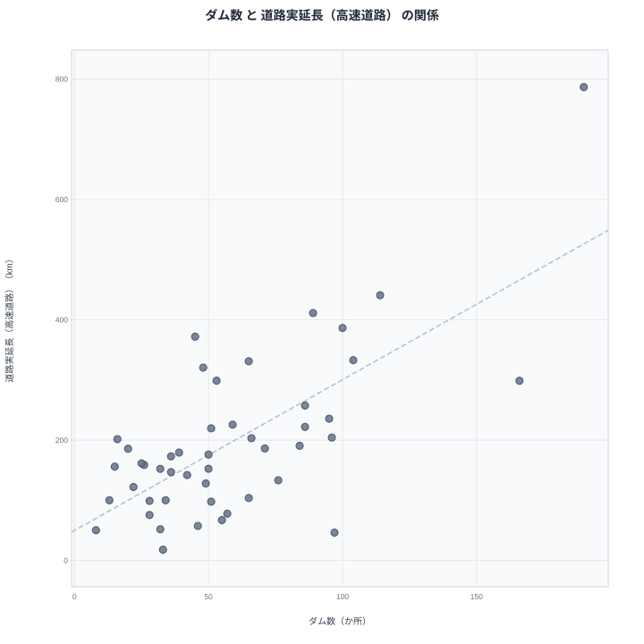

治水や利水のためのダムと、地域間の移動を支える高速道路は、どちらも大規模な公共インフラという点で共通しています。まったく別の目的で整備されるこの2つの指標を都道府県別に見比べると、上位に同じ県が並ぶ場面もあれば、順位が大きく食い違う場面もあり、両者の関係がそれほど単純ではないことが見えてきます。

## ダム数から見る出発点

<source-link href="/ranking/dam-count">ダム数ランキングをもっと見る</source-link>

ダム数は北海道が190か所で1位、岡山県が166か所で2位、新潟県が114か所で3位、兵庫県が104か所で4位、広島県が100か所で5位です。最も少ないのは東京都の8か所で、神奈川県の13か所、埼玉県の15か所、茨城県の16か所、徳島県の22か所と続きます。ダムの多い県は山地や複数の水系を抱える県、少ない県は平野が広がる首都圏の県に集まっています。

> [!NOTE]
> ここでのダム数は堤高15メートル以上を対象とする2014年時点の国土数値情報の集計で、高速道路の実延長は2023年時点の社会・人口統計体系の集計です。集計年が9年離れているため、この間に開通した高速道路や新設されたダムは反映されていない点に注意してください。

## 道路実延長（高速道路）から見る出発点

高速道路の実延長でも1位は北海道で、786.7キロメートルにおよびます。2位は新潟県の440.7キロメートル、3位は福島県の411.2キロメートル、4位は広島県の386.4キロメートル、5位は静岡県の371.9キロメートルです。最も短いのは奈良県の17.8キロメートルで、長崎県の46.2キロメートル、東京都の50.2キロメートルが続きます。

ダム数で2位だった岡山県は、高速道路実延長では298.7キロメートルで10位にとどまっています。反対に、ダム数では9位だった福島県は、高速道路実延長では411.2キロメートルで3位に浮上しています。2つの指標の顔ぶれは重なる部分もありますが、順位の入れ替わりも小さくありません。

さらに極端な例が長崎県です。ダム数は97か所で6位と上位に入る一方、高速道路実延長は46.2キロメートルで46位ときわめて短くなっています。多くの半島と離島からなる長崎県は、水源を確保するために各地に小規模なダムを整備する必要があった一方で、地形が入り組んでいるために長距離の高速道路を通しにくいという事情が、この落差を生んでいると考えられます。反対に静岡県は、ダム数が45か所で29位と中位にとどまる一方、高速道路実延長は371.9キロメートルで5位と上位に入っています。静岡県には東京と名古屋を結ぶ東名高速道路や新東名高速道路が通っており、県自体のダム整備の必要性とは別に、全国的な交通の大動脈としての役割が高速道路の延長を押し上げていると考えられます。

> [!WARNING]
> ダムと高速道路のどちらもが多い、あるいは少ないという関係が見られても、一方の整備がもう一方の整備を引き起こしているわけではありません。ダムは河川と水資源をめぐる計画にもとづき、高速道路は地域間の交通需要にもとづいて、それぞれ独立に整備が進められています。

## 2つの指標の関係を散布図で確認する

散布図で見ると、北海道が両方の指標で突出した位置にあり、新潟県や広島県もダム数・高速道路実延長のどちらも上位に位置していることが確認できます。一方で、埼玉県はダム数が15か所で45位と少ないにもかかわらず、高速道路実延長は156キロメートルで27位と中位に入っています。神奈川県も同様に、ダム数は13か所で46位と少ない一方、高速道路実延長は100キロメートルで37位と、ダム数ほど極端に低い順位にはなっていません。

この食い違いは、ダム数と高速道路実延長を押し上げる要因がそれぞれ異なることを示しています。ダムの多さは山地の広さや河川の数といった地形的な条件に強く左右される一方、高速道路の延長は都市間をつなぐ交通需要や経済活動の規模にも影響されるため、平野が広がる首都圏の県でも一定の水準を保っていると考えられます。

> [!TIP]
> ダム数と高速道路実延長がどちらも高い県を見つけたら、その背景に山地の広さという共通の土台があるのか、それとも別々の要因がたまたま重なっているのかを、他の指標もあわせて確認してみると理解が深まります。

## 見かけの相関の裏にあるもの

北海道が両方の指標で1位を占めているのは、国土面積の広さという単純な要因が背景にあると考えられます。広い土地には多くの河川と、都市間を結ぶ長い道路の両方が必要になるためです。一方で、岡山県のようにダム数では2位に入りながら高速道路実延長では10位にとどまる県があることは、ダムの多さが必ずしも高速道路の長さに直結しないことを示しています。岡山県のダムの多さには瀬戸内海式気候による少雨傾向という独自の背景があると考えられ、これは高速道路の整備状況とは直接関係のない要因です。

ダム数と高速道路実延長は、どちらも県の面積の大きさに影響を受けやすい指標ですが、面積と結びつく理由は指標ごとに異なります。ダムの多さは山地の急峻さや降水量といった地形・気候条件と直結しており、面積が広いほど山地の総量そのものが増えるため、ダムを建設できる立地も自然と増えていきます。一方、高速道路実延長を押し上げているのは主に都市間輸送の需要であり、面積の広さそのものよりも経済活動の規模や人口の分布が延長を左右します。かりに面積あたりに換算して比べれば、面積が飛び抜けて広い北海道はダム数・高速道路実延長のどちらでも順位を下げやすくなりますが、下がり方には差が出ると考えられます。面積に強く規定されるダム数のほうが面積で割ったときの北海道の突出は大きくやわらぎやすい一方、高速道路実延長は都市間需要という別の要因も働くため、面積で割っても埼玉県や神奈川県のような都市近郊の県が急に上位へ浮上するとは限りません。

高速道路実延長で2位の新潟県はダム数でも3位、4位の広島県はダム数でも5位に入っており、この2県では両方の指標が高い水準でそろっています。[道路実延長（高速道路）ランキング](/ranking/road-expressway-length)や、ダムと同じ[インフラ関連の統計一覧](/category/infrastructure)を見ると、他の指標との関係もあわせて確認できます。両方の指標で1位の[北海道のデータ](/areas/01000)と、ダム数で2位の[岡山県のデータ](/areas/33000)を見比べると、同じ上位県でも背景にある要因が異なることがより具体的にわかります。

## まとめ

- ダム数は北海道が190か所で1位、高速道路実延長も北海道が786.7キロメートルで1位です。
- 新潟県はダム数3位・高速道路実延長2位、広島県はダム数5位・高速道路実延長4位で、いずれも両指標が高い水準にあります。
- 岡山県はダム数2位である一方、高速道路実延長は10位にとどまっています。
- 埼玉県と神奈川県はダム数が下位である一方、高速道路実延長は中位に入っており、単純な相関では説明しきれません。
- 長崎県はダム数6位・高速道路実延長46位、静岡県はダム数29位・高速道路実延長5位と、正反対の食い違いを示しています。
- ダム数は地形的な条件に、高速道路実延長は交通需要にそれぞれ強く左右されており、両者の重なりは面積の広さという共通要因を介した見かけの関係だと考えられます。

## データ出典

- 国土数値情報（2014年）
- 社会・人口統計体系（2023年）
