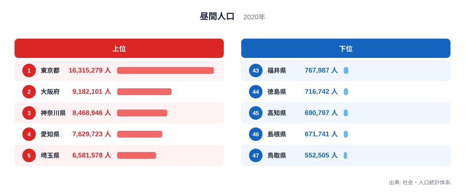

## 昼間人口は「昼にいる人」の規模を示します

2020年の昼間人口を都道府県別に比べると、東京都が1,631万5,279人で最多、大阪府が918万2,101人、神奈川県が846万8,946人と続きます。最少は鳥取県の55万2,505人で、東京都との差は約29.5倍です。

昼間人口は、常住人口を基礎に、通勤・通学による流入と流出を調整して推計されます。その地域で日中に働いたり学んだりする人を含むため、交通、防災、飲食、小売など、昼間の需要規模を考える材料になります。

> [!NOTE]
> 昼間人口は、観光客や買い物客など一時的な訪問者をすべて数えた「その瞬間の滞在人口」ではありません。主に通勤・通学の移動を反映した統計上の人口です。

ただし、昼間人口の総数が多いからといって、外から人を引きつける力が強いとは限りません。もともとの常住人口が多ければ、流入が少なくても昼間人口は大きくなります。都市の吸引力を測るには、夜間人口との差や昼夜間人口比率が必要です。

## 上位には大都市圏を構成する都府県が並びます

<source-link href="/ranking/day-time-population">昼間人口ランキングをもっと見る</source-link>

上位5都府県は、東京都1,631万5,279人、大阪府918万2,101人、神奈川県846万8,946人、愛知県762万9,723人、埼玉県658万1,578人です。東京、大阪、名古屋の大都市圏を構成する地域が上位を占めています。

6位は千葉県567万2,183人、7位は兵庫県524万9,636人です。神奈川県、埼玉県、千葉県は東京都への通勤者が多い地域ですが、県自体の人口規模が大きいため、昼間人口の総数でも上位に残ります。この点が、総数だけで流入・流出を判断できない理由です。

下位5県は、福井県76万7,987人、徳島県71万6,742人、高知県69万797人、島根県67万1,741人、鳥取県55万2,505人です。人口規模の小さい県が並び、昼間人口も小さくなっています。

> [!TIP]
> 昼間人口の総数は「市場や防災対象の規模」、昼夜間人口比率は「通勤・通学による吸引と流出」と役割を分けて読むと分かりやすくなります。

東京都と鳥取県の差は1,576万2,774人です。しかし、この差の大部分には常住人口の規模が含まれます。「東京都に毎日1,600万人が外から来る」という意味ではなく、東京都内に住み、日中も都内にいる人も含まれています。

## 昼間人口と夜間人口の差が都市圏を見せます

中心業務地を抱える地域では、通勤・通学の流入によって昼間人口が夜間人口を上回りやすくなります。周辺の住宅地では反対に、朝に人が外へ出るため昼間人口が夜間人口を下回ることがあります。両者は一つの都市圏の中で補い合う関係です。

このため、東京都と埼玉県を別々に順位づけするだけでは、東京圏全体の人の動きを捉えきれません。県境を越える鉄道路線や通勤圏を重ねると、雇用の中心と住宅地の役割分担が見えてきます。大阪府と兵庫県、愛知県と周辺県についても同様です。

> [!WARNING]
> 昼間人口の多さを、そのまま観光人気や商業集客力と解釈することはできません。観光・買い物の短期滞在は別の人流データで確認する必要があります。

昼間人口は災害対策にも関係します。平日昼間に災害が起きた場合、常住人口とは異なる人数と場所を前提に避難、帰宅困難者、医療、物資を計画する必要があります。夜間の防災計画だけでは、オフィス街や学校が集まる地域の需要を過小評価するおそれがあります。

都道府県全体の総数は、県内の中心と周辺の差を平均化します。東京都内でも都心部と住宅地では昼夜の動きが異なり、広い県では県庁所在地と郊外で別の構造を持ちます。鉄道駅や市区町村単位のデータへ降りると、混雑対策、店舗立地、避難計画に必要な時間帯別の偏りをより具体的に捉えられます。

曜日や時間帯による変化も総数には表れません。平日の通勤ピーク、休日の買い物や観光、夜間の滞在では人の分布が変わります。施策の目的に応じて国勢調査と携帯位置情報、交通量、乗降客数などを使い分けることが重要です。

## 2020年という時点にも注意が必要です

今回のデータは2020年の値です。国勢調査の基準時点を含むこの年は、新型コロナウイルス感染症の拡大によって、在宅勤務やオンライン授業が広がった時期でもあります。統計上の通勤・通学先と、実際に毎日移動した人数が一致しない可能性を意識する必要があります。

その後もリモートワークや働き方は変化しています。現在の平日昼間の滞在人口を知りたい場合は、より新しい人流データや交通利用実績を組み合わせるのが適切です。一方、同じ定義で長期的な都市圏構造を比べるには、国勢調査の昼間人口が有効です。

最多の[東京都のデータブック](/areas/13000)と最少の[鳥取県のデータブック](/areas/31000)では、人口や産業の別指標も確認できます。全47都道府県の値は[昼間人口ランキング](/ranking/day-time-population)、人口関連の統計は[人口カテゴリ](/category/population)からたどれます。

> [!NOTE]
> 時系列比較では、昼間人口の総数だけでなく、夜間人口、流入・流出人口、昼夜間人口比率を同じ年次でそろえると、変化の理由を分解しやすくなります。

## 約30倍の差は、日中需要の規模を示します

2020年の昼間人口は、東京都1,631万5,279人から鳥取県55万2,505人まで約29.5倍の差がありました。上位には大都市圏の都府県、下位には人口規模の小さい県が並びます。

この総数ランキングから分かるのは、各都道府県が日中に抱える人口の大きさです。交通、飲食、防災、公共サービスの需要規模を考える入口になりますが、外からの吸引力や観光客数を直接示すものではありません。

都市圏の構造を読み解くには、夜間人口との差、昼夜間人口比率、通勤・通学の流入元と流出先を重ねる必要があります。総数と比率の役割を分けることで、昼に人が集まる中心地と、そこを支える住宅地の関係が見えてきます。

## データ出典

- 総務省統計局「社会・人口統計体系」（2020年）
